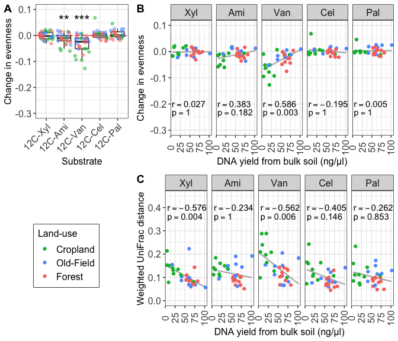

Analyses on Enrichment Microcosms
================
Samuel Barnett
19 July, 2021

-   [Introduction](#introduction)
-   [Basic stats](#basic-stats)
-   [Diversity differences between treatment and control microcosms](#diversity-differences-between-treatment-and-control-microcosms)
-   [Community composition difference between treatment and control microcosms](#community-composition-difference-between-treatment-and-control-microcosms)
-   [Diversity plots for publication](#diversity-plots-for-publication)
-   [DESeq2 significant enrichments](#deseq2-significant-enrichments)

Introduction
------------

In addition to SIP, we also ran a simple enrichment experiment, adding one 12C substrate to smaller microcoms containing ~ 5g soil. Unlike the SIP experiment, only one substrate was added to each microcosm and this time we used soil from all 10 locations, not just Monkey Run. Also we only sampled microcoms on two days for each substrate:

-   Days 2 and 4: xylose, amino acids, and vanillin
-   Days 14 and 28: cellulose and palmitic acid

We also had water treated controls for each timepoint as something to compare against.

In this notebook I will examine these samples both on their own and in relation to the incorporators identified in the MW-HR-SIP analysis.

#### Initialization

``` r
# For data handling
library(dplyr)
library(phyloseq)

# For analysis
library(vegan)
library(nlme)
library(lsmeans)

# For plotting
library(ggplot2)

# Set color schemes
eco.col = c(agriculture="#00BA38", meadow="#619CFF", forest="#F8766D")

g_legend<-function(a.gplot){
  tmp <- ggplot_gtable(ggplot_build(a.gplot))
  leg <- which(sapply(tmp$grobs, function(x) x$name) == "guide-box")
  legend <- tmp$grobs[[leg]]
  return(legend)}
```

#### Data

The OTU abundances and phylogeny can be found in the master phyloseq object.

``` r
# Import phyloseq object
physeq = readRDS("/Users/sambarnett/Documents/Buckley Lab/FullCyc2/fullcyc2_backups_8_8_19/phyloseq/fullcyc2physeq.RDS")

# Subset to just the unfractionated samples and remove the controls
enr.physeq = subset_samples(physeq, exp_type == "Enrichment" & sample_type == "unknown")
bulk.physeq = subset_samples(physeq, exp_type == "bulk" & sample_type == "unknown")
physeq = NULL

# Remove non-bacteria (aka Archaea)
enr.physeq = subset_taxa(enr.physeq, Domain == "Bacteria")
bulk.physeq = subset_taxa(bulk.physeq, Domain == "Bacteria")
  
# Add in a different phylogenetic tree. The one in the phyloseq might be an older version.
tree = read_tree("/Users/sambarnett/Documents/Buckley Lab/FullCyc2/fullcyc2_backups_8_8_19/fullcyc2.bacteria.cogent.tree")
phy_tree(enr.physeq) = tree
phy_tree(bulk.physeq) = tree

# Remove any OTUs no longer found in the samples
enr.physeq = prune_taxa(taxa_sums(enr.physeq) > 0, enr.physeq)
bulk.physeq = prune_taxa(taxa_sums(bulk.physeq) > 0, bulk.physeq)
```

Incorporator status can be found in the log2 fold change dataframe.

``` r
# Get the l2fc dataframe and add in columns indicating the land-use, labeled substrate, and day
l2fc.df = readRDS(file = "/Users/sambarnett/Documents/Buckley Lab/FullCyc2/fullcyc2_l2fc_testoutput.rds") %>%
  mutate(ecosystem  = factor(gsub(".+ecosystem == [ \']*([A-z]+).+", "\\1", .id),
                             levels = c("agriculture", "meadow", "forest")),
         day  = gsub(".+day == [ \']*([0-9]+).+", "\\1", .id),
         substrate = factor(gsub(".+(13C-[A-z]+).+", "\\1", .id),
                            levels = c("13C-Xyl", "13C-Ami", "13C-Van", "13C-Cel", "13C-Pal")))
```

For many of the following analyses I want a rarefied OTU table. This is one way to correct for differing sequencing depths across all my samples. I will set the seed for this process so that I can replicate this analysis if necessary (seed = 4242).

``` r
enr.rare.physeq = rarefy_even_depth(enr.physeq, rngseed=4242)
bulk.rare.physeq = rarefy_even_depth(bulk.physeq, rngseed=4242)

unique(colSums(otu_table(enr.rare.physeq)))
```

    ## [1] 14503

Basic stats
-----------

``` r
print(paste("Maximum read count =", max(colSums(otu_table(enr.physeq)))))
```

    ## [1] "Maximum read count = 194737"

``` r
print(paste("Minimum read count =", min(colSums(otu_table(enr.physeq)))))
```

    ## [1] "Minimum read count = 14503"

``` r
print(paste("Rarefied read count =", unique(colSums(otu_table(enr.rare.physeq)))))
```

    ## [1] "Rarefied read count = 14503"

``` r
print(paste("Number of OTUs total =", ntaxa(enr.physeq)))
```

    ## [1] "Number of OTUs total = 28296"

``` r
print(paste("Number of OTUs rarefied =", ntaxa(enr.rare.physeq)))
```

    ## [1] "Number of OTUs rarefied = 24659"

``` r
print(paste("Number of phyla total =", length(unique(filter(data.frame(tax_table(enr.physeq), stringsAsFactors = FALSE), !(is.na(Phylum)))$Phylum))))
```

    ## [1] "Number of phyla total = 45"

``` r
print(paste("Number of phyla total =", length(unique(filter(data.frame(tax_table(enr.rare.physeq), stringsAsFactors = FALSE), !(is.na(Phylum)))$Phylum))))
```

    ## [1] "Number of phyla total = 45"

Diversity differences between treatment and control microcosms
--------------------------------------------------------------

As with the SIP enrichments I want to see if there carbon addition leads to a shift in diversity.

Here I'll calculate the desired alpha diveristy measures.

``` r
OTU.table = t(otu_table(enr.rare.physeq))
alpha_div.df = data.frame(X.Sample = rownames(OTU.table), 
                          richness = specnumber(OTU.table),
                          shannon = diversity(OTU.table, index="shannon"),
                          simpson = diversity(OTU.table, index="simpson")) %>%
  mutate(evenness = shannon/log(richness)) %>%
  left_join(data.frame(sample_data(enr.rare.physeq)) %>% select(X.Sample, ecosystem, substrate, day, location),
            by = "X.Sample") %>%
  mutate(ecosystem = factor(ecosystem, levels = c("agriculture", "meadow", "forest")),
         substrate = factor(substrate, levels = c("H2O-Con", "12C-Xyl", "12C-Ami", "12C-Van", "12C-Cel", "12C-Pal")),
         time_point = ifelse(day %in% c(2, 14), "Early", "Late")) %>%
  tidyr::gather(key="method", value="Treatment", 
                -X.Sample, -ecosystem, -substrate, -day, -location, -time_point)

alpha_div_H2O.df = alpha_div.df %>%
  filter(substrate == "H2O-Con") %>%
  rename(Control = Treatment) %>%
  select(ecosystem, location, day, method, Control)

alpha_div_treat.df = alpha_div.df %>%
  filter(substrate != "H2O-Con") %>%
  select(-X.Sample) %>%
  left_join(alpha_div_H2O.df, by = c("ecosystem", "location", "day", "method")) %>%
  tidyr::gather(key = "treatment", value = "diversity", -ecosystem, -substrate, -day, -location, -time_point, -method) %>%
  arrange(ecosystem, substrate, day, location)
```

### Early timepoints

Early timepoints are the first timepoint for each of the substrates (Day 2 for Xylose, amino acids, and vanillin; Day 14 for palmitic acid and cellulose). This is similar to the early timepoints for SIP and likely captures bacterial growth due to substrate addition more so than secondary feeding.

``` r
## Get bulk
bulk_meta.df = data.frame(sample_data(bulk.rare.physeq)) %>%
  select(location, ecosystem, pH, organic_content_perc, DNA_conc__ng_ul) %>%
  mutate(DNA_conc__ng_ul = as.numeric(as.character(DNA_conc__ng_ul)))

evenness_early_meta.df = alpha_div_treat.df %>%
  filter(method == "evenness", time_point == "Early") %>%
  tidyr::spread(key=treatment, value=diversity) %>%
  mutate(delta_evenness = Treatment-Control) %>%
  left_join(bulk_meta.df, by = c("ecosystem", "location")) %>%
  mutate(ecosystem = factor(ecosystem, levels=c("agriculture", "meadow", "forest")))

## Compare to zero
early_evenness_wilcox.df = data.frame()
for (sub in c("12C-Xyl", "12C-Ami", "12C-Van", "12C-Cel", "12C-Pal")){
  model = wilcox.test(x = filter(evenness_early_meta.df, substrate==sub)$delta_evenness, alternative = "less", mu=0)
  model.df = data.frame(substrate = factor(sub, levels=c("12C-Xyl", "12C-Ami", "12C-Van", "12C-Cel", "12C-Pal")),
                        Vstat = model$statistic,
                        pvalue = model$p.value)
  early_evenness_wilcox.df = rbind(early_evenness_wilcox.df, model.df)
}

early_evenness_wilcox.df = early_evenness_wilcox.df %>%
  mutate(padj = p.adjust(pvalue, method = "BH", n = 5)) %>%
  mutate(sig = ifelse(padj < 0.001, "***",
                      ifelse(padj < 0.01, "**",
                             ifelse(padj < 0.05, "*", "NS"))))

early_evenness_wilcox.plot = ggplot(data=evenness_early_meta.df, aes(x=substrate, y=delta_evenness)) +
  geom_hline(yintercept = 0, linetype=2, color="red") +
  geom_boxplot(outlier.shape = NA) +
  geom_jitter(aes(color=ecosystem), alpha=0.5) +
  geom_text(data=filter(early_evenness_wilcox.df, padj < 0.05), aes(x=substrate, label=sig), y=0.06, size=6) +
  scale_color_manual(values = eco.col, labels = c("agriculture" = "Cropland", "meadow" = "Old-Field", "forest" = "Forest")) +
  labs(x="Substrate", y="Change in evenness", color="Land-use") +
  lims(y=c(-0.3, 0.1)) +
  theme_bw() + 
  theme(axis.text.x = element_text(size=12, angle=45, vjust=1, hjust=1),
        axis.text.y = element_text(size=12),
        axis.title = element_text(size=12),
        strip.text = element_text(size=12),
        legend.text = element_text(size=12),
        legend.title = element_text(size=12),
        legend.position = "top")


## Compare with organic content
early_SOM_evenness.df = data.frame()
for (sub in c("12C-Xyl", "12C-Ami", "12C-Van", "12C-Cel", "12C-Pal")){
  sub.evenness.df = filter(evenness_early_meta.df, substrate==sub)
  cor.res = cor.test(x=sub.evenness.df$organic_content_perc, y=sub.evenness.df$delta_evenness)
  model.df = data.frame(substrate = factor(sub, levels=c("12C-Xyl", "12C-Ami", "12C-Van", "12C-Cel", "12C-Pal")),
                        r = cor.res$estimate,
                        pvalue = cor.res$p.value)  %>%
    mutate(padj = p.adjust(pvalue, method = "BH", n = 5))
  early_SOM_evenness.df = rbind(early_SOM_evenness.df, model.df)
}

early_evenness_SOM.plot = ggplot(data=evenness_early_meta.df, aes(x=organic_content_perc, y=delta_evenness)) +
  geom_smooth(method="lm", se=FALSE, color="grey70", size=0.75) +
  geom_point(aes(color=ecosystem)) +
  geom_text(data=early_SOM_evenness.df, aes(label=paste("r==", round(r, 3), sep="")),
            x=0.03, y=-0.2, hjust=0, parse = TRUE) +
  geom_text(data=early_SOM_evenness.df, aes(label=paste("p==", round(padj, 3), sep="")),
            x=0.03, y=-0.235, hjust=0, parse = TRUE) +
  scale_color_manual(values = eco.col, labels = c("agriculture" = "Cropland", "meadow" = "Old-Field", "forest" = "Forest")) +
  lims(y=c(-0.3, 0.1)) +
  labs(x="% SOM in bulk soil", y="Change in evenness", color="Land-use") +
  theme_bw() + 
  theme(axis.text.x = element_text(size=12, angle=90, vjust=0.5),
        axis.text.y = element_text(size=12),
        axis.title = element_text(size=12),
        strip.text = element_text(size=12),
        legend.text = element_text(size=12),
        legend.title = element_text(size=12),
        legend.position = "top") +
  facet_wrap(~factor(gsub("12C-", "", substrate), levels=c("Xyl", "Ami", "Van", "Cel", "Pal")), nrow=1)

## Compare with DNA concentration
early_DNA_evenness.df = data.frame()
for (sub in c("12C-Xyl", "12C-Ami", "12C-Van", "12C-Cel", "12C-Pal")){
  sub.evenness.df = filter(evenness_early_meta.df, substrate==sub)
  cor.res = cor.test(x=sub.evenness.df$DNA_conc__ng_ul, y=sub.evenness.df$delta_evenness)
  model.df = data.frame(substrate = factor(sub, levels=c("12C-Xyl", "12C-Ami", "12C-Van", "12C-Cel", "12C-Pal")),
                        r = cor.res$estimate,
                        pvalue = cor.res$p.value)  %>%
    mutate(padj = p.adjust(pvalue, method = "BH", n = 5))
  early_DNA_evenness.df = rbind(early_DNA_evenness.df, model.df)
}

early_evenness_DNA.plot = ggplot(data=evenness_early_meta.df, aes(x=DNA_conc__ng_ul, y=delta_evenness)) +
  geom_smooth(method="lm", se=FALSE, color="grey70", size=0.75) +
  geom_point(aes(color=ecosystem)) +
  geom_text(data=early_DNA_evenness.df, aes(label=paste("r==", round(r, 3), sep="")),
            x=5, y=-0.2, hjust=0, parse = TRUE) +
  geom_text(data=early_DNA_evenness.df, aes(label=paste("p==", round(padj, 3), sep="")),
            x=5, y=-0.235, hjust=0, parse = TRUE) +
  scale_color_manual(values = eco.col, labels = c("agriculture" = "Cropland", "meadow" = "Old-Field", "forest" = "Forest")) +
  lims(y=c(-0.3, 0.1)) +
  labs(x="DNA Concentration", y="Change in evenness", color="Land-use") +
  theme_bw() + 
  theme(axis.text.x = element_text(size=12, angle=90, vjust=0.5),
        axis.text.y = element_text(size=12),
        axis.title = element_text(size=12),
        strip.text = element_text(size=12),
        legend.text = element_text(size=12),
        legend.title = element_text(size=12),
        legend.position = "top") +
  facet_wrap(~factor(gsub("12C-", "", substrate), levels=c("Xyl", "Ami", "Van", "Cel", "Pal")), nrow=1)

## Plot together

early_landuse.leg = g_legend(early_evenness_SOM.plot + theme(legend.direction = "vertical", 
                                                             legend.box.background = element_rect(colour = "black")))

early_alpha_SOM.plot = cowplot::plot_grid(early_evenness_wilcox.plot + theme(legend.position = "none"),
                                          early_evenness_SOM.plot + theme(legend.position = "none", axis.title.y = element_blank()),
                                          early_landuse.leg,
                                          early_evenness_DNA.plot + theme(legend.position = "none", axis.title.y = element_blank()), 
                                          ncol=2, labels=c("A", "B", "", "C"), rel_widths = c(0.5, 1, 0.5, 1))

early_alpha_SOM.plot
```


``` r
early_evenness_wilcox.df
```

    ##    substrate Vstat       pvalue         padj sig
    ## V    12C-Xyl   177 1.310611e-01 2.098336e-01  NS
    ## V1   12C-Ami    70 2.300534e-04 5.751336e-04 ***
    ## V2   12C-Van    15 1.275912e-07 6.379560e-07 ***
    ## V3   12C-Cel   210 3.277192e-01 3.277192e-01  NS
    ## V4   12C-Pal   172 1.678669e-01 2.098336e-01  NS

``` r
early_SOM_evenness.df
```

    ##      substrate         r      pvalue       padj
    ## cor    12C-Xyl 0.4377734 0.015545185 0.07772593
    ## cor1   12C-Ami 0.4648663 0.009646017 0.04823009
    ## cor2   12C-Van 0.3574692 0.052456283 0.26228141
    ## cor3   12C-Cel 0.3947730 0.030854962 0.15427481
    ## cor4   12C-Pal 0.1486803 0.441452927 1.00000000

``` r
early_DNA_evenness.df
```

    ##      substrate         r       pvalue        padj
    ## cor    12C-Xyl 0.4805024 7.197024e-03 0.035985118
    ## cor1   12C-Ami 0.6554694 8.442419e-05 0.000422121
    ## cor2   12C-Van 0.5498244 1.647087e-03 0.008235434
    ## cor3   12C-Cel 0.3027813 1.038712e-01 0.519355835
    ## cor4   12C-Pal 0.1253467 5.170601e-01 1.000000000

### Late timepoints

Late timepoints are the second timepoint for each of the substrates (Day 4 for Xylose, amino acids, and vanillin; Day 28 for palmitic acid and cellulose). This is similar to the late timepoints for SIP and likely captures bacterial growth due more to secondary feeding and late feeding on substrates.

``` r
## Get bulk
bulk_meta.df = data.frame(sample_data(bulk.rare.physeq)) %>%
  select(location, ecosystem, pH, organic_content_perc, DNA_conc__ng_ul) %>%
  mutate(DNA_conc__ng_ul = as.numeric(as.character(DNA_conc__ng_ul)))

evenness_late_meta.df = alpha_div_treat.df %>%
  filter(method == "evenness", time_point == "Late") %>%
  tidyr::spread(key=treatment, value=diversity) %>%
  mutate(delta_evenness = Treatment-Control) %>%
  left_join(bulk_meta.df, by = c("ecosystem", "location")) %>%
  mutate(ecosystem = factor(ecosystem, levels=c("agriculture", "meadow", "forest")))

## Compare to zero
late_evenness_wilcox.df = data.frame()
for (sub in c("12C-Xyl", "12C-Ami", "12C-Van", "12C-Cel", "12C-Pal")){
  model = wilcox.test(x = filter(evenness_late_meta.df, substrate==sub)$delta_evenness, alternative = "less", mu=0)
  model.df = data.frame(substrate = factor(sub, levels=c("12C-Xyl", "12C-Ami", "12C-Van", "12C-Cel", "12C-Pal")),
                        Vstat = model$statistic,
                        pvalue = model$p.value)
  late_evenness_wilcox.df = rbind(late_evenness_wilcox.df, model.df)
}

late_evenness_wilcox.df = late_evenness_wilcox.df %>%
  mutate(padj = p.adjust(pvalue, method = "BH", n = 5)) %>%
  mutate(sig = ifelse(padj < 0.001, "***",
                      ifelse(padj < 0.01, "**",
                             ifelse(padj < 0.05, "*", "NS"))))

late_evenness_wilcox.plot = ggplot(data=evenness_late_meta.df, aes(x=substrate, y=delta_evenness)) +
  geom_hline(yintercept = 0, linetype=2, color="red") +
  geom_boxplot(outlier.shape = NA) +
  geom_jitter(aes(color=ecosystem), alpha=0.5) +
  geom_text(data=filter(late_evenness_wilcox.df, padj < 0.05), aes(x=substrate, label=sig), y=0.06, size=6) +
  scale_color_manual(values = eco.col, labels = c("agriculture" = "Cropland", "meadow" = "Old-Field", "forest" = "Forest")) +
  labs(x="Substrate", y="Change in evenness", color="Land-use") +
  lims(y=c(-0.3, 0.1)) +
  theme_bw() + 
  theme(axis.text.x = element_text(size=12, angle=45, vjust=1, hjust=1),
        axis.text.y = element_text(size=12),
        axis.title = element_text(size=12),
        strip.text = element_text(size=12),
        legend.text = element_text(size=12),
        legend.title = element_text(size=12),
        legend.position = "top")


## Compare with organic content

late_SOM_evenness.df = data.frame()
for (sub in c("12C-Xyl", "12C-Ami", "12C-Van", "12C-Cel", "12C-Pal")){
  sub.evenness.df = filter(evenness_late_meta.df, substrate==sub)
  cor.res = cor.test(x=sub.evenness.df$organic_content_perc, y=sub.evenness.df$delta_evenness)
  model.df = data.frame(substrate = factor(sub, levels=c("12C-Xyl", "12C-Ami", "12C-Van", "12C-Cel", "12C-Pal")),
                        r = cor.res$estimate,
                        pvalue = cor.res$p.value)  %>%
    mutate(padj = p.adjust(pvalue, method = "BH", n = 5))
  late_SOM_evenness.df = rbind(late_SOM_evenness.df, model.df)
}

late_evenness_SOM.plot = ggplot(data=evenness_late_meta.df, aes(x=organic_content_perc, y=delta_evenness)) +
  geom_smooth(method="lm", se=FALSE, color="grey70", size=0.75) +
  geom_point(aes(color=ecosystem)) +
  geom_text(data=late_SOM_evenness.df, aes(label=paste("r==", round(r, 3), sep="")),
            x=0.03, y=-0.2, hjust=0, parse = TRUE) +
  geom_text(data=late_SOM_evenness.df, aes(label=paste("p==", round(padj, 3), sep="")),
            x=0.03, y=-0.235, hjust=0, parse = TRUE) +
  scale_color_manual(values = eco.col, labels = c("agriculture" = "Cropland", "meadow" = "Old-Field", "forest" = "Forest")) +
  lims(y=c(-0.3, 0.1)) +
  labs(x="% SOM in bulk soil", y="Change in evenness", color="Land-use") +
  theme_bw() + 
  theme(axis.text.x = element_text(size=12, angle=90, vjust=0.5),
        axis.text.y = element_text(size=12),
        axis.title = element_text(size=12),
        strip.text = element_text(size=12),
        legend.text = element_text(size=12),
        legend.title = element_text(size=12),
        legend.position = "top") +
  facet_wrap(~factor(gsub("12C-", "", substrate), levels=c("Xyl", "Ami", "Van", "Cel", "Pal")), nrow=1)

## Compare with DNA concentration
late_DNA_evenness.df = data.frame()
for (sub in c("12C-Xyl", "12C-Ami", "12C-Van", "12C-Cel", "12C-Pal")){
  sub.evenness.df = filter(evenness_late_meta.df, substrate==sub)
  cor.res = cor.test(x=sub.evenness.df$DNA_conc__ng_ul, y=sub.evenness.df$delta_evenness)
  model.df = data.frame(substrate = factor(sub, levels=c("12C-Xyl", "12C-Ami", "12C-Van", "12C-Cel", "12C-Pal")),
                        r = cor.res$estimate,
                        pvalue = cor.res$p.value)  %>%
    mutate(padj = p.adjust(pvalue, method = "BH", n = 5))
  late_DNA_evenness.df = rbind(late_DNA_evenness.df, model.df)
}

late_evenness_DNA.plot = ggplot(data=evenness_late_meta.df, aes(x=DNA_conc__ng_ul, y=delta_evenness)) +
  geom_smooth(method="lm", se=FALSE, color="grey70", size=0.75) +
  geom_point(aes(color=ecosystem)) +
  geom_text(data=late_DNA_evenness.df, aes(label=paste("r==", round(r, 3), sep="")),
            x=3, y=-0.2, hjust=0, parse = TRUE) +
  geom_text(data=late_DNA_evenness.df, aes(label=paste("p==", round(padj, 3), sep="")),
            x=3, y=-0.235, hjust=0, parse = TRUE) +
  scale_color_manual(values = eco.col, labels = c("agriculture" = "Cropland", "meadow" = "Old-Field", "forest" = "Forest")) +
  lims(y=c(-0.3, 0.1)) +
  labs(x="DNA Concentration", y="Change in evenness", color="Land-use") +
  theme_bw() + 
  theme(axis.text.x = element_text(size=12, angle=90, vjust=0.5),
        axis.text.y = element_text(size=12),
        axis.title = element_text(size=12),
        strip.text = element_text(size=12),
        legend.text = element_text(size=12),
        legend.title = element_text(size=12),
        legend.position = "top") +
  facet_wrap(~factor(gsub("12C-", "", substrate), levels=c("Xyl", "Ami", "Van", "Cel", "Pal")), nrow=1)

## Plot together

late_landuse.leg = g_legend(late_evenness_SOM.plot + theme(legend.direction = "vertical", 
                                                           legend.box.background = element_rect(colour = "black")))

cowplot::plot_grid(late_evenness_wilcox.plot + theme(legend.position = "none"),
                   late_evenness_SOM.plot + theme(legend.position = "none", axis.title.y = element_blank()),
                   late_landuse.leg,
                   late_evenness_DNA.plot + theme(legend.position = "none", axis.title.y = element_blank()), 
                   ncol=2, labels=c("A", "B", "", "C"), rel_widths = c(0.5, 1, 0.5, 1))
```


``` r
late_evenness_wilcox.df
```

    ##    substrate Vstat       pvalue         padj sig
    ## V    12C-Xyl   215 3.651710e-01 6.086183e-01  NS
    ## V1   12C-Ami    98 2.332402e-03 5.831006e-03  **
    ## V2   12C-Van    18 2.356246e-07 1.178123e-06 ***
    ## V3   12C-Cel   230 6.090689e-01 7.526750e-01  NS
    ## V4   12C-Pal   249 7.526750e-01 7.526750e-01  NS

``` r
late_SOM_evenness.df
```

    ##      substrate           r       pvalue        padj
    ## cor    12C-Xyl  0.05516903 0.7721575116 1.000000000
    ## cor1   12C-Ami  0.41074059 0.0241539493 0.120769746
    ## cor2   12C-Van  0.58126223 0.0007557696 0.003778848
    ## cor3   12C-Cel -0.33922920 0.0718198662 0.359099331
    ## cor4   12C-Pal -0.05088678 0.7932062614 1.000000000

``` r
late_DNA_evenness.df
```

    ##      substrate            r       pvalue        padj
    ## cor    12C-Xyl  0.026575752 0.8891335818 1.000000000
    ## cor1   12C-Ami  0.383383545 0.0364996598 0.182498299
    ## cor2   12C-Van  0.585679112 0.0006731203 0.003365602
    ## cor3   12C-Cel -0.194922309 0.3109276590 1.000000000
    ## cor4   12C-Pal  0.005407977 0.9777882112 1.000000000

Community composition difference between treatment and control microcosms
-------------------------------------------------------------------------

Since these are enrichments we cannot identify specific OTUs that have taken up a given substrate, however we can look at the community level change due to the substrate by comparing the treament microcosms to their corresponding water controls.

The first thing I need to do is measure the distance or dissimilarity between all microcosm communities. I will use three metrics for this: Bray-Curtis dissimilarity, unweighted UniFrac distance, and weighted UniFrac.

``` r
enr_BC.dist = vegdist(t(otu_table(enr.rare.physeq)), method="bray", binary=FALSE, diag=TRUE, upper=TRUE)
enr_uwUF.dist = distance(enr.rare.physeq, method="unifrac")
enr_wUF.dist = distance(enr.rare.physeq, method="wunifrac")
```

### PERMANOVA

``` r
print("Bray-Curtis dissimilarity")
```

    ## [1] "Bray-Curtis dissimilarity"

``` r
enr_BC.adonis = adonis(formula = enr_BC.dist ~ ecosystem * substrate * day, data = as(sample_data(enr.rare.physeq), "data.frame"))
enr_BC.adonis
```

    ## 
    ## Call:
    ## adonis(formula = enr_BC.dist ~ ecosystem * substrate * day, data = as(sample_data(enr.rare.physeq),      "data.frame")) 
    ## 
    ## Permutation: free
    ## Number of permutations: 999
    ## 
    ## Terms added sequentially (first to last)
    ## 
    ##                          Df SumsOfSqs MeanSqs F.Model      R2 Pr(>F)    
    ## ecosystem                 2    11.411  5.7053 28.3341 0.12269  0.001 ***
    ## substrate                 5     2.397  0.4794  2.3807 0.02577  0.001 ***
    ## day                       1     0.357  0.3571  1.7734 0.00384  0.062 .  
    ## ecosystem:substrate      10     1.156  0.1156  0.5741 0.01243  1.000    
    ## ecosystem:day             2     0.185  0.0923  0.4583 0.00198  0.999    
    ## substrate:day             5     0.303  0.0606  0.3010 0.00326  1.000    
    ## ecosystem:substrate:day  10     0.475  0.0475  0.2361 0.00511  1.000    
    ## Residuals               381    76.718  0.2014         0.82491           
    ## Total                   416    93.002                 1.00000           
    ## ---
    ## Signif. codes:  0 '***' 0.001 '**' 0.01 '*' 0.05 '.' 0.1 ' ' 1

``` r
print("-----")
```

    ## [1] "-----"

``` r
print("Unweighted UniFrac distance")
```

    ## [1] "Unweighted UniFrac distance"

``` r
enr_uwUF.adonis = adonis(formula = enr_uwUF.dist ~ ecosystem * substrate * day, data = as(sample_data(enr.rare.physeq), "data.frame"))
enr_uwUF.adonis
```

    ## 
    ## Call:
    ## adonis(formula = enr_uwUF.dist ~ ecosystem * substrate * day,      data = as(sample_data(enr.rare.physeq), "data.frame")) 
    ## 
    ## Permutation: free
    ## Number of permutations: 999
    ## 
    ## Terms added sequentially (first to last)
    ## 
    ##                          Df SumsOfSqs MeanSqs F.Model      R2 Pr(>F)    
    ## ecosystem                 2     5.890 2.94479 15.8179 0.07255  0.001 ***
    ## substrate                 5     1.071 0.21426  1.1509 0.01320  0.131    
    ## day                       1     0.276 0.27590  1.4820 0.00340  0.068 .  
    ## ecosystem:substrate      10     1.155 0.11548  0.6203 0.01422  1.000    
    ## ecosystem:day             2     0.241 0.12073  0.6485 0.00297  0.998    
    ## substrate:day             5     0.575 0.11499  0.6177 0.00708  1.000    
    ## ecosystem:substrate:day  10     1.046 0.10459  0.5618 0.01288  1.000    
    ## Residuals               381    70.930 0.18617         0.87370           
    ## Total                   416    81.184                 1.00000           
    ## ---
    ## Signif. codes:  0 '***' 0.001 '**' 0.01 '*' 0.05 '.' 0.1 ' ' 1

``` r
print("-----")
```

    ## [1] "-----"

``` r
print("Weighted UniFrac distance")
```

    ## [1] "Weighted UniFrac distance"

``` r
enr_wUF.adonis = adonis(formula = enr_wUF.dist ~ ecosystem * substrate * day, data = as(sample_data(enr.rare.physeq), "data.frame"))
enr_wUF.adonis
```

    ## 
    ## Call:
    ## adonis(formula = enr_wUF.dist ~ ecosystem * substrate * day,      data = as(sample_data(enr.rare.physeq), "data.frame")) 
    ## 
    ## Permutation: free
    ## Number of permutations: 999
    ## 
    ## Terms added sequentially (first to last)
    ## 
    ##                          Df SumsOfSqs MeanSqs F.Model      R2 Pr(>F)    
    ## ecosystem                 2    1.9896 0.99480  33.384 0.13575  0.001 ***
    ## substrate                 5    0.8335 0.16670   5.594 0.05687  0.001 ***
    ## day                       1    0.1283 0.12832   4.306 0.00876  0.002 ** 
    ## ecosystem:substrate      10    0.1916 0.01916   0.643 0.01307  0.992    
    ## ecosystem:day             2    0.0312 0.01559   0.523 0.00213  0.930    
    ## substrate:day             5    0.0649 0.01298   0.435 0.00443  1.000    
    ## ecosystem:substrate:day  10    0.0638 0.00638   0.214 0.00436  1.000    
    ## Residuals               381   11.3532 0.02980         0.77464           
    ## Total                   416   14.6561                 1.00000           
    ## ---
    ## Signif. codes:  0 '***' 0.001 '**' 0.01 '*' 0.05 '.' 0.1 ' ' 1

``` r
print("-----")
```

    ## [1] "-----"

### Distances/Dissimilarities

Substrate significantly explains varaition in community composition as does ecosystem. Now I want to see if the differences between water controls and treatments correlate with either SOM or \[DNA\].

``` r
bulk_meta.df = data.frame(sample_data(bulk.rare.physeq)) %>%
  select(location, ecosystem, pH, organic_content_perc, DNA_conc__ng_ul) %>%
  mutate(DNA_conc__ng_ul = as.numeric(as.character(DNA_conc__ng_ul)))

H2O.metadata = data.frame(sample_data(enr.rare.physeq)) %>%
  mutate(X.Sample = as.character(X.Sample)) %>%
  filter(substrate == "H2O-Con") %>%
  rename(Control = X.Sample) %>%
  select(Control, day, ecosystem, location)

treat.metadata = data.frame(sample_data(enr.rare.physeq)) %>%
  mutate(X.Sample = as.character(X.Sample)) %>%
  filter(substrate != "H2O-Con") %>%
  rename(Treatment = X.Sample) %>%
  select(Treatment, substrate, day, ecosystem, location)

paired.metadata = inner_join(H2O.metadata, treat.metadata, by = c("day", "ecosystem", "location"))

enr_BC.dist.df = as.matrix(enr_BC.dist)[paired.metadata$Treatment, paired.metadata$Control] %>%
  as.data.frame %>%
  tibble::rownames_to_column(var="X.Sample") %>%
  rename(Treatment = X.Sample) %>%
  tidyr::gather(key=Control, value=bray, -Treatment)

enr_uwUF.dist.df = as.matrix(enr_uwUF.dist)[paired.metadata$Treatment, paired.metadata$Control] %>%
  as.data.frame %>%
  tibble::rownames_to_column(var="X.Sample") %>%
  rename(Treatment = X.Sample) %>%
  tidyr::gather(key=Control, value=uwUF, -Treatment)

enr_wUF.dist.df = as.matrix(enr_wUF.dist)[paired.metadata$Treatment, paired.metadata$Control] %>%
  as.data.frame %>%
  tibble::rownames_to_column(var="X.Sample") %>%
  rename(Treatment = X.Sample) %>%
  tidyr::gather(key=Control, value=wUF, -Treatment)

enr_dist.df = full_join(enr_BC.dist.df, enr_uwUF.dist.df, by = c("Treatment", "Control")) %>%
  full_join(enr_wUF.dist.df, by = c("Treatment", "Control")) %>%
  inner_join(paired.metadata, by = c("Treatment", "Control")) %>%
  mutate(time_point = ifelse(day %in% c(2, 14), "Early", "Late"),
         ecosystem = factor(ecosystem, levels = c("agriculture", "meadow", "forest")),
         substrate = factor(substrate, levels = c("12C-Xyl", "12C-Ami", "12C-Van", "12C-Cel", "12C-Pal"))) %>%
  left_join(bulk_meta.df, by = c("ecosystem", "location")) %>%
  mutate(location = gsub("_", " ", location))
```

#### Early timepoints

``` r
## Filter to just early timepoints
early_enr_dist.df = enr_dist.df %>%
  filter(time_point == "Early") %>%
  mutate(ecosystem = factor(ecosystem, levels=c("agriculture", "meadow", "forest")))

## Compare with organic content
early_SOM_wUF.df = data.frame()
for (sub in c("12C-Xyl", "12C-Ami", "12C-Van", "12C-Cel", "12C-Pal")){
  sub.wUF.df = filter(early_enr_dist.df, substrate==sub)
  cor.res = cor.test(x=sub.wUF.df$organic_content_perc, y=sub.wUF.df$wUF)
  model.df = data.frame(substrate = factor(sub, levels=c("12C-Xyl", "12C-Ami", "12C-Van", "12C-Cel", "12C-Pal")),
                        r = cor.res$estimate,
                        pvalue = cor.res$p.value)  %>%
    mutate(padj = p.adjust(pvalue, method = "BH", n = 5))
  early_SOM_wUF.df = rbind(early_SOM_wUF.df, model.df)
}

early_wUF_SOM.plot = ggplot(data=early_enr_dist.df, aes(x=organic_content_perc, y=wUF)) +
  geom_smooth(method="lm", se=FALSE, color="grey70", size=0.75) +
  geom_point(aes(color=ecosystem)) +
  geom_text(data=early_SOM_wUF.df, aes(label=paste("r==", round(r, 3), sep="")),
            x=0.04, y=0.4, hjust=0, parse = TRUE) +
  geom_text(data=early_SOM_wUF.df, aes(label=paste("p==", round(padj, 3), sep="")),
            x=0.04, y=0.36, hjust=0, parse = TRUE) +
  scale_color_manual(values = eco.col, labels = c("agriculture" = "Cropland", "meadow" = "Old-Field", "forest" = "Forest")) +
  lims(y=c(0, 0.45)) +
  labs(x="% SOM in bulk soil", y="Weighted UniFrac Distance", color="Land-use") +
  theme_bw() + 
  theme(axis.text.x = element_text(size=12, angle=90, vjust=0.5),
        axis.text.y = element_text(size=12),
        axis.title = element_text(size=12),
        strip.text = element_text(size=12),
        legend.text = element_text(size=12),
        legend.title = element_text(size=12),
        legend.position = "top") +
  facet_wrap(~factor(gsub("12C-", "", substrate), levels=c("Xyl", "Ami", "Van", "Cel", "Pal")), nrow=1)

## Compare with DNA concentration
early_DNA_wUF.df = data.frame()
for (sub in c("12C-Xyl", "12C-Ami", "12C-Van", "12C-Cel", "12C-Pal")){
  sub.wUF.df = filter(early_enr_dist.df, substrate==sub)
  cor.res = cor.test(x=sub.wUF.df$DNA_conc__ng_ul, y=sub.wUF.df$wUF)
  model.df = data.frame(substrate = factor(sub, levels=c("12C-Xyl", "12C-Ami", "12C-Van", "12C-Cel", "12C-Pal")),
                        r = cor.res$estimate,
                        pvalue = cor.res$p.value)  %>%
    mutate(padj = p.adjust(pvalue, method = "BH", n = 5))
  early_DNA_wUF.df = rbind(early_DNA_wUF.df, model.df)
}

early_wUF_DNA.plot = ggplot(data=early_enr_dist.df, aes(x=DNA_conc__ng_ul, y=wUF)) +
  geom_smooth(method="lm", se=FALSE, color="grey70", size=0.75) +
  geom_point(aes(color=ecosystem)) +
  geom_text(data=early_DNA_wUF.df, aes(label=paste("r==", round(r, 3), sep="")),
            x=5, y=0.4, hjust=0, parse = TRUE) +
  geom_text(data=early_DNA_wUF.df, aes(label=paste("p==", round(padj, 3), sep="")),
            x=5, y=0.36, hjust=0, parse = TRUE) +
  scale_color_manual(values = eco.col, labels = c("agriculture" = "Cropland", "meadow" = "Old-Field", "forest" = "Forest")) +
  lims(y=c(0, 0.45)) +
  labs(x="DNA Concentration", y="Weighted UniFrac Distance", color="Land-use") +
  theme_bw() + 
  theme(axis.text.x = element_text(size=12, angle=90, vjust=0.5),
        axis.text.y = element_text(size=12),
        axis.title = element_text(size=12),
        strip.text = element_text(size=12),
        legend.text = element_text(size=12),
        legend.title = element_text(size=12),
        legend.position = "top") +
  facet_wrap(~factor(gsub("12C-", "", substrate), levels=c("Xyl", "Ami", "Van", "Cel", "Pal")), nrow=1)

## Plot together

early_landuse.leg = g_legend(early_wUF_SOM.plot + theme(legend.direction = "horizontal", 
                                                        legend.position = "top",
                                                        legend.margin=unit(c(0,0,0,0),"cm")))

cowplot::plot_grid(early_landuse.leg,
                   early_wUF_SOM.plot + theme(legend.position = "none"),
                   early_wUF_DNA.plot + theme(legend.position = "none"), 
                   ncol=1, labels=c("", "A", "B"), rel_heights = c(0.1, 1, 1))
```


``` r
early_SOM_wUF.df
```

    ##      substrate          r      pvalue        padj
    ## cor    12C-Xyl -0.4394740 0.015102735 0.075513675
    ## cor1   12C-Ami -0.5635586 0.001183091 0.005915455
    ## cor2   12C-Van -0.5085936 0.004106756 0.020533781
    ## cor3   12C-Cel -0.3298842 0.075028616 0.375143082
    ## cor4   12C-Pal -0.3912330 0.035847250 0.179236250

``` r
early_DNA_wUF.df
```

    ##      substrate          r       pvalue        padj
    ## cor    12C-Xyl -0.3919137 0.0322006083 0.161003042
    ## cor1   12C-Ami -0.5861507 0.0006647827 0.003323913
    ## cor2   12C-Van -0.5794285 0.0007926151 0.003963076
    ## cor3   12C-Cel -0.1307706 0.4909543483 1.000000000
    ## cor4   12C-Pal -0.3894321 0.0367842529 0.183921265

#### Late timepoints

``` r
## Filter to just late timepoints
late_enr_dist.df = enr_dist.df %>%
  filter(time_point == "Late") %>%
  mutate(ecosystem = factor(ecosystem, levels=c("agriculture", "meadow", "forest")))

## Compare with organic content
late_SOM_wUF.df = data.frame()
for (sub in c("12C-Xyl", "12C-Ami", "12C-Van", "12C-Cel", "12C-Pal")){
  sub.wUF.df = filter(late_enr_dist.df, substrate==sub)
  cor.res = cor.test(x=sub.wUF.df$organic_content_perc, y=sub.wUF.df$wUF)
  model.df = data.frame(substrate = factor(sub, levels=c("12C-Xyl", "12C-Ami", "12C-Van", "12C-Cel", "12C-Pal")),
                        r = cor.res$estimate,
                        pvalue = cor.res$p.value)  %>%
    mutate(padj = p.adjust(pvalue, method = "BH", n = 5))
  late_SOM_wUF.df = rbind(late_SOM_wUF.df, model.df)
}

late_wUF_SOM.plot = ggplot(data=late_enr_dist.df, aes(x=organic_content_perc, y=wUF)) +
  geom_smooth(method="lm", se=FALSE, color="grey70", size=0.75) +
  geom_point(aes(color=ecosystem)) +
  geom_text(data=late_SOM_wUF.df, aes(label=paste("r==", round(r, 3), sep="")),
            x=0.04, y=0.4, hjust=0, parse = TRUE) +
  geom_text(data=late_SOM_wUF.df, aes(label=paste("p==", round(padj, 3), sep="")),
            x=0.04, y=0.36, hjust=0, parse = TRUE) +
  scale_color_manual(values = eco.col, labels = c("agriculture" = "Cropland", "meadow" = "Old-Field", "forest" = "Forest")) +
  lims(y=c(0, 0.45)) +
  labs(x="% SOM in bulk soil", y="Weighted UniFrac Distance", color="Land-use") +
  theme_bw() + 
  theme(axis.text.x = element_text(size=12, angle=90, vjust=0.5),
        axis.text.y = element_text(size=12),
        axis.title = element_text(size=12),
        strip.text = element_text(size=12),
        legend.text = element_text(size=12),
        legend.title = element_text(size=12),
        legend.position = "top") +
  facet_wrap(~factor(gsub("12C-", "", substrate), levels=c("Xyl", "Ami", "Van", "Cel", "Pal")), nrow=1)

## Compare with DNA concentration
late_DNA_wUF.df = data.frame()
for (sub in c("12C-Xyl", "12C-Ami", "12C-Van", "12C-Cel", "12C-Pal")){
  sub.wUF.df = filter(late_enr_dist.df, substrate==sub)
  cor.res = cor.test(x=sub.wUF.df$DNA_conc__ng_ul, y=sub.wUF.df$wUF)
  model.df = data.frame(substrate = factor(sub, levels=c("12C-Xyl", "12C-Ami", "12C-Van", "12C-Cel", "12C-Pal")),
                        r = cor.res$estimate,
                        pvalue = cor.res$p.value)  %>%
    mutate(padj = p.adjust(pvalue, method = "BH", n = 5))
  late_DNA_wUF.df = rbind(late_DNA_wUF.df, model.df)
}

late_wUF_DNA.plot = ggplot(data=late_enr_dist.df, aes(x=DNA_conc__ng_ul, y=wUF)) +
  geom_smooth(method="lm", se=FALSE, color="grey70", size=0.75) +
  geom_point(aes(color=ecosystem)) +
  geom_text(data=late_DNA_wUF.df, aes(label=paste("r==", round(r, 3), sep="")),
            x=5, y=0.4, hjust=0, parse = TRUE) +
  geom_text(data=late_DNA_wUF.df, aes(label=paste("p==", round(padj, 3), sep="")),
            x=5, y=0.36, hjust=0, parse = TRUE) +
  scale_color_manual(values = eco.col, labels = c("agriculture" = "Cropland", "meadow" = "Old-Field", "forest" = "Forest")) +
  lims(y=c(0, 0.45)) +
  labs(x="DNA Concentration", y="Weighted UniFrac Distance", color="Land-use") +
  theme_bw() + 
  theme(axis.text.x = element_text(size=12, angle=90, vjust=0.5),
        axis.text.y = element_text(size=12),
        axis.title = element_text(size=12),
        strip.text = element_text(size=12),
        legend.text = element_text(size=12),
        legend.title = element_text(size=12),
        legend.position = "top") +
  facet_wrap(~factor(gsub("12C-", "", substrate), levels=c("Xyl", "Ami", "Van", "Cel", "Pal")), nrow=1)

## Plot together

late_landuse.leg = g_legend(late_wUF_SOM.plot + theme(legend.direction = "horizontal", 
                                            legend.position = "top",
                                            legend.margin=unit(c(0,0,0,0),"cm")))

cowplot::plot_grid(late_landuse.leg,
                   late_wUF_SOM.plot + theme(legend.position = "none"),
                   late_wUF_DNA.plot + theme(legend.position = "none"), 
                   ncol=1, labels=c("", "A", "B"), rel_heights = c(0.1, 1, 1))
```


``` r
late_SOM_wUF.df
```

    ##      substrate          r       pvalue        padj
    ## cor    12C-Xyl -0.5665699 0.0010981916 0.005490958
    ## cor1   12C-Ami -0.4295573 0.0178374274 0.089187137
    ## cor2   12C-Van -0.6256795 0.0002176509 0.001088255
    ## cor3   12C-Cel -0.4483317 0.0147202467 0.073601234
    ## cor4   12C-Pal -0.4150801 0.0251522068 0.125761034

``` r
late_DNA_wUF.df
```

    ##      substrate          r       pvalue        padj
    ## cor    12C-Xyl -0.5763353 0.0008583402 0.004291701
    ## cor1   12C-Ami -0.2342091 0.2128667039 1.000000000
    ## cor2   12C-Van -0.5619261 0.0012314691 0.006157345
    ## cor3   12C-Cel -0.4051031 0.0292561374 0.146280687
    ## cor4   12C-Pal -0.2615567 0.1705101106 0.852550553

Diversity plots for publication
-------------------------------

These will be the plots from the analyses above that are used in the publication of this study (and my PhD dissertation).

### Early timepoints

``` r
early_landuse.leg = g_legend(early_evenness_SOM.plot + theme(legend.direction = "vertical", 
                                                             legend.box.background = element_rect(colour = "black")))

early_DNAyield.plot = cowplot::plot_grid(early_evenness_wilcox.plot + theme(legend.position = "none"),
                                         early_evenness_DNA.plot + theme(legend.position = "none") + labs(x="DNA yield from bulk soil (ng/µl)", y="Change in evenness"),
                                         early_landuse.leg,
                                         early_wUF_DNA.plot + theme(legend.position = "none") + labs(x="DNA yield from bulk soil (ng/µl)", y="Weighted UniFrac distance"), 
                                         ncol=2, labels=c("A", "B", "", "C"), rel_widths = c(0.5, 1, 0.5, 1))

early_DNAyield.plot
```


``` r
#ggsave(early_DNAyield.plot, filename = "/Users/sambarnett/Documents/Dissertation/figures/fig2_5.tiff", 
#       device = "tiff", width = 7, height = 6, units = "in")
```

For publication

``` r
carbon.conv = data.frame(substrate = c("12C-Xyl", "12C-Ami", "12C-Van", "12C-Cel", "12C-Pal"),
                         carbon = factor(c("Xylose", "Amino acids", "Vanillin", "Cellulose", "Palmitic acid"),
                                         levels=c("Xylose", "Amino acids", "Vanillin", "Cellulose", "Palmitic acid")))

pub_early_evenness_wilcox.plot = ggplot(data=left_join(evenness_early_meta.df, carbon.conv, by="substrate"), aes(x=carbon, y=delta_evenness)) +
  geom_hline(yintercept = 0, linetype=2, color="red") +
  geom_boxplot(outlier.shape = NA) +
  geom_jitter(aes(color=ecosystem), alpha=0.5, size=1.5) +
  geom_text(data=filter(left_join(early_evenness_wilcox.df, carbon.conv, by="substrate"), padj < 0.05), aes(x=carbon, label=sig), y=0.06, size=4) +
  scale_color_manual(values = eco.col, labels = c("agriculture" = "Cropland", "meadow" = "Old-Field", "forest" = "Forest")) +
  labs(x="Substrate", y="Change in evenness", color="Land-use") +
  lims(y=c(-0.3, 0.1)) +
  theme_bw() + 
  theme(axis.text.x = element_text(size=6, angle=45, vjust=1, hjust=1),
        axis.text.y = element_text(size=6),
        axis.title = element_text(size=7),
        axis.ticks = element_line(size=0.2),
        strip.text = element_text(size=6),
        legend.text = element_text(size=6),
        legend.title = element_text(size=7),
        legend.position = "right",
        legend.box.background = element_rect(colour = "black"))

pub_early_evenness_DNA.plot = ggplot(data=left_join(evenness_early_meta.df, carbon.conv, by="substrate"), aes(x=DNA_conc__ng_ul, y=delta_evenness)) +
  geom_smooth(method="lm", se=FALSE, color="black", size=0.75) +
  geom_point(aes(color=ecosystem), size=1.5) +
  geom_text(data=left_join(early_DNA_evenness.df, carbon.conv, by="substrate"), aes(label=paste("r==", round(r, 3), sep="")),
            x=15, y=-0.2, hjust=0, parse = TRUE, size=(6*5/14)) +
  geom_text(data=left_join(early_DNA_evenness.df, carbon.conv, by="substrate"), aes(label=paste("p==", round(padj, 3), sep="")),
            x=15, y=-0.235, hjust=0, parse = TRUE, size=(6*5/14)) +
  scale_color_manual(values = eco.col, labels = c("agriculture" = "Cropland", "meadow" = "Old-Field", "forest" = "Forest")) +
  scale_x_continuous(breaks=c(0,  50, 100)) +
  lims(y=c(-0.3, 0.1)) +
  labs(x="DNA Concentration", y="Change in evenness", color="Land-use") +
  theme_bw() + 
  theme(axis.text.x = element_text(size=6, angle=90, vjust=0.5),
        axis.text.y = element_text(size=6),
        axis.title = element_text(size=7),
        axis.ticks = element_line(size=0.2),
        strip.text = element_text(size=6),
        legend.text = element_text(size=6),
        legend.title = element_text(size=7),
        legend.position = "right") +
  facet_wrap(~carbon, nrow=1)


pub_early_wUF_DNA.plot = ggplot(data=left_join(early_enr_dist.df, carbon.conv, by="substrate"), aes(x=DNA_conc__ng_ul, y=wUF)) +
  geom_smooth(method="lm", se=FALSE, color="black", size=0.75) +
  geom_point(aes(color=ecosystem), size=1.5) +
  geom_text(data=left_join(early_DNA_wUF.df, carbon.conv, by="substrate"), aes(label=paste("r==", round(r, 3), sep="")),
            x=15, y=0.4, hjust=0, parse = TRUE, size=(6*5/14)) +
  geom_text(data=left_join(early_DNA_wUF.df, carbon.conv, by="substrate"), aes(label=paste("p==", round(padj, 3), sep="")),
            x=15, y=0.36, hjust=0, parse = TRUE, size=(6*5/14)) +
  scale_color_manual(values = eco.col, labels = c("agriculture" = "Cropland", "meadow" = "Old-Field", "forest" = "Forest")) +
  scale_x_continuous(breaks=c(0,  50, 100)) +
  lims(y=c(0, 0.45)) +
  labs(x="DNA Concentration", y="Weighted UniFrac Distance", color="Land-use") +
  theme_bw() + 
  theme(axis.text.x = element_text(size=6, angle=90, vjust=0.5),
        axis.text.y = element_text(size=6),
        axis.title = element_text(size=7),
        axis.ticks = element_line(size=0.2),
        strip.text = element_text(size=6),
        legend.text = element_text(size=6),
        legend.title = element_text(size=7),
        legend.position = "right") +
  facet_wrap(~carbon, nrow=1)

pub_early_landuse.leg = g_legend(pub_early_wUF_DNA.plot + theme(legend.box.background = element_rect(colour = "black"),
                                                                legend.title = element_text(size=7, hjust=0.5)))


pub_early_evenness_wilcox_leg.plot = cowplot::plot_grid(pub_early_evenness_wilcox.plot + theme(legend.position = "none"), 
                                                        pub_early_landuse.leg, ncol=2, rel_widths = c(1, 0.41))

pub_early_DNAyield.plot = cowplot::plot_grid(pub_early_evenness_wilcox_leg.plot,
                                             pub_early_evenness_DNA.plot + theme(legend.position = "none") + labs(x="DNA yield from bulk soil (ng/µl)", y="Change in evenness"),
                                             pub_early_wUF_DNA.plot + theme(legend.position = "none") + labs(x="DNA yield from bulk soil (ng/µl)", y="Weighted UniFrac distance"), 
                                             ncol=1, labels=c("a", "b", "c"), label_size = 10, rel_heights = c(0.9, 1, 1))

pub_early_DNAyield.plot
```


``` r
#ggsave(pub_early_DNAyield.plot, filename = "/Users/sambarnett/Documents/Buckley Lab/FullCyc2/manuscript/Figures/Fig3.tiff", 
#       device = "tiff", width = 3.46457, height = 7.08661, units = "in")
```

``` r
early_landuse.leg = g_legend(early_wUF_SOM.plot + theme(legend.direction = "horizontal", 
                                                        legend.position = "top",
                                                        legend.margin=unit(c(0,0,0,0),"cm")))
early_SOM.plot = cowplot::plot_grid(early_landuse.leg,
                                    early_evenness_SOM.plot + theme(legend.position = "none") + labs(x="Percent SOM in bulk soil (%)", y="Change in evenness"),
                                    early_wUF_SOM.plot + theme(legend.position = "none") + labs(x="Percent SOM in bulk soil (%)", y="Weighted UniFrac distance"), 
                                    ncol=1, labels=c("", "A", "B"), rel_heights = c(0.1, 1, 1))

early_SOM.plot
```


``` r
#ggsave(early_SOM.plot, filename = "/Users/sambarnett/Documents/Dissertation/figures/figS2_11.tiff", 
#       device = "tiff", width = 5, height = 7, units = "in")
```

### Late timepoints

``` r
late_landuse.leg = g_legend(late_evenness_SOM.plot + theme(legend.direction = "vertical", 
                                                           legend.box.background = element_rect(colour = "black")))

late_DNAyield.plot = cowplot::plot_grid(late_evenness_wilcox.plot + theme(legend.position = "none"),
                                        late_evenness_DNA.plot + theme(legend.position = "none") + labs(x="DNA yield from bulk soil (ng/µl)", y="Change in evenness"),
                                        late_landuse.leg,
                                        late_wUF_DNA.plot + theme(legend.position = "none") + labs(x="DNA yield from bulk soil (ng/µl)", y="Weighted UniFrac distance"), 
                                        ncol=2, labels=c("A", "B", "", "C"), rel_widths = c(0.5, 1, 0.5, 1))

late_DNAyield.plot
```



``` r
#ggsave(late_DNAyield.plot, filename = "/Users/sambarnett/Documents/Dissertation/figures/figS2_12.tiff", 
#       device = "tiff", width = 7, height = 6, units = "in")
```

``` r
late_landuse.leg = g_legend(late_wUF_SOM.plot + theme(legend.direction = "horizontal", 
                                                      legend.position = "top",
                                                      legend.margin=unit(c(0,0,0,0),"cm")))
late_SOM.plot = cowplot::plot_grid(late_landuse.leg,
                                   late_evenness_SOM.plot + theme(legend.position = "none") + labs(x="Percent SOM in bulk soil (%)", y="Change in evenness"),
                                   late_wUF_SOM.plot + theme(legend.position = "none") + labs(x="Percent SOM in bulk soil (%)", y="Weighted UniFrac distance"), 
                                   ncol=1, labels=c("", "A", "B"), rel_heights = c(0.1, 1, 1))

late_SOM.plot
```


``` r
#ggsave(late_SOM.plot, filename = "/Users/sambarnett/Documents/Dissertation/figures/figS2_13.tiff", 
#       device = "tiff", width = 5, height = 7, units = "in")
```

DESeq2 significant enrichments
------------------------------

Now I want to see if I can identify any OTUs that are significantly enriched in the substrate treated samples compared to the control samples.

``` r
library(DESeq2)
library(knitr)

enr.deseq.df = data.frame()
for (eco in c("agriculture", "meadow", "forest")){
  for (carbon in c("12C-Xyl", "12C-Ami", "12C-Van", "12C-Cel", "12C-Pal")){
    for (dia in unique(filter(data.frame(sample_data(enr.physeq)), ecosystem == eco, substrate == carbon)$day)){
      sub.physeq = subset_samples(enr.physeq, ecosystem == eco & substrate %in% c(carbon, "H2O-Con") & day == dia)
      sub.physeq = prune_taxa(taxa_sums(sub.physeq) > 0, sub.physeq)
      sample_data(sub.physeq)$substrate = as.factor(sample_data(sub.physeq)$substrate)
      sample_data(sub.physeq)$substrate = relevel(sample_data(sub.physeq)$substrate, "H2O-Con")
      
      OTU.table = as.matrix(otu_table(sub.physeq))
      OTU.table[OTU.table < 5] = 0
      OTU.table[OTU.table >= 5] = 1
      sparse = length(sample_names(sub.physeq)) * 0.25
      sampleCount.df = data.frame(sample = rowSums(OTU.table)) %>%
        tibble::rownames_to_column(var="OTU") %>%
        filter(sample >= sparse)
      sub.physeq = prune_taxa(sampleCount.df$OTU, sub.physeq)
      sub.deseq = phyloseq_to_deseq2(sub.physeq, ~ location + substrate)
      sub.deseq = DESeq(sub.deseq, betaPrior=TRUE)
      sub.deseq.res = results(sub.deseq, lfcThreshold = .25,
                              contrast = c("substrate", carbon, "H2O-Con"), 
                              altHypothesis = "greater",
                              test="Wald")
      enr.deseq.df = rbind(enr.deseq.df, data.frame(sub.deseq.res) %>%
                             tibble::rownames_to_column(var="OTU") %>%
                             mutate(substrate = carbon, ecosystem = eco, day = dia))
    }
  }
}

#write.table(enr.deseq.df, file = "/Users/sambarnett/Documents/Buckley Lab/FullCyc2/enrichment_DESeq2_l2fc.txt", sep="\t", quote=FALSE, row.names = FALSE)
```

``` r
kable(enr.deseq.df %>% 
        filter(padj < 0.05) %>%
        group_by(substrate, ecosystem, day) %>%
        mutate(n_total_OTU = n()))
```

| OTU       |     baseMean|  log2FoldChange|      lfcSE|       stat|     pvalue|       padj| substrate | ecosystem   |  day|  n\_total\_OTU|
|:----------|------------:|---------------:|----------:|----------:|----------:|----------:|:----------|:------------|----:|--------------:|
| OTU.463   |    57.143056|       1.7055406|  0.3470587|   4.193932|  0.0000137|  0.0118094| 12C-Xyl   | agriculture |    4|              3|
| OTU.66    |   108.855465|       1.8827157|  0.2496612|   6.539725|  0.0000000|  0.0000001| 12C-Xyl   | agriculture |    4|              3|
| OTU.2     |   215.880615|       1.1472726|  0.2351432|   3.815856|  0.0000679|  0.0389719| 12C-Xyl   | agriculture |    4|              3|
| OTU.9     |   823.875478|       1.4954986|  0.1899400|   6.557326|  0.0000000|  0.0000000| 12C-Xyl   | agriculture |    2|             10|
| OTU.463   |   176.220818|       2.3651105|  0.3061382|   6.909005|  0.0000000|  0.0000000| 12C-Xyl   | agriculture |    2|             10|
| OTU.1541  |    63.550455|       1.1522105|  0.2627946|   3.433139|  0.0002983|  0.0098445| 12C-Xyl   | agriculture |    2|             10|
| OTU.951   |    84.136147|       0.8679262|  0.2059635|   3.000173|  0.0013491|  0.0400692| 12C-Xyl   | agriculture |    2|             10|
| OTU.154   |    83.888332|       1.5065962|  0.2482874|   5.061054|  0.0000002|  0.0000155| 12C-Xyl   | agriculture |    2|             10|
| OTU.315   |   477.770963|       1.5345565|  0.3461871|   3.710585|  0.0001034|  0.0051178| 12C-Xyl   | agriculture |    2|             10|
| OTU.8     |  1616.901682|       1.2408664|  0.2885439|   3.434023|  0.0002973|  0.0098445| 12C-Xyl   | agriculture |    2|             10|
| OTU.66    |   124.839100|       1.9549236|  0.3147849|   5.416154|  0.0000000|  0.0000030| 12C-Xyl   | agriculture |    2|             10|
| OTU.2     |   249.987495|       1.3658821|  0.3072398|   3.631958|  0.0001406|  0.0059671| 12C-Xyl   | agriculture |    2|             10|
| OTU.187   |    64.905291|       1.6165815|  0.2975099|   4.593398|  0.0000022|  0.0001295| 12C-Xyl   | agriculture |    2|             10|
| OTU.9     |  1402.221020|       2.2974544|  0.2917992|   7.016655|  0.0000000|  0.0000000| 12C-Ami   | agriculture |    4|             14|
| OTU.463   |   148.253559|       2.4180415|  0.3429677|   6.321416|  0.0000000|  0.0000000| 12C-Ami   | agriculture |    4|             14|
| OTU.3782  |    12.433210|       1.9041180|  0.3626178|   4.561601|  0.0000025|  0.0002191| 12C-Ami   | agriculture |    4|             14|
| OTU.315   |   392.139985|       1.9600863|  0.2492455|   6.861052|  0.0000000|  0.0000000| 12C-Ami   | agriculture |    4|             14|
| OTU.8     |  1100.658842|       1.6892232|  0.2190543|   6.570168|  0.0000000|  0.0000000| 12C-Ami   | agriculture |    4|             14|
| OTU.2396  |    27.086295|       1.8923076|  0.3811749|   4.308541|  0.0000082|  0.0006384| 12C-Ami   | agriculture |    4|             14|
| OTU.23    |    93.608292|       1.5439977|  0.2326064|   5.563036|  0.0000000|  0.0000015| 12C-Ami   | agriculture |    4|             14|
| OTU.1386  |    58.258922|       1.2905180|  0.2966817|   3.507186|  0.0002264|  0.0125672| 12C-Ami   | agriculture |    4|             14|
| OTU.4461  |    24.743522|       1.5908981|  0.3615954|   3.708283|  0.0001043|  0.0067557| 12C-Ami   | agriculture |    4|             14|
| OTU.7776  |   115.221961|       0.8563077|  0.1714353|   3.536657|  0.0002026|  0.0121100| 12C-Ami   | agriculture |    4|             14|
| OTU.66    |   179.139721|       2.6579874|  0.2494062|   9.654884|  0.0000000|  0.0000000| 12C-Ami   | agriculture |    4|             14|
| OTU.2     |   460.160815|       1.6191671|  0.3311080|   4.135108|  0.0000177|  0.0012530| 12C-Ami   | agriculture |    4|             14|
| OTU.16149 |    21.593242|       3.4617346|  0.4060604|   7.909500|  0.0000000|  0.0000000| 12C-Ami   | agriculture |    4|             14|
| OTU.3     |    31.418578|       2.3544258|  0.4180531|   5.033872|  0.0000002|  0.0000233| 12C-Ami   | agriculture |    4|             14|
| OTU.3589  |    14.800817|       1.5392306|  0.4049181|   3.183929|  0.0007265|  0.0303748| 12C-Ami   | agriculture |    2|             17|
| OTU.9     |  2031.842266|       2.6071517|  0.2382931|   9.891816|  0.0000000|  0.0000000| 12C-Ami   | agriculture |    2|             17|
| OTU.463   |   245.424035|       2.6656187|  0.3248678|   7.435699|  0.0000000|  0.0000000| 12C-Ami   | agriculture |    2|             17|
| OTU.3782  |    14.552128|       2.0661450|  0.3948885|   4.599134|  0.0000021|  0.0001774| 12C-Ami   | agriculture |    2|             17|
| OTU.315   |   535.845657|       2.2230735|  0.2927950|   6.738753|  0.0000000|  0.0000000| 12C-Ami   | agriculture |    2|             17|
| OTU.8     |  1912.137734|       1.8269501|  0.2647118|   5.957233|  0.0000000|  0.0000001| 12C-Ami   | agriculture |    2|             17|
| OTU.2396  |    43.956143|       1.8111898|  0.4107461|   3.800863|  0.0000721|  0.0043848| 12C-Ami   | agriculture |    2|             17|
| OTU.2513  |    62.213661|       1.1788555|  0.2616336|   3.550216|  0.0001925|  0.0091967| 12C-Ami   | agriculture |    2|             17|
| OTU.1386  |    66.543042|       2.1527448|  0.2855800|   6.662739|  0.0000000|  0.0000000| 12C-Ami   | agriculture |    2|             17|
| OTU.4461  |    32.142982|       1.6209049|  0.3337316|   4.107807|  0.0000200|  0.0013361| 12C-Ami   | agriculture |    2|             17|
| OTU.193   |    72.464175|       2.3130630|  0.4535396|   4.548804|  0.0000027|  0.0002005| 12C-Ami   | agriculture |    2|             17|
| OTU.20    |   757.867525|       0.7834658|  0.1667190|   3.199790|  0.0006876|  0.0303748| 12C-Ami   | agriculture |    2|             17|
| OTU.66    |   210.384740|       2.3425108|  0.3797888|   5.509670|  0.0000000|  0.0000017| 12C-Ami   | agriculture |    2|             17|
| OTU.2     |   546.506627|       1.6335341|  0.3685922|   3.753563|  0.0000872|  0.0048597| 12C-Ami   | agriculture |    2|             17|
| OTU.3     |   113.241648|       2.8100466|  0.4301395|   5.951666|  0.0000000|  0.0000001| 12C-Ami   | agriculture |    2|             17|
| OTU.711   |    32.047650|       1.3359246|  0.3043876|   3.567572|  0.0001802|  0.0091967| 12C-Ami   | agriculture |    2|             17|
| OTU.187   |    53.188007|       1.0761760|  0.2623858|   3.148707|  0.0008200|  0.0322683| 12C-Ami   | agriculture |    2|             17|
| OTU.1     |   980.734255|       2.6471368|  0.5128590|   4.674066|  0.0000015|  0.0013451| 12C-Van   | agriculture |    2|              4|
| OTU.66    |   211.157488|       2.0560193|  0.4797711|   3.764335|  0.0000835|  0.0380326| 12C-Van   | agriculture |    2|              4|
| OTU.2     |  2180.028131|       2.1732379|  0.4791039|   4.014240|  0.0000298|  0.0181100| 12C-Van   | agriculture |    2|              4|
| OTU.3     |  1596.345820|       3.3653851|  0.4892176|   6.368097|  0.0000000|  0.0000002| 12C-Van   | agriculture |    2|              4|
| OTU.8     |  1850.903401|       2.3176915|  0.3966413|   5.213001|  0.0000001|  0.0000388| 12C-Van   | agriculture |    4|              6|
| OTU.2396  |    90.659803|       3.0985649|  0.4914833|   5.795852|  0.0000000|  0.0000028| 12C-Van   | agriculture |    4|              6|
| OTU.1     |   589.750952|       3.0252483|  0.5020376|   5.527970|  0.0000000|  0.0000090| 12C-Van   | agriculture |    4|              6|
| OTU.66    |   167.914591|       2.7058574|  0.3884788|   6.321728|  0.0000000|  0.0000002| 12C-Van   | agriculture |    4|              6|
| OTU.2     |  1069.948292|       2.3885562|  0.4823726|   4.433412|  0.0000046|  0.0012908| 12C-Van   | agriculture |    4|              6|
| OTU.56    |   193.226833|       2.0932142|  0.3779803|   4.876482|  0.0000005|  0.0001804| 12C-Van   | agriculture |    4|              6|
| OTU.18    |    83.450918|       1.4174655|  0.2508977|   4.653154|  0.0000016|  0.0032068| 12C-Cel   | agriculture |   14|              1|
| OTU.131   |    43.772174|       1.5132675|  0.3099683|   4.075473|  0.0000230|  0.0165366| 12C-Pal   | agriculture |   28|              3|
| OTU.18    |    42.941360|       1.4081744|  0.2860221|   4.049247|  0.0000257|  0.0165366| 12C-Pal   | agriculture |   28|              3|
| OTU.4420  |   113.862921|       2.3114293|  0.3187109|   6.468023|  0.0000000|  0.0000001| 12C-Pal   | agriculture |   28|              3|
| OTU.9     |   307.578454|       1.5465536|  0.2465028|   5.259791|  0.0000001|  0.0000171| 12C-Xyl   | meadow      |    2|              7|
| OTU.951   |    23.722085|       1.4350722|  0.2565998|   4.618367|  0.0000019|  0.0003055| 12C-Xyl   | meadow      |    2|              7|
| OTU.154   |   110.673703|       1.4643399|  0.2625814|   4.624622|  0.0000019|  0.0003055| 12C-Xyl   | meadow      |    2|              7|
| OTU.2396  |    19.764453|       1.6472424|  0.3547402|   3.938777|  0.0000409|  0.0055457| 12C-Xyl   | meadow      |    2|              7|
| OTU.66    |    28.053223|       2.0078524|  0.2912671|   6.035190|  0.0000000|  0.0000003| 12C-Xyl   | meadow      |    2|              7|
| OTU.2     |   180.311952|       1.7821720|  0.2239602|   6.841270|  0.0000000|  0.0000000| 12C-Xyl   | meadow      |    2|              7|
| OTU.187   |    51.968729|       1.6904341|  0.2269908|   6.345781|  0.0000000|  0.0000001| 12C-Xyl   | meadow      |    2|              7|
| OTU.2     |   291.607731|       1.5134239|  0.2343700|   5.390724|  0.0000000|  0.0000269| 12C-Ami   | meadow      |    4|              2|
| OTU.3     |    67.375845|       2.3313231|  0.3385215|   6.148274|  0.0000000|  0.0000006| 12C-Ami   | meadow      |    4|              2|
| OTU.9     |   390.716931|       1.9120133|  0.2430766|   6.837407|  0.0000000|  0.0000000| 12C-Ami   | meadow      |    2|              8|
| OTU.3782  |     6.986803|       1.5342235|  0.3496703|   3.672670|  0.0001200|  0.0213026| 12C-Ami   | meadow      |    2|              8|
| OTU.1863  |    63.905406|       1.7674692|  0.3457300|   4.389175|  0.0000057|  0.0013464| 12C-Ami   | meadow      |    2|              8|
| OTU.315   |   168.680186|       1.4360614|  0.2688758|   4.411186|  0.0000051|  0.0013464| 12C-Ami   | meadow      |    2|              8|
| OTU.66    |    27.246631|       1.6959146|  0.3149271|   4.591267|  0.0000022|  0.0007820| 12C-Ami   | meadow      |    2|              8|
| OTU.2     |   256.841475|       1.8312129|  0.2188198|   7.226096|  0.0000000|  0.0000000| 12C-Ami   | meadow      |    2|              8|
| OTU.16149 |     9.175487|       1.7383960|  0.3551714|   4.190641|  0.0000139|  0.0028214| 12C-Ami   | meadow      |    2|              8|
| OTU.3     |    41.985175|       2.6785968|  0.3498060|   6.942696|  0.0000000|  0.0000000| 12C-Ami   | meadow      |    2|              8|
| OTU.3782  |    18.765526|       2.3314754|  0.3499449|   5.948010|  0.0000000|  0.0000010| 12C-Van   | meadow      |    4|              5|
| OTU.66    |    45.834871|       1.7014041|  0.3599458|   4.032285|  0.0000276|  0.0104398| 12C-Van   | meadow      |    4|              5|
| OTU.2     |   828.031945|       2.7981725|  0.2536109|  10.047569|  0.0000000|  0.0000000| 12C-Van   | meadow      |    4|              5|
| OTU.3     |   367.006897|       1.8751572|  0.3784055|   4.294750|  0.0000087|  0.0044072| 12C-Van   | meadow      |    4|              5|
| OTU.29    |    23.315455|       1.6340944|  0.3734184|   3.706551|  0.0001051|  0.0317673| 12C-Van   | meadow      |    4|              5|
| OTU.85    |    50.025534|       1.4205890|  0.3140419|   3.727494|  0.0000967|  0.0070973| 12C-Van   | meadow      |    2|             12|
| OTU.35    |    83.736607|       1.1173289|  0.2567176|   3.378533|  0.0003644|  0.0202832| 12C-Van   | meadow      |    2|             12|
| OTU.2977  |    43.992439|       1.4438190|  0.3223333|   3.703679|  0.0001062|  0.0070973| 12C-Van   | meadow      |    2|             12|
| OTU.98    |    26.822922|       1.5949465|  0.3292538|   4.084832|  0.0000221|  0.0019933| 12C-Van   | meadow      |    2|             12|
| OTU.3782  |    20.076912|       3.0564123|  0.3232447|   8.682006|  0.0000000|  0.0000000| 12C-Van   | meadow      |    2|             12|
| OTU.1166  |    16.420254|       1.6638561|  0.2746476|   5.147891|  0.0000001|  0.0000147| 12C-Van   | meadow      |    2|             12|
| OTU.2396  |    50.033273|       2.6333978|  0.3383678|   7.043808|  0.0000000|  0.0000000| 12C-Van   | meadow      |    2|             12|
| OTU.66    |    46.853527|       2.5619807|  0.3194617|   7.237114|  0.0000000|  0.0000000| 12C-Van   | meadow      |    2|             12|
| OTU.2     |   818.088037|       2.2775018|  0.3727713|   5.438996|  0.0000000|  0.0000036| 12C-Van   | meadow      |    2|             12|
| OTU.16149 |    12.255583|       1.6074319|  0.4011831|   3.383572|  0.0003577|  0.0202832| 12C-Van   | meadow      |    2|             12|
| OTU.3     |   598.496711|       3.2789701|  0.4011677|   7.550383|  0.0000000|  0.0000000| 12C-Van   | meadow      |    2|             12|
| OTU.223   |    42.460611|       1.9160213|  0.4097038|   4.066405|  0.0000239|  0.0019933| 12C-Van   | meadow      |    2|             12|
| OTU.1     |   354.827089|       0.9391310|  0.1456613|   4.731050|  0.0000011|  0.0016920| 12C-Xyl   | forest      |    4|              2|
| OTU.2     |  2283.299024|       1.2753339|  0.2374383|   4.318317|  0.0000079|  0.0059549| 12C-Xyl   | forest      |    4|              2|
| OTU.9     |   279.245634|       1.2881788|  0.1957360|   5.303976|  0.0000001|  0.0000441| 12C-Ami   | forest      |    2|              2|
| OTU.3     |   161.998275|       2.7876475|  0.3552902|   7.142463|  0.0000000|  0.0000000| 12C-Ami   | forest      |    2|              2|
| OTU.2     |  2911.058579|       1.0187588|  0.1898262|   4.049804|  0.0000256|  0.0408034| 12C-Ami   | forest      |    4|              1|
| OTU.66    |    64.385275|       1.5741686|  0.2865746|   4.620677|  0.0000019|  0.0026750| 12C-Van   | forest      |    2|              2|
| OTU.2     |  3957.520597|       1.7175488|  0.3265153|   4.494579|  0.0000035|  0.0026750| 12C-Van   | forest      |    2|              2|
| OTU.2     |  4835.350981|       1.4233702|  0.2440426|   4.808054|  0.0000008|  0.0012177| 12C-Van   | forest      |    4|              1|

### Taxonomy of enriched OTUs

``` r
enr.deseq.tax.df = data.frame(tax_table(enr.physeq), stringsAsFactors = FALSE) %>%
  tibble::rownames_to_column(var="OTU") %>%
  right_join(enr.deseq.df, by="OTU")

enr.deseq.tax.sum = enr.deseq.tax.df %>%
  filter(padj < 0.05) %>%
  mutate(taxa = ifelse(Phylum == "Proteobacteria", Class, 
                       ifelse(is.na(Phylum), "Unclassified", Phylum)),
         period = ifelse(day %in% c(2, 14), "Early", "Late")) %>%
  group_by(ecosystem, substrate, period, taxa) %>%
  summarize(n_OTU = n()) %>%
  as.data.frame

ggplot(data = enr.deseq.tax.sum, aes(x=ecosystem, y=n_OTU, fill=taxa)) +
  geom_bar(stat = "identity") +
  facet_grid(substrate~period)
```


### OTUs confirming SIP results

Are any of these substrate enriched OTUs also 13C-labeled in the SIP study?

``` r
## Save results for publication table
enr.tax.df = data.frame(tax_table(enr.physeq), stringsAsFactors = FALSE) %>%
  tibble::rownames_to_column(var="OTU") %>%
  filter(OTU %in% filter(enr.deseq.df, padj < 0.05)$OTU)

incorp.enr.df = l2fc.df %>%
  filter(padj < 0.05) %>%
  select(OTU, substrate, ecosystem) %>%
  unique %>%
  mutate(substrate = gsub("13C", "12C", substrate),
         SIP_labeled = "Yes") %>%
  inner_join(enr.deseq.df %>% filter(padj < 0.05), 
             by = c("OTU", "substrate", "ecosystem")) %>%
  select(OTU, substrate, ecosystem, SIP_labeled) %>%
  right_join(enr.deseq.df %>% filter(padj < 0.05),
             by = c("OTU", "substrate", "ecosystem")) %>%
  mutate(SIP_labeled = ifelse(is.na(SIP_labeled), "No", SIP_labeled)) %>%
  left_join(enr.tax.df, by="OTU")

#write.table(incorp.enr.df, file = "/Users/sambarnett/Desktop/labeled_enrichment_DESeq2_l2fc.txt", sep="\t", quote=FALSE, row.names = FALSE)

kable(incorp.enr.df)
```

| OTU       | substrate | ecosystem   | SIP\_labeled |     baseMean|  log2FoldChange|      lfcSE|       stat|     pvalue|       padj|  day| Domain   | Phylum         | Class               | Order                 | Family            | Genus                                              | Species               |
|:----------|:----------|:------------|:-------------|------------:|---------------:|----------:|----------:|----------:|----------:|----:|:---------|:---------------|:--------------------|:----------------------|:------------------|:---------------------------------------------------|:----------------------|
| OTU.66    | 12C-Ami   | meadow      | Yes          |    27.246631|       1.6959146|  0.3149271|   4.591267|  0.0000022|  0.0007820|    2| Bacteria | Proteobacteria | Gammaproteobacteria | Betaproteobacteriales | Burkholderiaceae  | Burkholderia-Caballeronia-Paraburkholderia         | NA                    |
| OTU.9     | 12C-Ami   | meadow      | Yes          |   390.716931|       1.9120133|  0.2430766|   6.837407|  0.0000000|  0.0000000|    2| Bacteria | Actinobacteria | Actinobacteria      | Micrococcales         | Micrococcaceae    | Ambiguous\_taxa                                    | Ambiguous\_taxa       |
| OTU.3     | 12C-Ami   | meadow      | Yes          |    67.375845|       2.3313231|  0.3385215|   6.148274|  0.0000000|  0.0000006|    4| Bacteria | Proteobacteria | Gammaproteobacteria | Pseudomonadales       | Pseudomonadaceae  | Pseudomonas                                        | Ambiguous\_taxa       |
| OTU.3     | 12C-Ami   | meadow      | Yes          |    41.985175|       2.6785968|  0.3498060|   6.942696|  0.0000000|  0.0000000|    2| Bacteria | Proteobacteria | Gammaproteobacteria | Pseudomonadales       | Pseudomonadaceae  | Pseudomonas                                        | Ambiguous\_taxa       |
| OTU.3     | 12C-Ami   | meadow      | Yes          |    67.375845|       2.3313231|  0.3385215|   6.148274|  0.0000000|  0.0000006|    4| Bacteria | Proteobacteria | Gammaproteobacteria | Pseudomonadales       | Pseudomonadaceae  | Pseudomonas                                        | Ambiguous\_taxa       |
| OTU.3     | 12C-Ami   | meadow      | Yes          |    41.985175|       2.6785968|  0.3498060|   6.942696|  0.0000000|  0.0000000|    2| Bacteria | Proteobacteria | Gammaproteobacteria | Pseudomonadales       | Pseudomonadaceae  | Pseudomonas                                        | Ambiguous\_taxa       |
| OTU.2     | 12C-Ami   | meadow      | Yes          |   291.607731|       1.5134239|  0.2343700|   5.390724|  0.0000000|  0.0000269|    4| Bacteria | Proteobacteria | Gammaproteobacteria | Betaproteobacteriales | Burkholderiaceae  | Burkholderia-Caballeronia-Paraburkholderia         | NA                    |
| OTU.2     | 12C-Ami   | meadow      | Yes          |   256.841475|       1.8312129|  0.2188198|   7.226096|  0.0000000|  0.0000000|    2| Bacteria | Proteobacteria | Gammaproteobacteria | Betaproteobacteriales | Burkholderiaceae  | Burkholderia-Caballeronia-Paraburkholderia         | NA                    |
| OTU.2     | 12C-Ami   | meadow      | Yes          |   291.607731|       1.5134239|  0.2343700|   5.390724|  0.0000000|  0.0000269|    4| Bacteria | Proteobacteria | Gammaproteobacteria | Betaproteobacteriales | Burkholderiaceae  | Burkholderia-Caballeronia-Paraburkholderia         | NA                    |
| OTU.2     | 12C-Ami   | meadow      | Yes          |   256.841475|       1.8312129|  0.2188198|   7.226096|  0.0000000|  0.0000000|    2| Bacteria | Proteobacteria | Gammaproteobacteria | Betaproteobacteriales | Burkholderiaceae  | Burkholderia-Caballeronia-Paraburkholderia         | NA                    |
| OTU.3782  | 12C-Ami   | meadow      | Yes          |     6.986803|       1.5342235|  0.3496703|   3.672670|  0.0001200|  0.0213026|    2| Bacteria | Actinobacteria | Actinobacteria      | Corynebacteriales     | Nocardiaceae      | Rhodococcus                                        | NA                    |
| OTU.16149 | 12C-Ami   | meadow      | Yes          |     9.175487|       1.7383960|  0.3551714|   4.190641|  0.0000139|  0.0028214|    2| Bacteria | Proteobacteria | Gammaproteobacteria | Pseudomonadales       | Pseudomonadaceae  | Pseudomonas                                        | Pseudomonas koreensis |
| OTU.2     | 12C-Xyl   | agriculture | Yes          |   215.880615|       1.1472726|  0.2351432|   3.815856|  0.0000679|  0.0389719|    4| Bacteria | Proteobacteria | Gammaproteobacteria | Betaproteobacteriales | Burkholderiaceae  | Burkholderia-Caballeronia-Paraburkholderia         | NA                    |
| OTU.2     | 12C-Xyl   | agriculture | Yes          |   249.987495|       1.3658821|  0.3072398|   3.631958|  0.0001406|  0.0059671|    2| Bacteria | Proteobacteria | Gammaproteobacteria | Betaproteobacteriales | Burkholderiaceae  | Burkholderia-Caballeronia-Paraburkholderia         | NA                    |
| OTU.2     | 12C-Xyl   | agriculture | Yes          |   215.880615|       1.1472726|  0.2351432|   3.815856|  0.0000679|  0.0389719|    4| Bacteria | Proteobacteria | Gammaproteobacteria | Betaproteobacteriales | Burkholderiaceae  | Burkholderia-Caballeronia-Paraburkholderia         | NA                    |
| OTU.2     | 12C-Xyl   | agriculture | Yes          |   249.987495|       1.3658821|  0.3072398|   3.631958|  0.0001406|  0.0059671|    2| Bacteria | Proteobacteria | Gammaproteobacteria | Betaproteobacteriales | Burkholderiaceae  | Burkholderia-Caballeronia-Paraburkholderia         | NA                    |
| OTU.66    | 12C-Xyl   | agriculture | Yes          |   108.855465|       1.8827157|  0.2496612|   6.539725|  0.0000000|  0.0000001|    4| Bacteria | Proteobacteria | Gammaproteobacteria | Betaproteobacteriales | Burkholderiaceae  | Burkholderia-Caballeronia-Paraburkholderia         | NA                    |
| OTU.66    | 12C-Xyl   | agriculture | Yes          |   124.839100|       1.9549236|  0.3147849|   5.416154|  0.0000000|  0.0000030|    2| Bacteria | Proteobacteria | Gammaproteobacteria | Betaproteobacteriales | Burkholderiaceae  | Burkholderia-Caballeronia-Paraburkholderia         | NA                    |
| OTU.66    | 12C-Xyl   | agriculture | Yes          |   108.855465|       1.8827157|  0.2496612|   6.539725|  0.0000000|  0.0000001|    4| Bacteria | Proteobacteria | Gammaproteobacteria | Betaproteobacteriales | Burkholderiaceae  | Burkholderia-Caballeronia-Paraburkholderia         | NA                    |
| OTU.66    | 12C-Xyl   | agriculture | Yes          |   124.839100|       1.9549236|  0.3147849|   5.416154|  0.0000000|  0.0000030|    2| Bacteria | Proteobacteria | Gammaproteobacteria | Betaproteobacteriales | Burkholderiaceae  | Burkholderia-Caballeronia-Paraburkholderia         | NA                    |
| OTU.3     | 12C-Van   | meadow      | Yes          |   367.006897|       1.8751572|  0.3784055|   4.294750|  0.0000087|  0.0044072|    4| Bacteria | Proteobacteria | Gammaproteobacteria | Pseudomonadales       | Pseudomonadaceae  | Pseudomonas                                        | Ambiguous\_taxa       |
| OTU.3     | 12C-Van   | meadow      | Yes          |   598.496711|       3.2789701|  0.4011677|   7.550383|  0.0000000|  0.0000000|    2| Bacteria | Proteobacteria | Gammaproteobacteria | Pseudomonadales       | Pseudomonadaceae  | Pseudomonas                                        | Ambiguous\_taxa       |
| OTU.3     | 12C-Van   | meadow      | Yes          |   367.006897|       1.8751572|  0.3784055|   4.294750|  0.0000087|  0.0044072|    4| Bacteria | Proteobacteria | Gammaproteobacteria | Pseudomonadales       | Pseudomonadaceae  | Pseudomonas                                        | Ambiguous\_taxa       |
| OTU.3     | 12C-Van   | meadow      | Yes          |   598.496711|       3.2789701|  0.4011677|   7.550383|  0.0000000|  0.0000000|    2| Bacteria | Proteobacteria | Gammaproteobacteria | Pseudomonadales       | Pseudomonadaceae  | Pseudomonas                                        | Ambiguous\_taxa       |
| OTU.3782  | 12C-Van   | meadow      | Yes          |    18.765526|       2.3314754|  0.3499449|   5.948010|  0.0000000|  0.0000010|    4| Bacteria | Actinobacteria | Actinobacteria      | Corynebacteriales     | Nocardiaceae      | Rhodococcus                                        | NA                    |
| OTU.3782  | 12C-Van   | meadow      | Yes          |    20.076912|       3.0564123|  0.3232447|   8.682006|  0.0000000|  0.0000000|    2| Bacteria | Actinobacteria | Actinobacteria      | Corynebacteriales     | Nocardiaceae      | Rhodococcus                                        | NA                    |
| OTU.3782  | 12C-Van   | meadow      | Yes          |    18.765526|       2.3314754|  0.3499449|   5.948010|  0.0000000|  0.0000010|    4| Bacteria | Actinobacteria | Actinobacteria      | Corynebacteriales     | Nocardiaceae      | Rhodococcus                                        | NA                    |
| OTU.3782  | 12C-Van   | meadow      | Yes          |    20.076912|       3.0564123|  0.3232447|   8.682006|  0.0000000|  0.0000000|    2| Bacteria | Actinobacteria | Actinobacteria      | Corynebacteriales     | Nocardiaceae      | Rhodococcus                                        | NA                    |
| OTU.1166  | 12C-Van   | meadow      | Yes          |    16.420254|       1.6638561|  0.2746476|   5.147891|  0.0000001|  0.0000147|    2| Bacteria | Actinobacteria | Actinobacteria      | Corynebacteriales     | Nocardiaceae      | Rhodococcus                                        | Ambiguous\_taxa       |
| OTU.2     | 12C-Ami   | agriculture | Yes          |   460.160815|       1.6191671|  0.3311080|   4.135108|  0.0000177|  0.0012530|    4| Bacteria | Proteobacteria | Gammaproteobacteria | Betaproteobacteriales | Burkholderiaceae  | Burkholderia-Caballeronia-Paraburkholderia         | NA                    |
| OTU.2     | 12C-Ami   | agriculture | Yes          |   546.506627|       1.6335341|  0.3685922|   3.753563|  0.0000872|  0.0048597|    2| Bacteria | Proteobacteria | Gammaproteobacteria | Betaproteobacteriales | Burkholderiaceae  | Burkholderia-Caballeronia-Paraburkholderia         | NA                    |
| OTU.2     | 12C-Ami   | agriculture | Yes          |   460.160815|       1.6191671|  0.3311080|   4.135108|  0.0000177|  0.0012530|    4| Bacteria | Proteobacteria | Gammaproteobacteria | Betaproteobacteriales | Burkholderiaceae  | Burkholderia-Caballeronia-Paraburkholderia         | NA                    |
| OTU.2     | 12C-Ami   | agriculture | Yes          |   546.506627|       1.6335341|  0.3685922|   3.753563|  0.0000872|  0.0048597|    2| Bacteria | Proteobacteria | Gammaproteobacteria | Betaproteobacteriales | Burkholderiaceae  | Burkholderia-Caballeronia-Paraburkholderia         | NA                    |
| OTU.66    | 12C-Ami   | agriculture | Yes          |   179.139721|       2.6579874|  0.2494062|   9.654884|  0.0000000|  0.0000000|    4| Bacteria | Proteobacteria | Gammaproteobacteria | Betaproteobacteriales | Burkholderiaceae  | Burkholderia-Caballeronia-Paraburkholderia         | NA                    |
| OTU.66    | 12C-Ami   | agriculture | Yes          |   210.384740|       2.3425108|  0.3797888|   5.509670|  0.0000000|  0.0000017|    2| Bacteria | Proteobacteria | Gammaproteobacteria | Betaproteobacteriales | Burkholderiaceae  | Burkholderia-Caballeronia-Paraburkholderia         | NA                    |
| OTU.66    | 12C-Ami   | agriculture | Yes          |   179.139721|       2.6579874|  0.2494062|   9.654884|  0.0000000|  0.0000000|    4| Bacteria | Proteobacteria | Gammaproteobacteria | Betaproteobacteriales | Burkholderiaceae  | Burkholderia-Caballeronia-Paraburkholderia         | NA                    |
| OTU.66    | 12C-Ami   | agriculture | Yes          |   210.384740|       2.3425108|  0.3797888|   5.509670|  0.0000000|  0.0000017|    2| Bacteria | Proteobacteria | Gammaproteobacteria | Betaproteobacteriales | Burkholderiaceae  | Burkholderia-Caballeronia-Paraburkholderia         | NA                    |
| OTU.193   | 12C-Ami   | agriculture | Yes          |    72.464175|       2.3130630|  0.4535396|   4.548804|  0.0000027|  0.0002005|    2| Bacteria | Proteobacteria | Gammaproteobacteria | Betaproteobacteriales | Burkholderiaceae  | Cupriavidus                                        | Ambiguous\_taxa       |
| OTU.16149 | 12C-Ami   | agriculture | Yes          |    21.593242|       3.4617346|  0.4060604|   7.909500|  0.0000000|  0.0000000|    4| Bacteria | Proteobacteria | Gammaproteobacteria | Pseudomonadales       | Pseudomonadaceae  | Pseudomonas                                        | Pseudomonas koreensis |
| OTU.3782  | 12C-Ami   | agriculture | Yes          |    12.433210|       1.9041180|  0.3626178|   4.561601|  0.0000025|  0.0002191|    4| Bacteria | Actinobacteria | Actinobacteria      | Corynebacteriales     | Nocardiaceae      | Rhodococcus                                        | NA                    |
| OTU.3782  | 12C-Ami   | agriculture | Yes          |    14.552128|       2.0661450|  0.3948885|   4.599134|  0.0000021|  0.0001774|    2| Bacteria | Actinobacteria | Actinobacteria      | Corynebacteriales     | Nocardiaceae      | Rhodococcus                                        | NA                    |
| OTU.3782  | 12C-Ami   | agriculture | Yes          |    12.433210|       1.9041180|  0.3626178|   4.561601|  0.0000025|  0.0002191|    4| Bacteria | Actinobacteria | Actinobacteria      | Corynebacteriales     | Nocardiaceae      | Rhodococcus                                        | NA                    |
| OTU.3782  | 12C-Ami   | agriculture | Yes          |    14.552128|       2.0661450|  0.3948885|   4.599134|  0.0000021|  0.0001774|    2| Bacteria | Actinobacteria | Actinobacteria      | Corynebacteriales     | Nocardiaceae      | Rhodococcus                                        | NA                    |
| OTU.223   | 12C-Van   | meadow      | Yes          |    42.460611|       1.9160213|  0.4097038|   4.066405|  0.0000239|  0.0019933|    2| Bacteria | Proteobacteria | Alphaproteobacteria | Sphingomonadales      | Sphingomonadaceae | Novosphingobium                                    | uncultured bacterium  |
| OTU.3     | 12C-Ami   | forest      | Yes          |   161.998275|       2.7876475|  0.3552902|   7.142463|  0.0000000|  0.0000000|    2| Bacteria | Proteobacteria | Gammaproteobacteria | Pseudomonadales       | Pseudomonadaceae  | Pseudomonas                                        | Ambiguous\_taxa       |
| OTU.2     | 12C-Ami   | forest      | Yes          |  2911.058579|       1.0187588|  0.1898262|   4.049804|  0.0000256|  0.0408034|    4| Bacteria | Proteobacteria | Gammaproteobacteria | Betaproteobacteriales | Burkholderiaceae  | Burkholderia-Caballeronia-Paraburkholderia         | NA                    |
| OTU.9     | 12C-Ami   | agriculture | Yes          |  1402.221020|       2.2974544|  0.2917992|   7.016655|  0.0000000|  0.0000000|    4| Bacteria | Actinobacteria | Actinobacteria      | Micrococcales         | Micrococcaceae    | Ambiguous\_taxa                                    | Ambiguous\_taxa       |
| OTU.9     | 12C-Ami   | agriculture | Yes          |  2031.842266|       2.6071517|  0.2382931|   9.891816|  0.0000000|  0.0000000|    2| Bacteria | Actinobacteria | Actinobacteria      | Micrococcales         | Micrococcaceae    | Ambiguous\_taxa                                    | Ambiguous\_taxa       |
| OTU.9     | 12C-Ami   | agriculture | Yes          |  1402.221020|       2.2974544|  0.2917992|   7.016655|  0.0000000|  0.0000000|    4| Bacteria | Actinobacteria | Actinobacteria      | Micrococcales         | Micrococcaceae    | Ambiguous\_taxa                                    | Ambiguous\_taxa       |
| OTU.9     | 12C-Ami   | agriculture | Yes          |  2031.842266|       2.6071517|  0.2382931|   9.891816|  0.0000000|  0.0000000|    2| Bacteria | Actinobacteria | Actinobacteria      | Micrococcales         | Micrococcaceae    | Ambiguous\_taxa                                    | Ambiguous\_taxa       |
| OTU.315   | 12C-Ami   | agriculture | Yes          |   392.139985|       1.9600863|  0.2492455|   6.861052|  0.0000000|  0.0000000|    4| Bacteria | Proteobacteria | Gammaproteobacteria | Betaproteobacteriales | Burkholderiaceae  | Massilia                                           | uncultured bacterium  |
| OTU.315   | 12C-Ami   | agriculture | Yes          |   535.845657|       2.2230735|  0.2927950|   6.738753|  0.0000000|  0.0000000|    2| Bacteria | Proteobacteria | Gammaproteobacteria | Betaproteobacteriales | Burkholderiaceae  | Massilia                                           | uncultured bacterium  |
| OTU.315   | 12C-Ami   | agriculture | Yes          |   392.139985|       1.9600863|  0.2492455|   6.861052|  0.0000000|  0.0000000|    4| Bacteria | Proteobacteria | Gammaproteobacteria | Betaproteobacteriales | Burkholderiaceae  | Massilia                                           | uncultured bacterium  |
| OTU.315   | 12C-Ami   | agriculture | Yes          |   535.845657|       2.2230735|  0.2927950|   6.738753|  0.0000000|  0.0000000|    2| Bacteria | Proteobacteria | Gammaproteobacteria | Betaproteobacteriales | Burkholderiaceae  | Massilia                                           | uncultured bacterium  |
| OTU.23    | 12C-Ami   | agriculture | Yes          |    93.608292|       1.5439977|  0.2326064|   5.563036|  0.0000000|  0.0000015|    4| Bacteria | Proteobacteria | Gammaproteobacteria | Betaproteobacteriales | Burkholderiaceae  | Ralstonia                                          | NA                    |
| OTU.20    | 12C-Ami   | agriculture | Yes          |   757.867525|       0.7834658|  0.1667190|   3.199790|  0.0006876|  0.0303748|    2| Bacteria | Proteobacteria | Gammaproteobacteria | Betaproteobacteriales | Burkholderiaceae  | Ambiguous\_taxa                                    | Ambiguous\_taxa       |
| OTU.463   | 12C-Ami   | agriculture | Yes          |   148.253559|       2.4180415|  0.3429677|   6.321416|  0.0000000|  0.0000000|    4| Bacteria | Actinobacteria | Actinobacteria      | Micrococcales         | Micrococcaceae    | Ambiguous\_taxa                                    | Ambiguous\_taxa       |
| OTU.463   | 12C-Ami   | agriculture | Yes          |   245.424035|       2.6656187|  0.3248678|   7.435699|  0.0000000|  0.0000000|    2| Bacteria | Actinobacteria | Actinobacteria      | Micrococcales         | Micrococcaceae    | Ambiguous\_taxa                                    | Ambiguous\_taxa       |
| OTU.463   | 12C-Ami   | agriculture | Yes          |   148.253559|       2.4180415|  0.3429677|   6.321416|  0.0000000|  0.0000000|    4| Bacteria | Actinobacteria | Actinobacteria      | Micrococcales         | Micrococcaceae    | Ambiguous\_taxa                                    | Ambiguous\_taxa       |
| OTU.463   | 12C-Ami   | agriculture | Yes          |   245.424035|       2.6656187|  0.3248678|   7.435699|  0.0000000|  0.0000000|    2| Bacteria | Actinobacteria | Actinobacteria      | Micrococcales         | Micrococcaceae    | Ambiguous\_taxa                                    | Ambiguous\_taxa       |
| OTU.1386  | 12C-Ami   | agriculture | Yes          |    58.258922|       1.2905180|  0.2966817|   3.507186|  0.0002264|  0.0125672|    4| Bacteria | Proteobacteria | Gammaproteobacteria | Betaproteobacteriales | Burkholderiaceae  | NA                                                 | NA                    |
| OTU.1386  | 12C-Ami   | agriculture | Yes          |    66.543042|       2.1527448|  0.2855800|   6.662739|  0.0000000|  0.0000000|    2| Bacteria | Proteobacteria | Gammaproteobacteria | Betaproteobacteriales | Burkholderiaceae  | NA                                                 | NA                    |
| OTU.1386  | 12C-Ami   | agriculture | Yes          |    58.258922|       1.2905180|  0.2966817|   3.507186|  0.0002264|  0.0125672|    4| Bacteria | Proteobacteria | Gammaproteobacteria | Betaproteobacteriales | Burkholderiaceae  | NA                                                 | NA                    |
| OTU.1386  | 12C-Ami   | agriculture | Yes          |    66.543042|       2.1527448|  0.2855800|   6.662739|  0.0000000|  0.0000000|    2| Bacteria | Proteobacteria | Gammaproteobacteria | Betaproteobacteriales | Burkholderiaceae  | NA                                                 | NA                    |
| OTU.2     | 12C-Xyl   | forest      | Yes          |  2283.299024|       1.2753339|  0.2374383|   4.318317|  0.0000079|  0.0059549|    4| Bacteria | Proteobacteria | Gammaproteobacteria | Betaproteobacteriales | Burkholderiaceae  | Burkholderia-Caballeronia-Paraburkholderia         | NA                    |
| OTU.1     | 12C-Xyl   | forest      | Yes          |   354.827089|       0.9391310|  0.1456613|   4.731050|  0.0000011|  0.0016920|    4| Bacteria | Proteobacteria | Gammaproteobacteria | Betaproteobacteriales | Burkholderiaceae  | Burkholderia-Caballeronia-Paraburkholderia         | Ambiguous\_taxa       |
| OTU.66    | 12C-Van   | forest      | Yes          |    64.385275|       1.5741686|  0.2865746|   4.620677|  0.0000019|  0.0026750|    2| Bacteria | Proteobacteria | Gammaproteobacteria | Betaproteobacteriales | Burkholderiaceae  | Burkholderia-Caballeronia-Paraburkholderia         | NA                    |
| OTU.2     | 12C-Van   | forest      | Yes          |  3957.520597|       1.7175488|  0.3265153|   4.494579|  0.0000035|  0.0026750|    2| Bacteria | Proteobacteria | Gammaproteobacteria | Betaproteobacteriales | Burkholderiaceae  | Burkholderia-Caballeronia-Paraburkholderia         | NA                    |
| OTU.2     | 12C-Van   | forest      | Yes          |  4835.350981|       1.4233702|  0.2440426|   4.808054|  0.0000008|  0.0012177|    4| Bacteria | Proteobacteria | Gammaproteobacteria | Betaproteobacteriales | Burkholderiaceae  | Burkholderia-Caballeronia-Paraburkholderia         | NA                    |
| OTU.2     | 12C-Van   | forest      | Yes          |  3957.520597|       1.7175488|  0.3265153|   4.494579|  0.0000035|  0.0026750|    2| Bacteria | Proteobacteria | Gammaproteobacteria | Betaproteobacteriales | Burkholderiaceae  | Burkholderia-Caballeronia-Paraburkholderia         | NA                    |
| OTU.2     | 12C-Van   | forest      | Yes          |  4835.350981|       1.4233702|  0.2440426|   4.808054|  0.0000008|  0.0012177|    4| Bacteria | Proteobacteria | Gammaproteobacteria | Betaproteobacteriales | Burkholderiaceae  | Burkholderia-Caballeronia-Paraburkholderia         | NA                    |
| OTU.951   | 12C-Xyl   | meadow      | Yes          |    23.722085|       1.4350722|  0.2565998|   4.618367|  0.0000019|  0.0003055|    2| Bacteria | Actinobacteria | Actinobacteria      | Micrococcales         | Microbacteriaceae | NA                                                 | NA                    |
| OTU.9     | 12C-Xyl   | meadow      | Yes          |   307.578454|       1.5465536|  0.2465028|   5.259791|  0.0000001|  0.0000171|    2| Bacteria | Actinobacteria | Actinobacteria      | Micrococcales         | Micrococcaceae    | Ambiguous\_taxa                                    | Ambiguous\_taxa       |
| OTU.154   | 12C-Xyl   | meadow      | Yes          |   110.673703|       1.4643399|  0.2625814|   4.624622|  0.0000019|  0.0003055|    2| Bacteria | Actinobacteria | Actinobacteria      | Micrococcales         | Cellulomonadaceae | Cellulomonas                                       | Ambiguous\_taxa       |
| OTU.2     | 12C-Xyl   | meadow      | Yes          |   180.311952|       1.7821720|  0.2239602|   6.841270|  0.0000000|  0.0000000|    2| Bacteria | Proteobacteria | Gammaproteobacteria | Betaproteobacteriales | Burkholderiaceae  | Burkholderia-Caballeronia-Paraburkholderia         | NA                    |
| OTU.66    | 12C-Xyl   | meadow      | Yes          |    28.053223|       2.0078524|  0.2912671|   6.035190|  0.0000000|  0.0000003|    2| Bacteria | Proteobacteria | Gammaproteobacteria | Betaproteobacteriales | Burkholderiaceae  | Burkholderia-Caballeronia-Paraburkholderia         | NA                    |
| OTU.2396  | 12C-Xyl   | meadow      | Yes          |    19.764453|       1.6472424|  0.3547402|   3.938777|  0.0000409|  0.0055457|    2| Bacteria | Proteobacteria | Gammaproteobacteria | Betaproteobacteriales | Burkholderiaceae  | Massilia                                           | NA                    |
| OTU.187   | 12C-Xyl   | meadow      | Yes          |    51.968729|       1.6904341|  0.2269908|   6.345781|  0.0000000|  0.0000001|    2| Bacteria | Proteobacteria | Alphaproteobacteria | Rhizobiales           | Rhizobiaceae      | Allorhizobium-Neorhizobium-Pararhizobium-Rhizobium | uncultured bacterium  |
| OTU.2396  | 12C-Ami   | agriculture | Yes          |    27.086295|       1.8923076|  0.3811749|   4.308541|  0.0000082|  0.0006384|    4| Bacteria | Proteobacteria | Gammaproteobacteria | Betaproteobacteriales | Burkholderiaceae  | Massilia                                           | NA                    |
| OTU.2396  | 12C-Ami   | agriculture | Yes          |    43.956143|       1.8111898|  0.4107461|   3.800863|  0.0000721|  0.0043848|    2| Bacteria | Proteobacteria | Gammaproteobacteria | Betaproteobacteriales | Burkholderiaceae  | Massilia                                           | NA                    |
| OTU.2396  | 12C-Ami   | agriculture | Yes          |    27.086295|       1.8923076|  0.3811749|   4.308541|  0.0000082|  0.0006384|    4| Bacteria | Proteobacteria | Gammaproteobacteria | Betaproteobacteriales | Burkholderiaceae  | Massilia                                           | NA                    |
| OTU.2396  | 12C-Ami   | agriculture | Yes          |    43.956143|       1.8111898|  0.4107461|   3.800863|  0.0000721|  0.0043848|    2| Bacteria | Proteobacteria | Gammaproteobacteria | Betaproteobacteriales | Burkholderiaceae  | Massilia                                           | NA                    |
| OTU.8     | 12C-Van   | agriculture | Yes          |  1850.903401|       2.3176915|  0.3966413|   5.213001|  0.0000001|  0.0000388|    4| Bacteria | Proteobacteria | Gammaproteobacteria | Betaproteobacteriales | Burkholderiaceae  | Massilia                                           | Ambiguous\_taxa       |
| OTU.2396  | 12C-Van   | agriculture | Yes          |    90.659803|       3.0985649|  0.4914833|   5.795852|  0.0000000|  0.0000028|    4| Bacteria | Proteobacteria | Gammaproteobacteria | Betaproteobacteriales | Burkholderiaceae  | Massilia                                           | NA                    |
| OTU.2     | 12C-Van   | agriculture | Yes          |  2180.028131|       2.1732379|  0.4791039|   4.014240|  0.0000298|  0.0181100|    2| Bacteria | Proteobacteria | Gammaproteobacteria | Betaproteobacteriales | Burkholderiaceae  | Burkholderia-Caballeronia-Paraburkholderia         | NA                    |
| OTU.2     | 12C-Van   | agriculture | Yes          |  1069.948292|       2.3885562|  0.4823726|   4.433412|  0.0000046|  0.0012908|    4| Bacteria | Proteobacteria | Gammaproteobacteria | Betaproteobacteriales | Burkholderiaceae  | Burkholderia-Caballeronia-Paraburkholderia         | NA                    |
| OTU.2     | 12C-Van   | agriculture | Yes          |  2180.028131|       2.1732379|  0.4791039|   4.014240|  0.0000298|  0.0181100|    2| Bacteria | Proteobacteria | Gammaproteobacteria | Betaproteobacteriales | Burkholderiaceae  | Burkholderia-Caballeronia-Paraburkholderia         | NA                    |
| OTU.2     | 12C-Van   | agriculture | Yes          |  1069.948292|       2.3885562|  0.4823726|   4.433412|  0.0000046|  0.0012908|    4| Bacteria | Proteobacteria | Gammaproteobacteria | Betaproteobacteriales | Burkholderiaceae  | Burkholderia-Caballeronia-Paraburkholderia         | NA                    |
| OTU.1     | 12C-Van   | agriculture | Yes          |   980.734255|       2.6471368|  0.5128590|   4.674066|  0.0000015|  0.0013451|    2| Bacteria | Proteobacteria | Gammaproteobacteria | Betaproteobacteriales | Burkholderiaceae  | Burkholderia-Caballeronia-Paraburkholderia         | Ambiguous\_taxa       |
| OTU.1     | 12C-Van   | agriculture | Yes          |   589.750952|       3.0252483|  0.5020376|   5.527970|  0.0000000|  0.0000090|    4| Bacteria | Proteobacteria | Gammaproteobacteria | Betaproteobacteriales | Burkholderiaceae  | Burkholderia-Caballeronia-Paraburkholderia         | Ambiguous\_taxa       |
| OTU.1     | 12C-Van   | agriculture | Yes          |   980.734255|       2.6471368|  0.5128590|   4.674066|  0.0000015|  0.0013451|    2| Bacteria | Proteobacteria | Gammaproteobacteria | Betaproteobacteriales | Burkholderiaceae  | Burkholderia-Caballeronia-Paraburkholderia         | Ambiguous\_taxa       |
| OTU.1     | 12C-Van   | agriculture | Yes          |   589.750952|       3.0252483|  0.5020376|   5.527970|  0.0000000|  0.0000090|    4| Bacteria | Proteobacteria | Gammaproteobacteria | Betaproteobacteriales | Burkholderiaceae  | Burkholderia-Caballeronia-Paraburkholderia         | Ambiguous\_taxa       |
| OTU.8     | 12C-Xyl   | agriculture | Yes          |  1616.901682|       1.2408664|  0.2885439|   3.434023|  0.0002973|  0.0098445|    2| Bacteria | Proteobacteria | Gammaproteobacteria | Betaproteobacteriales | Burkholderiaceae  | Massilia                                           | Ambiguous\_taxa       |
| OTU.131   | 12C-Pal   | agriculture | Yes          |    43.772174|       1.5132675|  0.3099683|   4.075473|  0.0000230|  0.0165366|   28| Bacteria | Actinobacteria | Actinobacteria      | Corynebacteriales     | Nocardiaceae      | Nocardia                                           | NA                    |
| OTU.56    | 12C-Van   | agriculture | Yes          |   193.226833|       2.0932142|  0.3779803|   4.876482|  0.0000005|  0.0001804|    4| Bacteria | Proteobacteria | Alphaproteobacteria | Rhizobiales           | Beijerinckiaceae  | Methylobacterium                                   | uncultured bacterium  |
| OTU.1541  | 12C-Xyl   | agriculture | Yes          |    63.550455|       1.1522105|  0.2627946|   3.433139|  0.0002983|  0.0098445|    2| Bacteria | Actinobacteria | Actinobacteria      | Micrococcales         | Microbacteriaceae | Microbacterium                                     | Ambiguous\_taxa       |
| OTU.9     | 12C-Xyl   | agriculture | Yes          |   823.875478|       1.4954986|  0.1899400|   6.557326|  0.0000000|  0.0000000|    2| Bacteria | Actinobacteria | Actinobacteria      | Micrococcales         | Micrococcaceae    | Ambiguous\_taxa                                    | Ambiguous\_taxa       |
| OTU.18    | 12C-Cel   | agriculture | Yes          |    83.450918|       1.4174655|  0.2508977|   4.653154|  0.0000016|  0.0032068|   14| Bacteria | Proteobacteria | Gammaproteobacteria | Betaproteobacteriales | Burkholderiaceae  | Duganella                                          | NA                    |
| OTU.3     | 12C-Van   | agriculture | Yes          |  1596.345820|       3.3653851|  0.4892176|   6.368097|  0.0000000|  0.0000002|    2| Bacteria | Proteobacteria | Gammaproteobacteria | Pseudomonadales       | Pseudomonadaceae  | Pseudomonas                                        | Ambiguous\_taxa       |
| OTU.463   | 12C-Xyl   | agriculture | No           |    57.143056|       1.7055406|  0.3470587|   4.193932|  0.0000137|  0.0118094|    4| Bacteria | Actinobacteria | Actinobacteria      | Micrococcales         | Micrococcaceae    | Ambiguous\_taxa                                    | Ambiguous\_taxa       |
| OTU.463   | 12C-Xyl   | agriculture | No           |   176.220818|       2.3651105|  0.3061382|   6.909005|  0.0000000|  0.0000000|    2| Bacteria | Actinobacteria | Actinobacteria      | Micrococcales         | Micrococcaceae    | Ambiguous\_taxa                                    | Ambiguous\_taxa       |
| OTU.951   | 12C-Xyl   | agriculture | No           |    84.136147|       0.8679262|  0.2059635|   3.000173|  0.0013491|  0.0400692|    2| Bacteria | Actinobacteria | Actinobacteria      | Micrococcales         | Microbacteriaceae | NA                                                 | NA                    |
| OTU.154   | 12C-Xyl   | agriculture | No           |    83.888332|       1.5065962|  0.2482874|   5.061054|  0.0000002|  0.0000155|    2| Bacteria | Actinobacteria | Actinobacteria      | Micrococcales         | Cellulomonadaceae | Cellulomonas                                       | Ambiguous\_taxa       |
| OTU.315   | 12C-Xyl   | agriculture | No           |   477.770963|       1.5345565|  0.3461871|   3.710585|  0.0001034|  0.0051178|    2| Bacteria | Proteobacteria | Gammaproteobacteria | Betaproteobacteriales | Burkholderiaceae  | Massilia                                           | uncultured bacterium  |
| OTU.187   | 12C-Xyl   | agriculture | No           |    64.905291|       1.6165815|  0.2975099|   4.593398|  0.0000022|  0.0001295|    2| Bacteria | Proteobacteria | Alphaproteobacteria | Rhizobiales           | Rhizobiaceae      | Allorhizobium-Neorhizobium-Pararhizobium-Rhizobium | uncultured bacterium  |
| OTU.8     | 12C-Ami   | agriculture | No           |  1100.658842|       1.6892232|  0.2190543|   6.570168|  0.0000000|  0.0000000|    4| Bacteria | Proteobacteria | Gammaproteobacteria | Betaproteobacteriales | Burkholderiaceae  | Massilia                                           | Ambiguous\_taxa       |
| OTU.4461  | 12C-Ami   | agriculture | No           |    24.743522|       1.5908981|  0.3615954|   3.708283|  0.0001043|  0.0067557|    4| Bacteria | Proteobacteria | Gammaproteobacteria | Betaproteobacteriales | Burkholderiaceae  | NA                                                 | NA                    |
| OTU.7776  | 12C-Ami   | agriculture | No           |   115.221961|       0.8563077|  0.1714353|   3.536657|  0.0002026|  0.0121100|    4| Bacteria | Proteobacteria | Gammaproteobacteria | Betaproteobacteriales | Burkholderiaceae  | NA                                                 | NA                    |
| OTU.3     | 12C-Ami   | agriculture | No           |    31.418578|       2.3544258|  0.4180531|   5.033872|  0.0000002|  0.0000233|    4| Bacteria | Proteobacteria | Gammaproteobacteria | Pseudomonadales       | Pseudomonadaceae  | Pseudomonas                                        | Ambiguous\_taxa       |
| OTU.3589  | 12C-Ami   | agriculture | No           |    14.800817|       1.5392306|  0.4049181|   3.183929|  0.0007265|  0.0303748|    2| Bacteria | Bacteroidetes  | Bacteroidia         | Chitinophagales       | Chitinophagaceae  | Flavisolibacter                                    | NA                    |
| OTU.8     | 12C-Ami   | agriculture | No           |  1912.137734|       1.8269501|  0.2647118|   5.957233|  0.0000000|  0.0000001|    2| Bacteria | Proteobacteria | Gammaproteobacteria | Betaproteobacteriales | Burkholderiaceae  | Massilia                                           | Ambiguous\_taxa       |
| OTU.2513  | 12C-Ami   | agriculture | No           |    62.213661|       1.1788555|  0.2616336|   3.550216|  0.0001925|  0.0091967|    2| Bacteria | Proteobacteria | Gammaproteobacteria | Betaproteobacteriales | Burkholderiaceae  | NA                                                 | NA                    |
| OTU.4461  | 12C-Ami   | agriculture | No           |    32.142982|       1.6209049|  0.3337316|   4.107807|  0.0000200|  0.0013361|    2| Bacteria | Proteobacteria | Gammaproteobacteria | Betaproteobacteriales | Burkholderiaceae  | NA                                                 | NA                    |
| OTU.3     | 12C-Ami   | agriculture | No           |   113.241648|       2.8100466|  0.4301395|   5.951666|  0.0000000|  0.0000001|    2| Bacteria | Proteobacteria | Gammaproteobacteria | Pseudomonadales       | Pseudomonadaceae  | Pseudomonas                                        | Ambiguous\_taxa       |
| OTU.711   | 12C-Ami   | agriculture | No           |    32.047650|       1.3359246|  0.3043876|   3.567572|  0.0001802|  0.0091967|    2| Bacteria | Proteobacteria | Alphaproteobacteria | Rhizobiales           | Beijerinckiaceae  | Bosea                                              | uncultured bacterium  |
| OTU.187   | 12C-Ami   | agriculture | No           |    53.188007|       1.0761760|  0.2623858|   3.148707|  0.0008200|  0.0322683|    2| Bacteria | Proteobacteria | Alphaproteobacteria | Rhizobiales           | Rhizobiaceae      | Allorhizobium-Neorhizobium-Pararhizobium-Rhizobium | uncultured bacterium  |
| OTU.66    | 12C-Van   | agriculture | No           |   211.157488|       2.0560193|  0.4797711|   3.764335|  0.0000835|  0.0380326|    2| Bacteria | Proteobacteria | Gammaproteobacteria | Betaproteobacteriales | Burkholderiaceae  | Burkholderia-Caballeronia-Paraburkholderia         | NA                    |
| OTU.66    | 12C-Van   | agriculture | No           |   167.914591|       2.7058574|  0.3884788|   6.321728|  0.0000000|  0.0000002|    4| Bacteria | Proteobacteria | Gammaproteobacteria | Betaproteobacteriales | Burkholderiaceae  | Burkholderia-Caballeronia-Paraburkholderia         | NA                    |
| OTU.18    | 12C-Pal   | agriculture | No           |    42.941360|       1.4081744|  0.2860221|   4.049247|  0.0000257|  0.0165366|   28| Bacteria | Proteobacteria | Gammaproteobacteria | Betaproteobacteriales | Burkholderiaceae  | Duganella                                          | NA                    |
| OTU.4420  | 12C-Pal   | agriculture | No           |   113.862921|       2.3114293|  0.3187109|   6.468023|  0.0000000|  0.0000001|   28| Bacteria | Proteobacteria | Gammaproteobacteria | Betaproteobacteriales | Burkholderiaceae  | Aquabacterium                                      | NA                    |
| OTU.1863  | 12C-Ami   | meadow      | No           |    63.905406|       1.7674692|  0.3457300|   4.389175|  0.0000057|  0.0013464|    2| Bacteria | Proteobacteria | Gammaproteobacteria | Betaproteobacteriales | Burkholderiaceae  | Massilia                                           | NA                    |
| OTU.315   | 12C-Ami   | meadow      | No           |   168.680186|       1.4360614|  0.2688758|   4.411186|  0.0000051|  0.0013464|    2| Bacteria | Proteobacteria | Gammaproteobacteria | Betaproteobacteriales | Burkholderiaceae  | Massilia                                           | uncultured bacterium  |
| OTU.66    | 12C-Van   | meadow      | No           |    45.834871|       1.7014041|  0.3599458|   4.032285|  0.0000276|  0.0104398|    4| Bacteria | Proteobacteria | Gammaproteobacteria | Betaproteobacteriales | Burkholderiaceae  | Burkholderia-Caballeronia-Paraburkholderia         | NA                    |
| OTU.2     | 12C-Van   | meadow      | No           |   828.031945|       2.7981725|  0.2536109|  10.047569|  0.0000000|  0.0000000|    4| Bacteria | Proteobacteria | Gammaproteobacteria | Betaproteobacteriales | Burkholderiaceae  | Burkholderia-Caballeronia-Paraburkholderia         | NA                    |
| OTU.29    | 12C-Van   | meadow      | No           |    23.315455|       1.6340944|  0.3734184|   3.706551|  0.0001051|  0.0317673|    4| Bacteria | Proteobacteria | Alphaproteobacteria | Sphingomonadales      | Sphingomonadaceae | Sphingomonas                                       | Ambiguous\_taxa       |
| OTU.85    | 12C-Van   | meadow      | No           |    50.025534|       1.4205890|  0.3140419|   3.727494|  0.0000967|  0.0070973|    2| Bacteria | Firmicutes     | Bacilli             | Bacillales            | Bacillaceae       | Bacillus                                           | NA                    |
| OTU.35    | 12C-Van   | meadow      | No           |    83.736607|       1.1173289|  0.2567176|   3.378533|  0.0003644|  0.0202832|    2| Bacteria | Firmicutes     | Bacilli             | Bacillales            | Bacillaceae       | Bacillus                                           | uncultured bacterium  |
| OTU.2977  | 12C-Van   | meadow      | No           |    43.992439|       1.4438190|  0.3223333|   3.703679|  0.0001062|  0.0070973|    2| Bacteria | Firmicutes     | Bacilli             | Bacillales            | Bacillaceae       | Bacillus                                           | Ambiguous\_taxa       |
| OTU.98    | 12C-Van   | meadow      | No           |    26.822922|       1.5949465|  0.3292538|   4.084832|  0.0000221|  0.0019933|    2| Bacteria | Firmicutes     | Bacilli             | Bacillales            | Bacillaceae       | Bacillus                                           | Ambiguous\_taxa       |
| OTU.2396  | 12C-Van   | meadow      | No           |    50.033273|       2.6333978|  0.3383678|   7.043808|  0.0000000|  0.0000000|    2| Bacteria | Proteobacteria | Gammaproteobacteria | Betaproteobacteriales | Burkholderiaceae  | Massilia                                           | NA                    |
| OTU.66    | 12C-Van   | meadow      | No           |    46.853527|       2.5619807|  0.3194617|   7.237114|  0.0000000|  0.0000000|    2| Bacteria | Proteobacteria | Gammaproteobacteria | Betaproteobacteriales | Burkholderiaceae  | Burkholderia-Caballeronia-Paraburkholderia         | NA                    |
| OTU.2     | 12C-Van   | meadow      | No           |   818.088037|       2.2775018|  0.3727713|   5.438996|  0.0000000|  0.0000036|    2| Bacteria | Proteobacteria | Gammaproteobacteria | Betaproteobacteriales | Burkholderiaceae  | Burkholderia-Caballeronia-Paraburkholderia         | NA                    |
| OTU.16149 | 12C-Van   | meadow      | No           |    12.255583|       1.6074319|  0.4011831|   3.383572|  0.0003577|  0.0202832|    2| Bacteria | Proteobacteria | Gammaproteobacteria | Pseudomonadales       | Pseudomonadaceae  | Pseudomonas                                        | Pseudomonas koreensis |
| OTU.9     | 12C-Ami   | forest      | No           |   279.245634|       1.2881788|  0.1957360|   5.303976|  0.0000001|  0.0000441|    2| Bacteria | Actinobacteria | Actinobacteria      | Micrococcales         | Micrococcaceae    | Ambiguous\_taxa                                    | Ambiguous\_taxa       |
