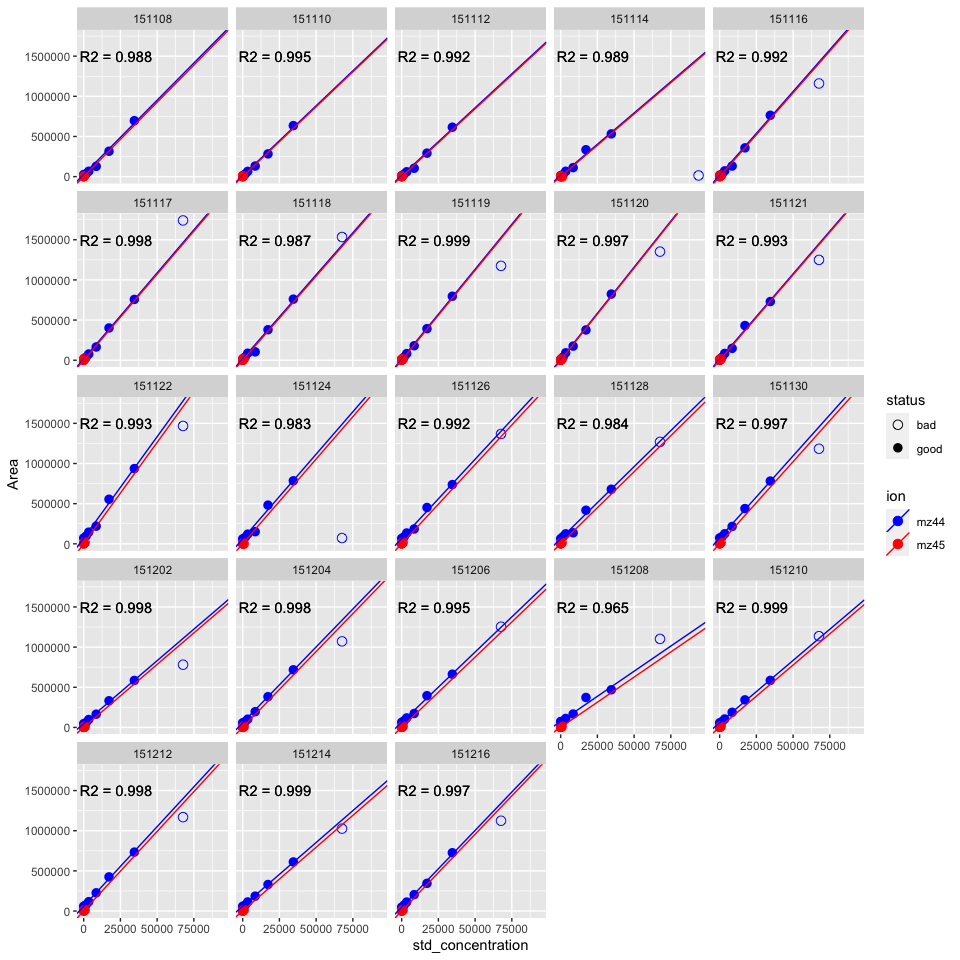
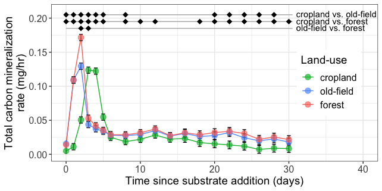
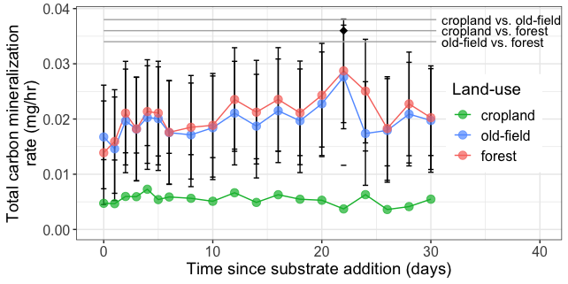
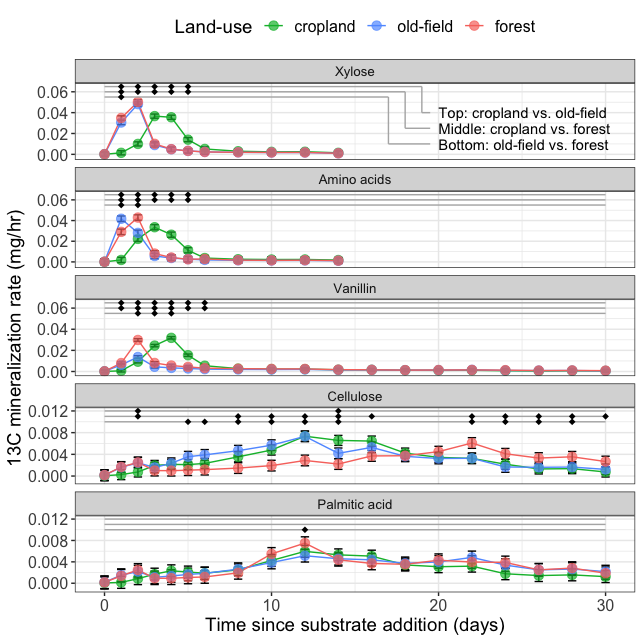
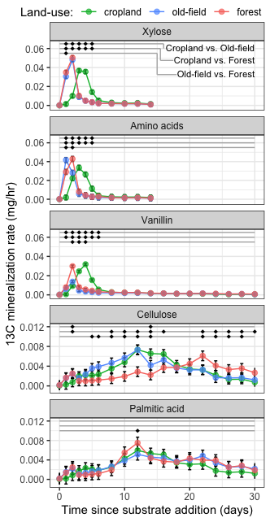
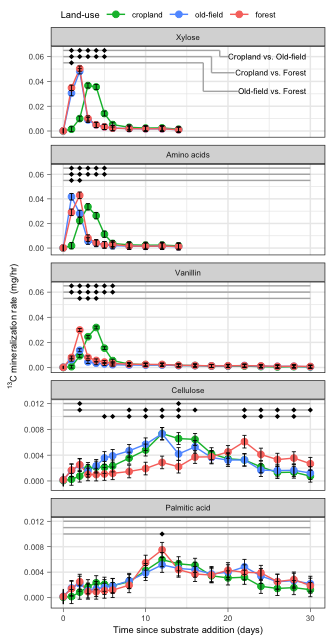
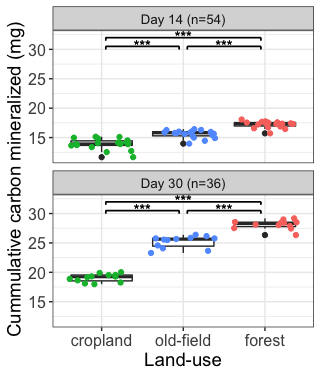
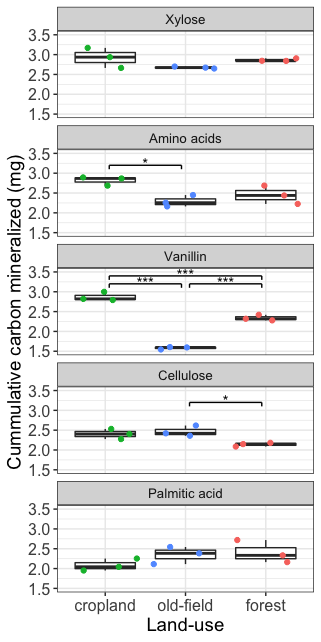

GCMS Analysis (Soil respiration)
================
Samuel Barnett
19 July, 2021

-   [Introduction](#introduction)
-   [Data](#data)
-   [Calculate CO2 concentration and amount of carbon](#calculate-co2-concentration-and-amount-of-carbon)
-   [Comparing total carbon mineralization rates across land-use](#comparing-total-carbon-mineralization-rates-across-land-use)
-   [Comparing mineralization of carbon from labeled substrates across land-use](#comparing-mineralization-of-carbon-from-labeled-substrates-across-land-use)
-   [Compare final cummulative carbon respired from each land use.](#compare-final-cummulative-carbon-respired-from-each-land-use.)
-   [Session info](#session-info)

Introduction
------------

This notebook works through analyzing the GCMS data from the FullCyc2 project. The GCMS was used to measure the concentration of 12C (mz44) and 13C (mz45) CO2 in the headspace of the soil microcoms. Here I will be looking for soil respiration and mineralization of the carbon from the added substrates and comparing across land-use regime.

The equipment used was the a Shimadzu GCMS-QP210S with a XXX column. 250µl headspace samples were taken from triplicate microcosms for each land-use and substrate over multiple days. The 250µl samples were added to a 2ml tube with room air.

Dr. Lynn Johnson from the Cornell Statistical Consulting unit helped develop the linear mixed effects model analysis.

#### Initialization

``` r
# For data handling
library(dplyr)

# For analysis
library(nlme)
library(lsmeans)

# For plotting
library(ggplot2)

# Set color schemes
eco.col = c(agriculture="#00BA38", meadow="#619CFF", forest="#F8766D")

# Legend capture
g_legend<-function(a.gplot){
  tmp <- ggplot_gtable(ggplot_build(a.gplot))
  leg <- which(sapply(tmp$grobs, function(x) x$name) == "guide-box")
  legend <- tmp$grobs[[leg]]
  return(legend)}
```

Data
----

Area and height data are found in separate tab separated files for each timepoint and ion (mz44 and mz45). Here I'll read these files, remove the summary information and combine all files into a single dataframe.

``` r
# Dataframe of timepoints and their sampling dates.
date.df = data.frame(date = c(151108, 151110, 151112, 151114, 151116, 
                              151117, 151118, 151119, 151120, 151121, 
                              151122, 151124, 151126, 151128, 151130, 
                              151202, 151204, 151206, 151208, 151210, 
                              151212, 151214, 151216),
                     day = c(-8, -6, -4, -2, 0, 
                             1, 2, 3, 4, 5, 
                             6, 8, 10, 12, 14, 
                             16, 18, 20, 22, 24, 
                             26, 28, 30))

# Get the mz44 and mz45 data for each timepoint and combine into a single raw data table Also remove the summary information from the bottom of each file.
raw.df = data.frame()
for (date in date.df$date){
  for (ion in c("mz44", "mz45")){
    sub.df = read.table(paste("/Users/sambarnett/Documents/Buckley Lab/FullCyc2/fullcyc2_backups_8_8_19/GCMS/", date, "/", ion, ".txt", sep=""),
                        header=TRUE, fill = TRUE, sep="\t", stringsAsFactors = F) %>%
      filter(!(is.na(X))) %>%
      mutate(ion = ion,
             date = date) %>%
      left_join(date.df, by="date")
    raw.df = rbind(raw.df, sub.df)
  }
}
```

Reformat some of the columns so that they work better in R.

-   Change heading names
-   Remove instances of "-----"
-   Add in samople IDs
-   Remove columns that you don't need anymore:
-   Caclulated concentrations using automatic standard curve
-   Retention time
-   Row id (X)

``` r
cleaned.raw.df = raw.df %>%
  select(Data.Filename, Sample.Type, Level, Area, Height, Std..Conc., ion, date, day) %>%
  rename(ID = Data.Filename, sample_type = Sample.Type, std_concentration = Std..Conc.) %>%
  mutate(ID = gsub(".qgd", "", ID),
         Level = as.numeric(ifelse(Level == "-----", NA, Level)),
         std_concentration = as.numeric(ifelse(std_concentration == "-----", NA, std_concentration)),
         Area = as.numeric(gsub(",", "", Area)),
         Height = as.numeric(gsub(",", "", Height)),
         ID = ifelse(ID == "unk_5perc_2.0_3", "unk_5perc_2.0ml_3", ID))
```

Calculate CO2 concentration and amount of carbon
------------------------------------------------

First I'll take the standards from each date and make a standard curve from which I can calculate the CO2 concentrations for each sample. I'll need to check each standard curve to remove any standards that seem to be off due to poor sampling or standard generation.

``` r
# Dataframe of bad controls
badstd.df = data.frame(Level=8,
                       status = "bad",
                       stringsAsFactors = FALSE)

# Get intercepts for each date and ion. These intercepts will be the area for standard 1 (no added CO2)
intercepts.df = cleaned.raw.df %>%
  filter(sample_type == "Standard", Level == 1) %>%
  rename(intercept = Area) %>%
  select(date, ion, intercept)

# Subset to just the standards. Then adjust the area by subtracting the noise (intercept = no added CO2 area)
std.raw.df = cleaned.raw.df %>%
  filter(sample_type == "Standard") %>%
  left_join(badstd.df, by = "Level") %>%
  mutate(status = ifelse(is.na(status), "good", status)) %>%
  left_join(intercepts.df) %>%
  mutate(adj_Area = Area-intercept)

# Get the standard curve for each day. 
std_curve.df = data.frame()
for(date in unique(std.raw.df$date)){
  std_curve = lm(adj_Area ~ 0 + std_concentration, data=std.raw.df[std.raw.df$date == date & std.raw.df$status == "good",])
  std_curve.sum = summary(std_curve)
  unique(std_curve$coefficients)
  std_curve.df = rbind(std_curve.df, data.frame(date = date, R2 = std_curve.sum$r.squared, slope = unique(std_curve$coefficients)))
}

std_curve.df = left_join(std_curve.df, intercepts.df, by = "date")

ggplot(data=std.raw.df) +
  geom_point(aes(x=std_concentration, y=Area, color=ion, shape=status), size=3) +
  geom_abline(data=std_curve.df, aes(intercept = intercept, slope=slope, color=ion)) +
  geom_text(data=std_curve.df, x=22000, y=1500000, aes(label=paste("R2 =", round(R2, digits = 3)))) +
  scale_color_manual(values = c(mz44 = "blue", mz45 = "red")) +
  scale_shape_manual(values = c(good = 16, bad = 1)) +
  facet_wrap(~date)
```



Now I can use these individual standard curves to calculate the ppm concentration of CO2 in all my samples from each day.

``` r
# Calculate the ppm of the CO2 based on the standard curve.
CO2_conc.df = cleaned.raw.df %>%
  left_join(std_curve.df, by = c("ion", "date")) %>%
  mutate(CO2_ppm = (Area-intercept)/slope)
```

Now I'll use the volume of each flask and the molar mass of carbon to calculate how much carbon is found in the headspace of each microcosm.

``` r
# Get the flask volumes
vols.df = read.table("/Users/sambarnett/Documents/Buckley Lab/FullCyc2/fullcyc2_backups_8_8_19/GCMS/microcosm_volume.txt", 
                     header=TRUE, sep="\t", stringsAsFactors = FALSE) %>%
  rename(ID = Microcosm, vol = volume..ml.)

# Add volumes to CO2 data and calculate carbon mass
temp = 293.15 # room temp or 20˚C
R = 8.314462618e-2 # Universal gas constant
mmC = 12.011 # Molar mass of carbon
mmCO2 = 44.01 # Molar mass of CO2

CO2_conc.df = left_join(CO2_conc.df, vols.df, by = "ID") %>%
  mutate(mass_CO2 = 10^3*mmCO2*(CO2_ppm*vol*10^-9)/(temp*R),
         mass_C = 10^3*mmC*(CO2_ppm*vol*10^-9)/(temp*R))
```

Now I need to calculate rates of mineralization and cummulative carbon mineralization over time.

``` r
# Set sampling periods and the previous day for each timepoint
periods.df = data.frame(day = c(-8,-6,-4,-2,0,1,2,3,4,5,6,8,10,12,14,16,18,20,22,24,26,28,30),
                        prev_day = c(NA,-8,-6,-4,-2,0,1,2,3,4,5,6,8,10,12,14,16,18,20,22,24,26,28),
                        period = c(NA, 2,2,2,2,1,1,1,1,1,1,2,2,2,2,2,2,2,2,2,2,2,2))

# Calculate the rates and cummultive mineralization
CO2_conc.df = CO2_conc.df %>%
  left_join(periods.df, by="day") %>%
  mutate(exp_period = ifelse(day < 0, "pre-incubation", "experimental"),
         C_rate = mass_C/(period*24)) %>%
  arrange(day) %>%
  group_by(ID, ion, exp_period) %>%
  mutate(cum_C = cumsum(mass_C)) %>%
  ungroup
```

Finally, I'll save the required data that is needed for further analysis

``` r
# Keep just necessary columns so there isnt too much clutter
CO2_conc.df = CO2_conc.df %>%
  select(ID, sample_type, Area, ion, date, day, CO2_ppm, mass_C, exp_period, C_rate, cum_C)

#write.table(CO2_conc.df, file="/Users/sambarnett/Documents/Buckley Lab/FullCyc2/Analysis/GCMS_calc_data.txt", 
#            quote=FALSE, sep="\t", row.names = FALSE, col.names = TRUE)
```

Comparing total carbon mineralization rates across land-use
-----------------------------------------------------------

For my first analysis I want to see if the total carbon mineralization rates differ between land use regimes over time. I will do this analysis using a linear mixed effects model. For this analysis we can use all samples from a land-use (except for the H2O-Con) as replicates since they were all treated the same except for the 13C label.

First I'll load the data and remove samples that we don't want to analyze. I'll also combine the mz44 and mz45 together since we are looking at total carbon not specific ions.

``` r
GCMS.df = read.table(file="/Users/sambarnett/Documents/Buckley Lab/FullCyc2/Analysis/GCMS_calc_data.txt",
                     header = TRUE, sep="\t", stringsAsFactors = FALSE)

totalC.df = GCMS.df %>%
  filter(sample_type == "Unknown", ID != "air_control", 
         !(grepl("unk", ID)),
         !(grepl("blank", ID)),
         !(grepl("Glu", ID)),
         !(grepl("Agilent", ID)),
         day >= 0) %>%
  tidyr::separate(ID, into=c("loc", "eco", "substrate", "extract_day", "replicate"), sep="\\.", remove=FALSE) %>%
  mutate(ecosystem = ifelse(eco == "A", "agriculture", 
                            ifelse(eco == "M", "meadow",
                                   ifelse(eco == "F", "forest", NA))),
         replicate = as.numeric(gsub("R", "", replicate))) %>%
  #filter(extract_day == "D30") %>%
  mutate(ecosystem = factor(ecosystem, levels = c("agriculture", "meadow", "forest")),
         substrate = factor(substrate, levels = c("H2O-Con", "12C-Con", "13C-Xyl", "13C-Ami", "13C-Van", "13C-Cel", "13C-Pal")),
         day = factor(day, levels=unique(day)),
         ID = factor(ID, levels=unique(ID))) %>%
  group_by(ID, ecosystem, substrate, day, exp_period) %>%
  summarize(C_rate = sum(C_rate),
            cum_C = sum(cum_C)) %>%
  as.data.frame
```

Now I'll run the linear mixed effects model comparing land use mineralization rates over time.

``` r
# Run the linear mixed effects model
treat.model = lme(C_rate ~ ecosystem + day + ecosystem*day, random = ~1|ID,
                  data=totalC.df[totalC.df$substrate != "H2O-Con",], method="REML")
anova(treat.model)
```

    ##               numDF denDF  F-value p-value
    ## (Intercept)       1   774 38978.14  <.0001
    ## ecosystem         2    51   237.08  <.0001
    ## day              18   774  1222.09  <.0001
    ## ecosystem:day    36   774   368.63  <.0001

``` r
# Run a posthoc pairwise comparisons and get the means
#lsmeans(treat.model, pairwise~ecosystem*day, adjust="tukey")
posthoc.res = lsmeans(treat.model, pairwise~ecosystem*day, adjust="bonferroni")

rate_means.df = data.frame(posthoc.res$lsmeans) %>%
  mutate(day = as.numeric(as.character(day)))
rate_pairwise.df = data.frame(posthoc.res$contrasts) %>%
  tidyr::separate(contrast, into=c("ecosystem_1", "day_1", "ecosystem_2", "day_2"), remove=FALSE) %>%
  filter(ecosystem_1 != ecosystem_2, day_1 == day_2) %>%
  mutate(day = as.numeric(as.character(day_1))) %>%
  dplyr::select(-day_1, -day_2) %>%
  mutate(contrast = paste(ecosystem_1, ecosystem_2, sep="-"))

# Plot the results
total_rate.plot = ggplot(data=rate_means.df, aes(x=day, y=lsmean, color=ecosystem)) +
  geom_line(aes(group=ecosystem)) +
  geom_errorbar(aes(ymin=lower.CL, ymax=upper.CL), width=0.5, color="black") +
  geom_point(size=3, alpha=0.7) +
  annotate("segment", x=0, xend=30.5, y=c(0.205, 0.195, 0.185), yend=c(0.205, 0.195, 0.185), color="grey70") +
  geom_point(data=rate_pairwise.df[rate_pairwise.df$contrast == "agriculture-meadow" & rate_pairwise.df$p.value < 0.05,], 
             aes(x=day), y=0.205, color="black", shape=18, size=3) +
  geom_point(data=rate_pairwise.df[rate_pairwise.df$contrast == "agriculture-forest" & rate_pairwise.df$p.value < 0.05,], 
             aes(x=day), y=0.195, color="black", shape=18, size=3) +
  geom_point(data=rate_pairwise.df[rate_pairwise.df$contrast == "meadow-forest" & rate_pairwise.df$p.value < 0.05,], 
             aes(x=day), y=0.185, color="black", shape=18, size=3) +
  annotate("text", x=31, y=c(0.206, 0.196, 0.186), hjust=0,
           label=c("cropland vs. old-field", "cropland vs. forest", "old-field vs. forest")) +
  scale_color_manual(values = eco.col, labels = c("agriculture" = "cropland", "meadow" = "old-field", "forest" = "forest")) +
  labs(x="Time since substrate addition (days)", y="Total carbon mineralization\nrate (mg/hr)",
       color="Land-use") +
  lims(x=c(0,40), y=c(0, 0.21)) +
  theme_bw() +
  theme(legend.position = c(0.85, 0.5),
        legend.title=element_text(size=14),
        legend.text=element_text(size=12),
        axis.title = element_text(size=14),
        axis.text = element_text(size=12))
total_rate.plot
```



``` r
#ggsave(total_rate.plot, filename = "/Users/sambarnett/Documents/Dissertation/figures/figS2_2.tiff", 
#       device = "tiff", width = 6.69291, height = 3.34646, units = "in")
```

``` r
# Run the linear mixed effects model
H2O.model = lme(C_rate ~ ecosystem + day + ecosystem*day, random = ~1|ID,
                  data=totalC.df[totalC.df$substrate == "H2O-Con",], method="REML")
anova(H2O.model)
```

    ##               numDF denDF  F-value p-value
    ## (Intercept)       1   108 847.7182  <.0001
    ## ecosystem         2     6  88.8889  <.0001
    ## day              18   108   7.4685  <.0001
    ## ecosystem:day    36   108   2.6106   1e-04

``` r
# Run a posthoc pairwise comparisons and get the means
#lsmeans(treat.model, pairwise~ecosystem*day, adjust="tukey")
H2O_posthoc.res = lsmeans(H2O.model, pairwise~ecosystem*day, adjust="bonferroni")

H2O_rate_means.df = data.frame(H2O_posthoc.res$lsmeans) %>%
  mutate(day = as.numeric(as.character(day)))
H2O_rate_pairwise.df = data.frame(H2O_posthoc.res$contrasts) %>%
  tidyr::separate(contrast, into=c("ecosystem_1", "day_1", "ecosystem_2", "day_2"), remove=FALSE) %>%
  filter(ecosystem_1 != ecosystem_2, day_1 == day_2) %>%
  mutate(day = as.numeric(as.character(day_1))) %>%
  dplyr::select(-day_1, -day_2) %>%
  mutate(contrast = paste(ecosystem_1, ecosystem_2, sep="-"))

# Plot the results
ggplot(data=H2O_rate_means.df, aes(x=day, y=lsmean, color=ecosystem)) +
  geom_line(aes(group=ecosystem)) +
  geom_errorbar(aes(ymin=lower.CL, ymax=upper.CL), width=0.5, color="black") +
  geom_point(size=3, alpha=0.7) +
  annotate("segment", x=0, xend=30.5, y=c(0.034, 0.036, 0.038), yend=c(0.034, 0.036, 0.038), color="grey70") +
  geom_point(data=H2O_rate_pairwise.df[H2O_rate_pairwise.df$contrast == "agriculture-meadow" & H2O_rate_pairwise.df$p.value < 0.05,], 
             aes(x=day), y=0.038, color="black", shape=18, size=3) +
  geom_point(data=H2O_rate_pairwise.df[H2O_rate_pairwise.df$contrast == "agriculture-forest" & H2O_rate_pairwise.df$p.value < 0.05,], 
             aes(x=day), y=0.036, color="black", shape=18, size=3) +
  geom_point(data=H2O_rate_pairwise.df[H2O_rate_pairwise.df$contrast == "meadow-forest" & H2O_rate_pairwise.df$p.value < 0.05,], 
             aes(x=day), y=0.034, color="black", shape=18, size=3) +
  annotate("text", x=31, y=c(0.038, 0.036, 0.034), hjust=0,
           label=c("cropland vs. old-field", "cropland vs. forest", "old-field vs. forest")) +
  scale_color_manual(values = eco.col, labels = c("agriculture" = "cropland", "meadow" = "old-field", "forest" = "forest")) +
  labs(x="Time since substrate addition (days)", y="Total carbon mineralization\nrate (mg/hr)",
       color="Land-use") +
  lims(x=c(-0.5,40), y=c(0, 0.0385)) +
  theme_bw() +
  theme(legend.position = c(0.86, 0.5),
        legend.title=element_text(size=14),
        legend.text=element_text(size=12),
        axis.title = element_text(size=14),
        axis.text = element_text(size=12))
```



Comparing mineralization of carbon from labeled substrates across land-use
--------------------------------------------------------------------------

So clearly mineralization of total carbon differs across land-use regime in a particular pattern. Now I'll use the 13C-CO2 data (mz45) to specifically look at the mineralization of carbon from the substrates of interest. Here I am curious to see if the rates of carbon mineralization differ between land use regime differently across substrates. I'll use the same method as before and run a linear mixed effects model for each substrate individually to compare between land-use across time.

First, I just need to subset out my data to get just the mz45 ion values.

``` r
GCMS.df = read.table(file="/Users/sambarnett/Documents/Buckley Lab/FullCyc2/Analysis/GCMS_calc_data.txt",
                     header = TRUE, sep="\t", stringsAsFactors = FALSE)

labeledC.df = GCMS.df %>%
  filter(sample_type == "Unknown", ID != "air_control", 
         !(grepl("unk", ID)),
         !(grepl("blank", ID)),
         !(grepl("Glu", ID)),
         !(grepl("Agilent", ID)),
         day >= 0,
         ion == "mz45") %>%
  tidyr::separate(ID, into=c("loc", "eco", "substrate", "extract_day", "replicate"), sep="\\.", remove=FALSE) %>%
  mutate(ecosystem = ifelse(eco == "A", "agriculture", 
                            ifelse(eco == "M", "meadow",
                                   ifelse(eco == "F", "forest", NA))),
         replicate = as.numeric(gsub("R", "", replicate))) %>%
  filter(substrate != "H2O-Con", substrate != "12C-Con") %>%
  mutate(ecosystem = factor(ecosystem, levels = c("agriculture", "meadow", "forest")),
         substrate = factor(substrate, levels = c("12C-Con", "13C-Xyl", "13C-Ami", "13C-Van", "13C-Cel", "13C-Pal")),
         day = factor(day, levels=unique(day)),
         ID = factor(ID, levels=unique(ID))) %>%
  dplyr::select(ID, ecosystem, substrate, day, ion, C_rate, cum_C)
```

Now I'll run the linear mixed effects model comparing land use 13C mineralization rates over time.

``` r
# Run the linear mixed effects model for each substrate individually
sub.model.list = list()
sub.rate_lme.df = data.frame()
sub.rate_means.df = data.frame()
sub.rate_pairwise.df = data.frame()
for (carbon in unique(labeledC.df$substrate)){
  sub.model = lme(C_rate ~ ecosystem + day + ecosystem*day, random = ~1|ID,
                  data=labeledC.df[labeledC.df$substrate == carbon,], method="REML")
  sub.model.list[[carbon]] = sub.model
  sub.rate_lme.df = rbind(sub.rate_lme.df, data.frame(anova(sub.model)) %>%
                            tibble::rownames_to_column(var="factor") %>%
                            mutate(substrate = carbon))
  
  # Run a posthoc pairwise comparisons and get the means
  sub.posthoc.res = lsmeans(sub.model, pairwise~ecosystem*day, adjust=NULL)
  
  sub.rate_means.df = rbind(sub.rate_means.df, data.frame(sub.posthoc.res$lsmeans) %>%
                              mutate(day = as.numeric(as.character(day)),
                                     substrate = carbon))
  sub.rate_pairwise.df = rbind(sub.rate_pairwise.df, data.frame(sub.posthoc.res$contrasts) %>%
                                 mutate(padj = p.adjust(p.value, method = "BH")) %>%
                                 tidyr::separate(contrast, into=c("ecosystem_1", "day_1", "ecosystem_2", "day_2"), 
                                                 remove=FALSE) %>%
                                 filter(ecosystem_1 != ecosystem_2, day_1 == day_2) %>%
                                 mutate(day = as.numeric(as.character(day_1))) %>%
                                 dplyr::select(-day_1, -day_2) %>%
                                 mutate(contrast = paste(ecosystem_1, ecosystem_2, sep="-"),
                                        substrate = carbon))
}

sub.rate_means.df$substrate = factor(sub.rate_means.df$substrate, 
                                     levels = c("12C-Con", "13C-Xyl", "13C-Ami", "13C-Van", "13C-Cel", "13C-Pal"))
sub.rate_pairwise.df$substrate = factor(sub.rate_pairwise.df$substrate, 
                                        levels = c("12C-Con", "13C-Xyl", "13C-Ami", "13C-Van", "13C-Cel", "13C-Pal"))

# dataframe with the y-coordinates for the significance symbols for each substrate
sig_y.df = data.frame(substrate = factor(c("13C-Xyl", "13C-Xyl", "13C-Xyl", 
                                           "13C-Ami", "13C-Ami", "13C-Ami", 
                                           "13C-Van", "13C-Van", "13C-Van", 
                                           "13C-Cel", "13C-Cel", "13C-Cel", 
                                           "13C-Pal", "13C-Pal", "13C-Pal"),
                                         levels = c("12C-Con", "13C-Xyl", "13C-Ami", 
                                                    "13C-Van", "13C-Cel", "13C-Pal")),
                      contrast = c("agriculture-meadow", "agriculture-forest", "meadow-forest"),
                      y = c(0.065, 0.06, 0.055, 0.065, 0.06, 0.055, 0.065, 0.06, 0.055,
                            0.012, 0.011, 0.01, 0.012, 0.011, 0.01),
                      xend = c(19, 18, 17, 30, 30, 30, 30, 30, 30, 30, 30, 30, 30, 30, 30))

sub.rate_pairwise.df = left_join(sub.rate_pairwise.df, sig_y.df, by = c("contrast", "substrate"))


sig.lab = data.frame(substrate = as.factor(c("13C-Xyl", "13C-Xyl", "13C-Xyl")),
                     label = c("Top: cropland vs. old-field", "Middle: cropland vs. forest", "Bottom: old-field vs. forest"),
                     y = c(0.04, 0.025, 0.01),
                     x = 20)

sig.lab.seg = data.frame(substrate = as.factor(c("13C-Xyl", "13C-Xyl", "13C-Xyl")),
                         y = c(0.065, 0.06, 0.055, 0.04, 0.025, 0.01),
                         yend = c(0.04, 0.025, 0.01, 0.04, 0.025, 0.01),
                         x = c(19, 18, 17, 19, 18, 17),
                         xend = c(19, 18, 17, 19.5, 19.5, 19.5))

# New facet labels
new.labs <- c("Xylose", "Amino acids", "Vanillin", "Cellulose", "Palmitic acid")
names(new.labs) <- c("13C-Xyl", "13C-Ami", "13C-Van", "13C-Cel", "13C-Pal")


# Plot the results
CO2_rates.plot = ggplot(data=sub.rate_means.df, aes(x=day, y=lsmean, color=ecosystem)) +
  geom_line(aes(group=ecosystem)) +
  geom_errorbar(aes(ymin=lower.CL, ymax=upper.CL), width=0.5, color="black") +
  geom_point(size=3, alpha=0.7) +
  geom_segment(data=sig_y.df, x=0, aes(xend=xend, y=y, yend=y), color="grey70") +
  geom_segment(data=sig.lab.seg, aes(x=x, xend=xend, y=y, yend=yend), color="grey70") +
  geom_point(data=sub.rate_pairwise.df[sub.rate_pairwise.df$contrast == "agriculture-meadow" & sub.rate_pairwise.df$padj < 0.05,], 
             aes(x=day, y=y), color="black", shape=18, size=2) +
  geom_point(data=sub.rate_pairwise.df[sub.rate_pairwise.df$contrast == "agriculture-forest" & sub.rate_pairwise.df$padj < 0.05,], 
             aes(x=day, y=y), color="black", shape=18, size=2) +
  geom_point(data=sub.rate_pairwise.df[sub.rate_pairwise.df$contrast == "meadow-forest" & sub.rate_pairwise.df$padj < 0.05,], 
             aes(x=day, y=y), color="black", shape=18, size=2) +
  geom_text(data=sig.lab, aes(label=label, x=x, y=y), hjust=0, color="black") +
  scale_color_manual(values = eco.col, labels = c("agriculture" = "cropland", "meadow" = "old-field", "forest" = "forest")) +
  labs(x="Time since substrate addition (days)", y="13C mineralization rate (mg/hr)",
       color="Land-use") +
  theme_bw() +
  theme(legend.position = "top",
        legend.title=element_text(size=14),
        legend.text=element_text(size=12),
        axis.title = element_text(size=14),
        axis.text = element_text(size=12),
        strip.text = element_text(size=10)) +
  facet_wrap(~substrate, nrow=6, scales = "free_y", labeller = labeller(substrate = new.labs))

CO2_rates.plot
```



``` r
#ggsave(CO2_rates.plot, filename = "/Users/sambarnett/Documents/Dissertation/figures/fig2_1.tiff", 
#       device = "tiff", width = 6.69291, height = 6.69291, units = "in")

sub.rate_lme.df
```

    ##           factor numDF denDF     F.value      p.value substrate
    ## 1    (Intercept)     1   108 2895.376801 0.000000e+00   13C-Cel
    ## 2      ecosystem     2     6    8.809208 1.639462e-02   13C-Cel
    ## 3            day    18   108   40.509035 0.000000e+00   13C-Cel
    ## 4  ecosystem:day    36   108   11.308458 0.000000e+00   13C-Cel
    ## 5    (Intercept)     1    60 3611.762518 0.000000e+00   13C-Xyl
    ## 6      ecosystem     2     6    1.973871 2.194220e-01   13C-Xyl
    ## 7            day    10    60  560.506825 0.000000e+00   13C-Xyl
    ## 8  ecosystem:day    20    60  199.296594 0.000000e+00   13C-Xyl
    ## 9    (Intercept)     1    60 1708.454668 0.000000e+00   13C-Ami
    ## 10     ecosystem     2     6    5.290340 4.738564e-02   13C-Ami
    ## 11           day    10    60  288.644550 0.000000e+00   13C-Ami
    ## 12 ecosystem:day    20    60   82.248169 0.000000e+00   13C-Ami
    ## 13   (Intercept)     1   108 3919.291088 0.000000e+00   13C-Van
    ## 14     ecosystem     2     6  160.673143 6.157884e-06   13C-Van
    ## 15           day    18   108  320.220176 0.000000e+00   13C-Van
    ## 16 ecosystem:day    36   108  118.151045 0.000000e+00   13C-Van
    ## 17   (Intercept)     1   108  962.869682 0.000000e+00   13C-Pal
    ## 18     ecosystem     2     6    1.440048 3.084613e-01   13C-Pal
    ## 19           day    18   108   33.269555 0.000000e+00   13C-Pal
    ## 20 ecosystem:day    36   108    2.068988 2.182587e-03   13C-Pal

``` r
# Run the linear mixed effects model for each substrate individually
sub.model.list = list()
sub.rate_lme.df = data.frame()
sub.rate_means.df = data.frame()
sub.rate_pairwise.df = data.frame()
for (carbon in unique(labeledC.df$substrate)){
  sub.model = lme(C_rate ~ ecosystem + day + ecosystem*day, random = ~1|ID,
                  data=labeledC.df[labeledC.df$substrate == carbon,], method="REML")
  sub.model.list[[carbon]] = sub.model
  sub.rate_lme.df = rbind(sub.rate_lme.df, data.frame(anova(sub.model)) %>%
                            tibble::rownames_to_column(var="factor") %>%
                            mutate(substrate = carbon))
  
  # Run a posthoc pairwise comparisons and get the means
  sub.posthoc.res = lsmeans(sub.model, pairwise~ecosystem*day, adjust=NULL)
  
  sub.rate_means.df = rbind(sub.rate_means.df, data.frame(sub.posthoc.res$lsmeans) %>%
                              mutate(day = as.numeric(as.character(day)),
                                     substrate = carbon))
  sub.rate_pairwise.df = rbind(sub.rate_pairwise.df, data.frame(sub.posthoc.res$contrasts) %>%
                                 mutate(padj = p.adjust(p.value, method = "BH")) %>%
                                 tidyr::separate(contrast, into=c("ecosystem_1", "day_1", "ecosystem_2", "day_2"), 
                                                 remove=FALSE) %>%
                                 filter(ecosystem_1 != ecosystem_2, day_1 == day_2) %>%
                                 mutate(day = as.numeric(as.character(day_1))) %>%
                                 dplyr::select(-day_1, -day_2) %>%
                                 mutate(contrast = paste(ecosystem_1, ecosystem_2, sep="-"),
                                        substrate = carbon))
}

sub.rate_means.df$substrate = factor(sub.rate_means.df$substrate, 
                                     levels = c("12C-Con", "13C-Xyl", "13C-Ami", "13C-Van", "13C-Cel", "13C-Pal"))
sub.rate_pairwise.df$substrate = factor(sub.rate_pairwise.df$substrate, 
                                        levels = c("12C-Con", "13C-Xyl", "13C-Ami", "13C-Van", "13C-Cel", "13C-Pal"))

# dataframe with the y-coordinates for the significance symbols for each substrate
sig_y.df = data.frame(substrate = factor(c("13C-Xyl", "13C-Xyl", "13C-Xyl", 
                                           "13C-Ami", "13C-Ami", "13C-Ami", 
                                           "13C-Van", "13C-Van", "13C-Van", 
                                           "13C-Cel", "13C-Cel", "13C-Cel", 
                                           "13C-Pal", "13C-Pal", "13C-Pal"),
                                         levels = c("12C-Con", "13C-Xyl", "13C-Ami", 
                                                    "13C-Van", "13C-Cel", "13C-Pal")),
                      contrast = c("agriculture-meadow", "agriculture-forest", "meadow-forest"),
                      y = c(0.065, 0.06, 0.055, 0.065, 0.06, 0.055, 0.065, 0.06, 0.055,
                            0.012, 0.011, 0.01, 0.012, 0.011, 0.01),
                      xend = c(16, 15.5, 15, 30, 30, 30, 30, 30, 30, 30, 30, 30, 30, 30, 30))

sub.rate_pairwise.df = left_join(sub.rate_pairwise.df, sig_y.df, by = c("contrast", "substrate"))


sig.lab = data.frame(substrate = as.factor(c("13C-Xyl", "13C-Xyl", "13C-Xyl")),
                     label = c("Cropland vs. Old-field", "Cropland vs. Forest", "Old-field vs. Forest"),
                     y = c(0.058, 0.045, 0.03),
                     x = 30)

sig.lab.seg = data.frame(substrate = as.factor(c("13C-Xyl", "13C-Xyl", "13C-Xyl")),
                         y = c(0.065, 0.06, 0.055, 0.06, 0.0475, 0.0325),
                         yend = c(0.06, 0.0475, 0.0325, 0.06, 0.0475, 0.0325),
                         x = c(16, 15.5, 15, 16, 15.5, 15),
                         xend = c(16, 15.5, 15, 16, 17.5, 18))

# New facet labels
new.labs <- c("Xylose", "Amino acids", "Vanillin", "Cellulose", "Palmitic acid")
names(new.labs) <- c("13C-Xyl", "13C-Ami", "13C-Van", "13C-Cel", "13C-Pal")


# Plot the results
CO2_rates.plot = ggplot(data=sub.rate_means.df, aes(x=day, y=lsmean, color=ecosystem)) +
  geom_line(aes(group=ecosystem)) +
  geom_errorbar(aes(ymin=lower.CL, ymax=upper.CL), width=0.5, color="black") +
  geom_point(size=2, alpha=0.7) +
  geom_segment(data=sig_y.df, x=0, aes(xend=xend, y=y, yend=y), color="grey70") +
  geom_segment(data=sig.lab.seg, aes(x=x, xend=xend, y=y, yend=yend), color="grey70") +
  geom_point(data=sub.rate_pairwise.df[sub.rate_pairwise.df$contrast == "agriculture-meadow" & sub.rate_pairwise.df$padj < 0.05,], 
             aes(x=day, y=y), color="black", shape=18, size=1.5) +
  geom_point(data=sub.rate_pairwise.df[sub.rate_pairwise.df$contrast == "agriculture-forest" & sub.rate_pairwise.df$padj < 0.05,], 
             aes(x=day, y=y), color="black", shape=18, size=1.5) +
  geom_point(data=sub.rate_pairwise.df[sub.rate_pairwise.df$contrast == "meadow-forest" & sub.rate_pairwise.df$padj < 0.05,], 
             aes(x=day, y=y), color="black", shape=18, size=1.5) +
  geom_text(data=sig.lab, aes(label=label, x=x, y=y), hjust=1, vjust=0, color="black", size=3) +
  scale_color_manual(values = eco.col, labels = c("agriculture" = "cropland", "meadow" = "old-field", "forest" = "forest")) +
  labs(x="Time since substrate addition (days)", y="13C mineralization rate (mg/hr)",
       color="Land-use:") +
  lims(x=c(0,30)) +
  theme_bw() +
  theme(legend.position = "top",
        legend.margin=margin(0,0,0,0),
        legend.box.margin=margin(-3,0,-10,-30),
        legend.title=element_text(size=11),
        legend.text=element_text(size=9),
        axis.title = element_text(size=11),
        axis.text = element_text(size=9),
        strip.text = element_text(size=9)) +
  facet_wrap(~substrate, nrow=6, scales = "free_y", labeller = labeller(substrate = new.labs))

CO2_rates.plot
```



``` r
#ggsave(CO2_rates.plot, filename = "/Users/sambarnett/Documents/Buckley Lab/FullCyc2/manuscript/Figures/Fig1.tiff", 
#       device = "tiff", width = 3.46457, height = 6.69291, units = "in")

sub.rate_lme.df
```

    ##           factor numDF denDF     F.value      p.value substrate
    ## 1    (Intercept)     1   108 2895.376801 0.000000e+00   13C-Cel
    ## 2      ecosystem     2     6    8.809208 1.639462e-02   13C-Cel
    ## 3            day    18   108   40.509035 0.000000e+00   13C-Cel
    ## 4  ecosystem:day    36   108   11.308458 0.000000e+00   13C-Cel
    ## 5    (Intercept)     1    60 3611.762518 0.000000e+00   13C-Xyl
    ## 6      ecosystem     2     6    1.973871 2.194220e-01   13C-Xyl
    ## 7            day    10    60  560.506825 0.000000e+00   13C-Xyl
    ## 8  ecosystem:day    20    60  199.296594 0.000000e+00   13C-Xyl
    ## 9    (Intercept)     1    60 1708.454668 0.000000e+00   13C-Ami
    ## 10     ecosystem     2     6    5.290340 4.738564e-02   13C-Ami
    ## 11           day    10    60  288.644550 0.000000e+00   13C-Ami
    ## 12 ecosystem:day    20    60   82.248169 0.000000e+00   13C-Ami
    ## 13   (Intercept)     1   108 3919.291088 0.000000e+00   13C-Van
    ## 14     ecosystem     2     6  160.673143 6.157884e-06   13C-Van
    ## 15           day    18   108  320.220176 0.000000e+00   13C-Van
    ## 16 ecosystem:day    36   108  118.151045 0.000000e+00   13C-Van
    ## 17   (Intercept)     1   108  962.869682 0.000000e+00   13C-Pal
    ## 18     ecosystem     2     6    1.440048 3.084613e-01   13C-Pal
    ## 19           day    18   108   33.269555 0.000000e+00   13C-Pal
    ## 20 ecosystem:day    36   108    2.068988 2.182587e-03   13C-Pal

2nd version for publication

``` r
# Run the linear mixed effects model for each substrate individually
sub.model.list = list()
sub.rate_lme.df = data.frame()
sub.rate_means.df = data.frame()
sub.rate_pairwise.df = data.frame()
for (carbon in unique(labeledC.df$substrate)){
  sub.model = lme(C_rate ~ ecosystem + day + ecosystem*day, random = ~1|ID,
                  data=labeledC.df[labeledC.df$substrate == carbon,], method="REML")
  sub.model.list[[carbon]] = sub.model
  sub.rate_lme.df = rbind(sub.rate_lme.df, data.frame(anova(sub.model)) %>%
                            tibble::rownames_to_column(var="factor") %>%
                            mutate(substrate = carbon))
  
  # Run a posthoc pairwise comparisons and get the means
  sub.posthoc.res = lsmeans(sub.model, pairwise~ecosystem*day, adjust=NULL)
  
  sub.rate_means.df = rbind(sub.rate_means.df, data.frame(sub.posthoc.res$lsmeans) %>%
                              mutate(day = as.numeric(as.character(day)),
                                     substrate = carbon))
  sub.rate_pairwise.df = rbind(sub.rate_pairwise.df, data.frame(sub.posthoc.res$contrasts) %>%
                                 mutate(padj = p.adjust(p.value, method = "BH")) %>%
                                 tidyr::separate(contrast, into=c("ecosystem_1", "day_1", "ecosystem_2", "day_2"), 
                                                 remove=FALSE) %>%
                                 filter(ecosystem_1 != ecosystem_2, day_1 == day_2) %>%
                                 mutate(day = as.numeric(as.character(day_1))) %>%
                                 dplyr::select(-day_1, -day_2) %>%
                                 mutate(contrast = paste(ecosystem_1, ecosystem_2, sep="-"),
                                        substrate = carbon))
}

sub.rate_means.df$substrate = factor(sub.rate_means.df$substrate, 
                                     levels = c("12C-Con", "13C-Xyl", "13C-Ami", "13C-Van", "13C-Cel", "13C-Pal"))
sub.rate_pairwise.df$substrate = factor(sub.rate_pairwise.df$substrate, 
                                        levels = c("12C-Con", "13C-Xyl", "13C-Ami", "13C-Van", "13C-Cel", "13C-Pal"))

# dataframe with the y-coordinates for the significance symbols for each substrate
sig_y.df = data.frame(substrate = factor(c("13C-Xyl", "13C-Xyl", "13C-Xyl", 
                                           "13C-Ami", "13C-Ami", "13C-Ami", 
                                           "13C-Van", "13C-Van", "13C-Van", 
                                           "13C-Cel", "13C-Cel", "13C-Cel", 
                                           "13C-Pal", "13C-Pal", "13C-Pal"),
                                         levels = c("12C-Con", "13C-Xyl", "13C-Ami", 
                                                    "13C-Van", "13C-Cel", "13C-Pal")),
                      contrast = c("agriculture-meadow", "agriculture-forest", "meadow-forest"),
                      y = c(0.065, 0.06, 0.055, 0.065, 0.06, 0.055, 0.065, 0.06, 0.055,
                            0.012, 0.011, 0.01, 0.012, 0.011, 0.01),
                      xend = c(19, 18, 17, 30, 30, 30, 30, 30, 30, 30, 30, 30, 30, 30, 30))

sub.rate_pairwise.df = left_join(sub.rate_pairwise.df, sig_y.df, by = c("contrast", "substrate"))


sig.lab = data.frame(substrate = as.factor(c("13C-Xyl", "13C-Xyl", "13C-Xyl")),
                     label = c("Cropland vs. Old-field", "Cropland vs. Forest", "Old-field vs. Forest"),
                     y = c(0.058, 0.045, 0.03),
                     x = 29.5)

sig.lab.seg = data.frame(substrate = as.factor(c("13C-Xyl", "13C-Xyl", "13C-Xyl")),
                         y = c(0.065, 0.06, 0.055, 0.06, 0.047, 0.032),
                         yend = c(0.06, 0.047, 0.032, 0.06, 0.047, 0.032),
                         x = c(19, 18, 17, 19, 18, 17),
                         xend = c(19, 18, 17, 20, 20.8, 21.2))

# New facet labels
new.labs <- c("Xylose", "Amino acids", "Vanillin", "Cellulose", "Palmitic acid")
names(new.labs) <- c("13C-Xyl", "13C-Ami", "13C-Van", "13C-Cel", "13C-Pal")


# Plot the results
CO2_rates.plot = ggplot(data=sub.rate_means.df, aes(x=day, y=lsmean, color=ecosystem)) +
  geom_line(aes(group=ecosystem)) +
  #geom_point(size=2, alpha=0.7) +
  geom_point(size=2) +
  geom_errorbar(aes(ymin=lower.CL, ymax=upper.CL), width=0.5, color="black", size=0.3) +
  geom_segment(data=sig_y.df, x=0, aes(xend=xend, y=y, yend=y), color="grey70") +
  geom_segment(data=sig.lab.seg, aes(x=x, xend=xend, y=y, yend=yend), color="grey70") +
  geom_point(data=sub.rate_pairwise.df[sub.rate_pairwise.df$contrast == "agriculture-meadow" & sub.rate_pairwise.df$padj < 0.05,], 
             aes(x=day, y=y), color="black", shape=18, size=1.5) +
  geom_point(data=sub.rate_pairwise.df[sub.rate_pairwise.df$contrast == "agriculture-forest" & sub.rate_pairwise.df$padj < 0.05,], 
             aes(x=day, y=y), color="black", shape=18, size=1.5) +
  geom_point(data=sub.rate_pairwise.df[sub.rate_pairwise.df$contrast == "meadow-forest" & sub.rate_pairwise.df$padj < 0.05,], 
             aes(x=day, y=y), color="black", shape=18, size=1.5) +
  geom_text(data=sig.lab, aes(label=label, x=x, y=y), hjust=1, vjust=0, color="black", size=(6*5/14)) +
  scale_color_manual(values = eco.col, labels = c("agriculture" = "cropland", "meadow" = "old-field", "forest" = "forest")) +
  labs(x="Time since substrate addition (days)",
       y=expression(" "^{13}*"C mineralization rate (mg/hr)"),
       color="Land-use") +
  lims(x=c(0,30.3)) +
  theme_bw() +
  theme(legend.position = "top",
        legend.margin=margin(0,0,0,0),
        legend.box.margin=margin(-3,0,-10,-30),
        legend.title=element_text(size=7),
        legend.text=element_text(size=6),
        axis.title = element_text(size=7),
        axis.text = element_text(size=6),
        axis.ticks = element_line(size=0.2),
        strip.text = element_text(size=6)) +
  facet_wrap(~substrate, nrow=6, scales = "free_y", labeller = labeller(substrate = new.labs))

CO2_rates.plot
```



``` r
#ggsave(CO2_rates.plot, filename = "/Users/sambarnett/Documents/Buckley Lab/FullCyc2/manuscript/Figures/Fig1.tiff", 
#       device = "tiff", width = 3.46457, height = 6.69291, units = "in")
```

Compare final cummulative carbon respired from each land use.
-------------------------------------------------------------

Now that I've shown that the rates of carbon mineralization differ across land use both with total carbon and labeled carbon from each substrate, I want to see if the cummulative carbon respired differs across land use. This will be important to know because it is a measure of how much of the carbon we added to the soil remains there after a given amount of time. The final timepoints I will use will be days 14 and 30 for total carbon, day 14 for xylose and amino acids, and day 30 for Vanillin, cellulose and palmitic acid.

First I'll run this analysis for the total carbon.

``` r
# Get the day 14 and 30 cummulative total carbon mineralization values
GCMS.df = read.table(file="/Users/sambarnett/Documents/Buckley Lab/FullCyc2/Analysis/GCMS_calc_data.txt",
                     header = TRUE, sep="\t", stringsAsFactors = FALSE)

total_cum.df = GCMS.df %>%
  filter(sample_type == "Unknown", ID != "air_control", 
         !(grepl("unk", ID)),
         !(grepl("blank", ID)),
         !(grepl("Glu", ID)),
         !(grepl("Agilent", ID)),
         day %in% c(14, 30)) %>%
  tidyr::separate(ID, into=c("loc", "eco", "substrate", "extract_day", "replicate"), sep="\\.", remove=FALSE) %>%
  mutate(ecosystem = ifelse(eco == "A", "agriculture", 
                            ifelse(eco == "M", "meadow",
                                   ifelse(eco == "F", "forest", NA))),
         replicate = as.numeric(gsub("R", "", replicate))) %>%
  filter(substrate != "H2O-Con") %>%
  mutate(ecosystem = factor(ecosystem, levels = c("agriculture", "meadow", "forest"))) %>%
  group_by(ID, ecosystem, substrate, day) %>%
  summarize(cum_C = sum(cum_C)) %>%
  as.data.frame %>%
  group_by(day) %>%
  mutate(n_samples = n()) %>%
  ungroup %>%
  mutate(day_name = paste("Day ", day, " (n=", n_samples, ")", sep=""))

# Compare the cummulative carbon from each land-use on either day.
total_cum_posthoc.res = data.frame()
for(dia in c(14, 30)){
  cumC.anova = aov(total_cum.df[total_cum.df$day == dia,]$cum_C ~ total_cum.df[total_cum.df$day == dia,]$ecosystem)
  if (anova(cumC.anova)$`Pr(>F)`[1] < 0.05){
    posthoc.res = data.frame(TukeyHSD(cumC.anova, conf.level=0.95)$`total_cum.df[total_cum.df$day == dia, ]$ecosystem`) %>%
      tibble::rownames_to_column(var="comparison") %>%
      mutate(anova.Df = anova(cumC.anova)$`Df`[1],
             anova.F = anova(cumC.anova)$`F value`[1],
             anova.pvalue = anova(cumC.anova)$`Pr(>F)`[1],
             day=dia)
    total_cum_posthoc.res = rbind(total_cum_posthoc.res, posthoc.res)
  }
}

total_cum_posthoc.res = total_cum_posthoc.res %>%
  mutate(xmin = ifelse(grepl("agriculture", comparison), 1.05, 2.05),
         xmax = ifelse(grepl("forest", comparison), 2.95, 1.95),
         ymin = ifelse(grepl("agriculture", comparison) & grepl("forest", comparison), 31.5, 30),
         ymax = ifelse(grepl("agriculture", comparison) & grepl("forest", comparison), 32, 30.5),
         xtext = ifelse(grepl("agriculture", comparison),
                        ifelse(grepl("meadow", comparison), 1.5, 2), 2.5),
         ytext = ifelse(grepl("agriculture", comparison) & grepl("forest", comparison), 32.2, 30.7),
         sig = ifelse(p.adj < 0.001, "***",
                      ifelse(p.adj < 0.01, "**",
                             ifelse(p.adj < 0.05, "*", "NS"))))

# plot these results
total_cum.plot = ggplot(data=total_cum.df, aes(x=ecosystem, y=cum_C)) +
  geom_boxplot() +
  geom_jitter(aes(color=ecosystem)) +
  geom_segment(data=total_cum_posthoc.res[total_cum_posthoc.res$p.adj < 0.05,], 
               aes(x=xmin, xend=xmin, y=ymin, yend=ymax)) +
  geom_segment(data=total_cum_posthoc.res[total_cum_posthoc.res$p.adj < 0.05,], 
               aes(x=xmin, xend=xmax, y=ymax, yend=ymax)) +
  geom_segment(data=total_cum_posthoc.res[total_cum_posthoc.res$p.adj < 0.05,], 
               aes(x=xmax, xend=xmax, y=ymax, yend=ymin)) +
  geom_text(data=total_cum_posthoc.res[total_cum_posthoc.res$p.adj < 0.05,],
            aes(label=sig, x=xtext, y=ytext)) +
  scale_color_manual(values = eco.col) +
  labs(x="Land-use", y="Cummulative carbon mineralized (mg)") +
  scale_x_discrete(labels=c("agriculture" = "cropland", "meadow" = "old-field",
                              "forest" = "forest")) +
  theme_bw() +
  theme(legend.position = "none",
        axis.title = element_text(size=14),
        axis.text = element_text(size=12),
        strip.text = element_text(size=10)) +
  facet_wrap(~day_name, ncol=1)

total_cum.plot
```



``` r
#ggsave(total_cum.plot, filename = "/Users/sambarnett/Documents/Dissertation/figures/figS2_3.tiff", 
#       device = "tiff", width = 3.34646, height = 3.93701, units = "in")

total_cum_posthoc.res
```

    ##           comparison     diff      lwr      upr        p.adj anova.Df   anova.F
    ## 1 meadow-agriculture 1.678881 1.094644 2.263117 2.044062e-08        2  93.06804
    ## 2 forest-agriculture 3.301791 2.717554 3.886027 0.000000e+00        2  93.06804
    ## 3      forest-meadow 1.622910 1.038674 2.207146 4.738407e-08        2  93.06804
    ## 4 meadow-agriculture 6.134040 5.296043 6.972037 5.861978e-14        2 367.17086
    ## 5 forest-agriculture 9.068235 8.230238 9.906232 5.861978e-14        2 367.17086
    ## 6      forest-meadow 2.934196 2.096199 3.772192 1.865416e-09        2 367.17086
    ##   anova.pvalue day xmin xmax ymin ymax xtext ytext sig
    ## 1 9.563117e-18  14 1.05 1.95 30.0 30.5   1.5  30.7 ***
    ## 2 9.563117e-18  14 1.05 2.95 31.5 32.0   2.0  32.2 ***
    ## 3 9.563117e-18  14 2.05 2.95 30.0 30.5   2.5  30.7 ***
    ## 4 2.838995e-23  30 1.05 1.95 30.0 30.5   1.5  30.7 ***
    ## 5 2.838995e-23  30 1.05 2.95 31.5 32.0   2.0  32.2 ***
    ## 6 2.838995e-23  30 2.05 2.95 30.0 30.5   2.5  30.7 ***

Now I'll look at the cummulative carbon mineralized from each of the labeled substrates.

``` r
# Get the day 14 and 30 cummulative total carbon mineralization values
GCMS.df = read.table(file="/Users/sambarnett/Documents/Buckley Lab/FullCyc2/Analysis/GCMS_calc_data.txt",
                     header = TRUE, sep="\t", stringsAsFactors = FALSE)

labeled_cum.df = GCMS.df %>%
  filter(sample_type == "Unknown", ID != "air_control", 
         !(grepl("unk", ID)),
         !(grepl("blank", ID)),
         !(grepl("Glu", ID)),
         !(grepl("Agilent", ID)),
         ion == "mz45") %>%
  tidyr::separate(ID, into=c("loc", "eco", "substrate", "extract_day", "replicate"), sep="\\.", remove=FALSE) %>%
  mutate(ecosystem = ifelse(eco == "A", "agriculture", 
                            ifelse(eco == "M", "meadow",
                                   ifelse(eco == "F", "forest", NA))),
         replicate = as.numeric(gsub("R", "", replicate))) %>%
  filter((substrate %in% c("13C-Xyl", "13C-Ami") & day == 14) | (substrate %in% c("13C-Van", "13C-Cel", "13C-Pal") & day == 30)) %>%
  mutate(ecosystem = factor(ecosystem, levels = c("agriculture", "meadow", "forest")),
         substrate = factor(substrate, levels = c("12C-Con", "13C-Xyl", "13C-Ami", "13C-Van", "13C-Cel", "13C-Pal"))) %>%
  select(ID, ecosystem, substrate, day, cum_C)

# Compare the cummulative labeled carbon from each land-use for each substrate.
labeled_cum_posthoc.res = data.frame()
for (carbon in c("13C-Xyl", "13C-Ami", "13C-Van", "13C-Cel", "13C-Pal")){
  cumC.anova = aov(labeled_cum.df[labeled_cum.df$substrate == carbon,]$cum_C ~ labeled_cum.df[labeled_cum.df$substrate == carbon,]$ecosystem)
  if (anova(cumC.anova)$`Pr(>F)`[1] < 0.05){
    posthoc.res = data.frame(TukeyHSD(cumC.anova, conf.level=0.95)$`labeled_cum.df[labeled_cum.df$substrate == carbon, ]$ecosystem`) %>%
      tibble::rownames_to_column(var="comparison") %>%
        mutate(anova.Df = anova(cumC.anova)$`Df`[1],
               anova.F = anova(cumC.anova)$`F value`[1],
               anova.pvalue = anova(cumC.anova)$`Pr(>F)`[1],
               substrate=carbon)
    labeled_cum_posthoc.res = bind_rows(labeled_cum_posthoc.res, posthoc.res)
  } else{
    posthoc.res = data.frame(anova.Df = anova(cumC.anova)$`Df`[1],
                             anova.F = anova(cumC.anova)$`F value`[1],
                             anova.pvalue = anova(cumC.anova)$`Pr(>F)`[1],
                             substrate=carbon)
    labeled_cum_posthoc.res = bind_rows(labeled_cum_posthoc.res, posthoc.res)
  }
}

labeled_cum_posthoc.res = labeled_cum_posthoc.res %>%
  mutate(xmin = ifelse(grepl("agriculture", comparison), 1.05, 2.05),
         xmax = ifelse(grepl("forest", comparison), 2.95, 1.95),
         ymin = ifelse(grepl("agriculture", comparison) & grepl("forest", comparison), 3.3, 3.1),
         ymax = ifelse(grepl("agriculture", comparison) & grepl("forest", comparison), 3.4, 3.2),
         xtext = ifelse(grepl("agriculture", comparison),
                        ifelse(grepl("meadow", comparison), 1.5, 2), 2.5),
         ytext = ifelse(grepl("agriculture", comparison) & grepl("forest", comparison), 3.45, 3.25),
         sig = ifelse(p.adj < 0.001, "***",
                      ifelse(p.adj < 0.01, "**",
                             ifelse(p.adj < 0.05, "*", "NS"))),
         substrate = factor(substrate, levels = c("12C-Con", "13C-Xyl", "13C-Ami", "13C-Van", "13C-Cel", "13C-Pal"))) %>%
  filter(!(is.na(p.adj)))

# plot these results
new.labs <- c("Xylose", "Amino acids", "Vanillin", "Cellulose", "Palmitic acid")
names(new.labs) <- c("13C-Xyl", "13C-Ami", "13C-Van", "13C-Cel", "13C-Pal")


CO2_cum.plot = ggplot(data=labeled_cum.df, aes(x=ecosystem, y=cum_C)) +
  geom_boxplot() +
  geom_jitter(aes(color=ecosystem)) +
  geom_segment(data=labeled_cum_posthoc.res[labeled_cum_posthoc.res$p.adj < 0.05,], 
               aes(x=xmin, xend=xmin, y=ymin, yend=ymax)) +
  geom_segment(data=labeled_cum_posthoc.res[labeled_cum_posthoc.res$p.adj < 0.05,], 
               aes(x=xmin, xend=xmax, y=ymax, yend=ymax)) +
  geom_segment(data=labeled_cum_posthoc.res[labeled_cum_posthoc.res$p.adj < 0.05,], 
               aes(x=xmax, xend=xmax, y=ymax, yend=ymin)) +
  geom_text(data=labeled_cum_posthoc.res[labeled_cum_posthoc.res$p.adj < 0.05,],
            aes(label=sig, x=xtext, y=ytext)) +
  scale_color_manual(values = eco.col) +
  labs(x="Land-use", y="Cummulative carbon mineralized (mg)") +
  scale_x_discrete(labels=c("agriculture" = "cropland", "meadow" = "old-field",
                            "forest" = "forest")) +
  lims(y=c(1.5, 3.5)) +
  theme_bw() +
  theme(legend.position = "none",
        axis.title = element_text(size=14),
        axis.text = element_text(size=12),
        strip.text = element_text(size=10)) +
  facet_wrap(~substrate, ncol=1, labeller = labeller(substrate = new.labs))

CO2_cum.plot
```



``` r
#ggsave(CO2_cum.plot, filename = "/Users/sambarnett/Documents/Dissertation/figures/figS2_4.tiff", 
#       device = "tiff", width = 3.34646, height = 6.69291, units = "in")

labeled_cum_posthoc.res
```

    ##   anova.Df    anova.F anova.pvalue substrate         comparison       diff
    ## 1        2   7.486045 2.341686e-02   13C-Ami meadow-agriculture -0.5273740
    ## 2        2   7.486045 2.341686e-02   13C-Ami forest-agriculture -0.3656420
    ## 3        2   7.486045 2.341686e-02   13C-Ami      forest-meadow  0.1617320
    ## 4        2 201.951981 3.136226e-06   13C-Van meadow-agriculture -1.2883740
    ## 5        2 201.951981 3.136226e-06   13C-Van forest-agriculture -0.5309313
    ## 6        2 201.951981 3.136226e-06   13C-Van      forest-meadow  0.7574427
    ## 7        2   7.375974 2.417003e-02   13C-Cel meadow-agriculture  0.0628239
    ## 8        2   7.375974 2.417003e-02   13C-Cel forest-agriculture -0.2638456
    ## 9        2   7.375974 2.417003e-02   13C-Cel      forest-meadow -0.3266695
    ##          lwr         upr        p.adj xmin xmax ymin ymax xtext ytext sig
    ## 1 -0.9558553 -0.09889273 2.154147e-02 1.05 1.95  3.1  3.2   1.5  3.25   *
    ## 2 -0.7941233  0.06283922 8.782315e-02 1.05 2.95  3.3  3.4   2.0  3.45  NS
    ## 3 -0.2667493  0.59021323 5.172425e-01 2.05 2.95  3.1  3.2   2.5  3.25  NS
    ## 4 -1.4860815 -1.09066661 2.331766e-06 1.05 1.95  3.1  3.2   1.5  3.25 ***
    ## 5 -0.7286388 -0.33322390 4.235040e-04 1.05 2.95  3.3  3.4   2.0  3.45 ***
    ## 6  0.5597353  0.95515014 5.647007e-05 2.05 2.95  3.1  3.2   2.5  3.25 ***
    ## 7 -0.2141194  0.33976720 7.744804e-01 1.05 1.95  3.1  3.2   1.5  3.25  NS
    ## 8 -0.5407889  0.01309766 5.984485e-02 1.05 2.95  3.3  3.4   2.0  3.45  NS
    ## 9 -0.6036128 -0.04972624 2.582775e-02 2.05 2.95  3.1  3.2   2.5  3.25   *

Session info
------------

``` r
sessionInfo()
```

    ## R version 3.6.3 (2020-02-29)
    ## Platform: x86_64-apple-darwin15.6.0 (64-bit)
    ## Running under: macOS Catalina 10.15.7
    ## 
    ## Matrix products: default
    ## BLAS:   /Library/Frameworks/R.framework/Versions/3.6/Resources/lib/libRblas.0.dylib
    ## LAPACK: /Library/Frameworks/R.framework/Versions/3.6/Resources/lib/libRlapack.dylib
    ## 
    ## locale:
    ## [1] en_US.UTF-8/en_US.UTF-8/en_US.UTF-8/C/en_US.UTF-8/en_US.UTF-8
    ## 
    ## attached base packages:
    ## [1] stats     graphics  grDevices utils     datasets  methods   base     
    ## 
    ## other attached packages:
    ## [1] ggplot2_3.3.3  lsmeans_2.30-0 emmeans_1.4.6  nlme_3.1-147   dplyr_1.0.6   
    ## 
    ## loaded via a namespace (and not attached):
    ##  [1] zoo_1.8-8        tidyselect_1.1.1 xfun_0.13        purrr_0.3.4     
    ##  [5] splines_3.6.3    lattice_0.20-41  colorspace_1.4-1 vctrs_0.3.8     
    ##  [9] generics_0.1.0   htmltools_0.4.0  yaml_2.2.1       utf8_1.1.4      
    ## [13] survival_3.1-12  rlang_0.4.11     pillar_1.6.0     glue_1.4.0      
    ## [17] withr_2.2.0      plyr_1.8.6       multcomp_1.4-13  lifecycle_1.0.0 
    ## [21] stringr_1.4.0    munsell_0.5.0    gtable_0.3.0     mvtnorm_1.1-0   
    ## [25] codetools_0.2-16 coda_0.19-3      evaluate_0.14    labeling_0.3    
    ## [29] knitr_1.28       fansi_0.4.1      TH.data_1.0-10   Rcpp_1.0.4.6    
    ## [33] xtable_1.8-4     scales_1.1.0     farver_2.0.3     digest_0.6.25   
    ## [37] stringi_1.4.6    grid_3.6.3       tools_3.6.3      sandwich_2.5-1  
    ## [41] magrittr_1.5     tibble_3.0.1     tidyr_1.0.2      crayon_1.3.4    
    ## [45] pkgconfig_2.0.3  ellipsis_0.3.0   MASS_7.3-51.6    Matrix_1.2-18   
    ## [49] estimability_1.3 rmarkdown_2.1    rstudioapi_0.11  R6_2.4.1        
    ## [53] compiler_3.6.3
