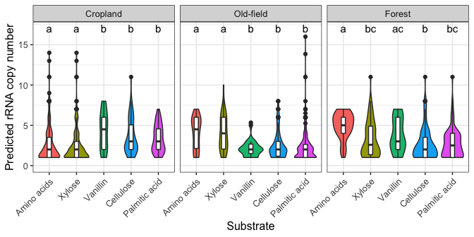
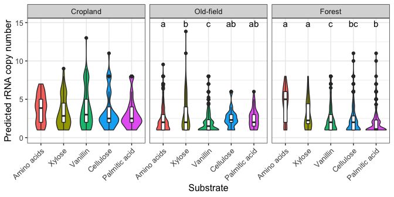
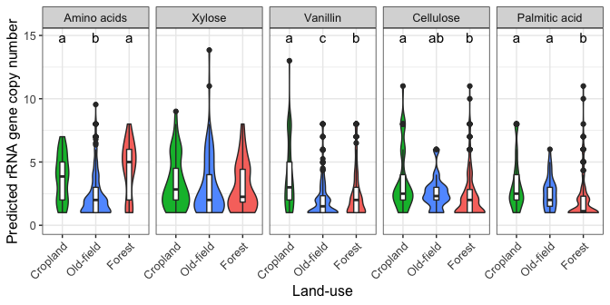
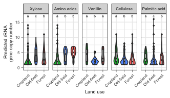

Incorporator rRNA operon copy number
================
Samuel Barnett
19 July, 2021

-   [Introduction](#introduction)
-   [rRNA copy number predictions](#rrna-copy-number-predictions)
-   [Plot 1 for publication (Fig 5)](#plot-1-for-publication-fig-5)

Introduction
------------

We are generally interested in the life history of the bacteria active in soil C cycling in our soils. To get at this a bit we will look at the predicted rRNA operon copy number, which tends to correlate with maximum growth rate, and see if these values vary across the incorporators.

### Initialization

``` r
# For data handling
library(dplyr)
library(phyloseq)

# For plotting
library(ggplot2)

# Set color schemes
eco.col = c(agriculture="#00BA38", meadow="#619CFF", forest="#F8766D")
landuse.col = c("Cropland"="#00BA38", "Old-field"="#619CFF", "Forest"="#F8766D")

g_legend<-function(a.gplot){
  tmp <- ggplot_gtable(ggplot_build(a.gplot))
  leg <- which(sapply(tmp$grobs, function(x) x$name) == "guide-box")
  legend <- tmp$grobs[[leg]]
  return(legend)}

# Dataframe for converting day to a time period (early and late)
subtime.df = data.frame(day = c(1, 3, 6, 14, 1, 3, 6, 14,
                                6, 14, 30, 6, 14, 30, 6, 14, 30),
                        substrate = c("13C-Xyl", "13C-Xyl", "13C-Xyl", "13C-Xyl",
                                      "13C-Ami", "13C-Ami", "13C-Ami", "13C-Ami",
                                      "13C-Van", "13C-Van", "13C-Van", 
                                      "13C-Cel", "13C-Cel", "13C-Cel",
                                      "13C-Pal", "13C-Pal", "13C-Pal"),
                        period = c("Early", "Early", "Late", "Late",
                                   "Early", "Early", "Late", "Late",
                                   "Early", "Late", "Late",
                                   "Early", "Early", "Late",
                                   "Early", "Early", "Late"),
                        Ctype = c("DOM", "DOM", "DOM", "DOM",
                                  "DOM", "DOM", "DOM", "DOM",
                                  #"Van", "Van", "Van",
                                  "DOM", "DOM", "DOM",
                                  "POM", "POM", "POM",
                                  "POM", "POM", "POM"))
```

### Data

``` r
# Get the l2fc dataframe and add in columns indicating the land-use, labeled substrate, and day
l2fc.df = readRDS(file = "/Users/sambarnett/Documents/Buckley Lab/FullCyc2/fullcyc2_l2fc_testoutput.rds") %>%
  mutate(ecosystem  = factor(gsub(".+ecosystem == [ \']*([A-z]+).+", "\\1", .id),
                             levels = c("agriculture", "meadow", "forest")),
         day  = gsub(".+day == [ \']*([0-9]+).+", "\\1", .id),
         substrate = factor(gsub(".+(13C-[A-z]+).+", "\\1", .id),
                            levels = c("13C-Xyl", "13C-Ami", "13C-Van", "13C-Cel", "13C-Pal")))

# Mapping OTUs to FullCyc2 (Both BLAST and mothur aligned)
BLAST2FC1.df = read.table("/Users/sambarnett/Documents/Buckley Lab/FullCyc2/FC2_to_FC1_blast.txt", header=FALSE, sep="\t")
colnames(BLAST2FC1.df) = c("qaccver", "saccver", "pident", "length", "mismatch", "gapopen", "qstart", "qend", "sstart", "send", "evalue", "bitscore")
mothur_aligned.df = read.table("/Users/sambarnett/Documents/Buckley Lab/FullCyc2/all_combined_map.txt", header=TRUE, sep="\t")
FC1_LHs.df = read.table("/Users/sambarnett/Documents/Buckley Lab/FullCyc2/FullCyc_incorporators.txt", header=TRUE, sep="\t") %>%
  rename(FC1_OTU = OTU)

# rRNA gene copy number predictions (from paprica)
#ribosome_counts.df = read.csv("/Users/sambarnett/Desktop/FullCyc2_incorporators.bacteria.unique_seqs.csv") %>%
ribosome_counts.df = read.csv("/Users/sambarnett/Documents/Buckley Lab/FullCyc2/paprica_final/final_incorp.bacteria.unique_seqs.csv") %>%
  select(name, abundance_corrected) %>%
  mutate(count = 1/abundance_corrected) %>%
  rename(OTU = name)
```

rRNA copy number predictions
----------------------------

Here lets see how the rrn (rRNA operon copy number) compares across incorporators of C from each substrate and land-use. We will do this separately for early and late C incorporators.

### Early timepoints

Early incorporators are those that assimilate C before peak mineralization.

First, lets look across substrate within land use.

``` r
sub.changes = data.frame(substrate = c("13C-Ami", "13C-Xyl", "13C-Van", "13C-Cel", "13C-Pal"), 
                         sub_long = c("Amino acids", "Xylose", "Vanillin", "Cellulose", "Palmitic acid"))
eco.changes = data.frame(ecosystem = c("agriculture", "meadow", "forest"), 
                         land_use = c("Cropland", "Old-field", "Forest"))

early_rrn.df = l2fc.df %>%
  filter(padj < 0.05) %>%
  mutate(day = as.numeric(day)) %>%
  left_join(subtime.df, by=c("day", "substrate")) %>%
  filter(period == "Early") %>%
  left_join(sub.changes, by="substrate") %>%
  left_join(eco.changes, by="ecosystem") %>%
  select(OTU, land_use, sub_long, period, Ctype) %>%
  unique() %>%
  left_join(ribosome_counts.df, by="OTU") %>%
  mutate(sub_long = factor(sub_long, levels = c("Amino acids", "Xylose", "Vanillin", "Cellulose", "Palmitic acid"))) %>%
  mutate(land_use = factor(land_use, levels = c("Cropland", "Old-field", "Forest")))

early_substrate_rrn.kruskal.res = data.frame()
for (lu in c("Cropland", "Old-field", "Forest")){
  ktest.res = kruskal.test(count~sub_long, data=filter(early_rrn.df, land_use == lu))
  if (p.adjust(ktest.res$p.value, n=3, method="BH") < 0.05){
    posthoc.res = FSA::dunnTest(count~sub_long, data=filter(early_rrn.df, land_use == lu))
    posthoc.res = posthoc.res$res
    posthoc.cld = rcompanion::cldList(comparison = posthoc.res$Comparison,
                                      p.value = posthoc.res$P.adj,
                                      threshold = 0.05)
  } else{
    posthoc.cld = data.frame(Group = NA, Letter = NA)
  }
  sub.posthoc.df = data.frame(land_use = lu, X2 = ktest.res$statistic, Pvalue = ktest.res$p.value,
                              padj = p.adjust(ktest.res$p.value, n=3, method="BH"),
                              sub_long = posthoc.cld$Group, group = posthoc.cld$Letter,
                              stringsAsFactors = FALSE) %>%
    mutate(sub_long = gsub("acid", " acid", sub_long))
  early_substrate_rrn.kruskal.res = rbind(early_substrate_rrn.kruskal.res, sub.posthoc.df)
}
early_substrate_rrn.kruskal.res = early_substrate_rrn.kruskal.res %>%
  mutate(sub_long = factor(sub_long, levels = c("Amino acids", "Xylose", "Vanillin", "Cellulose", "Palmitic acid"))) %>%
  mutate(land_use = factor(land_use, levels = c("Cropland", "Old-field", "Forest")))

early_substrate_rrn.plot = ggplot(data=early_rrn.df, aes(x=sub_long, y=count)) +
  geom_violin(aes(fill=sub_long)) +
  geom_boxplot(width=0.15) +
  geom_text(data=early_substrate_rrn.kruskal.res, 
            y=max(early_rrn.df$count, na.rm = TRUE)+1, 
            aes(x=sub_long, label=group), size=4) +
  lims(y=c(0, max(early_rrn.df$count, na.rm = TRUE)+1)) +
  labs(x="Substrate", y="Predicted rRNA copy number") +
  facet_wrap(~land_use, nrow=1) +
  theme_bw() +
  theme(axis.text.x = element_text(angle=45, hjust=1),
        text = element_text(size=12),
        legend.position = "none")

early_substrate_rrn.plot
```



``` r
early_substrate_rrn.kruskal.res
```

    ##     land_use       X2       Pvalue         padj      sub_long group
    ## 1   Cropland 56.83372 1.340633e-11 4.021899e-11   Amino acids     a
    ## 2   Cropland 56.83372 1.340633e-11 4.021899e-11     Cellulose     b
    ## 3   Cropland 56.83372 1.340633e-11 4.021899e-11 Palmitic acid     b
    ## 4   Cropland 56.83372 1.340633e-11 4.021899e-11      Vanillin     b
    ## 5   Cropland 56.83372 1.340633e-11 4.021899e-11        Xylose     a
    ## 6  Old-field 45.42968 3.236618e-09 9.709853e-09   Amino acids     a
    ## 7  Old-field 45.42968 3.236618e-09 9.709853e-09     Cellulose     b
    ## 8  Old-field 45.42968 3.236618e-09 9.709853e-09 Palmitic acid     b
    ## 9  Old-field 45.42968 3.236618e-09 9.709853e-09      Vanillin     b
    ## 10 Old-field 45.42968 3.236618e-09 9.709853e-09        Xylose     a
    ## 11    Forest 41.81336 1.823563e-08 5.470689e-08   Amino acids     a
    ## 12    Forest 41.81336 1.823563e-08 5.470689e-08     Cellulose     b
    ## 13    Forest 41.81336 1.823563e-08 5.470689e-08 Palmitic acid    bc
    ## 14    Forest 41.81336 1.823563e-08 5.470689e-08      Vanillin    ac
    ## 15    Forest 41.81336 1.823563e-08 5.470689e-08        Xylose    bc

Next lets look across land use within substrate.

``` r
early_eco_rrn.kruskal.res = data.frame()
for (subC in c("Amino acids", "Xylose", "Vanillin", "Cellulose", "Palmitic acid")){
  ktest.res = kruskal.test(count~land_use, data=filter(early_rrn.df, sub_long == subC))
  if (p.adjust(ktest.res$p.value, n=5, method="BH") < 0.05){
    posthoc.res = FSA::dunnTest(count~land_use, data=mutate(filter(early_rrn.df, sub_long == subC), land_use = gsub("-", "", land_use)))
    posthoc.res = posthoc.res$res
    posthoc.cld = rcompanion::cldList(comparison = posthoc.res$Comparison,
                                      p.value = posthoc.res$P.adj,
                                      threshold = 0.05)
  } else{
    posthoc.cld = data.frame(Group = NA, Letter = NA)
  }
  sub.posthoc.df = data.frame(sub_long = subC, X2 = ktest.res$statistic, Pvalue = ktest.res$p.value,
                              padj = p.adjust(ktest.res$p.value, n=5, method="BH"),
                              land_use = posthoc.cld$Group, group = posthoc.cld$Letter,
                              stringsAsFactors = FALSE) %>%
    mutate(land_use = gsub("Oldfield", "Old-field", land_use))
  early_eco_rrn.kruskal.res = rbind(early_eco_rrn.kruskal.res, sub.posthoc.df)
}
early_eco_rrn.kruskal.res = early_eco_rrn.kruskal.res %>%
  mutate(sub_long = factor(sub_long, levels = c("Amino acids", "Xylose", "Vanillin", "Cellulose", "Palmitic acid"))) %>%
  mutate(land_use = factor(land_use, levels = c("Cropland", "Old-field", "Forest")))


early_eco_rrn.plot = ggplot(data=early_rrn.df, aes(x=land_use, y=count)) +
  geom_violin(aes(fill=land_use)) +
  geom_boxplot(width=0.15) +
  geom_text(data=early_eco_rrn.kruskal.res, 
            y=max(early_rrn.df$count, na.rm = TRUE)+1, 
            aes(x=land_use, label=group), size=4) +
  scale_fill_manual(values=landuse.col) +
  lims(y=c(0, max(early_rrn.df$count, na.rm = TRUE)+1)) +
  labs(x="Land use", y="Predicted rRNA gene copy number") +
  facet_wrap(~sub_long, nrow=1) +
  theme_bw() +
  theme(axis.text.x = element_text(angle=45, hjust=1),
        text = element_text(size=12),
        legend.position = "none")

early_eco_rrn.plot
```


``` r
early_eco_rrn.kruskal.res
```

    ##         sub_long       X2       Pvalue         padj  land_use group
    ## 1    Amino acids 48.50002 2.940054e-11 1.470027e-10  Cropland     a
    ## 2    Amino acids 48.50002 2.940054e-11 1.470027e-10    Forest     b
    ## 3    Amino acids 48.50002 2.940054e-11 1.470027e-10 Old-field     b
    ## 4         Xylose 41.70408 8.791734e-10 4.395867e-09  Cropland     a
    ## 5         Xylose 41.70408 8.791734e-10 4.395867e-09    Forest     b
    ## 6         Xylose 41.70408 8.791734e-10 4.395867e-09 Old-field     c
    ## 7       Vanillin 17.85378 1.327702e-04 6.638510e-04  Cropland     a
    ## 8       Vanillin 17.85378 1.327702e-04 6.638510e-04    Forest     a
    ## 9       Vanillin 17.85378 1.327702e-04 6.638510e-04 Old-field     b
    ## 10     Cellulose 15.92919 3.475520e-04 1.737760e-03  Cropland     a
    ## 11     Cellulose 15.92919 3.475520e-04 1.737760e-03    Forest     b
    ## 12     Cellulose 15.92919 3.475520e-04 1.737760e-03 Old-field     b
    ## 13 Palmitic acid 23.96435 6.254729e-06 3.127365e-05  Cropland     a
    ## 14 Palmitic acid 23.96435 6.254729e-06 3.127365e-05    Forest     b
    ## 15 Palmitic acid 23.96435 6.254729e-06 3.127365e-05 Old-field     c

``` r
#ggsave(early_eco_rrn.plot, filename = "/Users/sambarnett/Documents/Dissertation/figures/fig2_4.tiff", 
#       device = "tiff", width = 7, height = 3.5, units = "in")
```

### Late timepoints

Late incorporators are those that assimilate C after peak mineralization.

First look across substrate within land use.

``` r
sub.changes = data.frame(substrate = c("13C-Ami", "13C-Xyl", "13C-Van", "13C-Cel", "13C-Pal"), 
                         sub_long = c("Amino acids", "Xylose", "Vanillin", "Cellulose", "Palmitic acid"))
eco.changes = data.frame(ecosystem = c("agriculture", "meadow", "forest"), 
                         land_use = c("Cropland", "Old-field", "Forest"))

late_rrn.df = l2fc.df %>%
  filter(padj < 0.05) %>%
  mutate(day = as.numeric(day)) %>%
  left_join(subtime.df, by=c("day", "substrate")) %>%
  filter(period == "Late") %>%
  left_join(sub.changes, by="substrate") %>%
  left_join(eco.changes, by="ecosystem") %>%
  select(OTU, land_use, sub_long, period, Ctype) %>%
  unique() %>%
  left_join(ribosome_counts.df, by="OTU") %>%
  mutate(sub_long = factor(sub_long, levels = c("Amino acids", "Xylose", "Vanillin", "Cellulose", "Palmitic acid"))) %>%
  mutate(land_use = factor(land_use, levels = c("Cropland", "Old-field", "Forest")))

late_substrate_rrn.kruskal.res = data.frame()
for (lu in c("Cropland", "Old-field", "Forest")){
  ktest.res = kruskal.test(count~sub_long, data=filter(late_rrn.df, land_use == lu))
  if (p.adjust(ktest.res$p.value, n=3, method="BH") < 0.05){
    posthoc.res = FSA::dunnTest(count~sub_long, data=filter(late_rrn.df, land_use == lu))
    posthoc.res = posthoc.res$res
    posthoc.cld = rcompanion::cldList(comparison = posthoc.res$Comparison,
                                      p.value = posthoc.res$P.adj,
                                      threshold = 0.05)
  } else{
    posthoc.cld = data.frame(Group = NA, Letter = NA)
  }
  sub.posthoc.df = data.frame(land_use = lu, X2 = ktest.res$statistic, Pvalue = ktest.res$p.value,
                              padj = p.adjust(ktest.res$p.value, n=3, method="BH"),
                              sub_long = posthoc.cld$Group, group = posthoc.cld$Letter,
                              stringsAsFactors = FALSE) %>%
    mutate(sub_long = gsub("acid", " acid", sub_long))
  late_substrate_rrn.kruskal.res = rbind(late_substrate_rrn.kruskal.res, sub.posthoc.df)
}
late_substrate_rrn.kruskal.res = late_substrate_rrn.kruskal.res %>%
  mutate(sub_long = factor(sub_long, levels = c("Amino acids", "Xylose", "Vanillin", "Cellulose", "Palmitic acid"))) %>%
  mutate(land_use = factor(land_use, levels = c("Cropland", "Old-field", "Forest")))

late_substrate_rrn.plot = ggplot(data=late_rrn.df, aes(x=sub_long, y=count)) +
  geom_violin(aes(fill=sub_long)) +
  geom_boxplot(width=0.15) +
  geom_text(data=filter(late_substrate_rrn.kruskal.res, padj < 0.05), 
            y=max(late_rrn.df$count, na.rm = TRUE)+1, 
            aes(x=sub_long, label=group), size=4) +
  lims(y=c(0, max(late_rrn.df$count, na.rm = TRUE)+1)) +
  labs(x="Substrate", y="Predicted rRNA copy number") +
  facet_wrap(~land_use, nrow=1) +
  theme_bw() +
  theme(axis.text.x = element_text(angle=45, hjust=1),
        text = element_text(size=12),
        legend.position = "none")

late_substrate_rrn.plot
```



``` r
late_substrate_rrn.kruskal.res
```

    ##                             land_use        X2       Pvalue         padj
    ## Kruskal-Wallis chi-squared  Cropland  4.729641 3.161792e-01 9.485377e-01
    ## 1                          Old-field 28.852845 8.374320e-06 2.512296e-05
    ## 2                          Old-field 28.852845 8.374320e-06 2.512296e-05
    ## 3                          Old-field 28.852845 8.374320e-06 2.512296e-05
    ## 4                          Old-field 28.852845 8.374320e-06 2.512296e-05
    ## 5                          Old-field 28.852845 8.374320e-06 2.512296e-05
    ## 11                            Forest 50.707091 2.570006e-10 7.710018e-10
    ## 21                            Forest 50.707091 2.570006e-10 7.710018e-10
    ## 31                            Forest 50.707091 2.570006e-10 7.710018e-10
    ## 41                            Forest 50.707091 2.570006e-10 7.710018e-10
    ## 51                            Forest 50.707091 2.570006e-10 7.710018e-10
    ##                                 sub_long group
    ## Kruskal-Wallis chi-squared          <NA>  <NA>
    ## 1                            Amino acids     a
    ## 2                              Cellulose    ab
    ## 3                          Palmitic acid    ab
    ## 4                               Vanillin     c
    ## 5                                 Xylose     b
    ## 11                           Amino acids     a
    ## 21                             Cellulose    bc
    ## 31                         Palmitic acid     b
    ## 41                              Vanillin     c
    ## 51                                Xylose     a

Next look across land-use within substrate.

``` r
late_eco_rrn.kruskal.res = data.frame()
for (subC in c("Amino acids", "Xylose", "Vanillin", "Cellulose", "Palmitic acid")){
  ktest.res = kruskal.test(count~land_use, data=filter(late_rrn.df, sub_long == subC))
  if (p.adjust(ktest.res$p.value, n=5, method="BH") < 0.05){
    posthoc.res = FSA::dunnTest(count~land_use, data=mutate(filter(late_rrn.df, sub_long == subC), land_use = gsub("-", "", land_use)))
    posthoc.res = posthoc.res$res
    posthoc.cld = rcompanion::cldList(comparison = posthoc.res$Comparison,
                                      p.value = posthoc.res$P.adj,
                                      threshold = 0.05)
  } else{
    posthoc.cld = data.frame(Group = NA, Letter = NA)
  }
  sub.posthoc.df = data.frame(sub_long = subC, X2 = ktest.res$statistic, Pvalue = ktest.res$p.value,
                              padj = p.adjust(ktest.res$p.value, n=5, method="BH"),
                              land_use = posthoc.cld$Group, group = posthoc.cld$Letter,
                              stringsAsFactors = FALSE) %>%
    mutate(land_use = gsub("Oldfield", "Old-field", land_use))
  late_eco_rrn.kruskal.res = rbind(late_eco_rrn.kruskal.res, sub.posthoc.df)
}
late_eco_rrn.kruskal.res = late_eco_rrn.kruskal.res %>%
  mutate(sub_long = factor(sub_long, levels = c("Amino acids", "Xylose", "Vanillin", "Cellulose", "Palmitic acid"))) %>%
  mutate(land_use = factor(land_use, levels = c("Cropland", "Old-field", "Forest")))


late_eco_rrn.plot = ggplot(data=late_rrn.df, aes(x=land_use, y=count)) +
  geom_violin(aes(fill=land_use)) +
  geom_boxplot(width=0.15) +
  geom_text(data=filter(late_eco_rrn.kruskal.res, padj < 0.05), 
            y=max(late_rrn.df$count, na.rm = TRUE)+1, 
            aes(x=land_use, label=group), size=4) +
  scale_fill_manual(values=landuse.col) +
  lims(y=c(0, max(late_rrn.df$count, na.rm = TRUE)+1)) +
  labs(x="Land-use", y="Predicted rRNA gene copy number") +
  facet_wrap(~sub_long, nrow=1) +
  theme_bw() +
  theme(axis.text.x = element_text(angle=45, hjust=1),
        text = element_text(size=12),
        legend.position = "none")

late_eco_rrn.plot
```



``` r
late_eco_rrn.kruskal.res
```

    ##                                 sub_long        X2       Pvalue         padj
    ## 1                            Amino acids 44.526338 2.144019e-10 1.072009e-09
    ## 2                            Amino acids 44.526338 2.144019e-10 1.072009e-09
    ## 3                            Amino acids 44.526338 2.144019e-10 1.072009e-09
    ## Kruskal-Wallis chi-squared        Xylose  1.677293 4.322953e-01 1.000000e+00
    ## 11                              Vanillin 59.400223 1.263006e-13 6.315031e-13
    ## 21                              Vanillin 59.400223 1.263006e-13 6.315031e-13
    ## 31                              Vanillin 59.400223 1.263006e-13 6.315031e-13
    ## 12                             Cellulose 21.102565 2.615991e-05 1.307995e-04
    ## 22                             Cellulose 21.102565 2.615991e-05 1.307995e-04
    ## 32                             Cellulose 21.102565 2.615991e-05 1.307995e-04
    ## 13                         Palmitic acid 38.020569 5.545469e-09 2.772735e-08
    ## 23                         Palmitic acid 38.020569 5.545469e-09 2.772735e-08
    ## 33                         Palmitic acid 38.020569 5.545469e-09 2.772735e-08
    ##                             land_use group
    ## 1                           Cropland     a
    ## 2                             Forest     a
    ## 3                          Old-field     b
    ## Kruskal-Wallis chi-squared      <NA>  <NA>
    ## 11                          Cropland     a
    ## 21                            Forest     b
    ## 31                         Old-field     c
    ## 12                          Cropland     a
    ## 22                            Forest     b
    ## 32                         Old-field    ab
    ## 13                          Cropland     a
    ## 23                            Forest     b
    ## 33                         Old-field     a

``` r
#ggsave(late_eco_rrn.plot, filename = "/Users/sambarnett/Documents/Dissertation/figures/figS2_10.tiff", 
#       device = "tiff", width = 7, height = 3.5, units = "in")
```

Plot 1 for publication (Fig 5)
------------------------------

Here is the plot used in the manuscript.

``` r
early_eco_rrn.kruskal.res = data.frame()
for (subC in c("Xylose", "Amino acids", "Vanillin", "Cellulose", "Palmitic acid")){
  ktest.res = kruskal.test(count~land_use, data=filter(early_rrn.df, sub_long == subC))
  if (p.adjust(ktest.res$p.value, n=5, method="BH") < 0.05){
    posthoc.res = FSA::dunnTest(count~land_use, data=mutate(filter(early_rrn.df, sub_long == subC), land_use = gsub("-", "", land_use)))
    posthoc.res = posthoc.res$res
    posthoc.cld = rcompanion::cldList(comparison = posthoc.res$Comparison,
                                      p.value = posthoc.res$P.adj,
                                      threshold = 0.05)
  } else{
    posthoc.cld = data.frame(Group = NA, Letter = NA)
  }
  sub.posthoc.df = data.frame(sub_long = subC, X2 = ktest.res$statistic, Pvalue = ktest.res$p.value,
                              padj = p.adjust(ktest.res$p.value, n=5, method="BH"),
                              land_use = posthoc.cld$Group, group = posthoc.cld$Letter,
                              stringsAsFactors = FALSE) %>%
    mutate(land_use = gsub("Oldfield", "Old-field", land_use))
  early_eco_rrn.kruskal.res = rbind(early_eco_rrn.kruskal.res, sub.posthoc.df)
}
early_eco_rrn.kruskal.res = early_eco_rrn.kruskal.res %>%
  mutate(sub_long = factor(sub_long, levels = c("Xylose", "Amino acids", "Vanillin", "Cellulose", "Palmitic acid"))) %>%
  mutate(land_use = factor(land_use, levels = c("Cropland", "Old-field", "Forest")))


early_eco_rrn.plot = ggplot(data=early_rrn.df, aes(x=land_use, y=count)) +
  geom_violin(aes(fill=land_use)) +
  geom_boxplot(width=0.15, outlier.size = 0.5) +
  geom_text(data=early_eco_rrn.kruskal.res, 
            y=max(early_rrn.df$count, na.rm = TRUE)+1, 
            aes(x=land_use, label=group), size=(5*5/14)) +
  scale_fill_manual(values=landuse.col) +
  lims(y=c(0, max(early_rrn.df$count, na.rm = TRUE)+1)) +
  labs(x="Land use", y="Predicted rRNA\ngene copy number") +
  facet_wrap(~factor(sub_long, levels=c("Xylose", "Amino acids", "Vanillin", "Cellulose", "Palmitic acid")), nrow=1) +
  theme_bw() +
  theme(axis.text.x = element_text(angle=45, hjust=1, size=6),
        axis.text.y = element_text(size=6),
        axis.title = element_text(size=7),
        axis.ticks = element_line(size=0.2),
        strip.text = element_text(size=6),
        legend.position = "none")

early_eco_rrn.plot
```



``` r
#ggsave(early_eco_rrn.plot, filename = "/Users/sambarnett/Documents/Buckley Lab/FullCyc2/manuscript/Figures/Fig5.tiff", 
#       device = "tiff", width = 3.46457, height = 2, units = "in")
```
