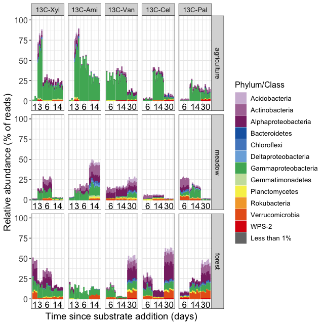

Incorporators
================
Samuel Barnett
19 July, 2021

-   [Introduction](#introduction)
-   [Initial stats](#initial-stats)
-   [Venn diagrams](#venn-diagrams)
-   [Incorporator taxonomy](#incorporator-taxonomy)
-   [Figure for ASM microbe](#figure-for-asm-microbe)
-   [Figure for Pub](#figure-for-pub)

Introduction
------------

Now that we have use MW-HR-SIP to identify incorporators, I want to take a closer look at these labeled OTUs. Specifically, I want to see if they differ systematically across land use regimes, substrates and timepoints.

#### Initialization

``` r
# For data handling
library(dplyr)
library(phyloseq)

# For analysis
library(nlme)
library(lsmeans)

# For plotting
library(ggplot2)
library(eulerr)
library(grid)
library(gridExtra)

# Set color schemes
eco.col = c(agriculture="#00BA38", meadow="#619CFF", forest="#F8766D")

g_legend<-function(a.gplot){
  tmp <- ggplot_gtable(ggplot_build(a.gplot))
  leg <- which(sapply(tmp$grobs, function(x) x$name) == "guide-box")
  legend <- tmp$grobs[[leg]]
  return(legend)}
```

#### Data

Incorporator status can be found in the log2 fold change dataframe.

``` r
# Get the l2fc dataframe and add in columns indicating the land-use, labeled substrate, and day
l2fc.df = readRDS(file = "/Users/sambarnett/Documents/Buckley Lab/FullCyc2/fullcyc2_l2fc_testoutput.rds") %>%
  mutate(ecosystem  = factor(gsub(".+ecosystem == [ \']*([A-z]+).+", "\\1", .id),
                             levels = c("agriculture", "meadow", "forest")),
         day  = gsub(".+day == [ \']*([0-9]+).+", "\\1", .id),
         substrate = factor(gsub(".+(13C-[A-z]+).+", "\\1", .id),
                            levels = c("13C-Xyl", "13C-Ami", "13C-Van", "13C-Cel", "13C-Pal")))
```

The OTU abundances and phylogeny can be found in the master phyloseq object.

``` r
# Import phyloseq object
physeq = readRDS("/Users/sambarnett/Documents/Buckley Lab/FullCyc2/fullcyc2_backups_8_8_19/phyloseq/fullcyc2physeq.RDS")

# Subset to just the unfractionated samples and remove the controls
unfrac.physeq = subset_samples(physeq, exp_type == "Unfractionated" & sample_type == "unknown")
bulk.physeq = subset_samples(physeq, exp_type == "bulk" & sample_type == "unknown")
physeq = NULL

# Remove samples MR.F.12C-Con.D0.R2 and MR.M.12C-Con.D0.R2 since these were likely accidently switched. Their correct, resequenced versions are called MR.F.12C-Con.D0.R2_primer2 and MR.M.12C-Con.D0.R2_primer2
unfrac.physeq = subset_samples(unfrac.physeq, !(X.Sample %in% c("MR.F.12C-Con.D0.R2", "MR.M.12C-Con.D0.R2")))

# Remove non-bacteria (aka Archaea)
unfrac.physeq = subset_taxa(unfrac.physeq, Domain == "Bacteria")
bulk.physeq = subset_taxa(bulk.physeq, Domain == "Bacteria")
  
# Add in a different phylogenetic tree. The one in the phyloseq might be an older version.
tree = read_tree("/Users/sambarnett/Documents/Buckley Lab/FullCyc2/fullcyc2_backups_8_8_19/fullcyc2.bacteria.cogent.tree")
phy_tree(unfrac.physeq) = tree
phy_tree(bulk.physeq) = tree

# Remove any OTUs no longer found in the samples
unfrac.physeq = prune_taxa(taxa_sums(unfrac.physeq) > 0, unfrac.physeq)
bulk.physeq = prune_taxa(taxa_sums(bulk.physeq) > 0, bulk.physeq)
```

For many of the following analyses I want a rarefied OTU table. This is one way to correct for differing sequencing depths across all my samples. I will set the seed for this process so that I can replicate this analysis if necessary (seed = 4242).

``` r
unfrac.rare.physeq = rarefy_even_depth(unfrac.physeq, rngseed=4242)
bulk.rare.physeq = rarefy_even_depth(bulk.physeq, rngseed=4242)
```

Initial stats
-------------

Before proceeding too far, lets just take a look a few inital stats.

``` r
# Total number of OTUs passing filtering (those that went into MW-HR-SIP)
print(paste("There are", nrow(unique(select(l2fc.df, OTU))), "total OTUs passing filter"))
```

    ## [1] "There are 11331 total OTUs passing filter"

``` r
# Total number of incorporators
print(paste("There are", nrow(unique(select(filter(l2fc.df, padj < 0.05), OTU))), "total incorporators"))
```

    ## [1] "There are 1452 total incorporators"

``` r
# Total number of incorporators for each land-use
for (eco in c("agriculture", "meadow", "forest")){
  print(paste("There are", nrow(unique(select(filter(l2fc.df, padj < 0.05 & ecosystem == eco), OTU))), "incorporators from", eco))
}
```

    ## [1] "There are 616 incorporators from agriculture"
    ## [1] "There are 790 incorporators from meadow"
    ## [1] "There are 574 incorporators from forest"

``` r
# Total number of incorporators for each substrate
for (sub in c("13C-Xyl", "13C-Ami", "13C-Van", "13C-Cel", "13C-Pal")){
  print(paste("There are", nrow(unique(select(filter(l2fc.df, padj < 0.05 & substrate == sub), OTU))), "incorporators of", sub))
}
```

    ## [1] "There are 505 incorporators of 13C-Xyl"
    ## [1] "There are 761 incorporators of 13C-Ami"
    ## [1] "There are 577 incorporators of 13C-Van"
    ## [1] "There are 500 incorporators of 13C-Cel"
    ## [1] "There are 584 incorporators of 13C-Pal"

``` r
# Number of incorporator phyla
print(paste("There are", nrow(unique(select(filter(l2fc.df, padj < 0.05, !(is.na(Phylum))), Phylum))), "incorporator phyla"))
```

    ## [1] "There are 22 incorporator phyla"

Now break this up into table format

``` r
l2fc.df %>%
  filter(padj < 0.05) %>%
  select(OTU, ecosystem, substrate) %>%
  unique %>%
  group_by(ecosystem, substrate) %>%
  summarize(n_OTU = n())
```

    ## # A tibble: 15 x 3
    ## # Groups:   ecosystem [3]
    ##    ecosystem   substrate n_OTU
    ##    <fct>       <fct>     <int>
    ##  1 agriculture 13C-Xyl     320
    ##  2 agriculture 13C-Ami     360
    ##  3 agriculture 13C-Van     126
    ##  4 agriculture 13C-Cel     104
    ##  5 agriculture 13C-Pal     121
    ##  6 meadow      13C-Xyl     121
    ##  7 meadow      13C-Ami     485
    ##  8 meadow      13C-Van     296
    ##  9 meadow      13C-Cel     119
    ## 10 meadow      13C-Pal     286
    ## 11 forest      13C-Xyl     190
    ## 12 forest      13C-Ami      49
    ## 13 forest      13C-Van     269
    ## 14 forest      13C-Cel     363
    ## 15 forest      13C-Pal     273

Venn diagrams
-------------

The first thing I want to do is see how incorporators differ between land-use regimes. To do this I will generate venn diagrams to see how many incoporators are within each land use and how many are shared.

### Across ecosystems

First make the plot showing which land use regimes incorporators are labeled in and which ones they are at least detected in.

``` r
# Get a table of each OTU and its labeling or detection pattern across land use regimes.
incorp_eco.df = l2fc.df %>%
  filter(padj < 0.05) %>%
  select(OTU, ecosystem) %>%
  unique %>%
  mutate(value = as.logical("TRUE")) %>%
  tidyr::spread(key=ecosystem, value=value) %>%
  select(-OTU) %>%
  mutate(test = "Labeling")
PA_eco.df = l2fc.df %>%
  group_by(OTU) %>%
  mutate(min_padj = min(padj)) %>%
  ungroup %>%
  filter(min_padj < 0.05) %>%
  select(OTU, ecosystem) %>%
  unique %>%
  mutate(value = as.logical("TRUE")) %>%
  tidyr::spread(key=ecosystem, value=value) %>%
  select(-OTU) %>%
  mutate(test = "Detection")
venn_eco.df = rbind(incorp_eco.df, PA_eco.df)
venn_eco.df[is.na(venn_eco.df)] = as.logical("FALSE")

venn_eco.plot = plot(euler(venn_eco.df, by = list(test)), 
                     legend = FALSE, labels = FALSE,
                     #legend = list(labels = c("Cropland", "Old-field", "Forest"), fontsize=5),
                     quantities = list(TRUE, fontsize=5), strip=FALSE, fills=eco.col)

# Add axis labels
x.grob <- textGrob("Detection                                      Labeling", gp=gpar(fontface="bold", col="black", fontsize=7))

venn_eco.plot = grid.arrange(arrangeGrob(venn_eco.plot, top = x.grob))
```


### Across ecosystems within substrate

First make the plot showing which land use regimes incorporators are labeled in and which ones they are at least detected in.

``` r
# Get a table of each OTU and its labeling or detection pattern across land use regimes.
incorp_subeco.df = l2fc.df %>%
  filter(padj < 0.05) %>%
  select(OTU, ecosystem, substrate) %>%
  unique %>%
  mutate(value = as.logical("TRUE")) %>%
  tidyr::spread(key=ecosystem, value=value) %>%
  select(agriculture, meadow, forest, substrate) %>%
  mutate(test = "Labeling")

incorp_sub.df = l2fc.df %>%
  filter(padj < 0.05) %>%
  select(OTU, substrate) %>%
  unique

PA_subeco.df = l2fc.df %>%
  group_by(OTU) %>%
  mutate(min_padj = min(padj)) %>%
  ungroup %>%
  filter(min_padj < 0.05) %>%
  select(OTU, ecosystem) %>%
  unique %>%
  mutate(value = as.logical("TRUE")) %>%
  tidyr::spread(key=ecosystem, value=value) %>%
  left_join(incorp_sub.df, by = "OTU") %>%
  select(-OTU) %>%
  mutate(test = "Detection")

venn_subeco.df = rbind(incorp_subeco.df, PA_subeco.df)
venn_subeco.df[is.na(venn_subeco.df)] = as.logical("FALSE")

# Plot the venn diagrams together
venn_subeco.plot = plot(euler(venn_subeco.df, by = list(test, substrate)), 
                        quantities = TRUE, labels = NULL,
                        fills=eco.col, strip=FALSE)

#ggsave(venn_subeco.plot, file="/Users/sambarnett/Desktop/Substrate_venns_unlab.tiff", device = "tiff")

# Add axis labels
x.grob <- textGrob("Xylose       Amino acids        Vanillin        Cellulose     Palmitic acid", gp=gpar(fontface="bold", col="black", fontsize=15))
y.grob <- textGrob("Detection    Labeling", 
                   gp=gpar(fontface="bold", col="black", fontsize=15), rot=90)

grid.arrange(arrangeGrob(venn_subeco.plot, top = x.grob, left = y.grob))
```


### Across time within substrate and ecosystem

``` r
# Dataframe for converting day to a time period (early and late)
timeperiods = data.frame(day = c(1, 3, 6, 14, 1, 3, 6, 14,
                                 6, 14, 30, 6, 14, 30, 6, 14, 30),
                         substrate = c("13C-Xyl", "13C-Xyl", "13C-Xyl", "13C-Xyl",
                                       "13C-Ami", "13C-Ami", "13C-Ami", "13C-Ami",
                                       "13C-Van", "13C-Van", "13C-Van", 
                                       "13C-Cel", "13C-Cel", "13C-Cel",
                                       "13C-Pal", "13C-Pal", "13C-Pal"),
                         period = c("Early", "Early", "Late", "Late",
                                    "Early", "Early", "Late", "Late",
                                    "Early", "Late", "Late",
                                    "Early", "Early", "Late",
                                    "Early", "Early", "Late"))

# Get a table of each OTU and its labeling or detection pattern across land use regimes.
venn_period.df = l2fc.df %>%
  filter(padj < 0.05) %>%
  mutate(day = as.numeric(day)) %>%
  left_join(timeperiods) %>%
  select(OTU, ecosystem, substrate, period) %>%
  unique %>%
  mutate(value = as.logical("TRUE")) %>%
  tidyr::spread(key=period, value=value) %>%
  select(ecosystem, substrate, Early, Late) %>%
  replace(is.na(.), as.logical("FALSE")) %>%
  mutate(ecosystem = factor(ecosystem, levels=c("agriculture", "meadow", "forest")),
         substrate = factor(substrate, levels=c("13C-Xyl", "13C-Ami", "13C-Van", "13C-Cel", "13C-Pal")))

# Plot the venn diagrams together
per.col = c(Early = "yellow", Late = "purple")
venn_period.plot = plot(euler(venn_period.df, by = list(substrate, ecosystem)), 
                        quantities = TRUE, labels = NULL, 
                        fills = per.col, strip = FALSE)

# Add axis labels
x.grob <- textGrob("A            M            F", gp=gpar(fontface="bold", col="black", fontsize=12))
y.grob <- textGrob("Pal        Cel       Van       Ami      Xyl    ", 
                   gp=gpar(fontface="bold", col="black", fontsize=12), rot=90)

grid.arrange(arrangeGrob(venn_period.plot, top = x.grob, left = y.grob))
```


Incorporator taxonomy
---------------------

Lets take a brief look at the taxonomy of the incorporators across land-use and time for each substrate.

### OTU counts per Phylum

First I'll look specifically at the phylum (class for proteobacteria) level and how many incorporator OTUs are classified to each phylum (class for Proteobacteria).

``` r
# Get OTU counts for each taxa
incorp_phyla.df = l2fc.df %>%
  filter(padj < 0.05) %>%
  mutate(taxa = ifelse(is.na(Phylum), "Unclassified bacteria",
                       ifelse(Phylum == "Proteobacteria", as.character(Class), as.character(Phylum)))) %>%
  group_by(taxa, ecosystem, substrate, day) %>%
  summarize(OTU_count = n()) %>%
  as.data.frame %>%
  mutate(eco = factor(ifelse(ecosystem == "agriculture", "A",
                             ifelse(ecosystem == "meadow", "M",
                                    ifelse(ecosystem == "forest", "F", NA))), 
                      levels = c("A", "M", "F")),
         substrate = factor(substrate, levels=c("13C-Xyl", "13C-Ami", "13C-Van", "13C-Cel", "13C-Pal")),
         day = as.numeric(day))

# Set the taxa colors
library(scales)
taxa = sort(unique(incorp_phyla.df$taxa))
taxa.col = hue_pal()(length(taxa))
names(taxa.col) = taxa

# Plot for soluble substrates (measured on days 1, 3, 6, and 14)
sol.count.plot = ggplot(data=incorp_phyla.df[incorp_phyla.df$substrate %in% c("13C-Xyl", "13C-Ami"),],
       aes(x=eco, y=OTU_count, fill=taxa)) +
  geom_bar(stat="identity") +
  scale_fill_manual(values=taxa.col) +
  labs(x = "Land-use", y="OTU count", fill="Phylum/Class") +
  theme_bw() +
  theme(legend.position = "none",
        legend.title=element_text(size=14),
        legend.text=element_text(size=12),
        axis.title = element_blank(),
        axis.text = element_text(size=12),
        strip.text = element_text(size=10)) +
  facet_grid(day~substrate, scales="free_y")

# Plot for insoluable substrates (measured on days 6, 14, and 30)
insol.count.plot = ggplot(data=incorp_phyla.df[incorp_phyla.df$substrate %in% c("13C-Van", "13C-Cel", "13C-Pal"),],
       aes(x=eco, y=OTU_count, fill=taxa)) +
  geom_bar(stat="identity") +
  scale_fill_manual(values=taxa.col) +
  labs(x = "Land-use", y="OTU count", fill="Phylum/Class") +
  guides(fill = guide_legend(ncol=3)) +
  theme_bw() +
  theme(legend.position = "none",
        legend.title=element_blank(),
        legend.text=element_text(size=10),
        axis.title = element_blank(),
        axis.text = element_text(size=12),
        strip.text = element_text(size=10)) +
  facet_grid(day~substrate, scales="free_y")

# Get the legend for all substrates
leg_plot = ggplot(data=incorp_phyla.df,
       aes(x=eco, y=OTU_count, fill=taxa)) +
  geom_bar(stat="identity") +
  scale_fill_manual(values=taxa.col) +
  labs(x = "Land-use", y="OTU count", fill="Phylum/Class") +
  guides(fill = guide_legend(ncol=4)) +
  theme_bw() +
  theme(legend.position = "bottom",
        legend.title=element_blank(),
        legend.text=element_text(size=10))

taxa.leg = g_legend(leg_plot)

# Add axis labels
x.grob <- textGrob("Land-use", gp=gpar(fontface="bold", col="black", fontsize=14))
y.grob <- textGrob("Incorporator OTU count", gp=gpar(fontface="bold", col="black", fontsize=14), rot=90)
leg.grob <- textGrob("Phylum/Class", gp=gpar(col="black", fontsize=12))

# Put all plots together
taxa_count.plot = cowplot::plot_grid(sol.count.plot, insol.count.plot, nrow=1, rel_widths = c(0.7,1))
taxa_count.plot = arrangeGrob(taxa_count.plot, bottom = x.grob, left = y.grob)
taxa_count.plot = cowplot::plot_grid(taxa.leg, taxa_count.plot, nrow=2, rel_heights = c(0.4, 1))
taxa_count.plot = grid.arrange(arrangeGrob(taxa_count.plot, top = leg.grob))
```


To make this a bit easier to understand, I'll group days based on whether they are early (i.e. before or around the day of peak mineralization for a given substrate) or late (i.e. after the day of peak mineralization for a given substrate).

``` r
# Set timeperiods for each timepoint
timeperiods = data.frame(day = c(1, 3, 6, 14, 1, 3, 6, 14,
                                 6, 14, 30, 6, 14, 30, 6, 14, 30),
                         substrate = c("13C-Xyl", "13C-Xyl", "13C-Xyl", "13C-Xyl",
                                       "13C-Ami", "13C-Ami", "13C-Ami", "13C-Ami",
                                       "13C-Van", "13C-Van", "13C-Van", 
                                       "13C-Cel", "13C-Cel", "13C-Cel",
                                       "13C-Pal", "13C-Pal", "13C-Pal"),
                         period = c("Early", "Early", "Late", "Late",
                                    "Early", "Early", "Late", "Late",
                                    "Early", "Late", "Late",
                                    "Early", "Early", "Late",
                                    "Early", "Early", "Late"))

# Get OTU counts for each taxa after grouping taxa with less than 5 labeled OTUs into a single group.
incorp_phyla.df = l2fc.df %>%
  filter(padj < 0.05) %>%
  mutate(day = as.numeric(day)) %>%
  left_join(timeperiods, by = c("day", "substrate")) %>%
  mutate(taxa = ifelse(is.na(Phylum), "Unclassified bacteria",
                       ifelse(Phylum == "Proteobacteria", as.character(Class), as.character(Phylum)))) %>%
  select(OTU, taxa, ecosystem, substrate, period) %>%
  unique

incorp_totalOTUcount.df = incorp_phyla.df %>%
  select(OTU, taxa) %>%
  unique() %>%
  group_by(taxa) %>%
  summarize(total_OTU_count = n()) %>%
  as.data.frame %>%
  arrange(total_OTU_count) %>%
  mutate(taxa2 = ifelse(total_OTU_count < 5, "OTU count < 5", taxa))

incorp_taxa_count.df = incorp_phyla.df %>%
  left_join(incorp_totalOTUcount.df, by = "taxa") %>%
  group_by(taxa2, ecosystem, substrate, period) %>%
  summarize(OTU_count = n()) %>%
  as.data.frame %>%
  mutate(eco = factor(ifelse(ecosystem == "agriculture", "A",
                             ifelse(ecosystem == "meadow", "M",
                                    ifelse(ecosystem == "forest", "F", NA))), 
                      levels = c("A", "M", "F")),
         substrate = factor(substrate, levels=c("13C-Xyl", "13C-Ami", "13C-Van", "13C-Cel", "13C-Pal")))
```

Plot this as a stacked bar plot

``` r
# Set colors for the taxa
source("/Users/sambarnett/Documents/Misc_code/paul_tol_colors.R")
taxa = unique(incorp_taxa_count.df[incorp_taxa_count.df$taxa != "OTU count < 5",]$taxa2)
taxa.cols = c(paultol_colors(length(taxa)), "#777777")
names(taxa.cols) = c(sort(taxa), "OTU count < 5")

# Arrange taxa labels for nicer plotting
incorp_taxa_count.df$taxa2 = factor(incorp_taxa_count.df$taxa2,
                                    levels=c(names(taxa.cols)))

# Plot for soluble substrates (measured on days 1, 3, 6, and 14)
taxa_count_grouped.plot = ggplot(data=incorp_taxa_count.df, aes(x=eco, y=OTU_count, fill=taxa2,)) +
  geom_bar(stat="identity") +
  scale_fill_manual(values=taxa.cols) +
  labs(x = "Land-use", y="OTU count", fill="Phylum/Class") +
  guides(fill = guide_legend(ncol=1)) +
  theme_bw() +
  theme(legend.position = "right",
        legend.title=element_text(size=12),
        legend.text=element_text(size=10),
        axis.title = element_text(size=14),
        axis.text = element_text(size=12),
        strip.text = element_text(size=10)) +
  facet_grid(substrate~period, scales="free_y")

taxa_count_grouped.plot
```


### Phylum abundances

Now I want to see how abundant the incorporators are across the microcosms, grouped by their phylum.

``` r
# Get metadata
metadata = data.frame(sample_data(unfrac.rare.physeq)) %>%
  rename(microcosm_substrate = substrate) %>%
  select(X.Sample, ecosystem, day, microcosm_substrate, microcosm_replicate)

# Get OTU relative abundances
OTU_table.df = data.frame(otu_table(transform_sample_counts(unfrac.rare.physeq, function(x) x / sum(x)))) %>%
  tibble::rownames_to_column(var="OTU") %>%
  tidyr::gather(key="X.Sample", value="abundance", -OTU) %>%
  mutate(X.Sample = gsub("13C.", "13C-", gsub("12C.", "12C-", gsub("H2O.", "H2O-", X.Sample))),
         abundance = abundance*100) %>%
  filter(abundance > 0) %>%
  left_join(metadata, by="X.Sample")

# Get incorporators and their pylum
incorp_phyla.df = l2fc.df %>%
  filter(padj < 0.05) %>%
  mutate(taxa = ifelse(is.na(Phylum), "Unclassified bacteria",
                       ifelse(Phylum == "Proteobacteria", as.character(Class), as.character(Phylum))),
         day = as.numeric(day)) %>%
  select(OTU, taxa, ecosystem, day, substrate)

# Group taxa that have less than 1% abundance in any sample
OTU_table.taxa.df = inner_join(OTU_table.df, incorp_phyla.df, by = c("OTU", "ecosystem", "day")) %>%
  group_by(taxa, X.Sample, substrate, ecosystem, day, microcosm_substrate, microcosm_replicate) %>%
  mutate(taxa_abd = sum(abundance)) %>%
  ungroup %>%
  group_by(taxa) %>%
  mutate(max_taxa_abd = max(taxa_abd)) %>%
  ungroup %>%
  mutate(taxa = ifelse(max_taxa_abd < 1, "Less than 1%", taxa)) %>%
  group_by(taxa, X.Sample, substrate, ecosystem, day, microcosm_substrate, microcosm_replicate) %>%
  summarize(taxa_abd = sum(abundance)) %>%
  as.data.frame %>%
  filter(microcosm_substrate != "H2O-Con") %>%
  mutate(ecosystem = factor(ecosystem, levels=c("agriculture", "meadow", "forest")),
         substrate = factor(substrate, levels=c("13C-Xyl", "13C-Ami", "13C-Van", "13C-Cel", "13C-Pal")),
         microcosm_substrate = factor(microcosm_substrate, levels=c("12C-Con", "13C-Xyl", "13C-Ami", "13C-Van", "13C-Cel", "13C-Pal")),
         day_factor = factor(day, levels = c(0, 1, 3, 6, 14, 30)))
```

Now I'll plot these abundances.

``` r
# Set colors for the taxa
source("/Users/sambarnett/Documents/Misc_code/paul_tol_colors.R")
taxa = unique(OTU_table.taxa.df[OTU_table.taxa.df$taxa != "Less than 1%",]$taxa)
taxa.cols = c(paultol_colors(length(taxa)), "#777777")
names(taxa.cols) = c(sort(taxa), "Less than 1%")

# Get positions for each replicate in the plot. Separating bars by their day with separate bars per replicate
day.shift = data.frame(substrate = c("13C-Xyl", "13C-Xyl", "13C-Xyl", "13C-Xyl",
                                     "13C-Ami", "13C-Ami", "13C-Ami", "13C-Ami",
                                     "13C-Van", "13C-Van", "13C-Van",
                                     "13C-Cel", "13C-Cel", "13C-Cel",
                                     "13C-Pal", "13C-Pal", "13C-Pal"),
                       day_factor = factor(c(1, 3, 6, 14, 1, 3, 6, 14,
                                      6, 14, 30, 6, 14, 30, 6, 14, 30)),
                       shift = c(0, 1, 2, 3, 0, 1, 2, 3, 
                                 0, 1, 2, 0, 1, 2, 0, 1, 2))

plot.positions = OTU_table.taxa.df %>%
  select(X.Sample, substrate, ecosystem, day_factor, microcosm_substrate, microcosm_replicate) %>%
  unique %>%
  arrange(day_factor, microcosm_substrate, microcosm_replicate) %>%
  group_by(ecosystem, substrate) %>%
  mutate(rank = row_number()) %>%
  ungroup %>%
  left_join(day.shift) %>%
  mutate(position = rank + shift) %>%
  select(X.Sample, ecosystem, substrate, position)

OTU_table.taxa.sum = left_join(OTU_table.taxa.df, plot.positions, by=c("X.Sample", "ecosystem", "substrate")) %>%
  mutate(taxa = factor(taxa, levels=names(taxa.cols)),
         substrate = factor(substrate, levels=c("13C-Xyl", "13C-Ami", "13C-Van", "13C-Cel", "13C-Pal")))


plot.xlab = OTU_table.taxa.sum %>%
  select(day_factor, position, ecosystem, substrate) %>%
  unique %>%
  group_by(day_factor, ecosystem, substrate) %>%
  summarize(midpoint = mean(position)) %>%
  as.data.frame

# Plot
ggplot(data=OTU_table.taxa.sum, aes(x=position, y=taxa_abd)) +
  geom_bar(stat="identity", aes(fill=taxa, color=taxa)) +
  geom_text(data=plot.xlab, aes(x=midpoint, label=day_factor), y=-7, size=4.5) +
  lims(y=c(-7, 100)) +
  labs(x="Time since substrate addition (days)", y="Relative abundance (% of reads)",
       fill="Phylum/Class", color="Phylum/Class") +
  scale_fill_manual(values=taxa.cols) +
  scale_color_manual(values=taxa.cols) +
  theme_bw() +
  theme(legend.position = "right",
        legend.title=element_text(size=12),
        legend.text=element_text(size=10),
        axis.title = element_text(size=14),
        axis.text.x = element_blank(),
        axis.text.y = element_text(size=12),
        axis.ticks.x = element_blank(),
        strip.text = element_text(size=10)) +
  facet_grid(ecosystem~substrate, scales="free_x")
```



``` r
# Plot
ggplot(data=OTU_table.taxa.sum, aes(x=position, y=taxa_abd)) +
  geom_bar(stat="identity", aes(fill=taxa, color=taxa)) +
  geom_text(data=plot.xlab, aes(x=midpoint, label=day_factor), y=-10, size=4.5) +
  lims(y=c(-15, 100)) +
  labs(x="Time since substrate addition (days)", y="Relative abundance (% of reads)",
       fill="Phylum/Class", color="Phylum/Class") +
  scale_fill_manual(values=taxa.cols) +
  scale_color_manual(values=taxa.cols) +
  theme_bw() +
  theme(legend.position = "right",
        legend.title=element_text(size=12),
        legend.text=element_text(size=10),
        axis.title = element_text(size=14),
        axis.text.x = element_blank(),
        axis.text.y = element_text(size=12),
        axis.ticks.x = element_blank(),
        strip.text = element_text(size=10)) +
  facet_grid(substrate~ecosystem)
```


Figure for ASM microbe
----------------------

``` r
landuse.conv = data.frame(ecosystem = c("agriculture", "meadow", "forest"),
                          landuse = factor(c("Cropland", "Old-field", "Forest"), levels = c("Cropland", "Old-field", "Forest")))

# Dataframe for converting day to a time period (early and late)
subtime.df = data.frame(day = c(1, 3, 6, 14, 1, 3, 6, 14,
                                6, 14, 30, 6, 14, 30, 6, 14, 30),
                        substrate = factor(c("13C-Xyl", "13C-Xyl", "13C-Xyl", "13C-Xyl",
                                             "13C-Ami", "13C-Ami", "13C-Ami", "13C-Ami",
                                             "13C-Van", "13C-Van", "13C-Van", 
                                             "13C-Cel", "13C-Cel", "13C-Cel",
                                             "13C-Pal", "13C-Pal", "13C-Pal"), 
                                           levels = c("13C-Xyl", "13C-Ami", "13C-Van",
                                                      "13C-Cel", "13C-Pal")),
                        period = c("Early", "Early", "Late", "Late",
                                   "Early", "Early", "Late", "Late",
                                   "Early", "Late", "Late",
                                   "Early", "Early", "Late",
                                   "Early", "Early", "Late"))
landuse.col = c("Cropland"="#00BA38", "Old-field"="#619CFF", "Forest"="#F8766D")

early.df = l2fc.df %>% 
  mutate(day = as.numeric(as.character(day))) %>%
  left_join(subtime.df, by=c("day", "substrate")) %>%
  filter(padj < 0.05, period == "Early") %>%
  mutate(taxa = ifelse(Phylum == "Proteobacteria", as.character(Class), as.character(Phylum))) %>%
  mutate(taxa = ifelse(is.na(taxa), "Unclassified", taxa)) %>%
  select(taxa, OTU, substrate, ecosystem) %>%
  unique %>%
  group_by(substrate, ecosystem, taxa) %>%
  summarize(n_OTU = n()) %>%
  left_join(landuse.conv, by="ecosystem") %>%
  mutate(Diversity = NA) %>%
  as.data.frame

## Get incorporator counts and phylogenetic diversity
early.mat = l2fc.df %>% 
  mutate(day = as.numeric(as.character(day))) %>%
  left_join(subtime.df, by=c("day", "substrate")) %>%
  filter(padj < 0.05, period == "Early") %>%
  mutate(eco_sub = paste(ecosystem, substrate, sep="_"), 
         labeled = 1) %>%
  select(OTU, eco_sub, labeled) %>%
  unique %>%
  tidyr::spread(key=eco_sub, value=labeled) %>%
  tibble::column_to_rownames(var="OTU")
early.mat[is.na(early.mat)] = 0

tips2drop = tree$tip.label[!(tree$tip.label %in% unique(l2fc.df$OTU))]
SIP.tree = ape::drop.tip(phy = tree, tip = tips2drop)
early.total.df = picante::pd(t(early.mat), SIP.tree) %>%
  as.data.frame %>%
  tibble::rownames_to_column(var="eco_sub") %>%
  tidyr::gather(key="taxa", value="Diversity", -eco_sub) %>%
  tidyr::separate(eco_sub, into=c("ecosystem", "substrate"), sep="_") %>%
  left_join(landuse.conv, by="ecosystem") %>%
  mutate(taxa = ifelse(taxa == "PD", "Phylogenetic diversity",
                       ifelse(taxa == "SR", "Total incorporators", NA)),
         n_OTU = NA)

early.df = rbind(early.df, early.total.df)

taxa.list = c("Phylogenetic diversity", "Total incorporators", sort(unique(early.df$taxa[!(early.df$taxa %in% c("Total incorporators", "Phylogenetic diversity"))]), decreasing = TRUE))

early.df$taxa = factor(early.df$taxa, levels = taxa.list)

## Scale factor for the phylogenetic diversity sizes
scale.factor = max(filter(early.df, taxa=="Total incorporators")$Diversity)/max(filter(early.df, taxa=="Phylogenetic diversity")$Diversity)

## Font for the y axis, make richness and PD bold
vec_fontface <- ifelse(levels(early.df$taxa) %in% c("Phylogenetic diversity", "Total incorporators"),"bold","plain")


early.plot = ggplot(data=early.df, aes(x=substrate, y=taxa)) +
  geom_tile(data=early.df, color="grey", aes(alpha=n_OTU, fill=landuse)) +
  geom_point(data=filter(early.df, taxa=="Total incorporators"), aes(size = Diversity), color="red") +
  geom_point(data=filter(early.df, taxa=="Phylogenetic diversity"), aes(size = Diversity*scale.factor), color="purple") +
  scale_fill_manual(values = landuse.col) +
  scale_alpha_continuous(na.value=0) +
  scale_x_discrete(position = "top") +
  labs(x="Substrate and land-use\n", y="Phylum/Class\n", 
       fill = "Land-use", alpha="Number of\nincorporators",
       size = "Total number of\nincorporators") +
  theme_bw() +
  theme(panel.grid.major = element_blank(),
        panel.grid.minor = element_blank(),
        panel.border = element_blank(),
        axis.text.x = element_text(angle=90, hjust=0),
        axis.text.y = element_text(face=vec_fontface),
        axis.text.x.top = element_text(vjust = 0.5),
        axis.text = element_text(size=12),
        axis.title = element_text(size=14),
        strip.placement = 'outside',
        strip.text = element_text(size=12),
        legend.text = element_text(size=12),
        legend.title = element_text(size=14)) +
  facet_wrap(~landuse, nrow=1)
```

``` r
leg.plot1 = ggplot(data=early.df, aes(x=substrate, y=taxa)) +
  geom_tile(data=early.df, color="grey", aes(alpha=n_OTU, fill=landuse)) +
  scale_fill_manual(values = landuse.col) +
  scale_alpha_continuous(na.value=0) +
  scale_x_discrete(position = "top") +
  labs(x="Substrate and land-use\n", y="Phylum/Class\n", 
       fill = "Land-use", alpha="Number of\nincorporators",
       size = "Total number of\nincorporators") +
  theme_bw() +
  theme(panel.grid.major = element_blank(),
        panel.grid.minor = element_blank(),
        panel.border = element_blank(),
        axis.text.x = element_text(angle=90, hjust=0),
        axis.text.x.top = element_text(vjust = 0.5),
        axis.text = element_text(size=12),
        axis.title = element_text(size=14),
        strip.placement = 'outside',
        strip.text = element_text(size=12),
        legend.text = element_text(size=12),
        legend.title = element_text(size=14)) +
  facet_wrap(~landuse, nrow=1)

leg.plot2 = ggplot(data=early.df, aes(x=substrate, y=taxa)) +
  geom_point(data=filter(early.df, taxa=="Total incorporators"), aes(size = Diversity), color="red") +
  scale_fill_manual(values = landuse.col) +
  scale_alpha_continuous(na.value=0) +
  scale_x_discrete(position = "top") +
  labs(x="Substrate and land-use\n", y="Phylum/Class\n", 
       fill = "Land-use", alpha="Number of\nincorporators",
       size = "Total number of\nincorporators") +
  theme_bw() +
  theme(panel.grid.major = element_blank(),
        panel.grid.minor = element_blank(),
        panel.border = element_blank(),
        axis.text.x = element_text(angle=90, hjust=0),
        axis.text.x.top = element_text(vjust = 0.5),
        axis.text = element_text(size=12),
        axis.title = element_text(size=14),
        strip.placement = 'outside',
        strip.text = element_text(size=12),
        legend.text = element_text(size=12),
        legend.title = element_text(size=14)) +
  facet_wrap(~landuse, nrow=1)

leg.plot3 = ggplot(data=early.df, aes(x=substrate, y=taxa)) +
  geom_point(data=filter(early.df, taxa=="Phylogenetic diversity"), aes(size = Diversity), color="purple") +
  scale_fill_manual(values = landuse.col) +
  scale_alpha_continuous(na.value=0) +
  scale_x_discrete(position = "top") +
  labs(x="Substrate and land-use\n", y="Phylum/Class\n", 
       fill = "Land-use", alpha="Number of\nincorporators",
       size = "Phylogenetic\ndiversity") +
  theme_bw() +
  theme(panel.grid.major = element_blank(),
        panel.grid.minor = element_blank(),
        panel.border = element_blank(),
        axis.text.x = element_text(angle=90, hjust=0),
        axis.text.x.top = element_text(vjust = 0.5),
        axis.text = element_text(size=12),
        axis.title = element_text(size=14),
        strip.placement = 'outside',
        strip.text = element_text(size=12),
        legend.text = element_text(size=12),
        legend.title = element_text(size=14)) +
  facet_wrap(~landuse, nrow=1)


leg.plot1 = g_legend(leg.plot1)
leg.plot2 = g_legend(leg.plot2)
leg.plot3 = g_legend(leg.plot3)
```

``` r
leg.plot = cowplot::plot_grid(leg.plot1, leg.plot2, leg.plot3, ncol=1, rel_heights = c(1,0.4, 0.4))
early.full.plot = cowplot::plot_grid(early.plot + theme(legend.position = "none"), leg.plot, ncol=2,
                                     rel_widths = c(1,0.3))

early_incorp_pub.plot = cowplot::plot_grid(venn_eco.plot, early.full.plot, ncol=1, rel_heights = c(0.4, 1),
                                           labels=c("A", "B"))
early_incorp_pub.plot
```


``` r
#ggsave(early_incorp_pub.plot, filename = "/Users/sambarnett/Documents/Dissertation/figures/fig2_3.tiff", 
#       device = "tiff", width = 7, height = 10, units = "in")
```

Late responders

``` r
landuse.conv = data.frame(ecosystem = c("agriculture", "meadow", "forest"),
                          landuse = factor(c("Cropland", "Old-field", "Forest"), levels = c("Cropland", "Old-field", "Forest")))

# Dataframe for converting day to a time period (early and late)
subtime.df = data.frame(day = c(1, 3, 6, 14, 1, 3, 6, 14,
                                6, 14, 30, 6, 14, 30, 6, 14, 30),
                        substrate = factor(c("13C-Xyl", "13C-Xyl", "13C-Xyl", "13C-Xyl",
                                             "13C-Ami", "13C-Ami", "13C-Ami", "13C-Ami",
                                             "13C-Van", "13C-Van", "13C-Van", 
                                             "13C-Cel", "13C-Cel", "13C-Cel",
                                             "13C-Pal", "13C-Pal", "13C-Pal"), 
                                           levels = c("13C-Xyl", "13C-Ami", "13C-Van",
                                                      "13C-Cel", "13C-Pal")),
                        period = c("Early", "Early", "Late", "Late",
                                   "Early", "Early", "Late", "Late",
                                   "Early", "Late", "Late",
                                   "Early", "Early", "Late",
                                   "Early", "Early", "Late"))
landuse.col = c("Cropland"="#00BA38", "Old-field"="#619CFF", "Forest"="#F8766D")

late.df = l2fc.df %>% 
  mutate(day = as.numeric(as.character(day))) %>%
  left_join(subtime.df, by=c("day", "substrate")) %>%
  filter(padj < 0.05, period == "Late") %>%
  mutate(taxa = ifelse(Phylum == "Proteobacteria", as.character(Class), as.character(Phylum))) %>%
  mutate(taxa = ifelse(is.na(taxa), "Unclassified", taxa)) %>%
  select(taxa, OTU, substrate, ecosystem) %>%
  unique %>%
  group_by(substrate, ecosystem, taxa) %>%
  summarize(n_OTU = n()) %>%
  left_join(landuse.conv, by="ecosystem") %>%
  mutate(Diversity = NA) %>%
  as.data.frame

## Get incorporator counts and phylogenetic diversity
late.mat = l2fc.df %>% 
  mutate(day = as.numeric(as.character(day))) %>%
  left_join(subtime.df, by=c("day", "substrate")) %>%
  filter(padj < 0.05, period == "Late") %>%
  mutate(eco_sub = paste(ecosystem, substrate, sep="_"), 
         labeled = 1) %>%
  select(OTU, eco_sub, labeled) %>%
  unique %>%
  tidyr::spread(key=eco_sub, value=labeled) %>%
  tibble::column_to_rownames(var="OTU")
late.mat[is.na(late.mat)] = 0

tips2drop = tree$tip.label[!(tree$tip.label %in% unique(l2fc.df$OTU))]
SIP.tree = ape::drop.tip(phy = tree, tip = tips2drop)
late.total.df = picante::pd(t(late.mat), SIP.tree) %>%
  as.data.frame %>%
  tibble::rownames_to_column(var="eco_sub") %>%
  tidyr::gather(key="taxa", value="Diversity", -eco_sub) %>%
  tidyr::separate(eco_sub, into=c("ecosystem", "substrate"), sep="_") %>%
  left_join(landuse.conv, by="ecosystem") %>%
  mutate(taxa = ifelse(taxa == "PD", "Phylogenetic diversity",
                       ifelse(taxa == "SR", "Total incorporators", NA)),
         n_OTU = NA)

late.df = rbind(late.df, late.total.df)

taxa.list = c("Phylogenetic diversity", "Total incorporators", sort(unique(late.df$taxa[!(late.df$taxa %in% c("Total incorporators", "Phylogenetic diversity"))]), decreasing = TRUE))

late.df$taxa = factor(late.df$taxa, levels = taxa.list)

## Scale factor for the phylogenetic diversity sizes
scale.factor = max(filter(late.df, taxa=="Total incorporators")$Diversity)/max(filter(late.df, taxa=="Phylogenetic diversity")$Diversity)

## Font for the y axis, make richness and PD bold
vec_fontface <- ifelse(levels(late.df$taxa) %in% c("Phylogenetic diversity", "Total incorporators"),"bold","plain")


late.plot = ggplot(data=late.df, aes(x=substrate, y=taxa)) +
  geom_tile(data=late.df, color="grey", aes(alpha=n_OTU, fill=landuse)) +
  geom_point(data=filter(late.df, taxa=="Total incorporators"), aes(size = Diversity), color="red") +
  geom_point(data=filter(late.df, taxa=="Phylogenetic diversity"), aes(size = Diversity*scale.factor), color="purple") +
  scale_fill_manual(values = landuse.col) +
  scale_alpha_continuous(na.value=0) +
  scale_x_discrete(position = "top") +
  labs(x="Substrate and land-use\n", y="Phylum/Class\n", 
       fill = "Land-use", alpha="Number of\nincorporators",
       size = "Total number of\nincorporators") +
  theme_bw() +
  theme(panel.grid.major = element_blank(),
        panel.grid.minor = element_blank(),
        panel.border = element_blank(),
        axis.text.x = element_text(angle=90, hjust=0),
        axis.text.y = element_text(face=vec_fontface),
        axis.text.x.top = element_text(vjust = 0.5),
        axis.text = element_text(size=12),
        axis.title = element_text(size=14),
        strip.placement = 'outside',
        strip.text = element_text(size=12),
        legend.text = element_text(size=12),
        legend.title = element_text(size=14)) +
  facet_wrap(~landuse, nrow=1)
```

``` r
leg.plot1 = ggplot(data=late.df, aes(x=substrate, y=taxa)) +
  geom_tile(data=late.df, color="grey", aes(alpha=n_OTU, fill=landuse)) +
  scale_fill_manual(values = landuse.col) +
  scale_alpha_continuous(na.value=0) +
  scale_x_discrete(position = "top") +
  labs(x="Substrate and land-use\n", y="Phylum/Class\n", 
       fill = "Land-use", alpha="Number of\nincorporators",
       size = "Total number of\nincorporators") +
  theme_bw() +
  theme(panel.grid.major = element_blank(),
        panel.grid.minor = element_blank(),
        panel.border = element_blank(),
        axis.text.x = element_text(angle=90, hjust=0),
        axis.text.x.top = element_text(vjust = 0.5),
        axis.text = element_text(size=12),
        axis.title = element_text(size=14),
        strip.placement = 'outside',
        strip.text = element_text(size=12),
        legend.text = element_text(size=12),
        legend.title = element_text(size=14)) +
  facet_wrap(~landuse, nrow=1)

leg.plot2 = ggplot(data=late.df, aes(x=substrate, y=taxa)) +
  geom_point(data=filter(late.df, taxa=="Total incorporators"), aes(size = Diversity), color="red") +
  scale_fill_manual(values = landuse.col) +
  scale_alpha_continuous(na.value=0) +
  scale_x_discrete(position = "top") +
  labs(x="Substrate and land-use\n", y="Phylum/Class\n", 
       fill = "Land-use", alpha="Number of\nincorporators",
       size = "Total number of\nincorporators") +
  theme_bw() +
  theme(panel.grid.major = element_blank(),
        panel.grid.minor = element_blank(),
        panel.border = element_blank(),
        axis.text.x = element_text(angle=90, hjust=0),
        axis.text.x.top = element_text(vjust = 0.5),
        axis.text = element_text(size=12),
        axis.title = element_text(size=14),
        strip.placement = 'outside',
        strip.text = element_text(size=12),
        legend.text = element_text(size=12),
        legend.title = element_text(size=14)) +
  facet_wrap(~landuse, nrow=1)

leg.plot3 = ggplot(data=late.df, aes(x=substrate, y=taxa)) +
  geom_point(data=filter(late.df, taxa=="Phylogenetic diversity"), aes(size = Diversity), color="purple") +
  scale_fill_manual(values = landuse.col) +
  scale_alpha_continuous(na.value=0) +
  scale_x_discrete(position = "top") +
  labs(x="Substrate and land-use\n", y="Phylum/Class\n", 
       fill = "Land-use", alpha="Number of\nincorporators",
       size = "Phylogenetic\ndiversity") +
  theme_bw() +
  theme(panel.grid.major = element_blank(),
        panel.grid.minor = element_blank(),
        panel.border = element_blank(),
        axis.text.x = element_text(angle=90, hjust=0),
        axis.text.x.top = element_text(vjust = 0.5),
        axis.text = element_text(size=12),
        axis.title = element_text(size=14),
        strip.placement = 'outside',
        strip.text = element_text(size=12),
        legend.text = element_text(size=12),
        legend.title = element_text(size=14)) +
  facet_wrap(~landuse, nrow=1)


leg.plot1 = g_legend(leg.plot1)
leg.plot2 = g_legend(leg.plot2)
leg.plot3 = g_legend(leg.plot3)
```

``` r
leg.plot = cowplot::plot_grid(leg.plot1, leg.plot2, leg.plot3, ncol=1, rel_heights = c(1,0.4, 0.4))
late_incorp_pub.plot = cowplot::plot_grid(late.plot + theme(legend.position = "none"), leg.plot, ncol=2,
                                          rel_widths = c(1,0.3))
late_incorp_pub.plot
```


``` r
#ggsave(late_incorp_pub.plot, filename = "/Users/sambarnett/Documents/Dissertation/figures/figS2_9.tiff", 
#       device = "tiff", width = 7, height = 7, units = "in")
```

Figure for Pub
--------------

``` r
landuse.conv = data.frame(ecosystem = c("agriculture", "meadow", "forest"),
                          landuse = factor(c("Cropland", "Old-field", "Forest"), levels = c("Cropland", "Old-field", "Forest")))

# Dataframe for converting day to a time period (early and late)
subtime.df = data.frame(day = c(1, 3, 6, 14, 1, 3, 6, 14,
                                6, 14, 30, 6, 14, 30, 6, 14, 30),
                        substrate = factor(c("13C-Xyl", "13C-Xyl", "13C-Xyl", "13C-Xyl",
                                             "13C-Ami", "13C-Ami", "13C-Ami", "13C-Ami",
                                             "13C-Van", "13C-Van", "13C-Van", 
                                             "13C-Cel", "13C-Cel", "13C-Cel",
                                             "13C-Pal", "13C-Pal", "13C-Pal"), 
                                           levels = c("13C-Xyl", "13C-Ami", "13C-Van",
                                                      "13C-Cel", "13C-Pal")),
                        period = c("Early", "Early", "Late", "Late",
                                   "Early", "Early", "Late", "Late",
                                   "Early", "Late", "Late",
                                   "Early", "Early", "Late",
                                   "Early", "Early", "Late"))
landuse.col = c("Cropland"="#00BA38", "Old-field"="#619CFF", "Forest"="#F8766D")

early.df = l2fc.df %>% 
  mutate(day = as.numeric(as.character(day))) %>%
  left_join(subtime.df, by=c("day", "substrate")) %>%
  filter(padj < 0.05, period == "Early") %>%
  mutate(taxa = ifelse(Phylum == "Proteobacteria", as.character(Class), as.character(Phylum))) %>%
  mutate(taxa = ifelse(is.na(taxa), "Unclassified", taxa)) %>%
  select(taxa, OTU, substrate, ecosystem) %>%
  unique %>%
  group_by(substrate, ecosystem, taxa) %>%
  summarize(n_OTU = n()) %>%
  left_join(landuse.conv, by="ecosystem") %>%
  mutate(Diversity = NA) %>%
  as.data.frame

## Get incorporator counts and phylogenetic diversity
early.mat = l2fc.df %>% 
  mutate(day = as.numeric(as.character(day))) %>%
  left_join(subtime.df, by=c("day", "substrate")) %>%
  filter(padj < 0.05, period == "Early") %>%
  mutate(eco_sub = paste(ecosystem, substrate, sep="_"), 
         labeled = 1) %>%
  select(OTU, eco_sub, labeled) %>%
  unique %>%
  tidyr::spread(key=eco_sub, value=labeled) %>%
  tibble::column_to_rownames(var="OTU")
early.mat[is.na(early.mat)] = 0

tips2drop = tree$tip.label[!(tree$tip.label %in% unique(l2fc.df$OTU))]
SIP.tree = ape::drop.tip(phy = tree, tip = tips2drop)
early.total.df = picante::pd(t(early.mat), SIP.tree) %>%
  as.data.frame %>%
  tibble::rownames_to_column(var="eco_sub") %>%
  tidyr::gather(key="taxa", value="Diversity", -eco_sub) %>%
  tidyr::separate(eco_sub, into=c("ecosystem", "substrate"), sep="_") %>%
  left_join(landuse.conv, by="ecosystem") %>%
  mutate(taxa = ifelse(taxa == "PD", "Phylogenetic diversity",
                       ifelse(taxa == "SR", "Total incorporators", NA)),
         n_OTU = NA)

early.df = rbind(early.df, early.total.df)

taxa.list = c("Phylogenetic diversity", "Total incorporators", sort(unique(early.df$taxa[!(early.df$taxa %in% c("Total incorporators", "Phylogenetic diversity"))]), decreasing = TRUE))

early.df$taxa = factor(early.df$taxa, levels = taxa.list)

## Scale factor for the phylogenetic diversity sizes
scale.factor = max(filter(early.df, taxa=="Total incorporators")$Diversity)/max(filter(early.df, taxa=="Phylogenetic diversity")$Diversity)

## Font for the y axis, make richness and PD bold
vec_fontface <- ifelse(levels(early.df$taxa) %in% c("Phylogenetic diversity", "Total incorporators"),"bold","plain")


early.plot = ggplot(data=early.df, aes(x=substrate, y=taxa)) +
  geom_tile(data=early.df, color="grey", aes(alpha=n_OTU, fill=landuse)) +
  geom_point(data=filter(early.df, taxa=="Total incorporators"), aes(size = Diversity), color="red") +
  geom_point(data=filter(early.df, taxa=="Phylogenetic diversity"), aes(size = Diversity*scale.factor), color="purple") +
  scale_fill_manual(values = landuse.col) +
  scale_alpha_continuous(na.value=0) +
  scale_size_continuous(range = c(0, 2)) +
  labs(x="Substrate and land-use\n", y="Phylum/Class\n", 
       fill = "Land-use", alpha="Number of\nincorporators",
       size = "Total number of\nincorporators", title = "Early 13C-Incorporators") +
  theme_bw() +
  theme(panel.grid.major = element_blank(),
        panel.grid.minor = element_blank(),
        panel.border = element_blank(),
        axis.ticks = element_line(size=0.2), 
        axis.text.x = element_text(angle=90, hjust=1, vjust=0.5),
        axis.text.y = element_text(face=vec_fontface),
        axis.text = element_text(size=6),
        axis.title = element_text(size=7),
        strip.placement = 'outside',
        strip.text = element_text(size=6),
        legend.text = element_text(size=6),
        legend.title = element_text(size=7, hjust=0.5),
        plot.title = element_text(size=7, hjust=0.5)) +
  facet_wrap(~landuse, nrow=1)


early.plot = ggplot(data=early.df, aes(x=substrate, y=taxa)) +
  geom_tile(data=early.df, color="grey", aes(alpha=n_OTU, fill=landuse)) +
  geom_point(data=filter(early.df, taxa=="Total incorporators"), aes(size = Diversity), color="red") +
  geom_point(data=filter(early.df, taxa=="Phylogenetic diversity"), aes(size = Diversity*scale.factor), color="purple") +
  scale_fill_manual(values = landuse.col) +
  scale_alpha_continuous(na.value=0, range = c(0, 1), limits=c(0,90), breaks=c(0, 20, 40, 60, 80)) +
  scale_size_continuous(range = c(0, 2)) +
  labs(x="Substrate and land-use\n", y="Phylum/Class\n", 
       fill = "Land-use", alpha="Number of\nincorporators",
       size = "Total number of\nincorporators", 
       title = expression(bold("Early "^{13}*"C Incorporators"))) +
  theme_bw() +
  theme(panel.grid.major = element_blank(),
        panel.grid.minor = element_blank(),
        panel.border = element_blank(),
        axis.ticks = element_line(size=0.2), 
        axis.text.x = element_text(angle=90, hjust=1, vjust=0.5),
        axis.text.y = element_text(face=vec_fontface),
        axis.text = element_text(size=6),
        axis.title.x = element_text(size=7),
        axis.title.y = element_text(size=7, margin=margin(r=-9)),
        strip.placement = 'outside',
        strip.text = element_text(size=6),
        legend.text = element_text(size=6),
        legend.title = element_text(size=7, hjust=0.5),
        plot.title = element_text(size=7, hjust=0.5, face = "bold")) +
  facet_wrap(~landuse, nrow=1)

early.plot
```


``` r
leg.plot1 = ggplot(data=early.df, aes(x=substrate, y=taxa)) +
  #geom_tile(data=early.df, color="grey", aes(alpha=n_OTU, fill=landuse)) +
  geom_tile(data=early.df, color="grey", aes(fill=landuse)) +
  scale_fill_manual(values = landuse.col) +
  scale_alpha_continuous(na.value=0, range = c(0, 1), limits=c(0,90), breaks=c(0, 20, 40, 60, 80)) +
  scale_size_continuous(range = c(0, 2)) +
  labs(x="Substrate and land-use\n", y="Phylum/Class\n", 
       fill = "Land-use", alpha="Number of\nincorporators",
       size = "Total number of\nincorporators") +
  theme_bw() +
  theme(panel.grid.major = element_blank(),
        panel.grid.minor = element_blank(),
        panel.border = element_blank(),
        axis.ticks = element_line(size=0.2), 
        axis.text.x = element_text(angle=90, hjust=1, vjust=0.5),
        axis.text.y = element_text(face=vec_fontface),
        axis.text = element_text(size=6),
        axis.title = element_text(size=7),
        strip.placement = 'outside',
        strip.text = element_text(size=6),
        legend.text = element_text(size=6),
        legend.title = element_text(size=7, hjust=0.5),
        plot.title = element_text(size=7, hjust=0.5)) +
  facet_wrap(~landuse, nrow=1)

leg.plot2 = ggplot(data=early.df, aes(x=substrate, y=taxa)) +
  geom_point(data=filter(early.df, taxa=="Total incorporators"), aes(size = Diversity), color="red") +
  scale_fill_manual(values = landuse.col) +
  scale_alpha_continuous(na.value=0, range = c(0, 1), limits=c(0,90), breaks=c(0, 20, 40, 60, 80)) +
  scale_size_continuous(range = c(0, 2)) +
  labs(x="Substrate and land-use\n", y="Phylum/Class\n", 
       fill = "Land-use", alpha="Number of\nincorporators",
       size = "Total number of\nincorporators") +
  theme_bw() +
  theme(panel.grid.major = element_blank(),
        panel.grid.minor = element_blank(),
        panel.border = element_blank(),
        axis.ticks = element_line(size=0.2), 
        axis.text.x = element_text(angle=90, hjust=1, vjust=0.5),
        axis.text.y = element_text(face=vec_fontface),
        axis.text = element_text(size=6),
        axis.title = element_text(size=7),
        strip.placement = 'outside',
        strip.text = element_text(size=6),
        legend.text = element_text(size=6),
        legend.title = element_text(size=7, hjust=0.5),
        plot.title = element_text(size=7, hjust=0.5)) +
  facet_wrap(~landuse, nrow=1)

leg.plot3 = ggplot(data=early.df, aes(x=substrate, y=taxa)) +
  geom_point(data=filter(early.df, taxa=="Phylogenetic diversity"), aes(size = Diversity), color="purple") +
  scale_fill_manual(values = landuse.col) +
  scale_alpha_continuous(na.value=0, range = c(0, 1), limits=c(0,90), breaks=c(0, 20, 40, 60, 80)) +
  scale_size_continuous(range = c(0, 2)) +
  labs(x="Substrate and land-use\n", y="Phylum/Class\n", 
       fill = "Land-use", alpha="Number of\nincorporators",
       size = "Phylogenetic\ndiversity") +
  theme_bw() +
  theme(panel.grid.major = element_blank(),
        panel.grid.minor = element_blank(),
        panel.border = element_blank(),
        axis.ticks = element_line(size=0.2), 
        axis.text.x = element_text(angle=90, hjust=1, vjust=0.5),
        axis.text.y = element_text(face=vec_fontface),
        axis.text = element_text(size=6),
        axis.title = element_text(size=7),
        strip.placement = 'outside',
        strip.text = element_text(size=6),
        legend.text = element_text(size=6),
        legend.title = element_text(size=7, hjust=0.5),
        plot.title = element_text(size=7, hjust=0.5)) +
  facet_wrap(~landuse, nrow=1)


leg.plot1 = g_legend(leg.plot1)
leg.plot2 = g_legend(leg.plot2)
leg.plot3 = g_legend(leg.plot3)
```

``` r
tile_leg.df = data.frame(landuse = factor(c("Cropland", "Cropland", "Cropland", "Cropland", "Cropland",
                                            "Old-field", "Old-field", "Old-field", "Old-field", "Old-field",
                                            "Forest", "Forest", "Forest", "Forest", "Forest"),
                                          levels=c("Cropland", "Old-field", "Forest")),
                         n_OTU = c(0, 20, 40, 60, 80, 0, 20, 40, 60, 80, 0, 20, 40, 60, 80),
                         alpha_labs = factor(c(0, 20, 40, 60, 80, 0, 20, 40, 60, 80, 0, 20, 40, 60, 80), 
                                             levels=c(80, 60, 40, 20, 0)))

leg.plot4 = ggplot(data=tile_leg.df, aes(x=landuse, y=alpha_labs)) +
  geom_tile(data=tile_leg.df, color="grey", aes(alpha=n_OTU, fill=landuse)) +
  scale_fill_manual(values = landuse.col) +
  scale_alpha_continuous(na.value=0, range = c(0, 1), limits=c(0,90), breaks=c(0, 20, 40, 60, 80)) +
  scale_size_continuous(range = c(0, 2)) +
  scale_y_discrete(position = "right") +
  labs(title="Number of\nincorporators") +
  theme_bw() +
  theme(panel.grid.major = element_blank(),
        panel.grid.minor = element_blank(),
        panel.border = element_blank(),
        axis.ticks.x = element_blank(), 
        axis.ticks.y = element_line(size=0.2), 
        axis.text.x = element_blank(),
        axis.text.y = element_text(face=vec_fontface),
        axis.text = element_text(size=6),
        axis.title = element_blank(),
        legend.position = "none",
        plot.title = element_text(size=7, hjust=0.5))
```

``` r
venn_eco.plot = plot(euler(venn_eco.df, by = list(test)), 
                     legend = FALSE, labels = FALSE,
                     #legend = list(labels = c("Cropland", "Old-field", "Forest"), fontsize=5),
                     quantities = list(TRUE, fontsize=5), strip=FALSE, fills=eco.col)
# Add axis labels
x.grob <- textGrob("Detection                                 Labeling", gp=gpar(fontface="bold", col="black", fontsize=7))
venn_eco.plot = grid.arrange(arrangeGrob(venn_eco.plot, top = x.grob))
```


``` r
venn_eco.plot
```

    ## TableGrob (1 x 1) "arrange": 1 grobs
    ##   z     cells    name            grob
    ## 1 1 (1-1,1-1) arrange gtable[arrange]

``` r
leg.plot = cowplot::plot_grid(leg.plot1, leg.plot4, leg.plot2, leg.plot3, ncol=1, rel_heights = c(1,1,1,1))

early_incorp_pub.plot = cowplot::plot_grid(venn_eco.plot, early.plot + theme(legend.position = "none"), ncol=1, rel_heights = c(0.4, 1),
                                           labels=c("a", "b"), label_size = 10)

early_incorp_leg_pub.plot = cowplot::plot_grid(early_incorp_pub.plot, leg.plot, ncol=2,
                                     rel_widths = c(1,0.3))

early_incorp_leg_pub.plot
```


``` r
#ggsave(early_incorp_leg_pub.plot, filename = "/Users/sambarnett/Documents/Buckley Lab/FullCyc2/manuscript/Figures/Fig4.tiff", 
#       device = "tiff", width = 3.46457, height = 5, units = "in")
```
