Unfractionated Samples
================
Samuel Barnett
19 July, 2021

-   [Introduction](#introduction)
-   [Data](#data)
-   [Alpha diversity](#alpha-diversity)
-   [Beta diversity](#beta-diversity)
-   [Convergence/Divergence](#convergencedivergence)
-   [Abundance of Taxa](#abundance-of-taxa)
-   [DNA concentration](#dna-concentration)
-   [Session info](#session-info)

Introduction
------------

In addition to all our SIP fraction sequences, we sequenced the unfractionated samples from all microcosms. For these samples, DNA was simply extracted from the soil using the MoBio PowerMag Microbiome RNA/DNA Isolation Kit (\#27500-4-EP), amplified using PCR targeting the V4 region of the 16S rRNA gene (515f-806r) and sequenced. This DNA was not put through a CsCl gradient.

This analysis allows us to see what the microbial communities within the microcosms look like over time and compare between land-use regimes. Note that since we are not fractionated the samples, we should see no effect of substrate. Remember that all microcosms were essentially treated the same in this case where the only difference is which substrates had 13C label. All except for the H2O-Control samples of course.

#### Initialization

``` r
# For data handling
library(dplyr)
library(phyloseq)
library(knitr)

# For analysis
library(ape)
library(vegan)
library(lsmeans)

# For plotting
library(ggplot2)

# Set color schemes
eco.col = c(agriculture="#00BA38", meadow="#619CFF", forest="#F8766D")

# Function for getting legends
g_legend<-function(a.gplot){
  tmp <- ggplot_gtable(ggplot_build(a.gplot))
  leg <- which(sapply(tmp$grobs, function(x) x$name) == "guide-box")
  legend <- tmp$grobs[[leg]]
  return(legend)}
```

Data
----

All unfractionated sequencing data is found in the master phyloseq object and labeled as "Unfractionated".

``` r
# Import phyloseq object
physeq = readRDS("/Users/sambarnett/Documents/Buckley Lab/FullCyc2/fullcyc2_backups_8_8_19/phyloseq/fullcyc2physeq.RDS")

# Subset to just the unfractionated samples and remove the controls
unfrac.physeq = subset_samples(physeq, exp_type == "Unfractionated" & sample_type == "unknown")
physeq = NULL

# Remove samples MR.F.12C-Con.D0.R2 and MR.M.12C-Con.D0.R2 since these were likely accidently switched. Their correct, resequenced versions are called MR.F.12C-Con.D0.R2_primer2 and MR.M.12C-Con.D0.R2_primer2
unfrac.physeq = subset_samples(unfrac.physeq, !(X.Sample %in% c("MR.F.12C-Con.D0.R2", "MR.M.12C-Con.D0.R2")))

# Remove non-bacteria (aka Archaea)
unfrac.physeq = subset_taxa(unfrac.physeq, Domain == "Bacteria")

# Plot the number of reads recovered from each sample. All samples should be above 3000 so we wont remove any due to low sequencing.
sample_depths.df = data.frame(colSums(otu_table(unfrac.physeq))) %>%
  rename(depth = colSums.otu_table.unfrac.physeq..) %>%
  tibble::rownames_to_column(var="X.Sample") %>%
  left_join(data.frame(sample_data(unfrac.physeq)) %>% select(X.Sample, ecosystem, substrate, day), by = "X.Sample") %>%
  arrange(-depth) %>%
  mutate(rank = row_number())
  
ggplot(data=sample_depths.df, aes(x=rank, y=log10(depth), fill=ecosystem, color=ecosystem)) +
  geom_bar(stat="identity") +
  geom_hline(yintercept = log10(3000)) +
  theme_bw()
```

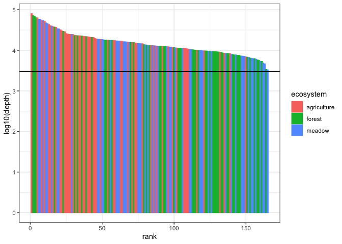

``` r
# Add in a different phylogenetic tree. The one in the phyloseq might be an older version.
tree = read_tree("/Users/sambarnett/Documents/Buckley Lab/FullCyc2/fullcyc2_backups_8_8_19/fullcyc2.bacteria.cogent.tree")
phy_tree(unfrac.physeq) = tree

# Remove any OTUs no longer found in the samples
unfrac.physeq = prune_taxa(taxa_sums(unfrac.physeq) > 0, unfrac.physeq)

unfrac.physeq
```

    ## phyloseq-class experiment-level object
    ## otu_table()   OTU Table:         [ 15387 taxa and 165 samples ]
    ## sample_data() Sample Data:       [ 165 samples by 38 sample variables ]
    ## tax_table()   Taxonomy Table:    [ 15387 taxa by 7 taxonomic ranks ]
    ## phy_tree()    Phylogenetic Tree: [ 15387 tips and 15386 internal nodes ]

For many of the following analyses I want a rarefied OTU table. This is one way to correct for differing sequencing depths across all my samples. I will set the seed for this process so that I can replicate this analysis if necessary (seed = 4242).

``` r
unfrac.rare.physeq = rarefy_even_depth(unfrac.physeq, rngseed=4242)
unfrac.rare.physeq
```

    ## phyloseq-class experiment-level object
    ## otu_table()   OTU Table:         [ 10014 taxa and 165 samples ]
    ## sample_data() Sample Data:       [ 165 samples by 38 sample variables ]
    ## tax_table()   Taxonomy Table:    [ 10014 taxa by 7 taxonomic ranks ]
    ## phy_tree()    Phylogenetic Tree: [ 10014 tips and 10013 internal nodes ]

``` r
rarecurve.df = data.frame()
for (rare_step in seq(1, max(sample_sums(unfrac.physeq)), by = 1000)){
  unfrac.steprare.physeq = rarefy_even_depth(unfrac.physeq, sample.size=rare_step, rngseed=4242)
  stepotu_counts = data.frame(n_OTUs = specnumber(t(otu_table(unfrac.steprare.physeq)))) %>%
    tibble::rownames_to_column(var="microcosm") %>%
    mutate(n_reads = rare_step)
  rarecurve.df = rbind(rarecurve.df, stepotu_counts)
}

ggplot(data=rarecurve.df, aes(x=n_reads, y=n_OTUs, group=microcosm)) +
  geom_line() +
  geom_vline(xintercept = mean(colSums(otu_table(unfrac.rare.physeq)))) +
  theme_bw() + 
  theme(legend.position = "none")
```

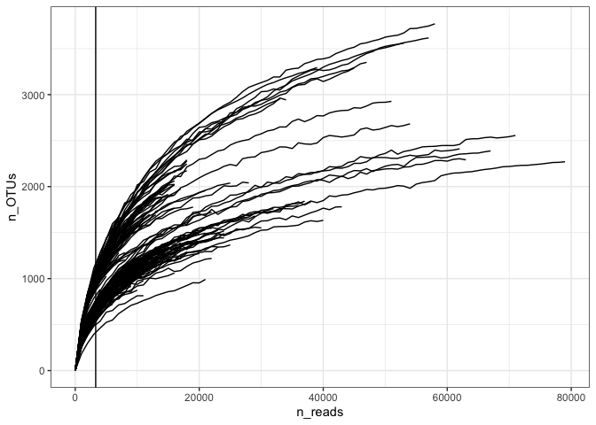

Some basic stats

``` r
print(paste("Maximum read count =", max(colSums(otu_table(unfrac.physeq)))))
```

    ## [1] "Maximum read count = 79981"

``` r
print(paste("Minimum read count =", min(colSums(otu_table(unfrac.physeq)))))
```

    ## [1] "Minimum read count = 3302"

``` r
print(paste("Rarefied read count =", unique(colSums(otu_table(unfrac.rare.physeq)))))
```

    ## [1] "Rarefied read count = 3302"

``` r
print(paste("Number of OTUs total =", ntaxa(unfrac.physeq)))
```

    ## [1] "Number of OTUs total = 15387"

``` r
print(paste("Number of OTUs rarefied =", ntaxa(unfrac.rare.physeq)))
```

    ## [1] "Number of OTUs rarefied = 10014"

``` r
print(paste("Number of phyla total =", length(unique(filter(data.frame(tax_table(unfrac.physeq), stringsAsFactors = FALSE), !(is.na(Phylum)))$Phylum))))
```

    ## [1] "Number of phyla total = 39"

``` r
print(paste("Number of phyla total =", length(unique(filter(data.frame(tax_table(unfrac.rare.physeq), stringsAsFactors = FALSE), !(is.na(Phylum)))$Phylum))))
```

    ## [1] "Number of phyla total = 34"

Alpha diversity
---------------

First I'll look at the alpha diversity of our samples. Specifically I'll look at the OTU richness, shannon index, simpson index, and Pielou's evenness. I will compare these values between land-use regimes and see how they change over time relative to their starting points (day 0).

### Get alpha diversity values

Here I'll calculate the desired alpha diveristy measures.

``` r
OTU.table = t(otu_table(unfrac.rare.physeq))
alpha_div.df = data.frame(X.Sample = rownames(OTU.table), 
                          richness = specnumber(OTU.table),
                          shannon = diversity(OTU.table, index="shannon"),
                          simpson = diversity(OTU.table, index="simpson")) %>%
  mutate(evenness = shannon/log(richness)) %>%
  left_join(data.frame(sample_data(unfrac.physeq)) %>% select(X.Sample, ecosystem, substrate, day, microcosm_replicate, DNA_conc__ng_ul),
            by = "X.Sample") %>%
  mutate(ecosystem = factor(ecosystem, levels = c("agriculture", "meadow", "forest")))
```

### Compare alpha diversity between land-use regimes over time

Now I'll compare these four alpha diversity metrics between the three land use regimes over the course of the experiment. I'll remove the H2O-Control sample from this experiment however. Note that I am not using a repeated measures here (mixed effect), because each timepoint is a separate microcosms therefore not a repeated measures.

``` r
# Remove H2O-Con samples and set day to be a factor
alpha_div_noH2O.df = alpha_div.df %>%
  filter(substrate != "H2O-Con") %>%
  mutate(day = as.factor(day))

# Richness
richness.lm = lm(richness ~ ecosystem*day, data=alpha_div_noH2O.df)
richness.lsmeans = lsmeans(richness.lm, pairwise~ecosystem*day, adjust=NULL)
richness_means.df = data.frame(richness.lsmeans$lsmeans) %>%
  mutate(day = as.numeric(as.character(day)),
         diversity = "richness")
richness_pairwise.df = data.frame(richness.lsmeans$contrasts) %>%
  mutate(padj = p.adjust(p.value, method="BH")) %>%
  tidyr::separate(contrast, into=c("ecosystem_1", "day_1", "ecosystem_2", "day_2"), remove=FALSE) %>%
  filter(ecosystem_1 != ecosystem_2, day_1 == day_2) %>%
  mutate(day = as.numeric(as.character(day_1))) %>%
  dplyr::select(-day_1, -day_2) %>%
  mutate(contrast = paste(ecosystem_1, ecosystem_2, sep="-"),
         diversity = "richness")

# Shannon index
shannon.lm = lm(shannon ~ ecosystem*day, data=alpha_div_noH2O.df)
shannon.lsmeans = lsmeans(shannon.lm, pairwise~ecosystem*day, adjust=NULL)
shannon_means.df = data.frame(shannon.lsmeans$lsmeans) %>%
  mutate(day = as.numeric(as.character(day)),
         diversity = "shannon")
shannon_pairwise.df = data.frame(shannon.lsmeans$contrasts) %>%
  mutate(padj = p.adjust(p.value, method="BH")) %>%
  tidyr::separate(contrast, into=c("ecosystem_1", "day_1", "ecosystem_2", "day_2"), remove=FALSE) %>%
  filter(ecosystem_1 != ecosystem_2, day_1 == day_2) %>%
  mutate(day = as.numeric(as.character(day_1))) %>%
  dplyr::select(-day_1, -day_2) %>%
  mutate(contrast = paste(ecosystem_1, ecosystem_2, sep="-"),
         diversity = "shannon")

# Simpson index
simpson.lm = lm(simpson ~ ecosystem*day, data=alpha_div_noH2O.df)
simpson.lsmeans = lsmeans(simpson.lm, pairwise~ecosystem*day, adjust=NULL)
simpson_means.df = data.frame(simpson.lsmeans$lsmeans) %>%
  mutate(day = as.numeric(as.character(day)),
         diversity = "simpson")
simpson_pairwise.df = data.frame(simpson.lsmeans$contrasts) %>%
  mutate(padj = p.adjust(p.value, method="BH")) %>%
  tidyr::separate(contrast, into=c("ecosystem_1", "day_1", "ecosystem_2", "day_2"), remove=FALSE) %>%
  filter(ecosystem_1 != ecosystem_2, day_1 == day_2) %>%
  mutate(day = as.numeric(as.character(day_1))) %>%
  dplyr::select(-day_1, -day_2) %>%
  mutate(contrast = paste(ecosystem_1, ecosystem_2, sep="-"),
         diversity = "simpson")

# Evenness
evenness.lm = lm(evenness ~ ecosystem*day, data=alpha_div_noH2O.df)
evenness.lsmeans = lsmeans(evenness.lm, pairwise~ecosystem*day, adjust=NULL)
evenness_means.df = data.frame(evenness.lsmeans$lsmeans) %>%
  mutate(day = as.numeric(as.character(day)),
         diversity = "evenness")
evenness_pairwise.df = data.frame(evenness.lsmeans$contrasts) %>%
  mutate(padj = p.adjust(p.value, method="BH")) %>%
  tidyr::separate(contrast, into=c("ecosystem_1", "day_1", "ecosystem_2", "day_2"), remove=FALSE) %>%
  filter(ecosystem_1 != ecosystem_2, day_1 == day_2) %>%
  mutate(day = as.numeric(as.character(day_1))) %>%
  dplyr::select(-day_1, -day_2) %>%
  mutate(contrast = paste(ecosystem_1, ecosystem_2, sep="-"),
         diversity = "evenness")

anova(richness.lm)
```

    ## Analysis of Variance Table
    ## 
    ## Response: richness
    ##                Df  Sum Sq Mean Sq F value    Pr(>F)    
    ## ecosystem       2 3661149 1830574 646.375 < 2.2e-16 ***
    ## day             5  357403   71481  25.240 < 2.2e-16 ***
    ## ecosystem:day  10  463468   46347  16.365 < 2.2e-16 ***
    ## Residuals     138  390824    2832                      
    ## ---
    ## Signif. codes:  0 '***' 0.001 '**' 0.01 '*' 0.05 '.' 0.1 ' ' 1

``` r
anova(shannon.lm)
```

    ## Analysis of Variance Table
    ## 
    ## Response: shannon
    ##                Df Sum Sq Mean Sq F value    Pr(>F)    
    ## ecosystem       2 44.966 22.4829 676.537 < 2.2e-16 ***
    ## day             5 12.753  2.5507  76.753 < 2.2e-16 ***
    ## ecosystem:day  10 18.508  1.8508  55.694 < 2.2e-16 ***
    ## Residuals     138  4.586  0.0332                      
    ## ---
    ## Signif. codes:  0 '***' 0.001 '**' 0.01 '*' 0.05 '.' 0.1 ' ' 1

``` r
anova(simpson.lm)
```

    ## Analysis of Variance Table
    ## 
    ## Response: simpson
    ##                Df   Sum Sq  Mean Sq F value    Pr(>F)    
    ## ecosystem       2 0.086573 0.043287 221.833 < 2.2e-16 ***
    ## day             5 0.045568 0.009114  46.705 < 2.2e-16 ***
    ## ecosystem:day  10 0.080140 0.008014  41.070 < 2.2e-16 ***
    ## Residuals     138 0.026928 0.000195                      
    ## ---
    ## Signif. codes:  0 '***' 0.001 '**' 0.01 '*' 0.05 '.' 0.1 ' ' 1

``` r
anova(evenness.lm)
```

    ## Analysis of Variance Table
    ## 
    ## Response: evenness
    ##                Df  Sum Sq  Mean Sq F value    Pr(>F)    
    ## ecosystem       2 0.55964 0.279820 488.877 < 2.2e-16 ***
    ## day             5 0.20958 0.041915  73.231 < 2.2e-16 ***
    ## ecosystem:day  10 0.31557 0.031557  55.133 < 2.2e-16 ***
    ## Residuals     138 0.07899 0.000572                      
    ## ---
    ## Signif. codes:  0 '***' 0.001 '**' 0.01 '*' 0.05 '.' 0.1 ' ' 1

Plot these results

``` r
alpha_means.df = rbind(richness_means.df, shannon_means.df, simpson_means.df, evenness_means.df) %>%
  mutate(diversity = factor(diversity, levels = c("richness", "shannon", "simpson", "evenness")))
alpha_pairwise.df = rbind(richness_pairwise.df, shannon_pairwise.df, simpson_pairwise.df, evenness_pairwise.df) %>%
  mutate(diversity = factor(diversity, levels = c("richness", "shannon", "simpson", "evenness")))

# dataframe with the y-coordinates for the significance symbols for each substrate
sig_y.df = data.frame(diversity = factor(c("richness", "richness", "richness",
                                           "shannon", "shannon", "shannon",
                                           "simpson", "simpson", "simpson",
                                           "evenness", "evenness", "evenness"),
                                         levels = c("richness", "shannon", "simpson", "evenness")),
                      contrast = c("agriculture-meadow", "agriculture-forest", "meadow-forest"),
                      label=c("CL - OF", "CL - F", "OF - F"),
                      y = c(1310, 1230, 1150, 7.5, 7.1, 6.7, 1.075, 1.05, 1.025, 1.07, 1.02, 0.97),
                      xend = 30)
alpha_pairwise.df = left_join(alpha_pairwise.df, sig_y.df, by = c("contrast", "diversity"))

sig.lab = data.frame(substrate = as.factor(c("13C-Xyl", "13C-Xyl", "13C-Xyl")),
                     label = c("Top: agriculture-meadow", "Middle: agriculture-forest", "Bottom: meadow-forest"),
                     y = c(0.04, 0.025, 0.01),
                     x = 20)

alpha_pairwise.plot = ggplot(data = filter(alpha_means.df, diversity != "simpson"), aes(x=day, y=lsmean)) +
  geom_line(aes(color=ecosystem)) +
  geom_errorbar(aes(ymin=lower.CL, ymax=upper.CL), width=0.5) +
  geom_point(aes(color=ecosystem), alpha=0.7) +
  geom_segment(data=filter(sig_y.df, diversity != "simpson"), x=0, aes(xend=xend, y=y, yend=y), color="grey70") +
  geom_point(data=alpha_pairwise.df[alpha_pairwise.df$contrast == "agriculture-meadow" & alpha_pairwise.df$padj < 0.05 & alpha_pairwise.df$diversity != "simpson",], 
             aes(x=day, y=y), color="black", shape=18, size=2) +
  geom_point(data=alpha_pairwise.df[alpha_pairwise.df$contrast == "agriculture-forest" & alpha_pairwise.df$padj < 0.05 & alpha_pairwise.df$diversity != "simpson",], 
             aes(x=day, y=y), color="black", shape=18, size=2) +
  geom_point(data=alpha_pairwise.df[alpha_pairwise.df$contrast == "meadow-forest" & alpha_pairwise.df$padj < 0.05 & alpha_pairwise.df$diversity != "simpson",], 
             aes(x=day, y=y), color="black", shape=18, size=2) +
  geom_text(data=filter(sig_y.df, diversity != "simpson"), aes(label=label, y=y), x=30.5, hjust=0) +
  scale_color_manual(values = eco.col, labels = c("agriculture" = "Cropland", "meadow" = "Old-Field", "forest" = "Forest")) +
  lims(x=c(-0.5, 33)) +
  labs(x="Time since substrate addition (days)", y="Diversity",
       color="Land-use") +
  theme_bw() +
  theme(legend.position = "top",
        legend.title=element_text(size=14),
        legend.text=element_text(size=12),
        axis.title = element_text(size=14),
        axis.text = element_text(size=12),
        strip.text = element_text(size=10)) +
  facet_wrap(~diversity, ncol=1, scales="free_y")

alpha_pairwise.plot
```

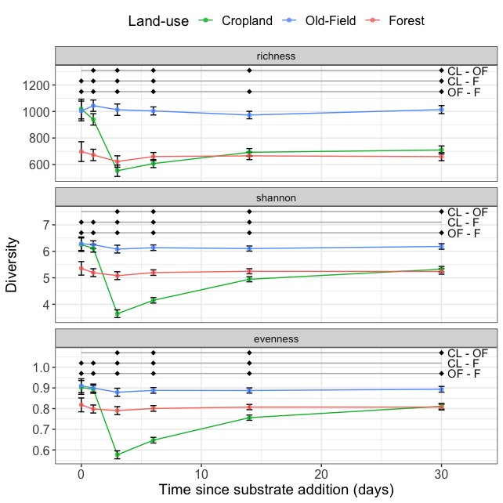

``` r
#ggsave(alpha_pairwise.plot, filename = "/Users/sambarnett/Documents/Dissertation/figures/figS2_5.tiff", 
#       device = "tiff", width = 6.69291, height = 6.69291, units = "in")
```

### Compare alpha diversity over time to timepoint 0 for each land use

Now I want to see how much the alpha diversity diverges from its starting point before substrate addition. For this analysis I'll be comparing each diversity metric from each day to the baseline of the average diversity on day 0. I will do this separately for each land use regime. I will also see if the H2O-Control sample from day 30 differs much from this timepoint 0.

``` r
# Get day 0 measure
alpha_div_post.df = alpha_div.df %>%
  tidyr::gather(key="diversity", value="measure", -X.Sample, -ecosystem, -substrate, -day, -microcosm_replicate, -DNA_conc__ng_ul) %>%
  mutate(day0_measure = ifelse(day == 0, measure, NA),
         treatment = factor(ifelse(substrate == "H2O-Con", "Water", "Carbon"), levels=c("Carbon", "Water")),
         diversity = factor(diversity, levels = c("richness", "shannon", "simpson", "evenness"))) %>%
  group_by(ecosystem, diversity) %>%
  mutate(day0_measure = mean(day0_measure, na.rm = TRUE)) %>%
  ungroup

# Run a one sample t-test for each day, land-use, and diversity metric combinations
alpha_ttest.df = data.frame()

for (eco in c("agriculture", "meadow", "forest")){
  for (div in c("richness", "shannon", "simpson", "evenness")){
    for (dia in c(1,3,6,14,30)){
    treat = "Carbon"
    sub.df = filter(alpha_div_post.df, day==dia, treatment==treat, ecosystem==eco, diversity==div)
    sub.ttest = t.test(sub.df$measure, mu=unique(sub.df$day0_measure))
    alpha_ttest.df = rbind(alpha_ttest.df, data.frame(ecosystem = eco, day = dia, treatment = treat, diversity = div,
                                                      t = sub.ttest$statistic, df = sub.ttest$parameter, 
                                                      pvalue = sub.ttest$p.value, mean = sub.ttest$estimate, 
                                                      lower.CL = sub.ttest$conf.int[1], upper.CL = sub.ttest$conf.int[2]))
    }
    treat = "Water"
    dia = 30
    sub.df = filter(alpha_div_post.df, day==dia, treatment==treat, ecosystem==eco, diversity==div)
    sub.ttest = t.test(sub.df$measure, mu=unique(sub.df$day0_measure))
    alpha_ttest.df = rbind(alpha_ttest.df, data.frame(ecosystem = eco, day = dia, treatment = treat, diversity = div,
                                                      t = sub.ttest$statistic, df = sub.ttest$parameter, 
                                                      pvalue = sub.ttest$p.value, mean = sub.ttest$estimate, 
                                                      lower.CL = sub.ttest$conf.int[1], upper.CL = sub.ttest$conf.int[2]))
  }
}

alpha_ttest.df = alpha_ttest.df %>%
  group_by(diversity) %>%
  mutate(padj = p.adjust(pvalue, method="BH")) %>%
  ungroup %>%
  mutate(sig = ifelse(padj < 0.05, "Significant", "Non-significant"),
         diversity = factor(diversity, levels = c("richness", "shannon", "simpson", "evenness")),
         treatment = factor(treatment, levels=c("Carbon", "Water")))

kable(alpha_ttest.df)
```

| ecosystem   |  day| treatment | diversity |            t|   df|     pvalue|          mean|      lower.CL|      upper.CL|       padj| sig             |
|:------------|----:|:----------|:----------|------------:|----:|----------:|-------------:|-------------:|-------------:|----------:|:----------------|
| agriculture |    1| Carbon    | richness  |   -6.8591034|    5|  0.0010065|   940.5000000|   911.2679896|   969.7320104|  0.0036235| Significant     |
| agriculture |    3| Carbon    | richness  |  -12.8679011|    5|  0.0000505|   553.3333333|   460.4083901|   646.2582766|  0.0002271| Significant     |
| agriculture |    6| Carbon    | richness  |  -34.0490139|   11|  0.0000000|   607.3333333|   580.7548329|   633.9118338|  0.0000000| Significant     |
| agriculture |   14| Carbon    | richness  |  -28.2958323|   13|  0.0000000|   692.3571429|   667.4563448|   717.2579409|  0.0000000| Significant     |
| agriculture |   30| Carbon    | richness  |  -26.1510884|   11|  0.0000000|   709.8333333|   683.8546535|   735.8120132|  0.0000000| Significant     |
| agriculture |   30| Water     | richness  |   -4.0347595|    2|  0.0562911|   904.0000000|   781.8976190|  1026.1023810|  0.0921127| Non-significant |
| agriculture |    1| Carbon    | shannon   |   -7.2324772|    5|  0.0007885|     6.1160118|     6.0684182|     6.1636054|  0.0015769| Significant     |
| agriculture |    3| Carbon    | shannon   |  -11.6481686|    5|  0.0000819|     3.6444535|     3.0694651|     4.2194420|  0.0002106| Significant     |
| agriculture |    6| Carbon    | shannon   |  -20.9159184|   11|  0.0000000|     4.1497907|     3.9287939|     4.3707875|  0.0000000| Significant     |
| agriculture |   14| Carbon    | shannon   |  -20.4311602|   13|  0.0000000|     4.9460034|     4.8081288|     5.0838781|  0.0000000| Significant     |
| agriculture |   30| Carbon    | shannon   |  -23.5134454|   11|  0.0000000|     5.3253250|     5.2387780|     5.4118720|  0.0000000| Significant     |
| agriculture |   30| Water     | shannon   |   -3.4952458|    2|  0.0730044|     6.1247989|     5.9707757|     6.2788220|  0.0876053| Non-significant |
| agriculture |    1| Carbon    | simpson   |   -3.4905343|    5|  0.0174605|     0.9947098|     0.9937221|     0.9956974|  0.0285716| Significant     |
| agriculture |    3| Carbon    | simpson   |   -7.5013839|    5|  0.0006657|     0.8430934|     0.7906778|     0.8955090|  0.0017118| Significant     |
| agriculture |    6| Carbon    | simpson   |  -11.3003849|   11|  0.0000002|     0.8936313|     0.8736830|     0.9135797|  0.0000013| Significant     |
| agriculture |   14| Carbon    | simpson   |  -10.7989221|   13|  0.0000001|     0.9573157|     0.9495665|     0.9650648|  0.0000012| Significant     |
| agriculture |   30| Carbon    | simpson   |  -11.8177058|   11|  0.0000001|     0.9751180|     0.9712193|     0.9790166|  0.0000012| Significant     |
| agriculture |   30| Water     | simpson   |   -2.5152582|    2|  0.1283328|     0.9955142|     0.9945960|     0.9964323|  0.1392608| Non-significant |
| agriculture |    1| Carbon    | evenness  |   -3.0602179|    5|  0.0280950|     0.8933749|     0.8858163|     0.9009336|  0.0337140| Significant     |
| agriculture |    3| Carbon    | evenness  |  -10.8490682|    5|  0.0001155|     0.5766264|     0.4994438|     0.6538090|  0.0002599| Significant     |
| agriculture |    6| Carbon    | evenness  |  -18.0103559|   11|  0.0000000|     0.6473480|     0.6161822|     0.6785138|  0.0000000| Significant     |
| agriculture |   14| Carbon    | evenness  |  -17.9927497|   13|  0.0000000|     0.7562454|     0.7387000|     0.7737908|  0.0000000| Significant     |
| agriculture |   30| Carbon    | evenness  |  -18.4691725|   11|  0.0000000|     0.8113059|     0.8004533|     0.8221585|  0.0000000| Significant     |
| agriculture |   30| Water     | evenness  |   -1.6643431|    2|  0.2379527|     0.8999204|     0.8935792|     0.9062616|  0.2519499| Non-significant |
| meadow      |    1| Carbon    | richness  |    1.4383899|    5|  0.2098454|  1044.0000000|   972.5150201|  1115.4849799|  0.2698012| Non-significant |
| meadow      |    3| Carbon    | richness  |    0.3905631|    5|  0.7122060|  1013.5000000|   950.9735360|  1076.0264640|  0.7541004| Non-significant |
| meadow      |    6| Carbon    | richness  |    0.0195351|   11|  0.9847641|  1004.3333333|   966.7772401|  1041.8894266|  0.9847641| Non-significant |
| meadow      |   14| Carbon    | richness  |   -1.5525014|   13|  0.1445399|   973.3571429|   930.7163633|  1015.9979224|  0.2001322| Non-significant |
| meadow      |   30| Carbon    | richness  |    0.6737884|   11|  0.5143548|  1014.4166667|   980.3897675|  1048.4435658|  0.6172258| Non-significant |
| meadow      |   30| Water     | richness  |    4.6249326|    2|  0.0437085|  1116.6666667|  1011.8509690|  1221.4823644|  0.0786753| Non-significant |
| meadow      |    1| Carbon    | shannon   |   -1.2662040|    5|  0.2612253|     6.2493935|     6.1695946|     6.3291925|  0.2612253| Non-significant |
| meadow      |    3| Carbon    | shannon   |   -5.5864446|    5|  0.0025351|     6.0836591|     5.9893101|     6.1780082|  0.0038027| Significant     |
| meadow      |    6| Carbon    | shannon   |   -5.6513912|   11|  0.0001485|     6.1368447|     6.0777030|     6.1959863|  0.0003341| Significant     |
| meadow      |   14| Carbon    | shannon   |   -7.9023103|   13|  0.0000026|     6.1047392|     6.0544471|     6.1550314|  0.0000115| Significant     |
| meadow      |   30| Carbon    | shannon   |   -7.1021215|   11|  0.0000199|     6.1839487|     6.1514856|     6.2164119|  0.0000716| Significant     |
| meadow      |   30| Water     | shannon   |    1.5864021|    2|  0.2535443|     6.3723111|     6.1455417|     6.5990805|  0.2612253| Non-significant |
| meadow      |    1| Carbon    | simpson   |   -2.1597901|    5|  0.0832090|     0.9952656|     0.9941013|     0.9964299|  0.0998509| Non-significant |
| meadow      |    3| Carbon    | simpson   |   -5.7540720|    5|  0.0022246|     0.9924827|     0.9908024|     0.9941629|  0.0050053| Significant     |
| meadow      |    6| Carbon    | simpson   |   -5.2678300|   11|  0.0002652|     0.9937628|     0.9927261|     0.9947994|  0.0007956| Significant     |
| meadow      |   14| Carbon    | simpson   |   -6.3544197|   13|  0.0000252|     0.9936998|     0.9928349|     0.9945647|  0.0000906| Significant     |
| meadow      |   30| Carbon    | simpson   |   -8.1899249|   11|  0.0000052|     0.9951673|     0.9948780|     0.9954566|  0.0000235| Significant     |
| meadow      |   30| Water     | simpson   |    1.3970872|    2|  0.2972139|     0.9966087|     0.9954851|     0.9977323|  0.2972139| Non-significant |
| meadow      |    1| Carbon    | evenness  |   -3.1143081|    5|  0.0264217|     0.8993331|     0.8900026|     0.9086636|  0.0337140| Significant     |
| meadow      |    3| Carbon    | evenness  |  -10.9413644|    5|  0.0001109|     0.8791406|     0.8717408|     0.8865405|  0.0002599| Significant     |
| meadow      |    6| Carbon    | evenness  |   -8.1945794|   11|  0.0000052|     0.8880303|     0.8819584|     0.8941023|  0.0000156| Significant     |
| meadow      |   14| Carbon    | evenness  |  -11.0386460|   13|  0.0000001|     0.8875704|     0.8830560|     0.8920848|  0.0000002| Significant     |
| meadow      |   30| Carbon    | evenness  |  -14.5031364|   11|  0.0000000|     0.8935428|     0.8909486|     0.8961371|  0.0000001| Significant     |
| meadow      |   30| Water     | evenness  |   -0.5004560|    2|  0.6663965|     0.9080198|     0.8855175|     0.9305221|  0.6663965| Non-significant |
| forest      |    1| Carbon    | richness  |   -2.2518867|    5|  0.0741014|   672.5000000|   643.9619103|   701.0380897|  0.1111521| Non-significant |
| forest      |    3| Carbon    | richness  |   -2.8017407|    5|  0.0379157|   622.8333333|   554.3270729|   691.3395938|  0.0758314| Non-significant |
| forest      |    6| Carbon    | richness  |   -3.0734908|   11|  0.0105937|   660.3333333|   633.7175775|   686.9490892|  0.0272409| Significant     |
| forest      |   14| Carbon    | richness  |   -2.7581691|   13|  0.0162817|   665.4285714|   640.3082443|   690.5488985|  0.0366338| Significant     |
| forest      |   30| Carbon    | richness  |   -4.0106774|   11|  0.0020485|   659.7500000|   639.0335023|   680.4664977|  0.0061454| Significant     |
| forest      |   30| Water     | richness  |    0.4282706|    2|  0.7101655|   714.0000000|   548.2314970|   879.7685030|  0.7541004| Non-significant |
| forest      |    1| Carbon    | shannon   |   -3.1504045|    5|  0.0253674|     5.1957305|     5.0644380|     5.3270230|  0.0326152| Significant     |
| forest      |    3| Carbon    | shannon   |   -6.5715807|    5|  0.0012241|     5.0811076|     4.9733296|     5.1888856|  0.0021540| Significant     |
| forest      |    6| Carbon    | shannon   |   -6.3423021|   11|  0.0000550|     5.1968235|     5.1413628|     5.2522841|  0.0001651| Significant     |
| forest      |   14| Carbon    | shannon   |   -3.5563530|   13|  0.0035134|     5.2472489|     5.1807988|     5.3136989|  0.0048647| Significant     |
| forest      |   30| Carbon    | shannon   |   -4.2719637|   11|  0.0013163|     5.2401920|     5.1801975|     5.3001866|  0.0021540| Significant     |
| forest      |   30| Water     | shannon   |    1.8062552|    2|  0.2126267|     5.4443213|     5.2354509|     5.6531917|  0.2392051| Non-significant |
| forest      |    1| Carbon    | simpson   |   -1.8013777|    5|  0.1315241|     0.9789776|     0.9698503|     0.9881048|  0.1392608| Non-significant |
| forest      |    3| Carbon    | simpson   |   -4.0401295|    5|  0.0099215|     0.9777902|     0.9729652|     0.9826153|  0.0198429| Significant     |
| forest      |    6| Carbon    | simpson   |   -2.9914356|   11|  0.0122662|     0.9818630|     0.9792800|     0.9844460|  0.0220791| Significant     |
| forest      |   14| Carbon    | simpson   |   -2.2305969|   13|  0.0439526|     0.9840636|     0.9827948|     0.9853324|  0.0659289| Non-significant |
| forest      |   30| Carbon    | simpson   |   -2.0919286|   11|  0.0604387|     0.9841848|     0.9829339|     0.9854356|  0.0836843| Non-significant |
| forest      |   30| Water     | simpson   |    3.2563678|    2|  0.0827654|     0.9868983|     0.9848838|     0.9889129|  0.0998509| Non-significant |
| forest      |    1| Carbon    | evenness  |   -2.6508709|    5|  0.0453789|     0.7980755|     0.7786398|     0.8175112|  0.0510513| Non-significant |
| forest      |    3| Carbon    | evenness  |   -4.7567777|    5|  0.0050739|     0.7903456|     0.7753372|     0.8053541|  0.0083028| Significant     |
| forest      |    6| Carbon    | evenness  |   -4.7573423|   11|  0.0005926|     0.8006528|     0.7925723|     0.8087332|  0.0011853| Significant     |
| forest      |   14| Carbon    | evenness  |   -3.2564385|   13|  0.0062503|     0.8074109|     0.8003074|     0.8145143|  0.0093754| Significant     |
| forest      |   30| Carbon    | evenness  |   -4.3386960|   11|  0.0011774|     0.8072735|     0.8017721|     0.8127750|  0.0021192| Significant     |
| forest      |   30| Water     | evenness  |   11.6282530|    2|  0.0073145|     0.8288986|     0.8249097|     0.8328875|  0.0101278| Significant     |

Now I'll plot the results.

``` r
alpha_ttest.LU.df = left_join(alpha_ttest.df, 
                           data.frame(ecosystem = c("agriculture", "meadow", "forest"),
                                      landuse = factor(c("Cropland", "Old-field", "Forest"), 
                                                       levels=c("Cropland", "Old-field", "Forest"))),
                           by = "ecosystem")
alpha_div_post.LU.df = left_join(alpha_div_post.df, 
                                 data.frame(ecosystem = c("agriculture", "meadow", "forest"),
                                            landuse = factor(c("Cropland", "Old-field", "Forest"), 
                                                             levels=c("Cropland", "Old-field", "Forest"))),
                                 by = "ecosystem")

alpha_to0.plot = ggplot(data=filter(alpha_ttest.LU.df, diversity != "simpson"), aes(x=day, y=mean)) +
  geom_hline(data=filter(unique(select(alpha_div_post.LU.df, landuse, diversity, day0_measure)), diversity != "simpson"),
             aes(yintercept=day0_measure), linetype=2) +
  geom_line(data=filter(alpha_ttest.LU.df[alpha_ttest.LU.df$treatment=="Carbon",], diversity != "simpson")) +
  geom_errorbar(aes(ymin=lower.CL, ymax=upper.CL), width=1) +
  geom_point(aes(fill=sig, shape=treatment), size=3) +
  scale_fill_manual(values = c("Significant" = "black", "Non-significant" = "white")) +
  scale_shape_manual(values = c(Water=24, Carbon = 21)) +
  labs(x="Time since substrate addition (days)", y="Diversity") +
  theme_bw() +
  theme(legend.position = "none",
        legend.title=element_text(size=14),
        legend.text=element_text(size=12),
        axis.title = element_text(size=14),
        axis.text = element_text(size=12),
        strip.text = element_text(size=14)) +
  facet_grid(diversity~landuse, scales = "free_y")

alpha_to0.plot
```

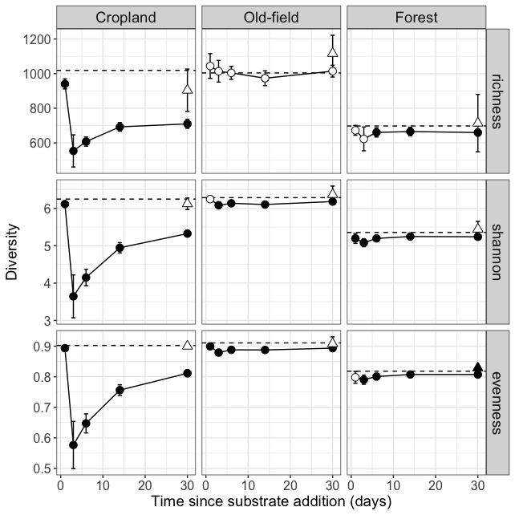

``` r
#ggsave(alpha_to0.plot, filename = "/Users/sambarnett/Documents/Dissertation/figures/figS2_6.tiff", 
#       device = "tiff", width = 6.69291, height = 6.69291, units = "in")
```

Beta diversity
--------------

So we saw that alpha diversity varies across land-use and time. Now I want to see how the community compositions vary between land-use regimes and across time after substrate addition. For this analysis I will look at:

-   Ordination: How compositionally dissimilar are all the microcosms and is there a pattern.
-   Resistance/Resiliance: comparing composition at each timepoint to timepoint 0.
-   Convergence/Divergence: comparing composition across land-use regimes over time.

### Get compositional distance measures

The first thing I need to do is measure the distance or dissimilarity between all microcosm communities. I will use three metrics for this: Bray-Curtis dissimilarity, unweighted UniFrac distance, and weighted UniFrac.

``` r
unfrac_BC.dist = vegdist(t(otu_table(unfrac.rare.physeq)), method="bray", binary=FALSE, diag=TRUE, upper=TRUE)
unfrac_uwUF.dist = distance(unfrac.rare.physeq, method="unifrac")
unfrac_wUF.dist = distance(unfrac.rare.physeq, method="wunifrac")
```

### Ordinate

Now I'll make ordinations based on the distance measures and look for a pattern. For this I'll use NMDS to be consistent across all metrics.

``` r
# Run the NMDS ordinations
set.seed(4242)
unfrac_BC.ord = metaMDS(unfrac_BC.dist, trymax = 1000)
```

    ## Run 0 stress 0.05914022 
    ## Run 1 stress 0.05914015 
    ## ... New best solution
    ## ... Procrustes: rmse 0.0003976242  max resid 0.004760278 
    ## ... Similar to previous best
    ## Run 2 stress 0.05914348 
    ## ... Procrustes: rmse 0.0002630298  max resid 0.001646961 
    ## ... Similar to previous best
    ## Run 3 stress 0.05913834 
    ## ... New best solution
    ## ... Procrustes: rmse 0.0005305894  max resid 0.005630054 
    ## ... Similar to previous best
    ## Run 4 stress 0.05914034 
    ## ... Procrustes: rmse 0.0002865668  max resid 0.002512786 
    ## ... Similar to previous best
    ## Run 5 stress 0.05914124 
    ## ... Procrustes: rmse 0.0003078596  max resid 0.002246905 
    ## ... Similar to previous best
    ## Run 6 stress 0.05914042 
    ## ... Procrustes: rmse 0.0002826469  max resid 0.002286847 
    ## ... Similar to previous best
    ## Run 7 stress 0.05914136 
    ## ... Procrustes: rmse 0.000554491  max resid 0.005678648 
    ## ... Similar to previous best
    ## Run 8 stress 0.05913935 
    ## ... Procrustes: rmse 0.0004819438  max resid 0.005597857 
    ## ... Similar to previous best
    ## Run 9 stress 0.05914309 
    ## ... Procrustes: rmse 0.000543916  max resid 0.00562829 
    ## ... Similar to previous best
    ## Run 10 stress 0.05913951 
    ## ... Procrustes: rmse 0.0002497161  max resid 0.00261592 
    ## ... Similar to previous best
    ## Run 11 stress 0.05914315 
    ## ... Procrustes: rmse 0.0005760401  max resid 0.005670918 
    ## ... Similar to previous best
    ## Run 12 stress 0.05914305 
    ## ... Procrustes: rmse 0.0005586587  max resid 0.005636709 
    ## ... Similar to previous best
    ## Run 13 stress 0.05913998 
    ## ... Procrustes: rmse 0.0004950668  max resid 0.005667864 
    ## ... Similar to previous best
    ## Run 14 stress 0.05914111 
    ## ... Procrustes: rmse 0.0005446641  max resid 0.005608481 
    ## ... Similar to previous best
    ## Run 15 stress 0.05913999 
    ## ... Procrustes: rmse 0.0001813058  max resid 0.001910203 
    ## ... Similar to previous best
    ## Run 16 stress 0.05913887 
    ## ... Procrustes: rmse 0.0004784922  max resid 0.005581082 
    ## ... Similar to previous best
    ## Run 17 stress 0.05913735 
    ## ... New best solution
    ## ... Procrustes: rmse 9.264754e-05  max resid 0.0008072059 
    ## ... Similar to previous best
    ## Run 18 stress 0.05914039 
    ## ... Procrustes: rmse 0.0002123473  max resid 0.001636732 
    ## ... Similar to previous best
    ## Run 19 stress 0.05913911 
    ## ... Procrustes: rmse 0.0002202349  max resid 0.001526763 
    ## ... Similar to previous best
    ## Run 20 stress 0.0591444 
    ## ... Procrustes: rmse 0.0006004791  max resid 0.006026361 
    ## ... Similar to previous best
    ## *** Solution reached

``` r
set.seed(4242)
unfrac_uwUF.ord = metaMDS(unfrac_uwUF.dist, trymax = 1000)
```

    ## Run 0 stress 0.02489321 
    ## Run 1 stress 0.02489419 
    ## ... Procrustes: rmse 0.0001107427  max resid 0.0009647177 
    ## ... Similar to previous best
    ## Run 2 stress 0.02489419 
    ## ... Procrustes: rmse 0.0001072141  max resid 0.0008799464 
    ## ... Similar to previous best
    ## Run 3 stress 0.02489368 
    ## ... Procrustes: rmse 0.0001045403  max resid 0.0009665736 
    ## ... Similar to previous best
    ## Run 4 stress 0.0248991 
    ## ... Procrustes: rmse 0.0002887235  max resid 0.003493072 
    ## ... Similar to previous best
    ## Run 5 stress 0.02489325 
    ## ... Procrustes: rmse 1.739716e-05  max resid 0.0001307099 
    ## ... Similar to previous best
    ## Run 6 stress 0.0248935 
    ## ... Procrustes: rmse 7.646805e-05  max resid 0.0007924833 
    ## ... Similar to previous best
    ## Run 7 stress 0.02489961 
    ## ... Procrustes: rmse 0.0002896331  max resid 0.003517366 
    ## ... Similar to previous best
    ## Run 8 stress 0.02489355 
    ## ... Procrustes: rmse 8.20657e-05  max resid 0.0009236951 
    ## ... Similar to previous best
    ## Run 9 stress 0.02489344 
    ## ... Procrustes: rmse 7.621549e-05  max resid 0.0007885482 
    ## ... Similar to previous best
    ## Run 10 stress 0.02489946 
    ## ... Procrustes: rmse 0.0002871788  max resid 0.003512923 
    ## ... Similar to previous best
    ## Run 11 stress 0.02489918 
    ## ... Procrustes: rmse 0.0002907955  max resid 0.003495008 
    ## ... Similar to previous best
    ## Run 12 stress 0.02489929 
    ## ... Procrustes: rmse 0.0002885055  max resid 0.003503923 
    ## ... Similar to previous best
    ## Run 13 stress 0.02489331 
    ## ... Procrustes: rmse 1.819338e-05  max resid 0.0001310223 
    ## ... Similar to previous best
    ## Run 14 stress 0.02489353 
    ## ... Procrustes: rmse 8.176918e-05  max resid 0.0009245166 
    ## ... Similar to previous best
    ## Run 15 stress 0.02489941 
    ## ... Procrustes: rmse 0.0002818099  max resid 0.00350957 
    ## ... Similar to previous best
    ## Run 16 stress 0.02489329 
    ## ... Procrustes: rmse 1.217705e-05  max resid 0.0001017034 
    ## ... Similar to previous best
    ## Run 17 stress 0.02489918 
    ## ... Procrustes: rmse 0.0002816298  max resid 0.003505723 
    ## ... Similar to previous best
    ## Run 18 stress 0.02489916 
    ## ... Procrustes: rmse 0.0002872557  max resid 0.003450369 
    ## ... Similar to previous best
    ## Run 19 stress 0.02489355 
    ## ... Procrustes: rmse 7.573582e-05  max resid 0.0007661766 
    ## ... Similar to previous best
    ## Run 20 stress 0.02489951 
    ## ... Procrustes: rmse 0.0002911398  max resid 0.00350765 
    ## ... Similar to previous best
    ## *** Solution reached

``` r
set.seed(4242)
unfrac_wUF.ord = metaMDS(unfrac_wUF.dist, trymax = 1000)
```

    ## Run 0 stress 0.102025 
    ## Run 1 stress 0.1165711 
    ## Run 2 stress 0.1233004 
    ## Run 3 stress 0.1165703 
    ## Run 4 stress 0.1020303 
    ## ... Procrustes: rmse 0.001063699  max resid 0.008267948 
    ## ... Similar to previous best
    ## Run 5 stress 0.115918 
    ## Run 6 stress 0.1137215 
    ## Run 7 stress 0.1171678 
    ## Run 8 stress 0.1145296 
    ## Run 9 stress 0.1135719 
    ## Run 10 stress 0.1137748 
    ## Run 11 stress 0.1149016 
    ## Run 12 stress 0.1153024 
    ## Run 13 stress 0.1301713 
    ## Run 14 stress 0.1103646 
    ## Run 15 stress 0.1186415 
    ## Run 16 stress 0.1161794 
    ## Run 17 stress 0.1137223 
    ## Run 18 stress 0.1088928 
    ## Run 19 stress 0.1059812 
    ## Run 20 stress 0.1171131 
    ## *** Solution reached

``` r
unfrac_BC.ord.df = data.frame(unfrac_BC.ord$points) %>%
  tibble::rownames_to_column(var="X.Sample") %>%
  left_join(data.frame(sample_data(unfrac.physeq)) %>% select(X.Sample, ecosystem, substrate, day),
            by = "X.Sample") %>%
  mutate(ecosystem = factor(ecosystem, levels = c("agriculture", "meadow", "forest")))

unfrac_uwUF.ord.df = data.frame(unfrac_uwUF.ord$points) %>%
  tibble::rownames_to_column(var="X.Sample") %>%
  left_join(data.frame(sample_data(unfrac.physeq)) %>% select(X.Sample, ecosystem, substrate, day),
            by = "X.Sample") %>%
  mutate(ecosystem = factor(ecosystem, levels = c("agriculture", "meadow", "forest")))

unfrac_wUF.ord.df = data.frame(unfrac_wUF.ord$points) %>%
  tibble::rownames_to_column(var="X.Sample") %>%
  left_join(data.frame(sample_data(unfrac.physeq)) %>% select(X.Sample, ecosystem, substrate, day),
            by = "X.Sample") %>%
  mutate(ecosystem = factor(ecosystem, levels = c("agriculture", "meadow", "forest")))
```

Now I'll plot. I want to add in arrows showing the direction of community shift over time. These arrows will be based on the centroid of the points for a given day and land use. I also want to show how these communities all relate to the H2O-control so I'll add those points in as blue colored points.

``` r
# Get centroids for plotting the paths
unfrac_meta.df = data.frame(sample_data(unfrac.physeq)) %>%
  mutate(treatment = ifelse(substrate == "H2O-Con", "Water", "Carbon")) %>%
  mutate(group = paste(ecosystem, day, treatment, sep="-"))

prevday.df = data.frame(day=c(0,1,3,6,14,30),
                        prev_day=c(NA,0,1,3,6,14))

unfrac_BC.centroids = data.frame(envfit(unfrac_BC.ord ~ group, data=unfrac_meta.df)$factors$centroids) %>%
  tibble::rownames_to_column(var="group") %>%
  mutate(group = gsub("group", "", group)) %>%
  left_join(unique(select(unfrac_meta.df, ecosystem, day, treatment, group)), by="group") %>%
  left_join(prevday.df, by="day") %>%
  as.data.frame
unfrac_BC.previous.centroids = unfrac_BC.centroids %>%
  select(ecosystem, treatment, NMDS1, NMDS2, day) %>%
  rename(NMDS1_prev = NMDS1, NMDS2_prev = NMDS2, prev_day = day)
unfrac_BC.centroids = left_join(unfrac_BC.centroids, unfrac_BC.previous.centroids, by = c("ecosystem", "treatment", "prev_day")) %>%
  filter(day != 0, treatment == "Carbon") %>%
  mutate(ecosystem = factor(ecosystem, levels = c("agriculture", "meadow", "forest")))


unfrac_BC.ord.plot = ggplot(data=unfrac_BC.ord.df, aes(x=MDS1, y=MDS2)) +
  geom_point(data=unfrac_BC.ord.df[unfrac_BC.ord.df$substrate == "H2O-Con" & unfrac_BC.ord.df$ecosystem == "agriculture",], 
             shape=15, color="blue", size=3) +
  geom_point(data=unfrac_BC.ord.df[unfrac_BC.ord.df$substrate == "H2O-Con" & unfrac_BC.ord.df$ecosystem == "meadow",], 
             shape=16, color="blue", size=3) +
  geom_point(data=unfrac_BC.ord.df[unfrac_BC.ord.df$substrate == "H2O-Con" & unfrac_BC.ord.df$ecosystem == "forest",], 
             shape=17, color="blue", size=3) +
  geom_point(data=unfrac_BC.ord.df[unfrac_BC.ord.df$substrate != "H2O-Con",], 
             aes(fill=day, shape=ecosystem), size=3) +
  geom_segment(data=unfrac_BC.centroids, aes(x=NMDS1_prev, xend=NMDS1, y=NMDS2_prev, yend=NMDS2, color=ecosystem),
               size=1, arrow = arrow(length = unit(0.02, "npc"))) +
  scale_fill_gradient(low="grey90", high="black") +
  scale_color_manual(values = eco.col, labels = c("agriculture" = "Cropland", "meadow" = "Old-Field", "forest" = "Forest")) +
  scale_shape_manual(values=c(agriculture=22, meadow=21, forest=24), labels = c("agriculture" = "Cropland", "meadow" = "Old-Field", "forest" = "Forest")) +
  labs(x="NMDS1", y="NMDS2", fill="Day", shape="Land-use", color="Land-use", title="Bray-Curtis dissimilarity") +
  theme_bw() +
  theme(axis.title=element_text(size=14),
        axis.text=element_text(size=12),
        legend.title=element_text(size=14),
        legend.text=element_text(size=12),
        legend.background = element_blank())

unfrac_BC.ord.plot
```

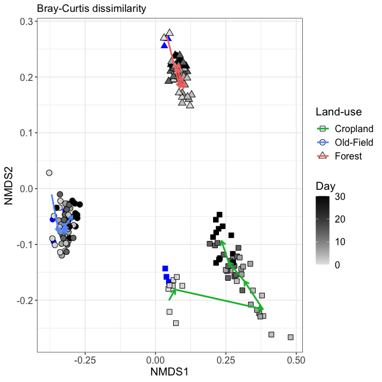

``` r
# Get centroids for plotting the paths
unfrac_meta.df = data.frame(sample_data(unfrac.physeq)) %>%
  mutate(treatment = ifelse(substrate == "H2O-Con", "Water", "Carbon")) %>%
  mutate(group = paste(ecosystem, day, treatment, sep="-"))

prevday.df = data.frame(day=c(0,1,3,6,14,30),
                        prev_day=c(NA,0,1,3,6,14))

unfrac_uwUF.centroids = data.frame(envfit(unfrac_uwUF.ord ~ group, data=unfrac_meta.df)$factors$centroids) %>%
  tibble::rownames_to_column(var="group") %>%
  mutate(group = gsub("group", "", group)) %>%
  left_join(unique(select(unfrac_meta.df, ecosystem, day, treatment, group)), by="group") %>%
  left_join(prevday.df, by="day") %>%
  as.data.frame
unfrac_uwUF.previous.centroids = unfrac_uwUF.centroids %>%
  select(ecosystem, treatment, NMDS1, NMDS2, day) %>%
  rename(NMDS1_prev = NMDS1, NMDS2_prev = NMDS2, prev_day = day)
unfrac_uwUF.centroids = left_join(unfrac_uwUF.centroids, unfrac_uwUF.previous.centroids, by = c("ecosystem", "treatment", "prev_day")) %>%
  filter(day != 0, treatment == "Carbon") %>%
  mutate(ecosystem = factor(ecosystem, levels = c("agriculture", "meadow", "forest")))


unfrac_uwUF.ord.plot = ggplot(data=unfrac_uwUF.ord.df, aes(x=MDS1, y=MDS2)) +
  geom_point(data=unfrac_uwUF.ord.df[unfrac_uwUF.ord.df$substrate == "H2O-Con" & unfrac_uwUF.ord.df$ecosystem == "agriculture",], 
             shape=15, color="blue", size=3) +
  geom_point(data=unfrac_uwUF.ord.df[unfrac_uwUF.ord.df$substrate == "H2O-Con" & unfrac_uwUF.ord.df$ecosystem == "meadow",], 
             shape=16, color="blue", size=3) +
  geom_point(data=unfrac_uwUF.ord.df[unfrac_uwUF.ord.df$substrate == "H2O-Con" & unfrac_uwUF.ord.df$ecosystem == "forest",], 
             shape=17, color="blue", size=3) +
  geom_point(data=unfrac_uwUF.ord.df[unfrac_uwUF.ord.df$substrate != "H2O-Con",], 
             aes(fill=day, shape=ecosystem), size=3) +
  geom_segment(data=unfrac_uwUF.centroids, aes(x=NMDS1_prev, xend=NMDS1, y=NMDS2_prev, yend=NMDS2, color=ecosystem),
               size=1, arrow = arrow(length = unit(0.02, "npc"))) +
  scale_fill_gradient(low="grey90", high="black") +
  scale_color_manual(values = eco.col, labels = c("agriculture" = "Cropland", "meadow" = "Old-Field", "forest" = "Forest")) +
  scale_shape_manual(values=c(agriculture=22, meadow=21, forest=24), labels = c("agriculture" = "Cropland", "meadow" = "Old-Field", "forest" = "Forest")) +
  labs(x="NMDS1", y="NMDS2", fill="Day", shape="Land-use", color="Land-use", title="Unweighted UniFrac distance") +
  theme_bw() +
  theme(axis.title=element_text(size=14),
        axis.text=element_text(size=12),
        legend.title=element_text(size=14),
        legend.text=element_text(size=12),
        legend.background = element_blank())

unfrac_uwUF.ord.plot
```

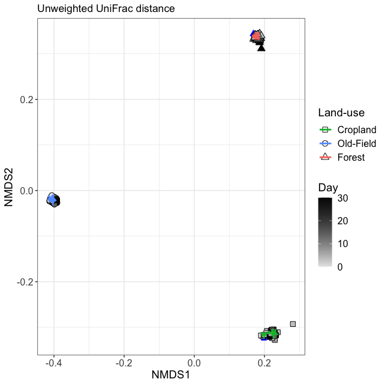

``` r
# Get centroids for plotting the paths
unfrac_meta.df = data.frame(sample_data(unfrac.physeq)) %>%
  mutate(treatment = ifelse(substrate == "H2O-Con", "Water", "Carbon")) %>%
  mutate(group = paste(ecosystem, day, treatment, sep="-"))

prevday.df = data.frame(day=c(0,1,3,6,14,30),
                        prev_day=c(NA,0,1,3,6,14))

unfrac_wUF.centroids = data.frame(envfit(unfrac_wUF.ord ~ group, data=unfrac_meta.df)$factors$centroids) %>%
  tibble::rownames_to_column(var="group") %>%
  mutate(group = gsub("group", "", group)) %>%
  left_join(unique(select(unfrac_meta.df, ecosystem, day, treatment, group)), by="group") %>%
  left_join(prevday.df, by="day") %>%
  as.data.frame
unfrac_wUF.previous.centroids = unfrac_wUF.centroids %>%
  select(ecosystem, treatment, NMDS1, NMDS2, day) %>%
  rename(NMDS1_prev = NMDS1, NMDS2_prev = NMDS2, prev_day = day)
unfrac_wUF.centroids = left_join(unfrac_wUF.centroids, unfrac_wUF.previous.centroids, by = c("ecosystem", "treatment", "prev_day")) %>%
  filter(day != 0, treatment == "Carbon") %>%
  mutate(ecosystem = factor(ecosystem, levels = c("agriculture", "meadow", "forest")))

unfrac_wUF.ord.plot = ggplot(data=unfrac_wUF.ord.df, aes(x=MDS1, y=MDS2)) +
  geom_point(data=unfrac_wUF.ord.df[unfrac_wUF.ord.df$substrate == "H2O-Con" & unfrac_wUF.ord.df$ecosystem == "agriculture",], 
             shape=15, color="blue", size=3) +
  geom_point(data=unfrac_wUF.ord.df[unfrac_wUF.ord.df$substrate == "H2O-Con" & unfrac_wUF.ord.df$ecosystem == "meadow",], 
             shape=16, color="blue", size=3) +
  geom_point(data=unfrac_wUF.ord.df[unfrac_wUF.ord.df$substrate == "H2O-Con" & unfrac_wUF.ord.df$ecosystem == "forest",], 
             shape=17, color="blue", size=3) +
  geom_point(data=unfrac_wUF.ord.df[unfrac_wUF.ord.df$substrate != "H2O-Con",], 
             aes(fill=day, shape=ecosystem), size=3) +
  geom_segment(data=unfrac_wUF.centroids, aes(x=NMDS1_prev, xend=NMDS1, y=NMDS2_prev, yend=NMDS2, color=ecosystem),
               size=1, arrow = arrow(length = unit(0.02, "npc"))) +
  scale_fill_gradient(low="grey90", high="black") +
  scale_color_manual(values = eco.col, labels = c("agriculture" = "Cropland", "meadow" = "Old-Field", "forest" = "Forest")) +
  scale_shape_manual(values=c(agriculture=22, meadow=21, forest=24), labels = c("agriculture" = "Cropland", "meadow" = "Old-Field", "forest" = "Forest")) +
  labs(x="NMDS1", y="NMDS2", fill="Day", shape="Land-use", color="Land-use", title="Weighted UniFrac distance") +
  theme_bw() +
  theme(axis.title=element_text(size=14),
        axis.text=element_text(size=12),
        legend.title=element_text(size=14),
        legend.text=element_text(size=12),
        legend.background = element_blank())

unfrac_wUF.ord.plot
```

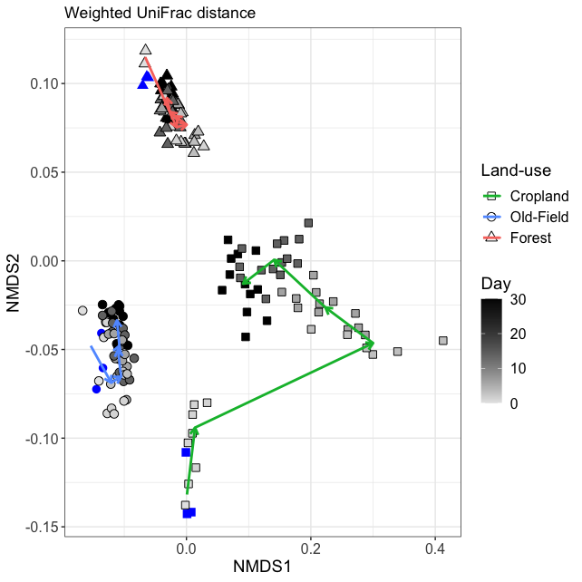

Plot all together

``` r
unfrac.ord.leg = g_legend(unfrac_BC.ord.plot + theme(legend.title=element_text(size=14),
                                                     legend.text=element_text(size=12),
                                                     legend.background = element_blank(),
                                                     legend.box = "horizontal"))

beta_ords.plot = cowplot::plot_grid(unfrac_BC.ord.plot + theme(legend.position = "none", title = element_blank()), 
                                    unfrac_uwUF.ord.plot + theme(legend.position = "none", title = element_blank()), 
                                    unfrac_wUF.ord.plot+ theme(legend.position = "none", title = element_blank()),
                                    unfrac.ord.leg, nrow=2, labels = c("A", "B", "C", ""))
beta_ords.plot
```

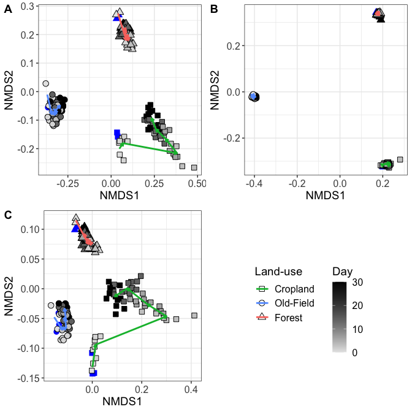

``` r
#ggsave(beta_ords.plot, filename = "/Users/sambarnett/Documents/Dissertation/figures/fig2_2.tiff", 
#       device = "tiff", width = 7, height = 7, units = "in")
```

### Plot for publication

``` r
# Get centroids for plotting the paths
unfrac_meta.df = data.frame(sample_data(unfrac.physeq)) %>%
  mutate(treatment = ifelse(substrate == "H2O-Con", "Water", "Carbon")) %>%
  mutate(group = paste(ecosystem, day, treatment, sep="-"))

prevday.df = data.frame(day=c(0,1,3,6,14,30),
                        prev_day=c(NA,0,1,3,6,14))

unfrac_BC.centroids = data.frame(envfit(unfrac_BC.ord ~ group, data=unfrac_meta.df)$factors$centroids) %>%
  tibble::rownames_to_column(var="group") %>%
  mutate(group = gsub("group", "", group)) %>%
  left_join(unique(select(unfrac_meta.df, ecosystem, day, treatment, group)), by="group") %>%
  left_join(prevday.df, by="day") %>%
  as.data.frame
unfrac_BC.previous.centroids = unfrac_BC.centroids %>%
  select(ecosystem, treatment, NMDS1, NMDS2, day) %>%
  rename(NMDS1_prev = NMDS1, NMDS2_prev = NMDS2, prev_day = day)
unfrac_BC.centroids = left_join(unfrac_BC.centroids, unfrac_BC.previous.centroids, by = c("ecosystem", "treatment", "prev_day")) %>%
  filter(day != 0, treatment == "Carbon") %>%
  mutate(ecosystem = factor(ecosystem, levels = c("agriculture", "meadow", "forest")))


unfrac_BC.ord.plot = ggplot(data=unfrac_BC.ord.df, aes(x=MDS1, y=MDS2)) +
  geom_point(data=unfrac_BC.ord.df[unfrac_BC.ord.df$substrate == "H2O-Con" & unfrac_BC.ord.df$ecosystem == "agriculture",], 
             shape=15, color="blue", size=2) +
  geom_point(data=unfrac_BC.ord.df[unfrac_BC.ord.df$substrate == "H2O-Con" & unfrac_BC.ord.df$ecosystem == "meadow",], 
             shape=16, color="blue", size=2) +
  geom_point(data=unfrac_BC.ord.df[unfrac_BC.ord.df$substrate == "H2O-Con" & unfrac_BC.ord.df$ecosystem == "forest",], 
             shape=17, color="blue", size=2) +
  geom_point(data=unfrac_BC.ord.df[unfrac_BC.ord.df$substrate != "H2O-Con",], 
             aes(fill=day, shape=ecosystem), size=2) +
  geom_segment(data=unfrac_BC.centroids, aes(x=NMDS1_prev, xend=NMDS1, y=NMDS2_prev, yend=NMDS2), color="black",
               size=1, arrow = arrow(length = unit(0.02, "npc"))) +
  geom_segment(data=unfrac_BC.centroids, aes(x=NMDS1_prev, xend=NMDS1, y=NMDS2_prev, yend=NMDS2, color=ecosystem),
               size=0.5, arrow = arrow(length = unit(0.02, "npc"))) +
  scale_fill_gradient(low="grey90", high="black") +
  scale_color_manual(values = eco.col, labels = c("agriculture" = "Cropland", "meadow" = "Old-Field", "forest" = "Forest")) +
  scale_shape_manual(values=c(agriculture=22, meadow=21, forest=24), labels = c("agriculture" = "Cropland", "meadow" = "Old-Field", "forest" = "Forest")) +
  labs(x="NMDS1", y="NMDS2", fill="Day", shape="Land-use", color="Land-use", title="Bray-Curtis dissimilarity") +
  theme_bw() +
  theme(axis.title=element_text(size=7),
        axis.text=element_text(size=6),
        axis.ticks = element_line(size=0.2),
        legend.title=element_text(size=7),
        legend.text=element_text(size=6),
        legend.background = element_blank())

unfrac_BC.ord.plot + 
  theme(axis.title=element_blank(),
        plot.title = element_blank(),
        legend.position = "none")
```

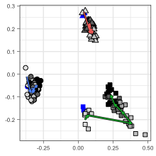

``` r
# Get centroids for plotting the paths
unfrac_meta.df = data.frame(sample_data(unfrac.physeq)) %>%
  mutate(treatment = ifelse(substrate == "H2O-Con", "Water", "Carbon")) %>%
  mutate(group = paste(ecosystem, day, treatment, sep="-"))

prevday.df = data.frame(day=c(0,1,3,6,14,30),
                        prev_day=c(NA,0,1,3,6,14))

unfrac_uwUF.centroids = data.frame(envfit(unfrac_uwUF.ord ~ group, data=unfrac_meta.df)$factors$centroids) %>%
  tibble::rownames_to_column(var="group") %>%
  mutate(group = gsub("group", "", group)) %>%
  left_join(unique(select(unfrac_meta.df, ecosystem, day, treatment, group)), by="group") %>%
  left_join(prevday.df, by="day") %>%
  as.data.frame
unfrac_uwUF.previous.centroids = unfrac_uwUF.centroids %>%
  select(ecosystem, treatment, NMDS1, NMDS2, day) %>%
  rename(NMDS1_prev = NMDS1, NMDS2_prev = NMDS2, prev_day = day)
unfrac_uwUF.centroids = left_join(unfrac_uwUF.centroids, unfrac_uwUF.previous.centroids, by = c("ecosystem", "treatment", "prev_day")) %>%
  filter(day != 0, treatment == "Carbon") %>%
  mutate(ecosystem = factor(ecosystem, levels = c("agriculture", "meadow", "forest")))


unfrac_uwUF.ord.plot = ggplot(data=unfrac_uwUF.ord.df, aes(x=MDS1, y=MDS2)) +
  geom_point(data=unfrac_uwUF.ord.df[unfrac_uwUF.ord.df$substrate == "H2O-Con" & unfrac_uwUF.ord.df$ecosystem == "agriculture",], 
             shape=15, color="blue", size=2) +
  geom_point(data=unfrac_uwUF.ord.df[unfrac_uwUF.ord.df$substrate == "H2O-Con" & unfrac_uwUF.ord.df$ecosystem == "meadow",], 
             shape=16, color="blue", size=2) +
  geom_point(data=unfrac_uwUF.ord.df[unfrac_uwUF.ord.df$substrate == "H2O-Con" & unfrac_uwUF.ord.df$ecosystem == "forest",], 
             shape=17, color="blue", size=2) +
  geom_point(data=unfrac_uwUF.ord.df[unfrac_uwUF.ord.df$substrate != "H2O-Con",], 
             aes(fill=day, shape=ecosystem), size=2) +
  geom_segment(data=unfrac_uwUF.centroids, aes(x=NMDS1_prev, xend=NMDS1, y=NMDS2_prev, yend=NMDS2), color="black",
               size=1, arrow = arrow(length = unit(0.02, "npc"))) +
  geom_segment(data=unfrac_uwUF.centroids, aes(x=NMDS1_prev, xend=NMDS1, y=NMDS2_prev, yend=NMDS2, color=ecosystem),
               size=0.5, arrow = arrow(length = unit(0.02, "npc"))) +
  scale_fill_gradient(low="grey90", high="black") +
  scale_color_manual(values = eco.col, labels = c("agriculture" = "Cropland", "meadow" = "Old-Field", "forest" = "Forest")) +
  scale_shape_manual(values=c(agriculture=22, meadow=21, forest=24), labels = c("agriculture" = "Cropland", "meadow" = "Old-Field", "forest" = "Forest")) +
  labs(x="NMDS1", y="NMDS2", fill="Day", shape="Land-use", color="Land-use", title="Unweighted UniFrac distance") +
  theme_bw() +
  theme(axis.title=element_text(size=7),
        axis.text=element_text(size=6),
        axis.ticks = element_line(size=0.2),
        legend.title=element_text(size=7),
        legend.text=element_text(size=6),
        legend.background = element_blank())

unfrac_uwUF.ord.plot + 
  theme(axis.title=element_blank(),
        plot.title = element_blank(),
        legend.position = "none")
```


``` r
# Get centroids for plotting the paths
unfrac_meta.df = data.frame(sample_data(unfrac.physeq)) %>%
  mutate(treatment = ifelse(substrate == "H2O-Con", "Water", "Carbon")) %>%
  mutate(group = paste(ecosystem, day, treatment, sep="-"))

prevday.df = data.frame(day=c(0,1,3,6,14,30),
                        prev_day=c(NA,0,1,3,6,14))

unfrac_wUF.centroids = data.frame(envfit(unfrac_wUF.ord ~ group, data=unfrac_meta.df)$factors$centroids) %>%
  tibble::rownames_to_column(var="group") %>%
  mutate(group = gsub("group", "", group)) %>%
  left_join(unique(select(unfrac_meta.df, ecosystem, day, treatment, group)), by="group") %>%
  left_join(prevday.df, by="day") %>%
  as.data.frame
unfrac_wUF.previous.centroids = unfrac_wUF.centroids %>%
  select(ecosystem, treatment, NMDS1, NMDS2, day) %>%
  rename(NMDS1_prev = NMDS1, NMDS2_prev = NMDS2, prev_day = day)
unfrac_wUF.centroids = left_join(unfrac_wUF.centroids, unfrac_wUF.previous.centroids, by = c("ecosystem", "treatment", "prev_day")) %>%
  filter(day != 0, treatment == "Carbon") %>%
  mutate(ecosystem = factor(ecosystem, levels = c("agriculture", "meadow", "forest")))

unfrac_wUF.ord.plot = ggplot(data=unfrac_wUF.ord.df, aes(x=MDS1, y=MDS2)) +
  geom_point(data=unfrac_wUF.ord.df[unfrac_wUF.ord.df$substrate == "H2O-Con" & unfrac_wUF.ord.df$ecosystem == "agriculture",], 
             shape=15, color="blue", size=2) +
  geom_point(data=unfrac_wUF.ord.df[unfrac_wUF.ord.df$substrate == "H2O-Con" & unfrac_wUF.ord.df$ecosystem == "meadow",], 
             shape=16, color="blue", size=2) +
  geom_point(data=unfrac_wUF.ord.df[unfrac_wUF.ord.df$substrate == "H2O-Con" & unfrac_wUF.ord.df$ecosystem == "forest",], 
             shape=17, color="blue", size=2) +
  geom_point(data=unfrac_wUF.ord.df[unfrac_wUF.ord.df$substrate != "H2O-Con",], 
             aes(fill=day, shape=ecosystem), size=2) +
  geom_segment(data=unfrac_wUF.centroids, aes(x=NMDS1_prev, xend=NMDS1, y=NMDS2_prev, yend=NMDS2), color="black",
               size=1, arrow = arrow(length = unit(0.02, "npc"))) +
  geom_segment(data=unfrac_wUF.centroids, aes(x=NMDS1_prev, xend=NMDS1, y=NMDS2_prev, yend=NMDS2, color=ecosystem),
               size=0.5, arrow = arrow(length = unit(0.02, "npc"))) +
  scale_fill_gradient(low="grey90", high="black") +
  scale_color_manual(values = eco.col, labels = c("agriculture" = "Cropland", "meadow" = "Old-Field", "forest" = "Forest")) +
  scale_shape_manual(values=c(agriculture=22, meadow=21, forest=24), labels = c("agriculture" = "Cropland", "meadow" = "Old-Field", "forest" = "Forest")) +
  labs(x="NMDS1", y="NMDS2", fill="Day", shape="Land-use", color="Land-use", title="Weighted UniFrac distance") +
  theme_bw() +
  theme(axis.title=element_text(size=7),
        axis.text=element_text(size=6),
        axis.ticks = element_line(size=0.2),
        legend.title=element_text(size=7),
        legend.text=element_text(size=6),
        legend.background = element_blank())

unfrac_wUF.ord.plot + 
  theme(axis.title=element_blank(),
        plot.title = element_blank(),
        legend.position = "none")
```

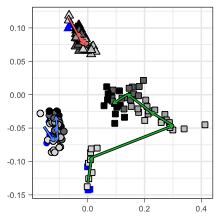

Plot all together

``` r
library(grid)
library(gridExtra)

unfrac.ord.leg = g_legend(unfrac_BC.ord.plot + labs(fill="Day", shape="Land-use", color="Land-use") +
                            theme(legend.title=element_text(size=7, hjust=0.5),
                                  legend.text=element_text(size=6),
                                  legend.background = element_blank(),
                                  legend.position = "top") +
                            guides(fill = guide_colourbar(barheight = 0.5, title.position="top"),
                                   color = guide_legend(title.position="top"),
                                   shape = guide_legend(title.position="top")))

beta_ords.plot = cowplot::plot_grid(unfrac_BC.ord.plot + theme(legend.position = "none", title = element_blank(), axis.title=element_blank()) + 
                                      scale_y_continuous(breaks=c(-0.2, -0.1, 0, 0.1, 0.2)),
                                    unfrac_uwUF.ord.plot + theme(legend.position = "none", title = element_blank(), axis.title=element_blank()), 
                                    unfrac_wUF.ord.plot+ theme(legend.position = "none", title = element_blank(), axis.title=element_blank()),
                                    nrow=1, labels = c("a", "b", "c"), label_size = 10)
y.grob <- textGrob("NMDS2", gp=gpar(col="black", fontsize=7), rot=90)
x.grob <- textGrob("NMDS1", gp=gpar(col="black", fontsize=7))
beta_ords.plot = grid.arrange(arrangeGrob(beta_ords.plot, left = y.grob, bottom = x.grob))
```

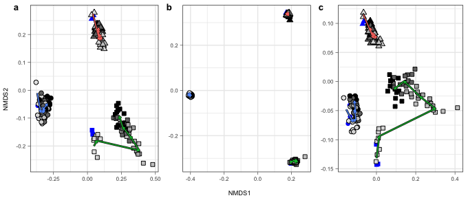

``` r
beta_ords_leg.plot = cowplot::plot_grid(beta_ords.plot, unfrac.ord.leg, nrow=2, rel_heights = c(1, 0.2))
beta_ords_leg.plot
```

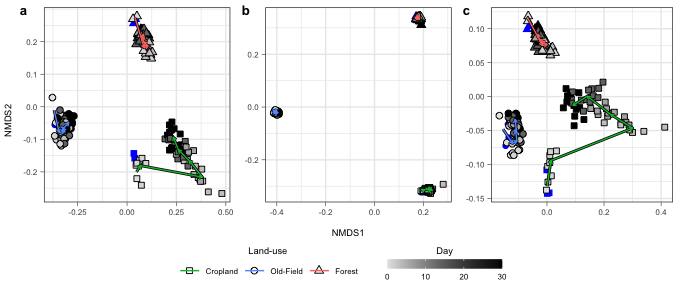

### PERMANOVA

``` r
# Get metadata without H2O-Con samples
meta_noH2O.df = data.frame(sample_data(unfrac.rare.physeq)) %>%
  select(X.Sample, ecosystem, substrate, day) %>%
  filter(substrate != "H2O-Con") %>%
  mutate(X.Sample = as.character(X.Sample))
rownames(meta_noH2O.df) = meta_noH2O.df$X.Sample

# Remove the H2O-Con samples from the distance matrices
unfrac_BC_noH2O.dist = dist(as.matrix(unfrac_BC.dist)[meta_noH2O.df$X.Sample, meta_noH2O.df$X.Sample])
unfrac_uwUF_noH2O.dist = dist(as.matrix(unfrac_uwUF.dist)[meta_noH2O.df$X.Sample, meta_noH2O.df$X.Sample])
unfrac_wUF_noH2O.dist = dist(as.matrix(unfrac_wUF.dist)[meta_noH2O.df$X.Sample, meta_noH2O.df$X.Sample])

print("Bray-Curtis")
```

    ## [1] "Bray-Curtis"

``` r
set.seed(4242)
unfrac_BC_noH2O.perm = adonis(unfrac_BC_noH2O.dist ~ ecosystem*day, data=meta_noH2O.df, permutations = 999)
unfrac_BC_noH2O.perm
```

    ## 
    ## Call:
    ## adonis(formula = unfrac_BC_noH2O.dist ~ ecosystem * day, data = meta_noH2O.df,      permutations = 999) 
    ## 
    ## Permutation: free
    ## Number of permutations: 999
    ## 
    ## Terms added sequentially (first to last)
    ## 
    ##                Df SumsOfSqs MeanSqs F.Model      R2 Pr(>F)    
    ## ecosystem       2    708.70  354.35  961.81 0.91483  0.001 ***
    ## day             1      4.39    4.39   11.91 0.00567  0.001 ***
    ## ecosystem:day   2      6.33    3.17    8.59 0.00817  0.001 ***
    ## Residuals     150     55.26    0.37         0.07134           
    ## Total         155    774.68                 1.00000           
    ## ---
    ## Signif. codes:  0 '***' 0.001 '**' 0.01 '*' 0.05 '.' 0.1 ' ' 1

``` r
print("Unweighted UniFrac")
```

    ## [1] "Unweighted UniFrac"

``` r
set.seed(4242)
unfrac_uwUF_noH2O.perm = adonis(unfrac_uwUF_noH2O.dist ~ ecosystem*day, data=meta_noH2O.df, permutations = 999)
unfrac_uwUF_noH2O.perm
```

    ## 
    ## Call:
    ## adonis(formula = unfrac_uwUF_noH2O.dist ~ ecosystem * day, data = meta_noH2O.df,      permutations = 999) 
    ## 
    ## Permutation: free
    ## Number of permutations: 999
    ## 
    ## Terms added sequentially (first to last)
    ## 
    ##                Df SumsOfSqs MeanSqs F.Model      R2 Pr(>F)    
    ## ecosystem       2   170.745  85.373 309.562 0.79279  0.001 ***
    ## day             1     1.529   1.529   5.543 0.00710  0.002 ** 
    ## ecosystem:day   2     1.732   0.866   3.139 0.00804  0.013 *  
    ## Residuals     150    41.368   0.276         0.19207           
    ## Total         155   215.373                 1.00000           
    ## ---
    ## Signif. codes:  0 '***' 0.001 '**' 0.01 '*' 0.05 '.' 0.1 ' ' 1

``` r
print("Weighted UniFrac")
```

    ## [1] "Weighted UniFrac"

``` r
set.seed(4242)
unfrac_wUF_noH2O.perm = adonis(unfrac_wUF_noH2O.dist ~ ecosystem*day, data=meta_noH2O.df, permutations = 999)
unfrac_wUF_noH2O.perm
```

    ## 
    ## Call:
    ## adonis(formula = unfrac_wUF_noH2O.dist ~ ecosystem * day, data = meta_noH2O.df,      permutations = 999) 
    ## 
    ## Permutation: free
    ## Number of permutations: 999
    ## 
    ## Terms added sequentially (first to last)
    ## 
    ##                Df SumsOfSqs MeanSqs F.Model      R2 Pr(>F)    
    ## ecosystem       2   167.188  83.594  332.73 0.78399  0.001 ***
    ## day             1     3.765   3.765   14.99 0.01766  0.001 ***
    ## ecosystem:day   2     4.614   2.307    9.18 0.02164  0.001 ***
    ## Residuals     150    37.686   0.251         0.17672           
    ## Total         155   213.253                 1.00000           
    ## ---
    ## Signif. codes:  0 '***' 0.001 '**' 0.01 '*' 0.05 '.' 0.1 ' ' 1

### Resistance/resilience

Based on the ordinations, the community compositions clearly change over time after carbon substrates are added to the microcosm. It further looks as though the degree of compositional change differes across land-use regime where agriculture soils seem to show the greatest change. It also looks as though this change is somewhat reversed over time where the communities on the final day (30) seem to be more similar to the starting day (0) than the earlier timepoints. With this in mind I will look to see if we are seeing resilience or resistance in these communities and how these differ across land use regime. Resistance here is defined by the amount of change in the community after a disturbance, which in this case is carbon addtion. Resilience is the ability of the community to return to its original stable composition after a disturbance.

To examine resistance an resilience, I will compare the dissimilairty/distance in community composition between each day and day 0 to the starting variation between the day 0 replicates. Essentially, this analysis will tell us whether the shift in community composition is greater or less than what might be expected between untreated soil microcosms.

I will run this analysis using Bray-Curtis, unweighted UniFrac, and UniFrac. First I need to collect all paired distances of interest.

``` r
# Get paired samples
unfrac_metadata.df = data.frame(sample_data(unfrac.physeq)) %>%
  mutate(treatment = ifelse(substrate == "H2O-Con", "Water", "Carbon"),
         X.Sample = as.character(X.Sample)) %>%
  select(X.Sample, day, ecosystem, treatment, microcosm_replicate)

unfrac_day0.df = unfrac_metadata.df %>%
  filter(day == 0) %>%
  select(X.Sample, ecosystem) %>%
  rename(day0.Sample = X.Sample)

unfrac_daypaired.df = unfrac_metadata.df %>%
  filter(day != 0) %>%
  rename(dayX.Sample = X.Sample) %>%
  left_join(unfrac_day0.df, by = "ecosystem") %>%
  select(-microcosm_replicate)

# Get the distances/dissimilarities between the two day 0 replicates
unfrac_day0_within.df = unfrac_metadata.df %>%
  filter(day == 0) %>%
  select(X.Sample, ecosystem, microcosm_replicate)

unfrac_day0.BC.df = as.matrix(unfrac_BC.dist)[unique(unfrac_day0_within.df[unfrac_day0_within.df$microcosm_replicate==1,]$X.Sample),
                                     as.character(unfrac_day0_within.df[unfrac_day0_within.df$microcosm_replicate==2,]$X.Sample)] %>%
  as.data.frame %>%
  tibble::rownames_to_column(var="X.Sample") %>%
  tidyr::gather(key="day0.Sample", value="Day0_dist", -X.Sample) %>%
  mutate(day0.Sample = gsub("12C.Con", "12C-Con", day0.Sample)) %>%
  inner_join(unfrac_day0_within.df, by = "X.Sample") %>%
  inner_join(unfrac_day0.df, by = c("day0.Sample", "ecosystem")) %>%
  select(ecosystem, Day0_dist) %>%
  mutate(measure="Bray-Curtis")

unfrac_day0.uwUF.df = as.matrix(unfrac_uwUF.dist)[unique(unfrac_day0_within.df[unfrac_day0_within.df$microcosm_replicate==1,]$X.Sample),
                                     as.character(unfrac_day0_within.df[unfrac_day0_within.df$microcosm_replicate==2,]$X.Sample)] %>%
  as.data.frame %>%
  tibble::rownames_to_column(var="X.Sample") %>%
  tidyr::gather(key="day0.Sample", value="Day0_dist", -X.Sample) %>%
  mutate(day0.Sample = gsub("12C.Con", "12C-Con", day0.Sample)) %>%
  inner_join(unfrac_day0_within.df, by = "X.Sample") %>%
  inner_join(unfrac_day0.df, by = c("day0.Sample", "ecosystem")) %>%
  select(ecosystem, Day0_dist) %>%
  mutate(measure="Unweighted UniFrac")

unfrac_day0.wUF.df = as.matrix(unfrac_wUF.dist)[unique(unfrac_day0_within.df[unfrac_day0_within.df$microcosm_replicate==1,]$X.Sample),
                                     as.character(unfrac_day0_within.df[unfrac_day0_within.df$microcosm_replicate==2,]$X.Sample)] %>%
  as.data.frame %>%
  tibble::rownames_to_column(var="X.Sample") %>%
  tidyr::gather(key="day0.Sample", value="Day0_dist", -X.Sample) %>%
  mutate(day0.Sample = gsub("12C.Con", "12C-Con", day0.Sample)) %>%
  inner_join(unfrac_day0_within.df, by = "X.Sample") %>%
  inner_join(unfrac_day0.df, by = c("day0.Sample", "ecosystem")) %>%
  select(ecosystem, Day0_dist) %>%
  mutate(measure="Weighted UniFrac")

unfrac_day0.dist.df = rbind(unfrac_day0.BC.df, unfrac_day0.uwUF.df, unfrac_day0.wUF.df)


# Get distances/dissimilarities between the each day and day 0.
unfrac_daypaired.BC.df = as.matrix(unfrac_BC.dist)[unique(unfrac_daypaired.df$dayX.Sample),
                                     as.character(unfrac_daypaired.df$day0.Sample)] %>%
  as.data.frame %>%
  tibble::rownames_to_column(var="dayX.Sample") %>%
  tidyr::gather(key="day0.Sample", value="distance", -dayX.Sample) %>%
  mutate(day0.Sample = gsub("12C.Con", "12C-Con", day0.Sample)) %>%
  inner_join(unfrac_daypaired.df, by = c("dayX.Sample", "day0.Sample")) %>%
  mutate(measure="Bray-Curtis")

unfrac_daypaired.uwUF.df = as.matrix(unfrac_uwUF.dist)[unique(unfrac_daypaired.df$dayX.Sample),
                                     as.character(unfrac_daypaired.df$day0.Sample)] %>%
  as.data.frame %>%
  tibble::rownames_to_column(var="dayX.Sample") %>%
  tidyr::gather(key="day0.Sample", value="distance", -dayX.Sample) %>%
  mutate(day0.Sample = gsub("12C.Con", "12C-Con", day0.Sample)) %>%
  inner_join(unfrac_daypaired.df, by = c("dayX.Sample", "day0.Sample")) %>%
  mutate(measure="Unweighted UniFrac")

unfrac_daypaired.wUF.df = as.matrix(unfrac_wUF.dist)[unique(unfrac_daypaired.df$dayX.Sample),
                                     as.character(unfrac_daypaired.df$day0.Sample)] %>%
  as.data.frame %>%
  tibble::rownames_to_column(var="dayX.Sample") %>%
  tidyr::gather(key="day0.Sample", value="distance", -dayX.Sample) %>%
  mutate(day0.Sample = gsub("12C.Con", "12C-Con", day0.Sample)) %>%
  inner_join(unfrac_daypaired.df, by = c("dayX.Sample", "day0.Sample")) %>%
  mutate(measure="Weighted UniFrac")

unfrac_daypaired.dist.df = rbind(unfrac_daypaired.BC.df, unfrac_daypaired.uwUF.df, unfrac_daypaired.wUF.df) %>%
  left_join(unfrac_day0.dist.df, by = c("ecosystem", "measure")) %>%
  mutate(ecosystem = factor(ecosystem, levels = c("agriculture", "meadow", "forest")),
         measure = factor(measure, levels = c("Bray-Curtis", "Unweighted UniFrac", "Weighted UniFrac")))

unfrac_daypaired.dist.sum = unfrac_daypaired.dist.df %>%
  group_by(day, ecosystem, treatment, measure) %>%
  summarize(mean_dist = mean(distance),
            sd_dist = sd(distance),
            n_pairs = n()) %>%
  as.data.frame %>%
  mutate(SE_dist = sd_dist/sqrt(n_pairs))
```

Now I an compare the distances between each day and day 0 to the intra-day 0 distance. I'll use a single sample t-test and adjust the p-value for multiple comparisons.

``` r
# Run analysis separately for each beta-diversity metric
daypair_ttest.df = data.frame()
for (metric in c("Bray-Curtis", "Unweighted UniFrac", "Weighted UniFrac")){
  for (eco in c("agriculture", "meadow", "forest")){
    for (dia in c(1, 3, 6, 14, 30)){
      sub.df = unfrac_daypaired.dist.df %>%
        filter(measure == metric,
               ecosystem == eco,
               treatment == "Carbon",
               day == dia)
      sub.ttest = t.test(sub.df$distance, mu=unique(sub.df$Day0_dist))
      daypair_ttest.df = rbind(daypair_ttest.df, data.frame(ecosystem = eco, day = dia, treatment = "Carbon", measure = metric,
                                                            t = sub.ttest$statistic, df = sub.ttest$parameter, 
                                                            pvalue = sub.ttest$p.value, mean = sub.ttest$estimate, 
                                                            lower.CL = sub.ttest$conf.int[1], upper.CL = sub.ttest$conf.int[2]))
    }
    sub.df = unfrac_daypaired.dist.df %>%
      filter(measure == metric,
             ecosystem == eco,
             treatment == "Water",
             day == 30)
    sub.ttest = t.test(sub.df$distance, mu=unique(sub.df$Day0_dist))
    daypair_ttest.df = rbind(daypair_ttest.df, data.frame(ecosystem = eco, day = 30, treatment = "Water", measure = metric,
                                                          t = sub.ttest$statistic, df = sub.ttest$parameter, 
                                                          pvalue = sub.ttest$p.value, mean = sub.ttest$estimate, 
                                                          lower.CL = sub.ttest$conf.int[1], upper.CL = sub.ttest$conf.int[2]))
  }
}
daypair_ttest.df = daypair_ttest.df %>%
  group_by(measure) %>%
  mutate(padj = p.adjust(pvalue, method="BH")) %>%
  ungroup %>%
  mutate(sig = ifelse(padj < 0.05, "Significant", "Non-significant")) %>%
  mutate(ecosystem = factor(ecosystem, levels = c("agriculture", "meadow", "forest")),
         measure = factor(measure, levels = c("Bray-Curtis", "Unweighted UniFrac", "Weighted UniFrac"))) %>%
  left_join(unfrac_daypaired.dist.sum, by = c("ecosystem", "day", "treatment", "measure"))

kable(daypair_ttest.df)
```

| ecosystem   |  day| treatment | measure            |           t|   df|     pvalue|       mean|   lower.CL|   upper.CL|       padj| sig             |  mean\_dist|   sd\_dist|  n\_pairs|   SE\_dist|
|:------------|----:|:----------|:-------------------|-----------:|----:|----------:|----------:|----------:|----------:|----------:|:----------------|-----------:|----------:|---------:|----------:|
| agriculture |    1| Carbon    | Bray-Curtis        |   2.9859052|   11|  0.0123880|  0.4132092|  0.3981593|  0.4282590|  0.0278731| Significant     |   0.4132092|  0.0236867|        12|  0.0068378|
| agriculture |    3| Carbon    | Bray-Curtis        |  16.7408160|   11|  0.0000000|  0.6932667|  0.6537621|  0.7327713|  0.0000000| Significant     |   0.6932667|  0.0621758|        12|  0.0179486|
| agriculture |    6| Carbon    | Bray-Curtis        |  30.0023823|   23|  0.0000000|  0.6428932|  0.6256488|  0.6601376|  0.0000000| Significant     |   0.6428932|  0.0408381|        24|  0.0083360|
| agriculture |   14| Carbon    | Bray-Curtis        |  30.6055032|   27|  0.0000000|  0.5881068|  0.5750126|  0.6012009|  0.0000000| Significant     |   0.5881068|  0.0337687|        28|  0.0063817|
| agriculture |   30| Carbon    | Bray-Curtis        |  35.1273135|   23|  0.0000000|  0.5766328|  0.5658064|  0.5874593|  0.0000000| Significant     |   0.5766328|  0.0256391|        24|  0.0052336|
| agriculture |   30| Water     | Bray-Curtis        |   0.9158609|    5|  0.4017528|  0.4067737|  0.3675315|  0.4460159|  0.4519719| Non-significant |   0.4067737|  0.0373936|         6|  0.0152659|
| meadow      |    1| Carbon    | Bray-Curtis        |  -0.4486267|   11|  0.6624099|  0.4794317|  0.4572688|  0.5015946|  0.6624099| Non-significant |   0.4794317|  0.0348819|        12|  0.0100695|
| meadow      |    3| Carbon    | Bray-Curtis        |  -1.4157230|   11|  0.1845420|  0.4712800|  0.4515838|  0.4909763|  0.2214504| Non-significant |   0.4712800|  0.0309997|        12|  0.0089488|
| meadow      |    6| Carbon    | Bray-Curtis        |  -2.2736914|   23|  0.0326365|  0.4707753|  0.4587894|  0.4827612|  0.0489547| Significant     |   0.4707753|  0.0283848|        24|  0.0057940|
| meadow      |   14| Carbon    | Bray-Curtis        |  -2.4777136|   27|  0.0197719|  0.4713918|  0.4609929|  0.4817907|  0.0395438| Significant     |   0.4713918|  0.0268179|        28|  0.0050681|
| meadow      |   30| Carbon    | Bray-Curtis        |  -3.5044875|   23|  0.0019071|  0.4618161|  0.4487512|  0.4748809|  0.0057213| Significant     |   0.4618161|  0.0309401|        24|  0.0063156|
| meadow      |   30| Water     | Bray-Curtis        |  -3.1027861|    5|  0.0267686|  0.4411468|  0.4056861|  0.4766075|  0.0452813| Significant     |   0.4411468|  0.0337902|         6|  0.0137948|
| forest      |    1| Carbon    | Bray-Curtis        |   2.1900191|   11|  0.0509665|  0.3734353|  0.3548438|  0.3920268|  0.0684738| Non-significant |   0.3734353|  0.0292609|        12|  0.0084469|
| forest      |    3| Carbon    | Bray-Curtis        |   4.4299596|   11|  0.0010117|  0.3883253|  0.3717363|  0.4049142|  0.0036421| Significant     |   0.3883253|  0.0261091|        12|  0.0075371|
| forest      |    6| Carbon    | Bray-Curtis        |   2.0375679|   23|  0.0532574|  0.3610438|  0.3548432|  0.3672444|  0.0684738| Non-significant |   0.3610438|  0.0146842|        24|  0.0029974|
| forest      |   14| Carbon    | Bray-Curtis        |  -0.7627740|   27|  0.4522113|  0.3525677|  0.3461960|  0.3589394|  0.4788120| Non-significant |   0.3525677|  0.0164321|        28|  0.0031054|
| forest      |   30| Carbon    | Bray-Curtis        |  -2.7895724|   23|  0.0104165|  0.3467595|  0.3406958|  0.3528232|  0.0267852| Significant     |   0.3467595|  0.0143600|        24|  0.0029312|
| forest      |   30| Water     | Bray-Curtis        |  -3.0735466|    5|  0.0276719|  0.3287402|  0.3068307|  0.3506496|  0.0452813| Significant     |   0.3287402|  0.0208773|         6|  0.0085231|
| agriculture |    1| Carbon    | Unweighted UniFrac |  -0.1698309|   11|  0.8682263|  0.4516856|  0.4447126|  0.4586585|  0.8682263| Non-significant |   0.4516856|  0.0109747|        12|  0.0031681|
| agriculture |    3| Carbon    | Unweighted UniFrac |   9.6980618|   11|  0.0000010|  0.5404746|  0.5204459|  0.5605033|  0.0000045| Significant     |   0.5404746|  0.0315228|        12|  0.0090999|
| agriculture |    6| Carbon    | Unweighted UniFrac |  22.5034932|   23|  0.0000000|  0.5342928|  0.5267485|  0.5418371|  0.0000000| Significant     |   0.5342928|  0.0178664|        24|  0.0036470|
| agriculture |   14| Carbon    | Unweighted UniFrac |  28.7483289|   27|  0.0000000|  0.5370220|  0.5309697|  0.5430742|  0.0000000| Significant     |   0.5370220|  0.0156082|        28|  0.0029497|
| agriculture |   30| Carbon    | Unweighted UniFrac |  37.0746074|   23|  0.0000000|  0.5509186|  0.5454117|  0.5564255|  0.0000000| Significant     |   0.5509186|  0.0130414|        24|  0.0026621|
| agriculture |   30| Water     | Unweighted UniFrac |  -0.4978519|    5|  0.6397085|  0.4498961|  0.4378784|  0.4619138|  0.7196721| Non-significant |   0.4498961|  0.0114516|         6|  0.0046751|
| meadow      |    1| Carbon    | Unweighted UniFrac |  -2.6234634|   11|  0.0236818|  0.5257086|  0.5152046|  0.5362126|  0.0387521| Significant     |   0.5257086|  0.0165321|        12|  0.0047724|
| meadow      |    3| Carbon    | Unweighted UniFrac |  -3.5792746|   11|  0.0043242|  0.5250135|  0.5168870|  0.5331399|  0.0111193| Significant     |   0.5250135|  0.0127901|        12|  0.0036922|
| meadow      |    6| Carbon    | Unweighted UniFrac |  -4.7564819|   23|  0.0000854|  0.5237359|  0.5174327|  0.5300391|  0.0003075| Significant     |   0.5237359|  0.0149272|        24|  0.0030470|
| meadow      |   14| Carbon    | Unweighted UniFrac |  -3.9488523|   27|  0.0005066|  0.5279810|  0.5226561|  0.5333058|  0.0015198| Significant     |   0.5279810|  0.0137323|        28|  0.0025952|
| meadow      |   30| Carbon    | Unweighted UniFrac |  -2.4240102|   23|  0.0236189|  0.5304645|  0.5238384|  0.5370906|  0.0387521| Significant     |   0.5304645|  0.0156919|        24|  0.0032031|
| meadow      |   30| Water     | Unweighted UniFrac |  -1.9898171|    5|  0.1032741|  0.5232481|  0.5038948|  0.5426013|  0.1429949| Non-significant |   0.5232481|  0.0184415|         6|  0.0075287|
| forest      |    1| Carbon    | Unweighted UniFrac |  -2.0644042|   11|  0.0633821|  0.5111036|  0.5034345|  0.5187727|  0.0950731| Non-significant |   0.5111036|  0.0120703|        12|  0.0034844|
| forest      |    3| Carbon    | Unweighted UniFrac |  -0.3046365|   11|  0.7663291|  0.5167827|  0.5058435|  0.5277218|  0.8114073| Non-significant |   0.5167827|  0.0172170|        12|  0.0049701|
| forest      |    6| Carbon    | Unweighted UniFrac |  -1.1802732|   23|  0.2499548|  0.5149994|  0.5092201|  0.5207787|  0.3213705| Non-significant |   0.5149994|  0.0136865|        24|  0.0027937|
| forest      |   14| Carbon    | Unweighted UniFrac |  -3.0377666|   27|  0.0052366|  0.5082733|  0.5015030|  0.5150435|  0.0117823| Significant     |   0.5082733|  0.0174600|        28|  0.0032996|
| forest      |   30| Carbon    | Unweighted UniFrac |  -2.8479108|   23|  0.0091072|  0.5108098|  0.5053714|  0.5162481|  0.0182143| Significant     |   0.5108098|  0.0128791|        24|  0.0026289|
| forest      |   30| Water     | Unweighted UniFrac |  -0.8119728|    5|  0.4537130|  0.5127115|  0.4950294|  0.5303936|  0.5444556| Non-significant |   0.5127115|  0.0168491|         6|  0.0068786|
| agriculture |    1| Carbon    | Weighted UniFrac   |   0.8086996|   11|  0.4358300|  0.1396207|  0.1237855|  0.1554560|  0.4877082| Non-significant |   0.1396207|  0.0249228|        12|  0.0071946|
| agriculture |    3| Carbon    | Weighted UniFrac   |  14.6817501|   11|  0.0000000|  0.4370929|  0.3916257|  0.4825601|  0.0000001| Significant     |   0.4370929|  0.0715602|        12|  0.0206576|
| agriculture |    6| Carbon    | Weighted UniFrac   |  27.6178764|   23|  0.0000000|  0.3726828|  0.3547900|  0.3905756|  0.0000000| Significant     |   0.3726828|  0.0423736|        24|  0.0086495|
| agriculture |   14| Carbon    | Weighted UniFrac   |  28.4621265|   27|  0.0000000|  0.3101349|  0.2974231|  0.3228467|  0.0000000| Significant     |   0.3101349|  0.0327826|        28|  0.0061953|
| agriculture |   30| Carbon    | Weighted UniFrac   |  31.2531259|   23|  0.0000000|  0.2593954|  0.2510823|  0.2677084|  0.0000000| Significant     |   0.2593954|  0.0196869|        24|  0.0040186|
| agriculture |   30| Water     | Weighted UniFrac   |   0.1358991|    5|  0.8972030|  0.1358870|  0.0964576|  0.1753164|  0.8972030| Non-significant |   0.1358870|  0.0375720|         6|  0.0153387|
| meadow      |    1| Carbon    | Weighted UniFrac   |  -0.7645734|   11|  0.4606133|  0.1529967|  0.1363189|  0.1696745|  0.4877082| Non-significant |   0.1529967|  0.0262489|        12|  0.0075774|
| meadow      |    3| Carbon    | Weighted UniFrac   |  -0.7836519|   11|  0.4497890|  0.1534055|  0.1382820|  0.1685290|  0.4877082| Non-significant |   0.1534055|  0.0238027|        12|  0.0068712|
| meadow      |    6| Carbon    | Weighted UniFrac   |  -1.9909276|   23|  0.0584985|  0.1521210|  0.1451914|  0.1590506|  0.1052973| Non-significant |   0.1521210|  0.0164107|        24|  0.0033498|
| meadow      |   14| Carbon    | Weighted UniFrac   |  -1.6464486|   27|  0.1112637|  0.1531066|  0.1460236|  0.1601896|  0.1521632| Non-significant |   0.1531066|  0.0182665|        28|  0.0034520|
| meadow      |   30| Carbon    | Weighted UniFrac   |  -1.6223889|   23|  0.1183491|  0.1520318|  0.1434143|  0.1606492|  0.1521632| Non-significant |   0.1520318|  0.0204079|        24|  0.0041657|
| meadow      |   30| Water     | Weighted UniFrac   |  -2.2071926|    5|  0.0783809|  0.1327192|  0.1023560|  0.1630825|  0.1282597| Non-significant |   0.1327192|  0.0289329|         6|  0.0118118|
| forest      |    1| Carbon    | Weighted UniFrac   |   2.8950068|   11|  0.0145747|  0.1422826|  0.1252881|  0.1592771|  0.0327931| Significant     |   0.1422826|  0.0267474|        12|  0.0077213|
| forest      |    3| Carbon    | Weighted UniFrac   |   6.9760903|   11|  0.0000234|  0.1617864|  0.1485803|  0.1749925|  0.0000843| Significant     |   0.1617864|  0.0207849|        12|  0.0060001|
| forest      |    6| Carbon    | Weighted UniFrac   |   4.8936426|   23|  0.0000607|  0.1364934|  0.1294914|  0.1434954|  0.0001751| Significant     |   0.1364934|  0.0165821|        24|  0.0033848|
| forest      |   14| Carbon    | Weighted UniFrac   |   4.7005385|   27|  0.0000681|  0.1316322|  0.1265238|  0.1367406|  0.0001751| Significant     |   0.1316322|  0.0131742|        28|  0.0024897|
| forest      |   30| Carbon    | Weighted UniFrac   |   1.7449102|   23|  0.0943499|  0.1245558|  0.1190709|  0.1300407|  0.1415249| Non-significant |   0.1245558|  0.0129892|        24|  0.0026514|
| forest      |   30| Water     | Weighted UniFrac   |  -2.8528360|    5|  0.0357048|  0.1051128|  0.0917622|  0.1184634|  0.0714097| Non-significant |   0.1051128|  0.0127217|         6|  0.0051936|

Now I'll plot the results.

``` r
daypair_ttest.LU.df = left_join(daypair_ttest.df, 
                                data.frame(ecosystem = c("agriculture", "meadow", "forest"),
                                           landuse = factor(c("Cropland", "Old-field", "Forest"), 
                                                            levels=c("Cropland", "Old-field", "Forest"))),
                                by = "ecosystem")

unfrac_daypaired.LU.dist.df = left_join(unfrac_daypaired.dist.df, 
                                        data.frame(ecosystem = c("agriculture", "meadow", "forest"),
                                                   landuse = factor(c("Cropland", "Old-field", "Forest"), 
                                                                    levels=c("Cropland", "Old-field", "Forest"))),
                                        by = "ecosystem")

beta_to0.plot = ggplot(data=daypair_ttest.LU.df, aes(x=day, y=mean)) +
  geom_hline(data=unique(select(unfrac_daypaired.LU.dist.df, landuse, measure, Day0_dist)),
             aes(yintercept=Day0_dist), linetype=2) +
  geom_line(data=daypair_ttest.LU.df[daypair_ttest.LU.df$treatment=="Carbon",]) +
  geom_errorbar(aes(ymin=mean-SE_dist, ymax=mean+SE_dist), width=1) +
  geom_point(aes(fill=sig, shape=treatment), size=3) +
  scale_fill_manual(values = c("Significant" = "black", "Non-significant" = "white")) +
  scale_shape_manual(values = c(Water=24, Carbon = 21)) +
  labs(x="Time since substrate addition (days)", y="Community dissimilarity/distance") +
  theme_bw() +
  theme(legend.position = "none",
        legend.title=element_text(size=14),
        legend.text=element_text(size=12),
        axis.title = element_text(size=14),
        axis.text = element_text(size=12),
        strip.text = element_text(size=10)) +
  facet_grid(measure~landuse, scales = "free_y")

beta_to0.plot
```

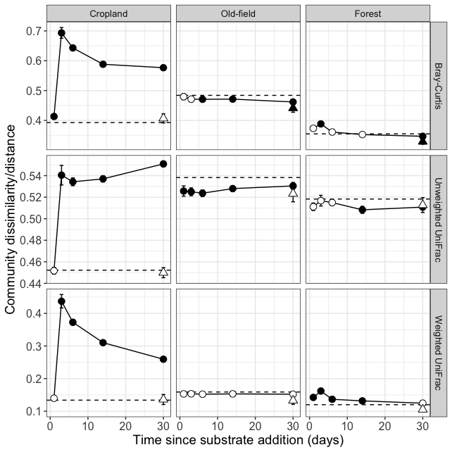

``` r
#ggsave(beta_to0.plot, filename = "/Users/sambarnett/Documents/Dissertation/figures/figS2_7.tiff", 
#       device = "tiff", width = 6.69291, height = 6.69291, units = "in")
```

Convergence/Divergence
----------------------

Based on the ordinations we can see that the microcosm community compositions cluster very nicely by land-use regime. I'm now curious to see if any of the land-use regimes show convergence or divergence to eachtother. In other words, do any land-use regimes become more (convergence) or less (divergence) similar to eachother after carbon addition?

For this analysis, I'll measure the dissimilarity/distance between microcosms from different land-use regimes on the same day and compare these values to the mean from day 0. This will effectively show whether the community compositions between two land-use regimes are more or less similar to eachother than initially.

Again, I will run this analysis using Bray-Curtis, unweighted UniFrac, and UniFrac. First I need to collect all paired distances of interest.

``` r
# Get paired samples
unfrac_metadata.df = data.frame(sample_data(unfrac.physeq)) %>%
  mutate(treatment = ifelse(substrate == "H2O-Con", "Water", "Carbon"),
         X.Sample = as.character(X.Sample)) %>%
  select(X.Sample, day, ecosystem, treatment)

unfrac_Ag_metadata.df = unfrac_metadata.df %>%
  filter(ecosystem == "agriculture") %>%
  rename(Sample1 = X.Sample, ecosystem_1 = ecosystem)
unfrac_M1_metadata.df = unfrac_metadata.df %>%
  filter(ecosystem == "meadow") %>%
  rename(Sample1 = X.Sample, ecosystem_1 = ecosystem)
unfrac_M2_metadata.df = unfrac_metadata.df %>%
  filter(ecosystem == "meadow") %>%
  rename(Sample2 = X.Sample, ecosystem_2 = ecosystem)
unfrac_F_metadata.df = unfrac_metadata.df %>%
  filter(ecosystem == "forest") %>%
  rename(Sample2 = X.Sample, ecosystem_2 = ecosystem)

unfrac_ecopaired.df = rbind(full_join(unfrac_Ag_metadata.df, unfrac_M2_metadata.df, by = c("day", "treatment")),
                            full_join(unfrac_Ag_metadata.df, unfrac_F_metadata.df, by = c("day", "treatment")),
                            full_join(unfrac_M1_metadata.df, unfrac_F_metadata.df, by = c("day", "treatment")))

# Get the distances/dissimilarities between the land-use regimes
unfrac_ecopaired.BC.df = data.frame(as.matrix(unfrac_BC.dist)) %>%
  tibble::rownames_to_column(var="Sample1") %>%
  tidyr::gather(key="Sample2", value="distance", -Sample1) %>%
  mutate(Sample2 = gsub("13C.", "13C-", gsub("12C.", "12C-", gsub("H2O.", "H2O-", Sample2)))) %>%
  inner_join(unfrac_ecopaired.df, by = c("Sample1", "Sample2")) %>%
  mutate(measure="Bray-Curtis")

unfrac_ecopaired.uwUF.df = data.frame(as.matrix(unfrac_uwUF.dist)) %>%
  tibble::rownames_to_column(var="Sample1") %>%
  tidyr::gather(key="Sample2", value="distance", -Sample1) %>%
  mutate(Sample2 = gsub("13C.", "13C-", gsub("12C.", "12C-", gsub("H2O.", "H2O-", Sample2)))) %>%
  inner_join(unfrac_ecopaired.df, by = c("Sample1", "Sample2")) %>%
  mutate(measure="Unweighted UniFrac")

unfrac_ecopaired.wUF.df = data.frame(as.matrix(unfrac_wUF.dist)) %>%
  tibble::rownames_to_column(var="Sample1") %>%
  tidyr::gather(key="Sample2", value="distance", -Sample1) %>%
  mutate(Sample2 = gsub("13C.", "13C-", gsub("12C.", "12C-", gsub("H2O.", "H2O-", Sample2)))) %>%
  inner_join(unfrac_ecopaired.df, by = c("Sample1", "Sample2")) %>%
  mutate(measure="Weighted UniFrac")

unfrac_ecopaired.dist.df = rbind(unfrac_ecopaired.BC.df, unfrac_ecopaired.uwUF.df, unfrac_ecopaired.wUF.df) %>%
  mutate(eco_pair = factor(paste(ecosystem_1, ecosystem_2, sep="-"),
                           levels = c("agriculture-meadow", "agriculture-forest", "meadow-forest")),
         measure = factor(measure, levels = c("Bray-Curtis", "Unweighted UniFrac", "Weighted UniFrac")))

unfrac_ecopaired.dist.sum = unfrac_ecopaired.dist.df %>%
  group_by(eco_pair, day, treatment, measure) %>%
  summarize(mean_dist = mean(distance),
            sd_dist = sd(distance),
            n_pairs = n()) %>%
  as.data.frame %>%
  mutate(SE_dist = sd_dist/sqrt(n_pairs))
```

Now I an compare the distances between land use regimes on each day to their day 0 distance. I'll use a two sample t-test and adjust the p-value for multiple comparisons.

``` r
# Run analysis separately for each beta-diversity metric
ecopair_ttest.df = data.frame()
eco_pair = NULL
for (metric in c("Bray-Curtis", "Unweighted UniFrac", "Weighted UniFrac")){
  for (pair in c("agriculture-meadow", "agriculture-forest", "meadow-forest")){
    subday0.df = unfrac_ecopaired.dist.df %>%
      filter(measure == metric,
             eco_pair == pair,
             day == 0)
    for (dia in c(1, 3, 6, 14, 30)){
      sub.df = unfrac_ecopaired.dist.df %>%
        filter(measure == metric,
               eco_pair == pair,
               treatment == "Carbon",
               day == dia)
      sub.ttest = t.test(x=sub.df$distance, y=subday0.df$distance)
      ecopair_ttest.df = rbind(ecopair_ttest.df, data.frame(eco_pair = pair, day = dia, treatment = "Carbon", measure = metric,
                                                            t = sub.ttest$statistic, df = sub.ttest$parameter, 
                                                            pvalue = sub.ttest$p.value, mean = sub.ttest$estimate[1], 
                                                            mean_day0 = sub.ttest$estimate[2],
                                                            lower.CL = sub.ttest$conf.int[1], upper.CL = sub.ttest$conf.int[2]))
    }
    sub.df = unfrac_ecopaired.dist.df %>%
      filter(measure == metric,
             eco_pair == pair,
             treatment == "Water",
             day == 30)
    sub.ttest = t.test(x=sub.df$distance, y=subday0.df$distance)
    ecopair_ttest.df = rbind(ecopair_ttest.df, data.frame(eco_pair = pair, day = 30, treatment = "Water", measure = metric,
                                                          t = sub.ttest$statistic, df = sub.ttest$parameter, 
                                                          pvalue = sub.ttest$p.value, mean = sub.ttest$estimate[1],
                                                          mean_day0 = sub.ttest$estimate[2],
                                                          lower.CL = sub.ttest$conf.int[1], upper.CL = sub.ttest$conf.int[2]))
  }
}
ecopair_ttest.df = ecopair_ttest.df %>%
  group_by(measure) %>%
  mutate(padj = p.adjust(pvalue, method="BH")) %>%
  ungroup %>%
  mutate(sig = ifelse(padj < 0.05, "Significant", "Non-significant"),
         eco_pair = factor(eco_pair, levels = c("agriculture-meadow", "agriculture-forest", "meadow-forest")),
         measure = factor(measure, levels = c("Bray-Curtis", "Unweighted UniFrac", "Weighted UniFrac"))) %>%
  left_join(unfrac_ecopaired.dist.sum, by = c("eco_pair", "day", "treatment", "measure"))

kable(ecopair_ttest.df)
```

| eco\_pair          |  day| treatment | measure            |           t|         df|     pvalue|       mean|  mean\_day0|    lower.CL|    upper.CL|       padj| sig             |  mean\_dist|   sd\_dist|  n\_pairs|   SE\_dist|
|:-------------------|----:|:----------|:-------------------|-----------:|----------:|----------:|----------:|-----------:|-----------:|-----------:|----------:|:----------------|-----------:|----------:|---------:|----------:|
| agriculture-meadow |    1| Carbon    | Bray-Curtis        |   0.4003860|   3.287284|  0.7134908|  0.7250824|   0.7213053|  -0.0248144|   0.0323687|  0.9144924| Non-significant |   0.7250824|  0.0119786|        36|  0.0019964|
| agriculture-meadow |    3| Carbon    | Bray-Curtis        |  10.9129394|   4.467676|  0.0002175|  0.8325762|   0.7213053|   0.0840929|   0.1384490|  0.0039159| Significant     |   0.8325762|  0.0261203|        36|  0.0043534|
| agriculture-meadow |    6| Carbon    | Bray-Curtis        |   9.1403775|   3.197764|  0.0021342|  0.8069373|   0.7213053|   0.0568336|   0.1144305|  0.0192077| Significant     |   0.8069373|  0.0199297|       144|  0.0016608|
| agriculture-meadow |   14| Carbon    | Bray-Curtis        |   6.6036766|   3.102516|  0.0063637|  0.7827059|   0.7213053|   0.0323559|   0.0904453|  0.0286368| Significant     |   0.7827059|  0.0168029|       196|  0.0012002|
| agriculture-meadow |   30| Carbon    | Bray-Curtis        |   4.6162982|   3.111065|  0.0176554|  0.7642569|   0.7213053|   0.0139302|   0.0719731|  0.0510466| Non-significant |   0.7642569|  0.0149862|       144|  0.0012489|
| agriculture-meadow |   30| Water     | Bray-Curtis        |  -2.3037545|   5.925163|  0.0613300|  0.6956390|   0.7213053|  -0.0530111|   0.0016786|  0.1379924| Non-significant |   0.6956390|  0.0187618|         9|  0.0062539|
| agriculture-forest |    1| Carbon    | Bray-Curtis        |  -1.9467062|   4.049849|  0.1225489|  0.6799835|   0.6960176|  -0.0387917|   0.0067236|  0.2205881| Non-significant |   0.6799835|  0.0185108|        36|  0.0030851|
| agriculture-forest |    3| Carbon    | Bray-Curtis        |   2.7587856|  10.186170|  0.0198515|  0.7251077|   0.6960176|   0.0056535|   0.0525267|  0.0510466| Non-significant |   0.7251077|  0.0436251|        36|  0.0072709|
| agriculture-forest |    6| Carbon    | Bray-Curtis        |   1.2257574|   4.398494|  0.2818397|  0.7063207|   0.6960176|  -0.0122236|   0.0328298|  0.4227596| Non-significant |   0.7063207|  0.0421377|       144|  0.0035115|
| agriculture-forest |   14| Carbon    | Bray-Curtis        |  -1.1912765|   3.535769|  0.3073258|  0.6865382|   0.6960176|  -0.0327650|   0.0138061|  0.4255281| Non-significant |   0.6865382|  0.0312975|       196|  0.0022355|
| agriculture-forest |   30| Carbon    | Bray-Curtis        |  -4.6082240|   3.608375|  0.0126868|  0.6591607|   0.6960176|  -0.0600466|  -0.0136671|  0.0456725| Significant     |   0.6591607|  0.0285164|       144|  0.0023764|
| agriculture-forest |   30| Water     | Bray-Curtis        |  -5.3832634|   3.912665|  0.0061281|  0.6519954|   0.6960176|  -0.0669281|  -0.0211162|  0.0286368| Significant     |   0.6519954|  0.0087727|         9|  0.0029242|
| meadow-forest      |    1| Carbon    | Bray-Curtis        |   1.2805763|   4.067834|  0.2684844|  0.7532472|   0.7468958|  -0.0073291|   0.0200318|  0.4227596| Non-significant |   0.7532472|  0.0112232|        36|  0.0018705|
| meadow-forest      |    3| Carbon    | Bray-Curtis        |   0.1238828|   4.059386|  0.9073006|  0.7475099|   0.7468958|  -0.0130701|   0.0142983|  0.9144924| Non-significant |   0.7475099|  0.0111815|        36|  0.0018636|
| meadow-forest      |    6| Carbon    | Bray-Curtis        |  -0.1772092|   3.286967|  0.8697101|  0.7460630|   0.7468958|  -0.0150771|   0.0134114|  0.9144924| Non-significant |   0.7460630|  0.0119196|       144|  0.0009933|
| meadow-forest      |   14| Carbon    | Bray-Curtis        |  -0.1160428|   3.214788|  0.9144924|  0.7463535|   0.7468958|  -0.0148693|   0.0137846|  0.9144924| Non-significant |   0.7463535|  0.0120636|       196|  0.0008617|
| meadow-forest      |   30| Carbon    | Bray-Curtis        |  -2.2047139|   3.395549|  0.1042127|  0.7364497|   0.7468958|  -0.0245782|   0.0036860|  0.2084254| Non-significant |   0.7364497|  0.0139373|       144|  0.0011614|
| meadow-forest      |   30| Water     | Bray-Curtis        |  -0.2743262|   7.481199|  0.7912556|  0.7452386|   0.7468958|  -0.0157581|   0.0124436|  0.9144924| Non-significant |   0.7452386|  0.0117709|         9|  0.0039236|
| agriculture-meadow |    1| Carbon    | Unweighted UniFrac |   1.9256580|   7.617673|  0.0921539|  0.6644674|   0.6581788|  -0.0013084|   0.0138856|  0.2764617| Non-significant |   0.6644674|  0.0121187|        36|  0.0020198|
| agriculture-meadow |    3| Carbon    | Unweighted UniFrac |  11.5871231|  10.014600|  0.0000004|  0.6990331|   0.6581788|   0.0329998|   0.0487088|  0.0000072| Significant     |   0.6990331|  0.0145074|        36|  0.0024179|
| agriculture-meadow |    6| Carbon    | Unweighted UniFrac |  15.1850769|   4.025247|  0.0001052|  0.7001236|   0.6581788|   0.0342946|   0.0495951|  0.0009466| Significant     |   0.7001236|  0.0122654|       144|  0.0010221|
| agriculture-meadow |   14| Carbon    | Unweighted UniFrac |  13.4091810|   3.713120|  0.0002793|  0.6944753|   0.6581788|   0.0285465|   0.0440465|  0.0016760| Significant     |   0.6944753|  0.0120571|       196|  0.0008612|
| agriculture-meadow |   30| Carbon    | Unweighted UniFrac |  11.7019205|   3.735211|  0.0004443|  0.6899017|   0.6581788|   0.0239810|   0.0394648|  0.0019994| Significant     |   0.6899017|  0.0104874|       144|  0.0008740|
| agriculture-meadow |   30| Water     | Unweighted UniFrac |   4.9035209|   9.204081|  0.0007901|  0.6765441|   0.6581788|   0.0099213|   0.0268092|  0.0028442| Significant     |   0.6765441|  0.0081841|         9|  0.0027280|
| agriculture-forest |    1| Carbon    | Unweighted UniFrac |  -0.3346148|   3.274089|  0.7582204|  0.6211013|   0.6239032|  -0.0282321|   0.0226282|  0.9549880| Non-significant |   0.6211013|  0.0104008|        36|  0.0017335|
| agriculture-forest |    3| Carbon    | Unweighted UniFrac |   0.1155068|   3.381078|  0.9145690|  0.6248783|   0.6239032|  -0.0242556|   0.0262057|  0.9549880| Non-significant |   0.6248783|  0.0122183|        36|  0.0020364|
| agriculture-forest |    6| Carbon    | Unweighted UniFrac |   0.2286671|   3.172980|  0.8330803|  0.6258030|   0.6239032|  -0.0237429|   0.0275424|  0.9549880| Non-significant |   0.6258030|  0.0165773|       144|  0.0013814|
| agriculture-forest |   14| Carbon    | Unweighted UniFrac |  -0.1816799|   3.085093|  0.8671184|  0.6224044|   0.6239032|  -0.0273484|   0.0243508|  0.9549880| Non-significant |   0.6224044|  0.0136115|       196|  0.0009723|
| agriculture-forest |   30| Carbon    | Unweighted UniFrac |  -0.9258918|   3.106704|  0.4206585|  0.6162515|   0.6239032|  -0.0334485|   0.0181449|  0.7571853| Non-significant |   0.6162515|  0.0130538|       144|  0.0010878|
| agriculture-forest |   30| Water     | Unweighted UniFrac |  -0.4158602|   3.833667|  0.6997308|  0.6202749|   0.6239032|  -0.0282728|   0.0210161|  0.9549880| Non-significant |   0.6202749|  0.0090051|         9|  0.0030017|
| meadow-forest      |    1| Carbon    | Unweighted UniFrac |   1.8420673|   4.992749|  0.1249000|  0.6861458|   0.6762369|  -0.0039249|   0.0237429|  0.3211715| Non-significant |   0.6861458|  0.0154017|        36|  0.0025670|
| meadow-forest      |    3| Carbon    | Unweighted UniFrac |   1.3832789|   5.449750|  0.2205722|  0.6838489|   0.6762369|  -0.0061896|   0.0214138|  0.4411444| Non-significant |   0.6838489|  0.0169013|        36|  0.0028169|
| meadow-forest      |    6| Carbon    | Unweighted UniFrac |   1.6429786|   3.343256|  0.1895327|  0.6842171|   0.6762369|  -0.0066173|   0.0225777|  0.4264487| Non-significant |   0.6842171|  0.0133875|       144|  0.0011156|
| meadow-forest      |   14| Carbon    | Unweighted UniFrac |   0.4787234|   3.226702|  0.6627205|  0.6785415|   0.6762369|  -0.0124250|   0.0170343|  0.9549880| Non-significant |   0.6785415|  0.0127487|       196|  0.0009106|
| meadow-forest      |   30| Carbon    | Unweighted UniFrac |  -0.0610550|   3.146817|  0.9549880|  0.6759448|   0.6762369|  -0.0151232|   0.0145390|  0.9549880| Non-significant |   0.6759448|  0.0088217|       144|  0.0007351|
| meadow-forest      |   30| Water     | Unweighted UniFrac |   0.5220103|  10.294576|  0.6127098|  0.6801918|   0.6762369|  -0.0128611|   0.0207711|  0.9549880| Non-significant |   0.6801918|  0.0177622|         9|  0.0059207|
| agriculture-meadow |    1| Carbon    | Weighted UniFrac   |  -0.0804889|   3.928233|  0.9397818|  0.2782886|   0.2788897|  -0.0214859|   0.0202838|  0.9900268| Non-significant |   0.2782886|  0.0159614|        36|  0.0026602|
| agriculture-meadow |    3| Carbon    | Weighted UniFrac   |  13.4388334|  16.872493|  0.0000000|  0.4308792|   0.2788897|   0.1281143|   0.1758647|  0.0000000| Significant     |   0.4308792|  0.0534017|        36|  0.0089003|
| agriculture-meadow |    6| Carbon    | Weighted UniFrac   |  13.4440445|   3.935968|  0.0001954|  0.3793055|   0.2788897|   0.0795443|   0.1212873|  0.0011726| Significant     |   0.3793055|  0.0319607|       144|  0.0026634|
| agriculture-meadow |   14| Carbon    | Weighted UniFrac   |   6.8007844|   3.399883|  0.0043132|  0.3278555|   0.2788897|   0.0275038|   0.0704278|  0.0155277| Significant     |   0.3278555|  0.0248299|       196|  0.0017736|
| agriculture-meadow |   30| Carbon    | Weighted UniFrac   |   3.4001387|   3.259065|  0.0374290|  0.3031131|   0.2788897|   0.0025371|   0.0459096|  0.0673722| Non-significant |   0.3031131|  0.0172230|       144|  0.0014352|
| agriculture-meadow |   30| Water     | Weighted UniFrac   |  -0.0128607|   8.767815|  0.9900268|  0.2787625|   0.2788897|  -0.0225996|   0.0223451|  0.9900268| Non-significant |   0.2787625|  0.0210419|         9|  0.0070140|
| agriculture-forest |    1| Carbon    | Weighted UniFrac   |  -1.3315025|   3.534485|  0.2623954|  0.2747152|   0.2871970|  -0.0399181|   0.0149545|  0.3373655| Non-significant |   0.2747152|  0.0158086|        36|  0.0026348|
| agriculture-forest |    3| Carbon    | Weighted UniFrac   |   7.1097097|  12.927095|  0.0000082|  0.3820725|   0.2871970|   0.0660300|   0.1237211|  0.0000737| Significant     |   0.3820725|  0.0591362|        36|  0.0098560|
| agriculture-forest |    6| Carbon    | Weighted UniFrac   |   5.8598493|   3.980783|  0.0042972|  0.3437841|   0.2871970|   0.0297245|   0.0834496|  0.0155277| Significant     |   0.3437841|  0.0421172|       144|  0.0035098|
| agriculture-forest |   14| Carbon    | Weighted UniFrac   |   0.4291288|   3.387676|  0.6936804|  0.2911768|   0.2871970|  -0.0237126|   0.0316721|  0.7803905| Non-significant |   0.2911768|  0.0315331|       196|  0.0022524|
| agriculture-forest |   30| Carbon    | Weighted UniFrac   |  -2.2977848|   3.372423|  0.0954647|  0.2659113|   0.2871970|  -0.0490078|   0.0064363|  0.1562150| Non-significant |   0.2659113|  0.0265088|       144|  0.0022091|
| agriculture-forest |   30| Water     | Weighted UniFrac   |  -2.8016839|   6.515960|  0.0284987|  0.2557444|   0.2871970|  -0.0584037|  -0.0045015|  0.0605626| Non-significant |   0.2557444|  0.0201461|         9|  0.0067154|
| meadow-forest      |    1| Carbon    | Weighted UniFrac   |  -1.1372926|   4.518847|  0.3121014|  0.2812418|   0.2882868|  -0.0234924|   0.0094023|  0.3745216| Non-significant |   0.2812418|  0.0160746|        36|  0.0026791|
| meadow-forest      |    3| Carbon    | Weighted UniFrac   |  -1.4893179|   3.565485|  0.2190083|  0.2796001|   0.2882868|  -0.0256896|   0.0083162|  0.3032423| Non-significant |   0.2796001|  0.0100849|        36|  0.0016808|
| meadow-forest      |    6| Carbon    | Weighted UniFrac   |  -3.7343370|   3.180178|  0.0302813|  0.2671232|   0.2882868|  -0.0386350|  -0.0036923|  0.0605626| Non-significant |   0.2671232|  0.0115313|       144|  0.0009609|
| meadow-forest      |   14| Carbon    | Weighted UniFrac   |  -4.3725368|   3.190177|  0.0194723|  0.2634869|   0.2882868|  -0.0422562|  -0.0073436|  0.0500717| Non-significant |   0.2634869|  0.0138155|       196|  0.0009868|
| meadow-forest      |   30| Carbon    | Weighted UniFrac   |  -5.4655945|   3.172821|  0.0103840|  0.2573295|   0.2882868|  -0.0484398|  -0.0134747|  0.0311519| Significant     |   0.2573295|  0.0112967|       144|  0.0009414|
| meadow-forest      |   30| Water     | Weighted UniFrac   |  -1.7576000|   7.062263|  0.1218530|  0.2756690|   0.2882868|  -0.0295631|   0.0043275|  0.1827794| Non-significant |   0.2756690|  0.0135309|         9|  0.0045103|

Now I'll plot the results.

``` r
ggplot(data=ecopair_ttest.df, aes(x=day, y=mean)) +
  #geom_hline(data=unique(select(ecopair_ttest.df, eco_pair, measure, mean_day0)),
            # aes(yintercept=mean_day0), linetype=2) +
  geom_hline(data=unfrac_ecopaired.dist.sum[unfrac_ecopaired.dist.sum$day == 0,],
             aes(yintercept=mean_dist), linetype=2) +
  geom_hline(data=unfrac_ecopaired.dist.sum[unfrac_ecopaired.dist.sum$day == 0,],
             aes(yintercept=mean_dist-SE_dist), linetype=3) +
  geom_hline(data=unfrac_ecopaired.dist.sum[unfrac_ecopaired.dist.sum$day == 0,],
             aes(yintercept=mean_dist+SE_dist), linetype=3) +
  geom_line(data=ecopair_ttest.df[ecopair_ttest.df$treatment=="Carbon",]) +
  geom_errorbar(aes(ymin=mean-SE_dist, ymax=mean+SE_dist), width=1) +
  geom_point(aes(fill=sig, shape=treatment), size=3) +
  scale_fill_manual(values = c("Significant" = "black", "Non-significant" = "white")) +
  scale_shape_manual(values = c(Water=24, Carbon = 21)) +
  labs(x="Time since substrate addition (days)", y="Community dissimilarity/distance") +
  theme_bw() +
  theme(legend.position = "none",
        legend.title=element_text(size=14),
        legend.text=element_text(size=12),
        axis.title = element_text(size=14),
        axis.text = element_text(size=12),
        strip.text = element_text(size=10)) +
  facet_grid(measure~eco_pair, scales = "free_y")
```

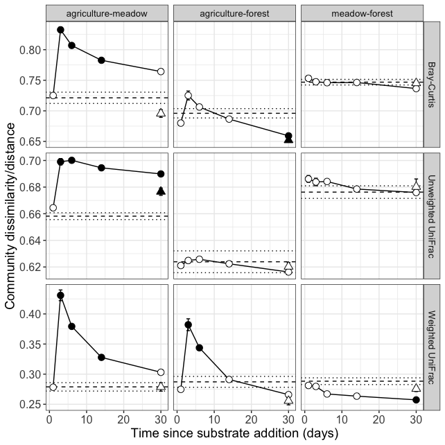

Abundance of Taxa
-----------------

We see that across the board, agriculture seems to show the greatest shift in diversity after substrate addition. Now I want to see if we can visualize this change with regards to the taxonomy and abundance of the OTUs. So, here I want to make a figure showing the abundance of various taxa across each land use regime over time.

``` r
# Get OTU relative abundances
OTU_table.df = data.frame(otu_table(unfrac.rare.physeq)) %>%
  tibble::rownames_to_column(var="OTU") %>%
  tidyr::gather(key="X.Sample", value="abundance", -OTU) %>%
  mutate(X.Sample = gsub("13C.", "13C-", gsub("12C.", "12C-", gsub("H2O.", "H2O-", X.Sample)))) %>%
  group_by(X.Sample) %>%
  mutate(total_count = sum(abundance)) %>%
  ungroup %>%
  mutate(abundance = abundance/total_count*100) %>%
  filter(abundance > 0)

# Add in taxonomy information
taxonomy.df = data.frame(tax_table(unfrac.rare.physeq), stringsAsFactors = FALSE) %>%
  tibble::rownames_to_column(var="OTU")

# Group taxa that have less than 1% abundance in any sample
OTU_table.taxa.df = left_join(OTU_table.df, taxonomy.df, by = "OTU") %>%
  mutate(taxa = ifelse(Phylum == "Proteobacteria", as.character(Class), as.character(Phylum))) %>%
  group_by(taxa, X.Sample) %>%
  mutate(taxa_abd = sum(abundance)) %>%
  ungroup %>%
  group_by(taxa) %>%
  mutate(max_taxa_abd = max(taxa_abd)) %>%
  ungroup %>%
  mutate(taxa = ifelse(max_taxa_abd < 1, "Less than 1%", taxa))

# Add in the sample metadata
unfrac_metadata.df = data.frame(sample_data(unfrac.rare.physeq)) %>%
  select(X.Sample, ecosystem, day, substrate, microcosm_replicate) %>%
  left_join(data.frame(ecosystem = c("agriculture", "meadow", "forest"), 
                       landuse = factor(c("Cropland", "Old-field", "Forest"), levels=c("Cropland", "Old-field", "Forest"))),
            by = "ecosystem") %>%
  mutate(ecosystem = factor(ecosystem, levels=c("agriculture", "meadow", "forest")),
         substrate = factor(substrate, levels=c("H2O-Con", "12C-Con", "13C-Xyl", "13C-Ami", "13C-Van", "13C-Cel", "13C-Pal")),
         day_factor = factor(ifelse(substrate == "H2O-Con", "H2O-Con", day), c(0, 1, 3, 6, 14, 30, "H2O-Con")))

OTU_table.taxa.meta.df = left_join(OTU_table.taxa.df, unfrac_metadata.df, by = "X.Sample") %>%
  arrange(day_factor, substrate, ecosystem, microcosm_replicate)
OTU_table.taxa.meta.df$X.Sample = factor(OTU_table.taxa.meta.df$X.Sample, levels=unique(OTU_table.taxa.meta.df$X.Sample))
```

Now I'll plot these abundances for my dissertation.

``` r
# Set colors for the taxa
source("/Users/sambarnett/Documents/Misc_code/paul_tol_colors.R")
taxa = unique(OTU_table.taxa.meta.df[OTU_table.taxa.meta.df$taxa != "Less than 1%",]$taxa)
taxa.cols = c(paultol_colors(length(taxa)), "#777777")
names(taxa.cols) = c(sort(taxa), "Less than 1%")

# Get summary abundance of each taxa
OTU_table.taxa.meta.sum = OTU_table.taxa.meta.df %>%
  group_by(X.Sample, day_factor, substrate, landuse, microcosm_replicate, taxa) %>%
  summarize(taxa_abd = sum(abundance)) %>%
  as.data.frame

# Get positions for each replicate in the plot. Separating bars by their day with separate bars per replicate
day.shift = data.frame(day_factor = c(0, 1, 3, 6, 14, 30, "H2O-Con"),
                       shift = c(0, 3, 6, 9, 12, 15, 20))
plot.positions = OTU_table.taxa.meta.sum %>%
  select(X.Sample, landuse, day_factor, substrate, microcosm_replicate) %>%
  unique %>%
  arrange(day_factor, substrate, microcosm_replicate) %>%
  group_by(landuse) %>%
  mutate(rank = row_number()) %>%
  ungroup %>%
  left_join(day.shift) %>%
  mutate(position = rank + shift) %>%
  select(X.Sample, position)

OTU_table.taxa.meta.sum = left_join(OTU_table.taxa.meta.sum, plot.positions, by="X.Sample") %>%
  mutate(taxa = factor(taxa, levels=names(taxa.cols)))

plot.xlab = OTU_table.taxa.meta.sum %>%
  select(day_factor, position, landuse) %>%
  unique %>%
  mutate(label = ifelse(day_factor == "H2O-Con", "w", as.character(day_factor))) %>%
  group_by(label, landuse) %>%
  summarize(midpoint = mean(position)) %>%
  as.data.frame

# Plot
taxa_abund.plot = ggplot(data=OTU_table.taxa.meta.sum, aes(x=position, y=taxa_abd)) +
  geom_bar(stat="identity", aes(fill=taxa, color=taxa)) +
  geom_text(data=plot.xlab, aes(x=midpoint, label=label), y=-3, size=4.5) +
  scale_y_continuous(limits=c(-5, 100), expand = c(0, 1)) +
  labs(x="Time since substrate addition (days)", y="Relative abundance (% of reads)",
       fill="Phylum/Class", color="Phylum/Class") +
  scale_fill_manual(values=taxa.cols) +
  scale_color_manual(values=taxa.cols) +
  theme_bw() +
  theme(panel.border = element_blank(),
        panel.grid.major = element_blank(), 
        panel.grid.minor = element_blank(),
        legend.position = "right",
        legend.title=element_text(size=14),
        legend.text=element_text(size=12),
        axis.title = element_text(size=14),
        axis.text.x = element_blank(),
        axis.text.y = element_text(size=12),
        axis.ticks.x = element_blank(),
        strip.text = element_text(size=10)) +
  facet_wrap(~landuse)

taxa_abund.plot
```

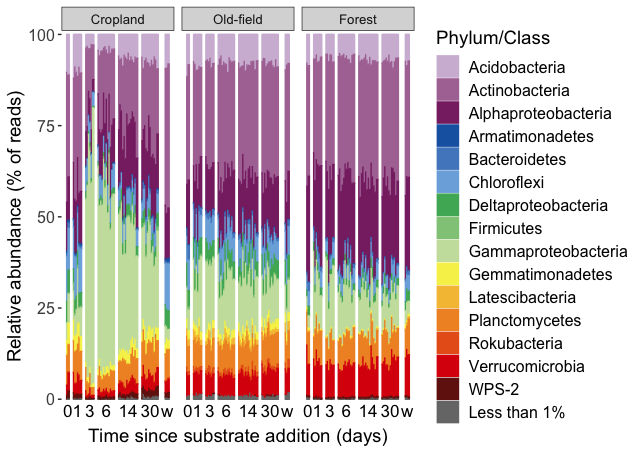

``` r
#ggsave(taxa_abund.plot, filename = "/Users/sambarnett/Documents/Dissertation/figures/figS2_14.tiff", 
#       device = "tiff", width = 6.69291, height = 4.72441, units = "in")
```

Now plot for publication.

``` r
# Set colors for the taxa
source("/Users/sambarnett/Documents/Misc_code/paul_tol_colors.R")
taxa = unique(OTU_table.taxa.meta.df[OTU_table.taxa.meta.df$taxa != "Less than 1%",]$taxa)
taxa.cols = c(paultol_colors(length(taxa)), "#777777")
names(taxa.cols) = c(sort(taxa), "Less than 1%")

# Get summary abundance of each taxa
OTU_table.taxa.meta.sum = OTU_table.taxa.meta.df %>%
  group_by(X.Sample, day_factor, substrate, landuse, microcosm_replicate, taxa) %>%
  summarize(taxa_abd = sum(abundance)) %>%
  as.data.frame

# Get positions for each replicate in the plot. Separating bars by their day with separate bars per replicate
day.shift = data.frame(day_factor = c(0, 1, 3, 6, 14, 30, "H2O-Con"),
                       shift = c(0, 3, 6, 9, 12, 15, 20))
plot.positions = OTU_table.taxa.meta.sum %>%
  select(X.Sample, landuse, day_factor, substrate, microcosm_replicate) %>%
  unique %>%
  arrange(day_factor, substrate, microcosm_replicate) %>%
  group_by(landuse) %>%
  mutate(rank = row_number()) %>%
  ungroup %>%
  left_join(day.shift) %>%
  mutate(position = rank + shift) %>%
  select(X.Sample, position)

OTU_table.taxa.meta.sum = left_join(OTU_table.taxa.meta.sum, plot.positions, by="X.Sample") %>%
  mutate(taxa = factor(taxa, levels=names(taxa.cols)))

plot.xlab = OTU_table.taxa.meta.sum %>%
  select(day_factor, position, landuse) %>%
  unique %>%
  mutate(label = ifelse(day_factor == "H2O-Con", "w", as.character(day_factor))) %>%
  group_by(label, landuse) %>%
  summarize(midpoint = mean(position)) %>%
  as.data.frame

# Plot
taxa_abund.plot = ggplot(data=OTU_table.taxa.meta.sum, aes(x=position, y=taxa_abd)) +
  geom_bar(stat="identity", aes(fill=taxa, color=taxa)) +
  geom_text(data=plot.xlab, aes(x=midpoint, label=label), y=-2, size=(6*5/14)) +
  scale_y_continuous(limits=c(-2.5, 100), expand = c(0, 1)) +
  labs(x="Time since substrate addition (days)", y="Relative abundance (% of reads)",
       fill="Phylum/Class", color="Phylum/Class") +
  scale_fill_manual(values=taxa.cols) +
  scale_color_manual(values=taxa.cols) +
  theme_bw() +
  theme(panel.border = element_blank(),
        panel.grid.major = element_blank(), 
        panel.grid.minor = element_blank(),
        axis.ticks.y = element_line(size=0.2),
        legend.position = "right",
        legend.title=element_text(size=7),
        legend.text=element_text(size=6),
        axis.title = element_text(size=7),
        axis.text.x = element_blank(),
        axis.text.y = element_text(size=6),
        axis.ticks.x = element_blank(),
        strip.text = element_text(size=6)) +
  facet_wrap(~landuse)
```

``` r
beta_ords_taxa_abund.plot = cowplot::plot_grid(beta_ords_leg.plot, taxa_abund.plot, nrow=2, rel_heights = c(0.7, 1), labels = c("", "d"), label_size = 10)
beta_ords_taxa_abund.plot
```

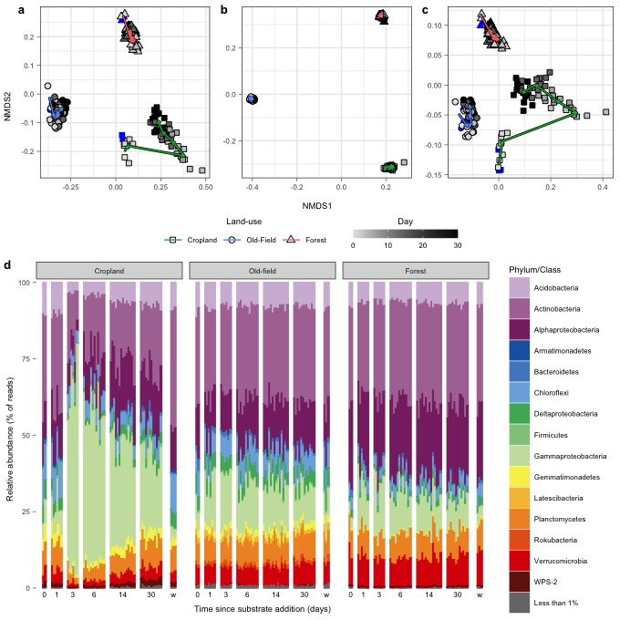

``` r
#ggsave(beta_ords_taxa_abund.plot, filename = "/Users/sambarnett/Documents/Buckley Lab/FullCyc2/manuscript/Figures/Fig2.tiff", 
#       device = "tiff", width = 7.08661, height = 7.08661, units = "in")
```

Lets plot the change in abundance of the top5 most abundant OTUs in each land use

``` r
library(grid)
library(gridExtra)

Top5OTUs.df = OTU_table.taxa.meta.df %>%
  filter(substrate != "H2O-Con") %>%
  group_by(OTU, day_factor, landuse, Domain, Phylum, Class, Order, Family, Genus, Species) %>%
  summarize(mean_abd = mean(abundance)) %>%
  as.data.frame %>%
  group_by(OTU, landuse, Domain, Phylum, Class, Order, Family, Genus, Species) %>%
  summarize(max_abd = max(mean_abd)) %>%
  as.data.frame %>%
  arrange(-max_abd) %>%
  group_by(landuse) %>%
  mutate(rank = row_number()) %>%
  ungroup %>%
  filter(rank <= 5) %>%
  as.data.frame %>%
  arrange(landuse, rank) %>%
  mutate(taxa = ifelse(!(is.na(Genus)) & !(grepl("uncultured", Genus)) & !(grepl("Ambiguous", Genus)), Genus,
                       ifelse(!(is.na(Family)) & !(grepl("uncultured", Family)), Family,
                              ifelse(!(is.na(Order)) & !(grepl("uncultured", Order)), Order, Class)))) %>%
  mutate(taxa_level = ifelse(!(is.na(Genus)) & !(grepl("uncultured", Genus)) & !(grepl("Ambiguous", Genus)), "Genus", 
                             ifelse(!(is.na(Family)) & !(grepl("uncultured", Family)), "Family",
                                    ifelse(!(is.na(Order)) & !(grepl("uncultured", Order)), "Order", "Class")))) %>%
  mutate(taxa = gsub("Burkholderia-Caballeronia-Paraburkholderia", "B-C-P", taxa),
         taxa = gsub("Candidatus", "Ca.", taxa)) %>%
  mutate(OTU_name = paste(rank, ")   ", OTU, "\n", taxa, " (", taxa_level, ")", sep="")) %>%
  select(OTU, landuse, OTU_name) #%>%


# Get OTU relative abundances
Top5OTUs.counts.df = data.frame(otu_table(unfrac.rare.physeq)) %>%
  tibble::rownames_to_column(var="OTU") %>%
  tidyr::gather(key="X.Sample", value="abundance", -OTU) %>%
  mutate(X.Sample = gsub("13C.", "13C-", gsub("12C.", "12C-", gsub("H2O.", "H2O-", X.Sample)))) %>%
  group_by(X.Sample) %>%
  mutate(total_count = sum(abundance)) %>%
  ungroup %>%
  mutate(abundance = abundance/total_count*100) %>%
  filter(OTU %in% Top5OTUs.df$OTU) %>%
  left_join(unfrac_metadata.df, by = "X.Sample") %>%
  inner_join(Top5OTUs.df, by = c("OTU", "landuse")) %>%
  mutate(treattype = ifelse(substrate == "H2O-Con", "Water control", "Carbon ammended")) %>%
  group_by(OTU, OTU_name, day, landuse, treattype) %>%
  summarize(mean_abd = mean(abundance),
            sd_abd = sd(abundance),
            n_sam = n()) %>%
  as.data.frame %>%
  mutate(SE_abd = sd_abd/sqrt(n_sam)) %>%
  arrange(landuse, day)

# Plot
ag.top5.plot = ggplot(data=filter(Top5OTUs.counts.df, landuse == "Cropland"), aes(x=day, y=mean_abd, shape=treattype)) +
  geom_errorbar(aes(ymin=mean_abd-SE_abd, ymax=mean_abd+SE_abd), width=0.2)+
  geom_point() +
  geom_line() +
  ggtitle("Cropland") +
  theme_bw() +
  theme(legend.position = "none",
        axis.title = element_blank(),
        axis.text = element_text(size=10),
        strip.text = element_text(size=10),
        plot.title = element_text(hjust = 0.5, size=12)) +
  facet_wrap(~ OTU_name, ncol=1, scales="free_y")

m.top5.plot = ggplot(data=filter(Top5OTUs.counts.df, landuse == "Old-field"), aes(x=day, y=mean_abd, shape=treattype)) +
  geom_errorbar(aes(ymin=mean_abd-SE_abd, ymax=mean_abd+SE_abd), width=0.2)+
  geom_point() +
  geom_line() +
  ggtitle("Old-field") +
  theme_bw() +
  theme(legend.position = "none",
        axis.title = element_blank(),
        axis.text = element_text(size=10),
        strip.text = element_text(size=10),
        plot.title = element_text(hjust = 0.5, size=12)) +
  facet_wrap(~ OTU_name, ncol=1, scales="free_y")

f.top5.plot = ggplot(data=filter(Top5OTUs.counts.df, landuse == "Forest"), aes(x=day, y=mean_abd, shape=treattype)) +
  geom_errorbar(aes(ymin=mean_abd-SE_abd, ymax=mean_abd+SE_abd), width=0.2)+
  geom_point() +
  geom_line() +
  ggtitle("Forest") +
  theme_bw() +
  theme(legend.position = "none",
        axis.title = element_blank(),
        axis.text = element_text(size=10),
        strip.text = element_text(size=10),
        plot.title = element_text(hjust = 0.5, size=12)) +
  facet_wrap(~ OTU_name, ncol=1, scales="free_y")

top5.plot = cowplot::plot_grid(ag.top5.plot, m.top5.plot, f.top5.plot, nrow=1)
top5.plot
```

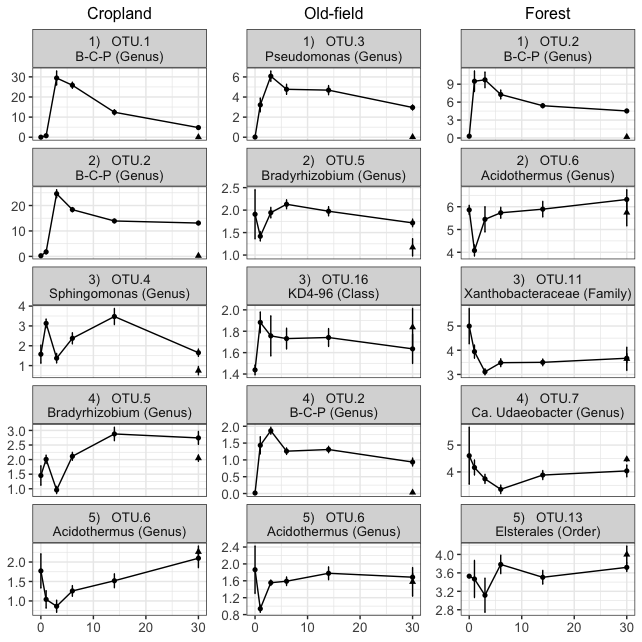

``` r
# Add axes

y.grob <- textGrob("Relative abundance (% of reads)", 
                   gp=gpar(fontface="bold", fontsize=14), rot=90)
x.grob <- textGrob("Time since substrate addition (days)", 
                   gp=gpar(fontface="bold", fontsize=14))

top5OTU_abund.plot = arrangeGrob(top5.plot, left = y.grob, bottom = x.grob)

grid.arrange(top5OTU_abund.plot)
```

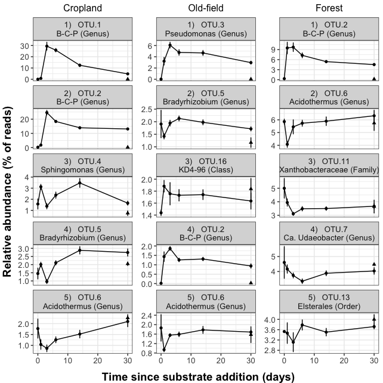

``` r
#ggsave(top5OTU_abund.plot, filename = "/Users/sambarnett/Documents/Dissertation/figures/figS2_15.tiff", 
#       device = "tiff", width = 6.69291, height = 6.69291, units = "in")
```

DNA concentration
-----------------

``` r
landuse.conv = data.frame(ecosystem = c("agriculture", "meadow", "forest"),
                          habitat = c("A", "M", "F"),
                          landuse = factor(c("Cropland", "Old-field", "Forest"), levels = c("Cropland", "Old-field", "Forest")))

landuse.col = c("Cropland"="#00BA38", "Old-field"="#619CFF", "Forest"="#F8766D")

perc_water.df = read.table("/Users/sambarnett/Documents/Buckley Lab/FullCyc2/Soil_drying.txt", header = TRUE) %>%
  rename(X.Sample = sample)

perc_water.sum = perc_water.df %>%
  filter(!(is.na(Perc_water))) %>%
  group_by(habitat, day) %>%
  summarize(n_samples = n(),
            mean_Perc_water = mean(Perc_water),
            sd_Perc_water = sd(Perc_water)) %>%
  as.data.frame %>%
  mutate(SE_Perc_water = sd_Perc_water/sqrt(n_samples))

ggplot(data=perc_water.sum, aes(x=day, y=mean_Perc_water, color=habitat)) +
  geom_line() +
  geom_point() +
  geom_errorbar(aes(ymin=mean_Perc_water-SE_Perc_water, ymax=mean_Perc_water+SE_Perc_water)) +
  labs(x="Sampling day", y="Mean % water content", color="Land-use") +
  theme_bw() +
  theme(legend.position = "top",
        legend.title=element_text(size=12),
        legend.text=element_text(size=12),
        axis.title = element_text(size=12),
        axis.text = element_text(size=12))
```

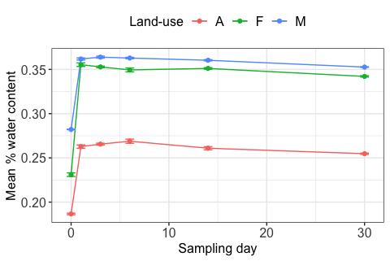

``` r
DNA_conc.df = data.frame(sample_data(unfrac.physeq)) %>%
  mutate(X.Sample = ifelse(X.Sample == "MR.F.12C-Con.D0.R2_primer2", "MR.F.12C-Con.D0.R2",
                           ifelse(X.Sample == "MR.M.12C-Con.D0.R2_primer2", "MR.M.12C-Con.D0.R2",
                                  as.character(X.Sample)))) %>%
  mutate(DNA_conc = ifelse(DNA_conc__ng_ul != "TBD", 
                           as.numeric(as.character(DNA_conc__ng_ul)), NA)) %>%
  select(X.Sample, DNA_conc) %>%
  full_join(perc_water.df, by="X.Sample") %>%
  arrange(habitat, day, substrate, microcosm_replicate) %>%
  mutate(ext_soil_mass = 0.25*(1-Perc_water)) %>%
  mutate(DNA_pG_soil = (DNA_conc*100)/ext_soil_mass)

DNA_conc.sum = DNA_conc.df %>%
  filter(!(is.na(DNA_pG_soil))) %>%
  group_by(habitat, day) %>%
  summarize(n_samples = n(),
            mean_DNA_pG_soil = mean(DNA_pG_soil),
            sd_DNA_pG_soil = sd(DNA_pG_soil)) %>%
  as.data.frame %>%
  mutate(SE_DNA_pG_soil = sd_DNA_pG_soil/sqrt(n_samples)) %>%
  left_join(landuse.conv, by="habitat")
  

ggplot(data=DNA_conc.sum, aes(x=day, y=mean_DNA_pG_soil, color=landuse)) +
  geom_line() +
  geom_point() +
  geom_errorbar(aes(ymin=mean_DNA_pG_soil-SE_DNA_pG_soil, ymax=mean_DNA_pG_soil+SE_DNA_pG_soil)) +
  scale_color_manual(values=landuse.col) +
  labs(x="Time since SOM addition", y="Mean ng DNA per g soil", color="Land use") +
  theme_bw() +
  theme(legend.position = "right",
        legend.title=element_text(size=12),
        legend.text=element_text(size=12),
        axis.title = element_text(size=12),
        axis.text = element_text(size=12))
```

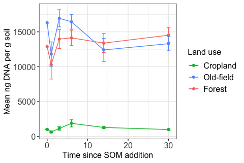

Session info
------------

``` r
sessionInfo()
```

    ## R version 3.6.3 (2020-02-29)
    ## Platform: x86_64-apple-darwin15.6.0 (64-bit)
    ## Running under: macOS Catalina 10.15.7
    ## 
    ## Matrix products: default
    ## BLAS:   /Library/Frameworks/R.framework/Versions/3.6/Resources/lib/libRblas.0.dylib
    ## LAPACK: /Library/Frameworks/R.framework/Versions/3.6/Resources/lib/libRlapack.dylib
    ## 
    ## locale:
    ## [1] en_US.UTF-8/en_US.UTF-8/en_US.UTF-8/C/en_US.UTF-8/en_US.UTF-8
    ## 
    ## attached base packages:
    ## [1] grid      stats     graphics  grDevices utils     datasets  methods  
    ## [8] base     
    ## 
    ## other attached packages:
    ##  [1] gridExtra_2.3   ggplot2_3.3.3   lsmeans_2.30-0  emmeans_1.4.6  
    ##  [5] vegan_2.5-6     lattice_0.20-41 permute_0.9-5   ape_5.3        
    ##  [9] knitr_1.28      phyloseq_1.30.0 dplyr_1.0.6    
    ## 
    ## loaded via a namespace (and not attached):
    ##  [1] Biobase_2.46.0      tidyr_1.0.2         jsonlite_1.6.1     
    ##  [4] splines_3.6.3       foreach_1.5.0       assertthat_0.2.1   
    ##  [7] highr_0.8           stats4_3.6.3        yaml_2.2.1         
    ## [10] pillar_1.6.0        glue_1.4.0          digest_0.6.25      
    ## [13] XVector_0.26.0      colorspace_1.4-1    sandwich_2.5-1     
    ## [16] cowplot_1.0.0       htmltools_0.4.0     Matrix_1.2-18      
    ## [19] plyr_1.8.6          pkgconfig_2.0.3     zlibbioc_1.32.0    
    ## [22] purrr_0.3.4         xtable_1.8-4        mvtnorm_1.1-0      
    ## [25] scales_1.1.0        tibble_3.0.1        mgcv_1.8-31        
    ## [28] generics_0.1.0      farver_2.0.3        IRanges_2.20.2     
    ## [31] ellipsis_0.3.0      TH.data_1.0-10      withr_2.2.0        
    ## [34] BiocGenerics_0.32.0 cli_2.0.2           survival_3.1-12    
    ## [37] magrittr_1.5        crayon_1.3.4        estimability_1.3   
    ## [40] evaluate_0.14       fansi_0.4.1         nlme_3.1-147       
    ## [43] MASS_7.3-51.6       tools_3.6.3         data.table_1.12.8  
    ## [46] lifecycle_1.0.0     multcomp_1.4-13     stringr_1.4.0      
    ## [49] Rhdf5lib_1.8.0      S4Vectors_0.24.4    munsell_0.5.0      
    ## [52] cluster_2.1.0       Biostrings_2.54.0   ade4_1.7-15        
    ## [55] compiler_3.6.3      rlang_0.4.11        rhdf5_2.30.1       
    ## [58] iterators_1.0.12    biomformat_1.14.0   rstudioapi_0.11    
    ## [61] igraph_1.2.5        labeling_0.3        rmarkdown_2.1      
    ## [64] gtable_0.3.0        codetools_0.2-16    multtest_2.42.0    
    ## [67] reshape2_1.4.4      R6_2.4.1            zoo_1.8-8          
    ## [70] utf8_1.1.4          stringi_1.4.6       parallel_3.6.3     
    ## [73] Rcpp_1.0.4.6        vctrs_0.3.8         tidyselect_1.1.1   
    ## [76] xfun_0.13           coda_0.19-3
